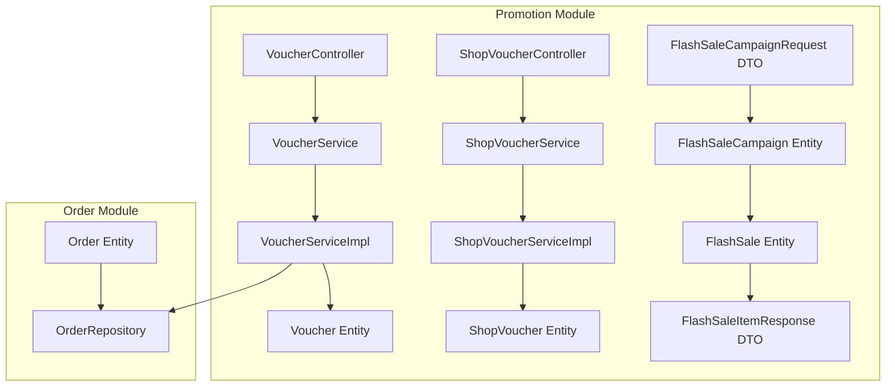
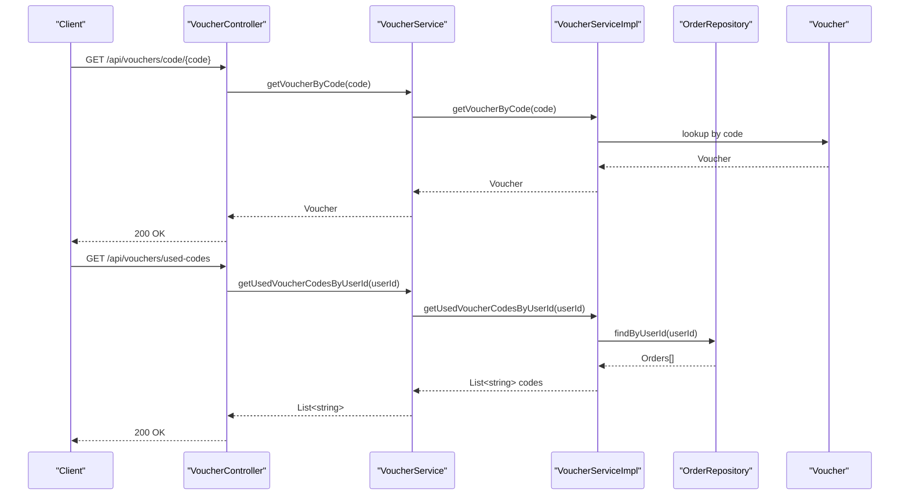
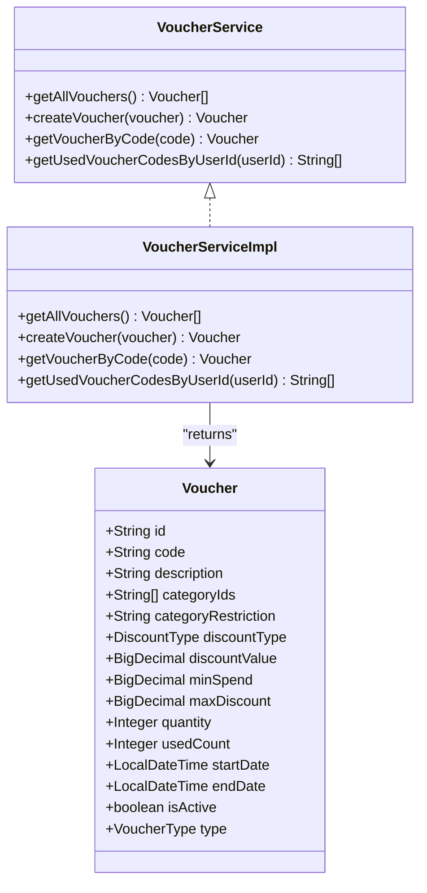
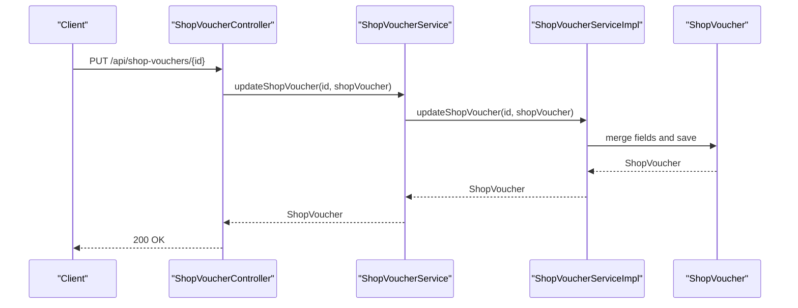
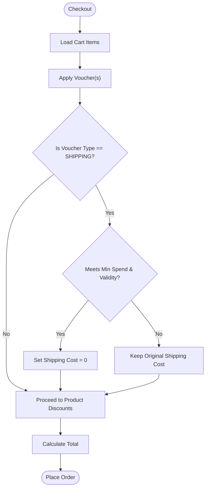
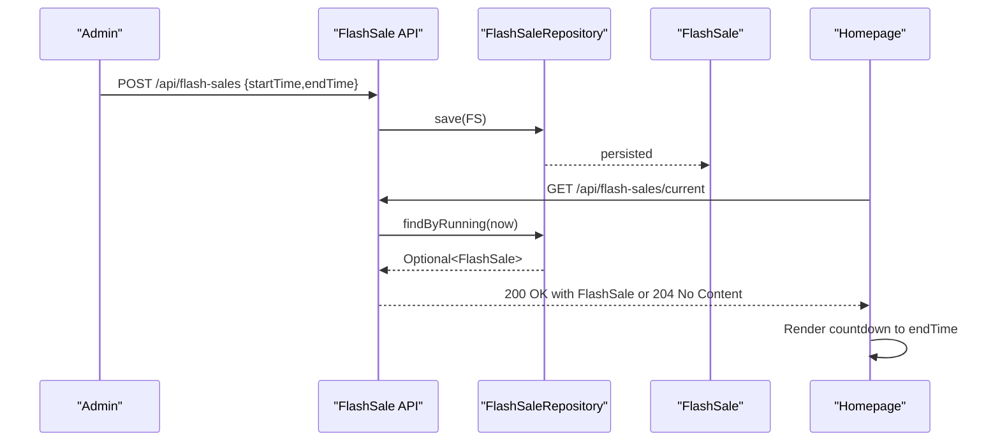
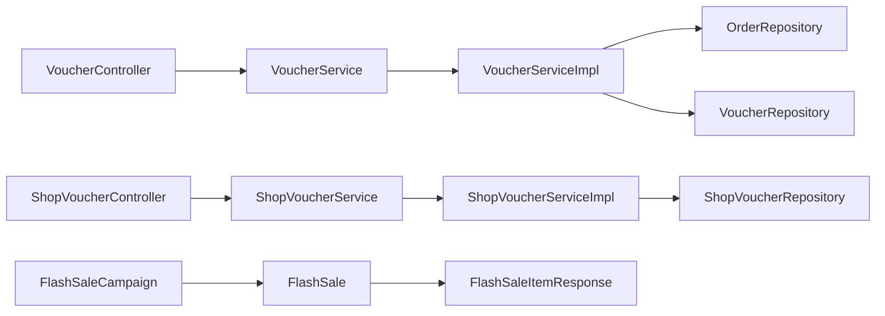

# Promotions & Discount System

<cite>
**Referenced Files in This Document**
- [VoucherController.java](file://src/Backend/src/main/java/com/shoppeclone/backend/promotion/controller/VoucherController.java)
- [ShopVoucherController.java](file://src/Backend/src/main/java/com/shoppeclone/backend/promotion/controller/ShopVoucherController.java)
- [Voucher.java](file://src/Backend/src/main/java/com/shoppeclone/backend/promotion/entity/Voucher.java)
- [ShopVoucher.java](file://src/Backend/src/main/java/com/shoppeclone/backend/promotion/entity/ShopVoucher.java)
- [VoucherService.java](file://src/Backend/src/main/java/com/shoppeclone/backend/promotion/service/VoucherService.java)
- [ShopVoucherService.java](file://src/Backend/src/main/java/com/shoppeclone/backend/promotion/service/ShopVoucherService.java)
- [VoucherServiceImpl.java](file://src/Backend/src/main/java/com/shoppeclone/backend/promotion/service/impl/VoucherServiceImpl.java)
- [ShopVoucherServiceImpl.java](file://src/Backend/src/main/java/com/shoppeclone/backend/promotion/service/impl/ShopVoucherServiceImpl.java)
- [FlashSaleCampaign.java](file://src/Backend/src/main/java/com/shoppeclone/backend/promotion/flashsale/entity/FlashSaleCampaign.java)
- [FlashSale.java](file://src/Backend/src/main/java/com/shoppeclone/backend/promotion/flashsale/entity/FlashSale.java)
- [FlashSaleItemResponse.java](file://src/Backend/src/main/java/com/shoppeclone/backend/promotion/flashsale/dto/FlashSaleItemResponse.java)
- [FlashSaleCampaignRequest.java](file://src/Backend/src/main/java/com/shoppeclone/backend/promotion/flashsale/dto/FlashSaleCampaignRequest.java)
- [Order.java](file://src/Backend/src/main/java/com/shoppeclone/backend/order/entity/Order.java)
- [OrderRepository.java](file://src/Backend/src/main/java/com/shoppeclone/backend/order/repository/OrderRepository.java)
- [ShopVoucherRepository.java](file://src/Backend/src/main/java/com/shoppeclone/backend/promotion/repository/ShopVoucherRepository.java)
- [VoucherRepository.java](file://src/Backend/src/main/java/com/shoppeclone/backend/promotion/repository/VoucherRepository.java)
- [LogNhaworkwithCusor.md](file://docs/ai_logs/LogNhaworkwithCusor.md)
</cite>

## Table of Contents
1. [Introduction](#introduction)
2. [Project Structure](#project-structure)
3. [Core Components](#core-components)
4. [Architecture Overview](#architecture-overview)
5. [Detailed Component Analysis](#detailed-component-analysis)
6. [Dependency Analysis](#dependency-analysis)
7. [Performance Considerations](#performance-considerations)
8. [Troubleshooting Guide](#troubleshooting-guide)
9. [Conclusion](#conclusion)
10. [Appendices](#appendices)

## Introduction
This document explains the promotions and discount system, focusing on:
- Voucher management (global and shop-specific)
- Shop-specific promotions
- Free shipping campaigns
- Flash sale implementation

It covers configuration options, parameters, return values, and how these components integrate with order processing, payment systems, and inventory management. It also includes discount calculation logic, campaign scheduling, and promotional analytics considerations.

## Project Structure
The promotions module is organized by domain:
- Controllers expose REST endpoints for vouchers and shop-specific promotions
- Entities define data models for vouchers and flash sale campaigns
- Services encapsulate business logic for creation, retrieval, updates, and deletion
- Repositories persist and query data from MongoDB collections

**Diagram sources**
- [VoucherController.java:1-45](file://src/Backend/src/main/java/com/shoppeclone/backend/promotion/controller/VoucherController.java#L1-L45)
- [ShopVoucherController.java:1-45](file://src/Backend/src/main/java/com/shoppeclone/backend/promotion/controller/ShopVoucherController.java#L1-L45)
- [VoucherService.java:1-17](file://src/Backend/src/main/java/com/shoppeclone/backend/promotion/service/VoucherService.java#L1-L17)
- [ShopVoucherService.java:1-18](file://src/Backend/src/main/java/com/shoppeclone/backend/promotion/service/ShopVoucherService.java#L1-L18)
- [VoucherServiceImpl.java:1-54](file://src/Backend/src/main/java/com/shoppeclone/backend/promotion/service/impl/VoucherServiceImpl.java#L1-L54)
- [ShopVoucherServiceImpl.java:1-54](file://src/Backend/src/main/java/com/shoppeclone/backend/promotion/service/impl/ShopVoucherServiceImpl.java#L1-L54)
- [Voucher.java:1-51](file://src/Backend/src/main/java/com/shoppeclone/backend/promotion/entity/Voucher.java#L1-L51)
- [ShopVoucher.java:1-28](file://src/Backend/src/main/java/com/shoppeclone/backend/promotion/entity/ShopVoucher.java#L1-L28)
- [FlashSaleCampaign.java:1-31](file://src/Backend/src/main/java/com/shoppeclone/backend/promotion/flashsale/entity/FlashSaleCampaign.java#L1-L31)
- [FlashSale.java:1-20](file://src/Backend/src/main/java/com/shoppeclone/backend/promotion/flashsale/entity/FlashSale.java#L1-L20)
- [FlashSaleItemResponse.java:1-31](file://src/Backend/src/main/java/com/shoppeclone/backend/promotion/flashsale/dto/FlashSaleItemResponse.java#L1-L31)
- [FlashSaleCampaignRequest.java:1-16](file://src/Backend/src/main/java/com/shoppeclone/backend/promotion/flashsale/dto/FlashSaleCampaignRequest.java#L1-L16)
- [Order.java](file://src/Backend/src/main/java/com/shoppeclone/backend/order/entity/Order.java)
- [OrderRepository.java](file://src/Backend/src/main/java/com/shoppeclone/backend/order/repository/OrderRepository.java)

**Section sources**
- [VoucherController.java:1-45](file://src/Backend/src/main/java/com/shoppeclone/backend/promotion/controller/VoucherController.java#L1-L45)
- [ShopVoucherController.java:1-45](file://src/Backend/src/main/java/com/shoppeclone/backend/promotion/controller/ShopVoucherController.java#L1-L45)
- [Voucher.java:1-51](file://src/Backend/src/main/java/com/shoppeclone/backend/promotion/entity/Voucher.java#L1-L51)
- [ShopVoucher.java:1-28](file://src/Backend/src/main/java/com/shoppeclone/backend/promotion/entity/ShopVoucher.java#L1-L28)
- [FlashSaleCampaign.java:1-31](file://src/Backend/src/main/java/com/shoppeclone/backend/promotion/flashsale/entity/FlashSaleCampaign.java#L1-L31)
- [FlashSale.java:1-20](file://src/Backend/src/main/java/com/shoppeclone/backend/promotion/flashsale/entity/FlashSale.java#L1-L20)
- [FlashSaleItemResponse.java:1-31](file://src/Backend/src/main/java/com/shoppeclone/backend/promotion/flashsale/dto/FlashSaleItemResponse.java#L1-L31)
- [FlashSaleCampaignRequest.java:1-16](file://src/Backend/src/main/java/com/shoppeclone/backend/promotion/flashsale/dto/FlashSaleCampaignRequest.java#L1-L16)

## Core Components
- Voucher (global): Supports percentage or fixed amount discounts, category restrictions, spend thresholds, caps, validity windows, and usage tracking via order history.
- ShopVoucher (shop-specific): Provides shop-level discounts with minimum spend, stock-like quantity, and validity windows.
- FlashSaleCampaign and FlashSale: Define campaign lifecycle and scheduled sale slots; FlashSaleItemResponse carries computed pricing and availability for UI.
- Controllers: Expose endpoints to manage and query vouchers and shop-specific promotions; also support retrieving used voucher codes by user.

Key integration points:
- Order processing: Voucher usage is tracked by scanning past orders for applied codes.
- Payment systems: Discounts are applied during checkout; payment totals reflect final amounts after promotions.
- Inventory management: ShopVoucher quantity acts as a soft cap; FlashSale item stock reflects remaining units.

**Section sources**
- [Voucher.java:1-51](file://src/Backend/src/main/java/com/shoppeclone/backend/promotion/entity/Voucher.java#L1-L51)
- [ShopVoucher.java:1-28](file://src/Backend/src/main/java/com/shoppeclone/backend/promotion/entity/ShopVoucher.java#L1-L28)
- [FlashSaleCampaign.java:1-31](file://src/Backend/src/main/java/com/shoppeclone/backend/promotion/flashsale/entity/FlashSaleCampaign.java#L1-L31)
- [FlashSale.java:1-20](file://src/Backend/src/main/java/com/shoppeclone/backend/promotion/flashsale/entity/FlashSale.java#L1-L20)
- [FlashSaleItemResponse.java:1-31](file://src/Backend/src/main/java/com/shoppeclone/backend/promotion/flashsale/dto/FlashSaleItemResponse.java#L1-L31)
- [VoucherController.java:1-45](file://src/Backend/src/main/java/com/shoppeclone/backend/promotion/controller/VoucherController.java#L1-L45)
- [ShopVoucherController.java:1-45](file://src/Backend/src/main/java/com/shoppeclone/backend/promotion/controller/ShopVoucherController.java#L1-L45)

## Architecture Overview
The system follows a layered architecture:
- Presentation: Controllers handle HTTP requests and return ResponseEntity-wrapped domain objects
- Application: Services implement business rules (validation, calculations, persistence)
- Persistence: Repositories map to MongoDB collections for vouchers, shop vouchers, and flash sale entities
- Integration: OrderRepository enables historical usage checks for vouchers

**Diagram sources**
- [VoucherController.java:23-43](file://src/Backend/src/main/java/com/shoppeclone/backend/promotion/controller/VoucherController.java#L23-L43)
- [VoucherService.java:7-16](file://src/Backend/src/main/java/com/shoppeclone/backend/promotion/service/VoucherService.java#L7-L16)
- [VoucherServiceImpl.java:33-52](file://src/Backend/src/main/java/com/shoppeclone/backend/promotion/service/impl/VoucherServiceImpl.java#L33-L52)
- [OrderRepository.java](file://src/Backend/src/main/java/com/shoppeclone/backend/order/repository/OrderRepository.java)
- [Order.java](file://src/Backend/src/main/java/com/shoppeclone/backend/order/entity/Order.java)

## Detailed Component Analysis

### Voucher Management (Global)
- Purpose: Manage global promotional codes with flexible discount rules
- Key fields:
  - code, description
  - categoryIds and categoryRestriction for category-scoped applicability
  - discountType (PERCENTAGE, FIXED_AMOUNT), discountValue, maxDiscount, minSpend
  - quantity and usedCount for supply tracking
  - startDate, endDate, isActive, type (PRODUCT or SHIPPING)
- Business logic:
  - Validation occurs at creation/update time (repository-level constraints apply)
  - Usage tracking: Used codes are derived from past orders by scanning product and shipping voucher fields
- Endpoints:
  - GET /api/vouchers
  - POST /api/vouchers
  - GET /api/vouchers/code/{code}
  - GET /api/vouchers/used-codes (authenticated)

**Diagram sources**
- [Voucher.java:11-50](file://src/Backend/src/main/java/com/shoppeclone/backend/promotion/entity/Voucher.java#L11-L50)
- [VoucherService.java:7-16](file://src/Backend/src/main/java/com/shoppeclone/backend/promotion/service/VoucherService.java#L7-L16)
- [VoucherServiceImpl.java:16-54](file://src/Backend/src/main/java/com/shoppeclone/backend/promotion/service/impl/VoucherServiceImpl.java#L16-L54)

**Section sources**
- [Voucher.java:1-51](file://src/Backend/src/main/java/com/shoppeclone/backend/promotion/entity/Voucher.java#L1-L51)
- [VoucherService.java:1-17](file://src/Backend/src/main/java/com/shoppeclone/backend/promotion/service/VoucherService.java#L1-L17)
- [VoucherServiceImpl.java:1-54](file://src/Backend/src/main/java/com/shoppeclone/backend/promotion/service/impl/VoucherServiceImpl.java#L1-L54)
- [VoucherController.java:1-45](file://src/Backend/src/main/java/com/shoppeclone/backend/promotion/controller/VoucherController.java#L1-L45)

### Shop-Specific Promotions (ShopVoucher)
- Purpose: Enable shops to issue their own discount codes
- Key fields:
  - shopId (indexed), code, discount, minSpend, quantity, startDate, endDate
- Operations:
  - Retrieve by shopId
  - Create, update, delete
  - Lookup by code
- Update logic copies provided fields into an existing record and persists

**Diagram sources**
- [ShopVoucherController.java:28-32](file://src/Backend/src/main/java/com/shoppeclone/backend/promotion/controller/ShopVoucherController.java#L28-L32)
- [ShopVoucherService.java:12-12](file://src/Backend/src/main/java/com/shoppeclone/backend/promotion/service/ShopVoucherService.java#L12-L12)
- [ShopVoucherServiceImpl.java:27-41](file://src/Backend/src/main/java/com/shoppeclone/backend/promotion/service/impl/ShopVoucherServiceImpl.java#L27-L41)
- [ShopVoucher.java:11-28](file://src/Backend/src/main/java/com/shoppeclone/backend/promotion/entity/ShopVoucher.java#L11-L28)

**Section sources**
- [ShopVoucher.java:1-28](file://src/Backend/src/main/java/com/shoppeclone/backend/promotion/entity/ShopVoucher.java#L1-L28)
- [ShopVoucherService.java:1-18](file://src/Backend/src/main/java/com/shoppeclone/backend/promotion/service/ShopVoucherService.java#L1-L18)
- [ShopVoucherServiceImpl.java:1-54](file://src/Backend/src/main/java/com/shoppeclone/backend/promotion/service/impl/ShopVoucherServiceImpl.java#L1-L54)
- [ShopVoucherController.java:1-45](file://src/Backend/src/main/java/com/shoppeclone/backend/promotion/controller/ShopVoucherController.java#L1-L45)

### Free Shipping Campaigns
- Mechanism: Voucher.type supports SHIPPING, enabling free shipping when applicable
- Usage: During checkout, if a shipping-type voucher is selected and conditions (minSpend, validity) are met, shipping cost is waived
- Tracking: Used codes are recorded in order history and retrievable by user

[No sources needed since this diagram shows conceptual workflow, not actual code structure]

**Section sources**
- [Voucher.java:39-44](file://src/Backend/src/main/java/com/shoppeclone/backend/promotion/entity/Voucher.java#L39-L44)
- [VoucherServiceImpl.java:40-52](file://src/Backend/src/main/java/com/shoppeclone/backend/promotion/service/impl/VoucherServiceImpl.java#L40-L52)

### Flash Sale Implementation
- Campaign lifecycle:
  - FlashSaleCampaign defines name, dates, status (UPCOMING, REGISTRATION_OPEN, ONGOING, FINISHED), and deadlines
  - FlashSale defines a scheduled slot (startTime, endTime) under a campaign
  - FlashSaleItemResponse aggregates product-level pricing and stock for UI display
- Countdown and visibility:
  - A current flash sale endpoint returns the active slot for homepage countdown
  - The frontend fetches the current slot and renders a real-time countdown to end time

**Diagram sources**
- [FlashSale.java:1-20](file://src/Backend/src/main/java/com/shoppeclone/backend/promotion/flashsale/entity/FlashSale.java#L1-L20)
- [FlashSaleCampaign.java:1-31](file://src/Backend/src/main/java/com/shoppeclone/backend/promotion/flashsale/entity/FlashSaleCampaign.java#L1-L31)
- [FlashSaleItemResponse.java:1-31](file://src/Backend/src/main/java/com/shoppeclone/backend/promotion/flashsale/dto/FlashSaleItemResponse.java#L1-L31)
- [LogNhaworkwithCusor.md:4114-4165](file://docs/ai_logs/LogNhaworkwithCusor.md#L4114-L4165)

**Section sources**
- [FlashSaleCampaign.java:1-31](file://src/Backend/src/main/java/com/shoppeclone/backend/promotion/flashsale/entity/FlashSaleCampaign.java#L1-L31)
- [FlashSale.java:1-20](file://src/Backend/src/main/java/com/shoppeclone/backend/promotion/flashsale/entity/FlashSale.java#L1-L20)
- [FlashSaleItemResponse.java:1-31](file://src/Backend/src/main/java/com/shoppeclone/backend/promotion/flashsale/dto/FlashSaleItemResponse.java#L1-L31)
- [LogNhaworkwithCusor.md:4114-4165](file://docs/ai_logs/LogNhaworkwithCusor.md#L4114-L4165)

## Dependency Analysis
- Controllers depend on services for business operations
- Services depend on repositories for persistence
- VoucherServiceImpl depends on OrderRepository to compute used codes
- ShopVoucherServiceImpl depends on ShopVoucherRepository
- Flash sale entities are independent and used for scheduling and UI responses

**Diagram sources**
- [VoucherController.java:1-45](file://src/Backend/src/main/java/com/shoppeclone/backend/promotion/controller/VoucherController.java#L1-L45)
- [ShopVoucherController.java:1-45](file://src/Backend/src/main/java/com/shoppeclone/backend/promotion/controller/ShopVoucherController.java#L1-L45)
- [VoucherServiceImpl.java:1-54](file://src/Backend/src/main/java/com/shoppeclone/backend/promotion/service/impl/VoucherServiceImpl.java#L1-L54)
- [ShopVoucherServiceImpl.java:1-54](file://src/Backend/src/main/java/com/shoppeclone/backend/promotion/service/impl/ShopVoucherServiceImpl.java#L1-L54)
- [OrderRepository.java](file://src/Backend/src/main/java/com/shoppeclone/backend/order/repository/OrderRepository.java)
- [VoucherRepository.java](file://src/Backend/src/main/java/com/shoppeclone/backend/promotion/repository/VoucherRepository.java)
- [ShopVoucherRepository.java](file://src/Backend/src/main/java/com/shoppeclone/backend/promotion/repository/ShopVoucherRepository.java)
- [FlashSaleCampaign.java:1-31](file://src/Backend/src/main/java/com/shoppeclone/backend/promotion/flashsale/entity/FlashSaleCampaign.java#L1-L31)
- [FlashSale.java:1-20](file://src/Backend/src/main/java/com/shoppeclone/backend/promotion/flashsale/entity/FlashSale.java#L1-L20)
- [FlashSaleItemResponse.java:1-31](file://src/Backend/src/main/java/com/shoppeclone/backend/promotion/flashsale/dto/FlashSaleItemResponse.java#L1-L31)

**Section sources**
- [VoucherServiceImpl.java:1-54](file://src/Backend/src/main/java/com/shoppeclone/backend/promotion/service/impl/VoucherServiceImpl.java#L1-L54)
- [ShopVoucherServiceImpl.java:1-54](file://src/Backend/src/main/java/com/shoppeclone/backend/promotion/service/impl/ShopVoucherServiceImpl.java#L1-L54)

## Performance Considerations
- Indexing:
  - ShopVoucher.code is indexed to accelerate lookups
- Query patterns:
  - Voucher code lookup and shop-specific retrieval are single-key queries
  - Used code computation scans order history; consider caching or denormalized fields if usage grows large
- Concurrency:
  - ShopVoucher update replaces fields; ensure optimistic locking if concurrent edits are expected
- Storage:
  - Separate collections for vouchers and shop vouchers reduce cross-domain contention

[No sources needed since this section provides general guidance]

## Troubleshooting Guide
- Voucher not found by code:
  - Ensure the code exists and is not expired; verify isActive and date range
- Used codes not appearing:
  - Confirm orders contain non-empty voucher codes; check both product and shipping voucher fields
- ShopVoucher update fails:
  - Verify the ID exists; ensure required fields (discount, minSpend, quantity, dates) are set appropriately
- Flash sale countdown not visible:
  - Confirm a current slot exists; ensure the endpoint returns a valid slot and the frontend polls correctly

**Section sources**
- [VoucherServiceImpl.java:33-37](file://src/Backend/src/main/java/com/shoppeclone/backend/promotion/service/impl/VoucherServiceImpl.java#L33-L37)
- [ShopVoucherServiceImpl.java:28-41](file://src/Backend/src/main/java/com/shoppeclone/backend/promotion/service/impl/ShopVoucherServiceImpl.java#L28-L41)
- [LogNhaworkwithCusor.md:4114-4165](file://docs/ai_logs/LogNhaworkwithCusor.md#L4114-L4165)

## Conclusion
The promotions and discount system provides robust mechanisms for global and shop-specific vouchers, shipping discounts, and flash sale scheduling. Its modular design integrates cleanly with order processing and supports straightforward UI-driven countdowns. Extending discount types, adding analytics hooks, and optimizing historical usage queries will further strengthen the system.

[No sources needed since this section summarizes without analyzing specific files]

## Appendices

### API Definitions

- Voucher Endpoints
  - GET /api/vouchers → List<Voucher>
  - POST /api/vouchers → Voucher
  - GET /api/vouchers/code/{code} → Voucher
  - GET /api/vouchers/used-codes → List<String> (applied codes by user)

- ShopVoucher Endpoints
  - GET /api/shop-vouchers/shop/{shopId} → List<ShopVoucher>
  - POST /api/shop-vouchers → ShopVoucher
  - PUT /api/shop-vouchers/{id} → ShopVoucher
  - GET /api/shop-vouchers/code/{code} → ShopVoucher
  - DELETE /api/shop-vouchers/{id} → 200 OK

- Flash Sale Endpoints
  - GET /api/flash-sales/current → FlashSale or 204

**Section sources**
- [VoucherController.java:23-43](file://src/Backend/src/main/java/com/shoppeclone/backend/promotion/controller/VoucherController.java#L23-L43)
- [ShopVoucherController.java:18-43](file://src/Backend/src/main/java/com/shoppeclone/backend/promotion/controller/ShopVoucherController.java#L18-L43)
- [LogNhaworkwithCusor.md:4114-4165](file://docs/ai_logs/LogNhaworkwithCusor.md#L4114-L4165)

### Configuration Options and Parameters

- Voucher
  - discountType: PERCENTAGE | FIXED_AMOUNT
  - discountValue: numeric value (percentage or currency)
  - maxDiscount: cap for percentage-based discounts
  - minSpend: minimum order value to qualify
  - categoryIds: restrict to categories; empty/null implies all
  - quantity: total issuance
  - startDate, endDate: validity window
  - type: PRODUCT | SHIPPING

- ShopVoucher
  - shopId: indexed
  - code: unique per shop
  - discount: numeric discount value
  - minSpend: minimum order value to qualify
  - quantity: issuance quantity
  - startDate, endDate: validity window

- FlashSaleCampaign
  - name, description
  - startDate, endDate
  - status: UPCOMING | REGISTRATION_OPEN | ONGOING | FINISHED
  - minDiscountPercentage, minStockPerProduct
  - registrationDeadline, approvalDeadline

- FlashSale
  - campaignId
  - startTime, endTime
  - status: ACTIVE | INACTIVE

**Section sources**
- [Voucher.java:25-49](file://src/Backend/src/main/java/com/shoppeclone/backend/promotion/entity/Voucher.java#L25-L49)
- [ShopVoucher.java:17-27](file://src/Backend/src/main/java/com/shoppeclone/backend/promotion/entity/ShopVoucher.java#L17-L27)
- [FlashSaleCampaign.java:15-30](file://src/Backend/src/main/java/com/shoppeclone/backend/promotion/flashsale/entity/FlashSaleCampaign.java#L15-L30)
- [FlashSale.java:15-19](file://src/Backend/src/main/java/com/shoppeclone/backend/promotion/flashsale/entity/FlashSale.java#L15-L19)

### Discount Calculation Algorithms
- Percentage discount:
  - Base discount = min((item price * discountValue)/100, maxDiscount)
  - Applies only if order total meets minSpend
- Fixed amount discount:
  - Base discount = discountValue up to item price
  - Applies only if order total meets minSpend
- Free shipping:
  - If shipping-type voucher qualifies, shipping cost becomes zero

[No sources needed since this section provides general guidance]

### Campaign Scheduling
- FlashSaleCampaign controls registration and approval deadlines
- FlashSale sets the actual start/end times for the sale window
- UI countdown uses the current FlashSale’s end time

**Section sources**
- [FlashSaleCampaign.java:22-26](file://src/Backend/src/main/java/com/shoppeclone/backend/promotion/flashsale/entity/FlashSaleCampaign.java#L22-L26)
- [FlashSale.java:16-18](file://src/Backend/src/main/java/com/shoppeclone/backend/promotion/flashsale/entity/FlashSale.java#L16-L18)
- [LogNhaworkwithCusor.md:4114-4165](file://docs/ai_logs/LogNhaworkwithCusor.md#L4114-L4165)

### Promotional Analytics
- Track usage:
  - Count of distinct voucher codes per user
  - Revenue impact by discount type and campaign
- Recommendations:
  - Add counters in entities or denormalized order fields
  - Periodic aggregation jobs for reporting dashboards

[No sources needed since this section provides general guidance]