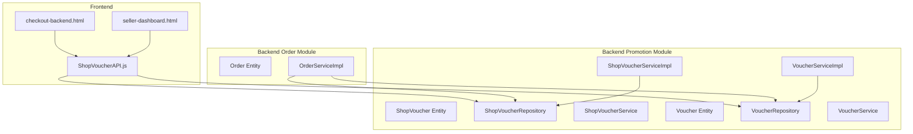
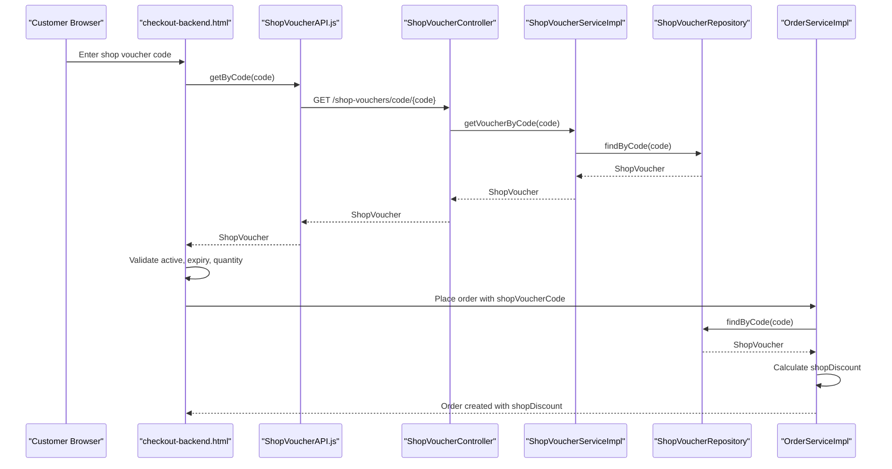
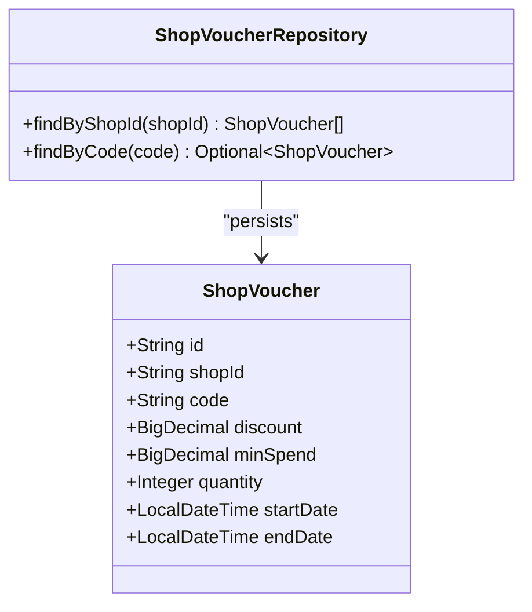
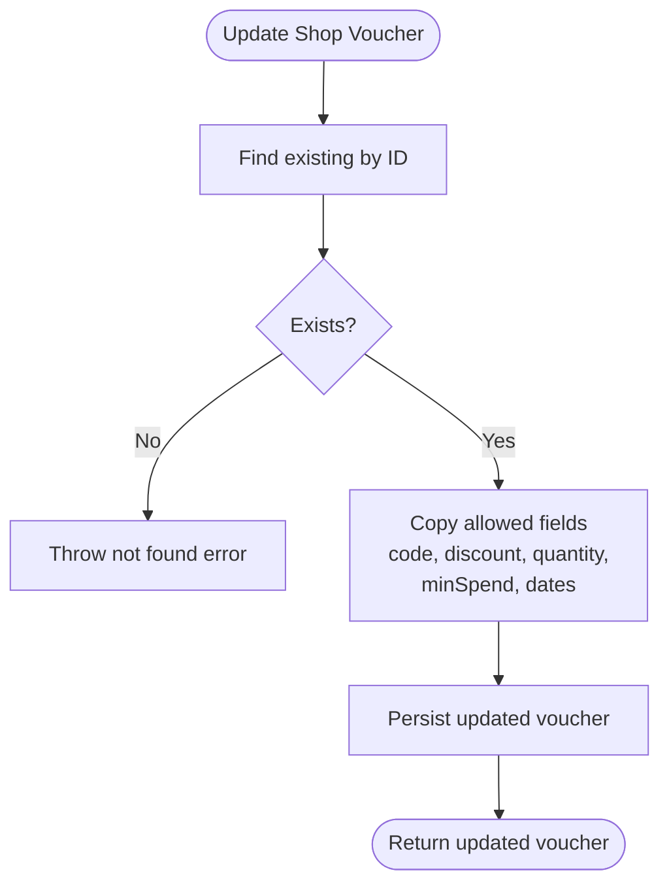
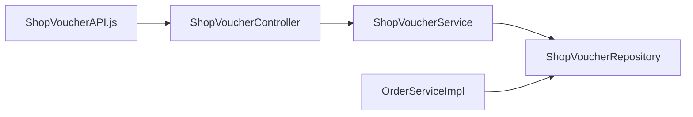

# Shop Voucher System

<cite>
**Referenced Files in This Document**
- [ShopVoucher.java](file://src/Backend/src/main/java/com/shoppeclone/backend/promotion/entity/ShopVoucher.java)
- [ShopVoucherController.java](file://src/Backend/src/main/java/com/shoppeclone/backend/promotion/controller/ShopVoucherController.java)
- [ShopVoucherService.java](file://src/Backend/src/main/java/com/shoppeclone/backend/promotion/service/ShopVoucherService.java)
- [ShopVoucherServiceImpl.java](file://src/Backend/src/main/java/com/shoppeclone/backend/promotion/service/impl/ShopVoucherServiceImpl.java)
- [ShopVoucherRepository.java](file://src/Backend/src/main/java/com/shoppeclone/backend/promotion/repository/ShopVoucherRepository.java)
- [Voucher.java](file://src/Backend/src/main/java/com/shoppeclone/backend/promotion/entity/Voucher.java)
- [VoucherService.java](file://src/Backend/src/main/java/com/shoppeclone/backend/promotion/service/VoucherService.java)
- [VoucherServiceImpl.java](file://src/Backend/src/main/java/com/shoppeclone/backend/promotion/service/impl/VoucherServiceImpl.java)
- [Order.java](file://src/Backend/src/main/java/com/shoppeclone/backend/order/entity/Order.java)
- [OrderServiceImpl.java](file://src/Backend/src/main/java/com/shoppeclone/backend/order/service/impl/OrderServiceImpl.java)
- [Shop.java](file://src/Backend/src/main/java/com/shoppeclone/backend/shop/entity/Shop.java)
- [ShopVoucherAPI.js](file://src/Frontend/js/services/api.js)
- [checkout-backend.html](file://src/Backend/src/main/resources/static/checkout-backend.html)
- [seller-dashboard.html](file://src/Backend/src/main/resources/static/seller-dashboard.html)
</cite>

## Table of Contents
1. [Introduction](#introduction)
2. [Project Structure](#project-structure)
3. [Core Components](#core-components)
4. [Architecture Overview](#architecture-overview)
5. [Detailed Component Analysis](#detailed-component-analysis)
6. [Dependency Analysis](#dependency-analysis)
7. [Performance Considerations](#performance-considerations)
8. [Troubleshooting Guide](#troubleshooting-guide)
9. [Conclusion](#conclusion)

## Introduction
This document describes the shop-specific voucher system that enables individual shops to create, manage, and distribute their own promotional vouchers independent of platform-wide offers. It covers the ShopVoucher entity, shop ownership validation, API endpoints, seller dashboard integration, customer-facing display, usage tracking, revenue attribution, verification requirements, approval workflows, and performance analytics.

## Project Structure
The shop voucher system spans backend Java services and frontend UI components:
- Backend promotion module defines ShopVoucher and Voucher entities, repositories, services, and controllers
- Order service integrates shop voucher discounts into checkout and order creation
- Frontend provides APIs for shop voucher retrieval and a seller dashboard for shop management

**Diagram sources**
- [ShopVoucher.java:11-27](file://src/Backend/src/main/java/com/shoppeclone/backend/promotion/entity/ShopVoucher.java#L11-L27)
- [ShopVoucherRepository.java:10-15](file://src/Backend/src/main/java/com/shoppeclone/backend/promotion/repository/ShopVoucherRepository.java#L10-L15)
- [ShopVoucherService.java:7-17](file://src/Backend/src/main/java/com/shoppeclone/backend/promotion/service/ShopVoucherService.java#L7-L17)
- [ShopVoucherServiceImpl.java:13-53](file://src/Backend/src/main/java/com/shoppeclone/backend/promotion/service/impl/ShopVoucherServiceImpl.java#L13-L53)
- [Voucher.java:11-50](file://src/Backend/src/main/java/com/shoppeclone/backend/promotion/entity/Voucher.java#L11-L50)
- [VoucherServiceImpl.java:18-53](file://src/Backend/src/main/java/com/shoppeclone/backend/promotion/service/impl/VoucherServiceImpl.java#L18-L53)
- [Order.java:16-54](file://src/Backend/src/main/java/com/shoppeclone/backend/order/entity/Order.java#L16-L54)
- [OrderServiceImpl.java:331-546](file://src/Backend/src/main/java/com/shoppeclone/backend/order/service/impl/OrderServiceImpl.java#L331-L546)
- [ShopVoucherAPI.js:424-440](file://src/Frontend/js/services/api.js#L424-L440)
- [checkout-backend.html:511-523](file://src/Backend/src/main/resources/static/checkout-backend.html#L511-L523)
- [seller-dashboard.html:1-800](file://src/Backend/src/main/resources/static/seller-dashboard.html#L1-L800)

**Section sources**
- [ShopVoucher.java:11-27](file://src/Backend/src/main/java/com/shoppeclone/backend/promotion/entity/ShopVoucher.java#L11-L27)
- [ShopVoucherController.java:11-44](file://src/Backend/src/main/java/com/shoppeclone/backend/promotion/controller/ShopVoucherController.java#L11-L44)
- [ShopVoucherService.java:7-17](file://src/Backend/src/main/java/com/shoppeclone/backend/promotion/service/ShopVoucherService.java#L7-L17)
- [ShopVoucherServiceImpl.java:13-53](file://src/Backend/src/main/java/com/shoppeclone/backend/promotion/service/impl/ShopVoucherServiceImpl.java#L13-L53)
- [ShopVoucherRepository.java:10-15](file://src/Backend/src/main/java/com/shoppeclone/backend/promotion/repository/ShopVoucherRepository.java#L10-L15)
- [Voucher.java:11-50](file://src/Backend/src/main/java/com/shoppeclone/backend/promotion/entity/Voucher.java#L11-L50)
- [VoucherServiceImpl.java:18-53](file://src/Backend/src/main/java/com/shoppeclone/backend/promotion/service/impl/VoucherServiceImpl.java#L18-L53)
- [Order.java:16-54](file://src/Backend/src/main/java/com/shoppeclone/backend/order/entity/Order.java#L16-L54)
- [OrderServiceImpl.java:331-546](file://src/Backend/src/main/java/com/shoppeclone/backend/order/service/impl/OrderServiceImpl.java#L331-L546)
- [ShopVoucherAPI.js:424-440](file://src/Frontend/js/services/api.js#L424-L440)
- [checkout-backend.html:511-523](file://src/Backend/src/main/resources/static/checkout-backend.html#L511-L523)
- [seller-dashboard.html:1-800](file://src/Backend/src/main/resources/static/seller-dashboard.html#L1-L800)

## Core Components
- ShopVoucher entity: Represents a shop-specific discount coupon with fields for shop association, discount value, minimum spend, quantity, and validity period.
- ShopVoucherController: Exposes REST endpoints for shop voucher CRUD operations and lookup by code.
- ShopVoucherService and implementation: Encapsulate business logic for retrieving, creating, updating, and deleting shop vouchers.
- ShopVoucherRepository: Data access layer for shop vouchers with MongoDB queries by shopId and code.
- Order integration: OrderServiceImpl applies shop voucher discounts during checkout and persists applied discount and code on the order.
- Frontend integration: ShopVoucherAPI provides client-side methods to fetch shop vouchers by shop and by code; checkout-backend.html validates and applies shop vouchers; seller-dashboard.html supports shop management.

Key implementation references:
- ShopVoucher entity definition and indexing: [ShopVoucher.java:11-27](file://src/Backend/src/main/java/com/shoppeclone/backend/promotion/entity/ShopVoucher.java#L11-L27)
- Shop voucher controller endpoints: [ShopVoucherController.java:18-43](file://src/Backend/src/main/java/com/shoppeclone/backend/promotion/controller/ShopVoucherController.java#L18-L43)
- Shop voucher service interface: [ShopVoucherService.java:7-17](file://src/Backend/src/main/java/com/shoppeclone/backend/promotion/service/ShopVoucherService.java#L7-L17)
- Shop voucher service implementation: [ShopVoucherServiceImpl.java:17-52](file://src/Backend/src/main/java/com/shoppeclone/backend/promotion/service/impl/ShopVoucherServiceImpl.java#L17-L52)
- Shop voucher repository: [ShopVoucherRepository.java:10-15](file://src/Backend/src/main/java/com/shoppeclone/backend/promotion/repository/ShopVoucherRepository.java#L10-L15)
- Order shop discount calculation and persistence: [OrderServiceImpl.java:331-346](file://src/Backend/src/main/java/com/shoppeclone/backend/order/service/impl/OrderServiceImpl.java#L331-L346), [OrderServiceImpl.java:535-546](file://src/Backend/src/main/java/com/shoppeclone/backend/order/service/impl/OrderServiceImpl.java#L535-L546)
- Frontend API for shop vouchers: [ShopVoucherAPI.js:424-440](file://src/Frontend/js/services/api.js#L424-L440)
- Frontend checkout validation for shop vouchers: [checkout-backend.html:511-523](file://src/Backend/src/main/resources/static/checkout-backend.html#L511-L523)

**Section sources**
- [ShopVoucher.java:11-27](file://src/Backend/src/main/java/com/shoppeclone/backend/promotion/entity/ShopVoucher.java#L11-L27)
- [ShopVoucherController.java:18-43](file://src/Backend/src/main/java/com/shoppeclone/backend/promotion/controller/ShopVoucherController.java#L18-L43)
- [ShopVoucherService.java:7-17](file://src/Backend/src/main/java/com/shoppeclone/backend/promotion/service/ShopVoucherService.java#L7-L17)
- [ShopVoucherServiceImpl.java:17-52](file://src/Backend/src/main/java/com/shoppeclone/backend/promotion/service/impl/ShopVoucherServiceImpl.java#L17-L52)
- [ShopVoucherRepository.java:10-15](file://src/Backend/src/main/java/com/shoppeclone/backend/promotion/repository/ShopVoucherRepository.java#L10-L15)
- [OrderServiceImpl.java:331-346](file://src/Backend/src/main/java/com/shoppeclone/backend/order/service/impl/OrderServiceImpl.java#L331-L346)
- [OrderServiceImpl.java:535-546](file://src/Backend/src/main/java/com/shoppeclone/backend/order/service/impl/OrderServiceImpl.java#L535-L546)
- [ShopVoucherAPI.js:424-440](file://src/Frontend/js/services/api.js#L424-L440)
- [checkout-backend.html:511-523](file://src/Backend/src/main/resources/static/checkout-backend.html#L511-L523)

## Architecture Overview
The system follows a layered architecture:
- Presentation layer: Frontend pages (checkout and seller dashboard) consume ShopVoucherAPI
- Application layer: Controllers expose endpoints; Services encapsulate business logic
- Persistence layer: Repositories interact with MongoDB collections for shop vouchers and platform vouchers
- Integration: Order service calculates and records shop voucher discounts per order

**Diagram sources**
- [ShopVoucherAPI.js:426-431](file://src/Frontend/js/services/api.js#L426-L431)
- [ShopVoucherController.java:34-37](file://src/Backend/src/main/java/com/shoppeclone/backend/promotion/controller/ShopVoucherController.java#L34-L37)
- [ShopVoucherServiceImpl.java:44-47](file://src/Backend/src/main/java/com/shoppeclone/backend/promotion/service/impl/ShopVoucherServiceImpl.java#L44-L47)
- [ShopVoucherRepository.java:14](file://src/Backend/src/main/java/com/shoppeclone/backend/promotion/repository/ShopVoucherRepository.java#L14)
- [OrderServiceImpl.java:535-546](file://src/Backend/src/main/java/com/shoppeclone/backend/order/service/impl/OrderServiceImpl.java#L535-L546)
- [checkout-backend.html:511-523](file://src/Backend/src/main/resources/static/checkout-backend.html#L511-L523)

## Detailed Component Analysis

### ShopVoucher Entity and Repository
- Entity fields include shop identifier, discount amount, minimum spend threshold, quantity, and validity dates. The shopId field is indexed for efficient lookups.
- Repository provides findByShopId and findByCode for querying.

**Diagram sources**
- [ShopVoucher.java:14-27](file://src/Backend/src/main/java/com/shoppeclone/backend/promotion/entity/ShopVoucher.java#L14-L27)
- [ShopVoucherRepository.java:12-14](file://src/Backend/src/main/java/com/shoppeclone/backend/promotion/repository/ShopVoucherRepository.java#L12-L14)

**Section sources**
- [ShopVoucher.java:14-27](file://src/Backend/src/main/java/com/shoppeclone/backend/promotion/entity/ShopVoucher.java#L14-L27)
- [ShopVoucherRepository.java:12-14](file://src/Backend/src/main/java/com/shoppeclone/backend/promotion/repository/ShopVoucherRepository.java#L12-L14)

### ShopVoucher Service Layer
- Service interface defines methods for listing by shop, creating/updating/deleting, and fetching by code.
- Implementation enforces existence checks and updates only permitted fields on update.

**Diagram sources**
- [ShopVoucherServiceImpl.java:27-41](file://src/Backend/src/main/java/com/shoppeclone/backend/promotion/service/impl/ShopVoucherServiceImpl.java#L27-L41)

**Section sources**
- [ShopVoucherService.java:7-17](file://src/Backend/src/main/java/com/shoppeclone/backend/promotion/service/ShopVoucherService.java#L7-L17)
- [ShopVoucherServiceImpl.java:27-41](file://src/Backend/src/main/java/com/shoppeclone/backend/promotion/service/impl/ShopVoucherServiceImpl.java#L27-L41)

### API Endpoints for Shop-Specific Vouchers
- Retrieve shop vouchers by shop: GET /api/shop-vouchers/shop/{shopId}
- Create a shop voucher: POST /api/shop-vouchers
- Update a shop voucher: PUT /api/shop-vouchers/{id}
- Retrieve a shop voucher by code: GET /api/shop-vouchers/code/{code}
- Delete a shop voucher: DELETE /api/shop-vouchers/{id}

These endpoints are implemented by ShopVoucherController and backed by ShopVoucherService.

**Section sources**
- [ShopVoucherController.java:18-43](file://src/Backend/src/main/java/com/shoppeclone/backend/promotion/controller/ShopVoucherController.java#L18-L43)

### Shop Ownership Validation and Shop Management Integration
- Shop ownership is validated implicitly via the shopId field on ShopVoucher and by retrieving vouchers per shopId.
- Shop entity contains owner identification and shop metadata, enabling shop management workflows.

References:
- ShopVoucher shopId indexing: [ShopVoucher.java:17-18](file://src/Backend/src/main/java/com/shoppeclone/backend/promotion/entity/ShopVoucher.java#L17-L18)
- Shop entity owner field: [Shop.java:18-19](file://src/Backend/src/main/java/com/shoppeclone/backend/shop/entity/Shop.java#L18-L19)

**Section sources**
- [ShopVoucher.java:17-18](file://src/Backend/src/main/java/com/shoppeclone/backend/promotion/entity/ShopVoucher.java#L17-L18)
- [Shop.java:18-19](file://src/Backend/src/main/java/com/shoppeclone/backend/shop/entity/Shop.java#L18-L19)

### Customer-Facing Display and Usage Mechanisms
- Frontend ShopVoucherAPI exposes getByCode and getVouchersByShop for client-side integration.
- checkout-backend.html validates voucher type, activity, expiry, and stock before applying.
- The seller dashboard provides shop management capabilities.

References:
- ShopVoucherAPI methods: [ShopVoucherAPI.js:426-439](file://src/Frontend/js/services/api.js#L426-L439)
- Frontend checkout validation: [checkout-backend.html:511-523](file://src/Backend/src/main/resources/static/checkout-backend.html#L511-L523)
- Seller dashboard page: [seller-dashboard.html:1-800](file://src/Backend/src/main/resources/static/seller-dashboard.html#L1-L800)

**Section sources**
- [ShopVoucherAPI.js:426-439](file://src/Frontend/js/services/api.js#L426-L439)
- [checkout-backend.html:511-523](file://src/Backend/src/main/resources/static/checkout-backend.html#L511-L523)
- [seller-dashboard.html:1-800](file://src/Backend/src/main/resources/static/seller-dashboard.html#L1-L800)

### Usage Tracking and Revenue Attribution
- OrderServiceImpl applies shop voucher discounts and persists the applied code and discount amount on the order.
- Platform Voucher usage tracking for a user aggregates used codes from orders (product and shipping vouchers), which can be extended to shop vouchers if needed.

References:
- Applying shop discount and saving order: [OrderServiceImpl.java:331-346](file://src/Backend/src/main/java/com/shoppeclone/backend/order/service/impl/OrderServiceImpl.java#L331-L346)
- Calculating shop discount: [OrderServiceImpl.java:535-546](file://src/Backend/src/main/java/com/shoppeclone/backend/order/service/impl/OrderServiceImpl.java#L535-L546)
- Used voucher codes tracking (platform): [VoucherServiceImpl.java:40-52](file://src/Backend/src/main/java/com/shoppeclone/backend/promotion/service/impl/VoucherServiceImpl.java#L40-L52)

**Section sources**
- [OrderServiceImpl.java:331-346](file://src/Backend/src/main/java/com/shoppeclone/backend/order/service/impl/OrderServiceImpl.java#L331-L346)
- [OrderServiceImpl.java:535-546](file://src/Backend/src/main/java/com/shoppeclone/backend/order/service/impl/OrderServiceImpl.java#L535-L546)
- [VoucherServiceImpl.java:40-52](file://src/Backend/src/main/java/com/shoppeclone/backend/promotion/service/impl/VoucherServiceImpl.java#L40-L52)

### Shop Verification Requirements and Approval Workflows
- Shop verification is managed by the Shop entity, which includes identity and bank account fields and a status indicator.
- While shop voucher creation does not enforce verification in the controller/service, shop ownership validation ensures vouchers belong to the shop.

References:
- Shop entity fields and status: [Shop.java:18-40](file://src/Backend/src/main/java/com/shoppeclone/backend/shop/entity/Shop.java#L18-L40)

**Section sources**
- [Shop.java:18-40](file://src/Backend/src/main/java/com/shoppeclone/backend/shop/entity/Shop.java#L18-L40)

### Performance Analytics for Sellers
- The seller dashboard page includes charts and metrics for revenue and order status, suitable for analyzing shop voucher impact on performance.
- Analytics can be extended to track shop voucher redemption rates and revenue attribution per shop.

References:
- Seller dashboard layout and chart placeholders: [seller-dashboard.html:209-234](file://src/Backend/src/main/resources/static/seller-dashboard.html#L209-L234)

**Section sources**
- [seller-dashboard.html:209-234](file://src/Backend/src/main/resources/static/seller-dashboard.html#L209-L234)

## Dependency Analysis
The system exhibits clear separation of concerns:
- ShopVoucherController depends on ShopVoucherService
- ShopVoucherService depends on ShopVoucherRepository
- OrderServiceImpl depends on ShopVoucherRepository for discount calculation and persistence
- Frontend ShopVoucherAPI depends on backend endpoints

**Diagram sources**
- [ShopVoucherController.java:16-16](file://src/Backend/src/main/java/com/shoppeclone/backend/promotion/controller/ShopVoucherController.java#L16-L16)
- [ShopVoucherService.java:7-17](file://src/Backend/src/main/java/com/shoppeclone/backend/promotion/service/ShopVoucherService.java#L7-L17)
- [ShopVoucherRepository.java:10-15](file://src/Backend/src/main/java/com/shoppeclone/backend/promotion/repository/ShopVoucherRepository.java#L10-L15)
- [OrderServiceImpl.java:331-346](file://src/Backend/src/main/java/com/shoppeclone/backend/order/service/impl/OrderServiceImpl.java#L331-L346)
- [ShopVoucherAPI.js:424-440](file://src/Frontend/js/services/api.js#L424-L440)

**Section sources**
- [ShopVoucherController.java:16-16](file://src/Backend/src/main/java/com/shoppeclone/backend/promotion/controller/ShopVoucherController.java#L16-L16)
- [ShopVoucherService.java:7-17](file://src/Backend/src/main/java/com/shoppeclone/backend/promotion/service/ShopVoucherService.java#L7-L17)
- [ShopVoucherRepository.java:10-15](file://src/Backend/src/main/java/com/shoppeclone/backend/promotion/repository/ShopVoucherRepository.java#L10-L15)
- [OrderServiceImpl.java:331-346](file://src/Backend/src/main/java/com/shoppeclone/backend/order/service/impl/OrderServiceImpl.java#L331-L346)
- [ShopVoucherAPI.js:424-440](file://src/Frontend/js/services/api.js#L424-L440)

## Performance Considerations
- Index shopId on ShopVoucher for efficient per-shop queries.
- Validate voucher availability and expiry on the client side before attempting checkout to reduce server load.
- Batch operations for bulk shop voucher creation/update if needed.
- Monitor repository query performance and consider caching for frequently accessed shop voucher lists.

## Troubleshooting Guide
Common issues and resolutions:
- Voucher not found by code: Ensure the code exists and is not expired; verify repository findByCode query.
- Quantity exhausted: Confirm quantity is greater than zero before applying.
- Expiry date validation: Ensure endDate is in the future.
- Ownership mismatch: Verify shopId matches the shop requesting the voucher list.

References:
- Not found exceptions and validations: [ShopVoucherServiceImpl.java:30](file://src/Backend/src/main/java/com/shoppeclone/backend/promotion/service/impl/ShopVoucherServiceImpl.java#L30), [ShopVoucherServiceImpl.java:46](file://src/Backend/src/main/java/com/shoppeclone/backend/promotion/service/impl/ShopVoucherServiceImpl.java#L46)
- Frontend validation: [checkout-backend.html:511-523](file://src/Backend/src/main/resources/static/checkout-backend.html#L511-L523)

**Section sources**
- [ShopVoucherServiceImpl.java:30](file://src/Backend/src/main/java/com/shoppeclone/backend/promotion/service/impl/ShopVoucherServiceImpl.java#L30)
- [ShopVoucherServiceImpl.java:46](file://src/Backend/src/main/java/com/shoppeclone/backend/promotion/service/impl/ShopVoucherServiceImpl.java#L46)
- [checkout-backend.html:511-523](file://src/Backend/src/main/resources/static/checkout-backend.html#L511-L523)

## Conclusion
The shop-specific voucher system provides shops with independent control over promotional campaigns while integrating seamlessly with checkout, order management, and seller analytics. By leveraging shopId-based ownership, explicit validation, and clear API boundaries, the system supports scalable, shop-centric promotions with accurate usage tracking and revenue attribution.