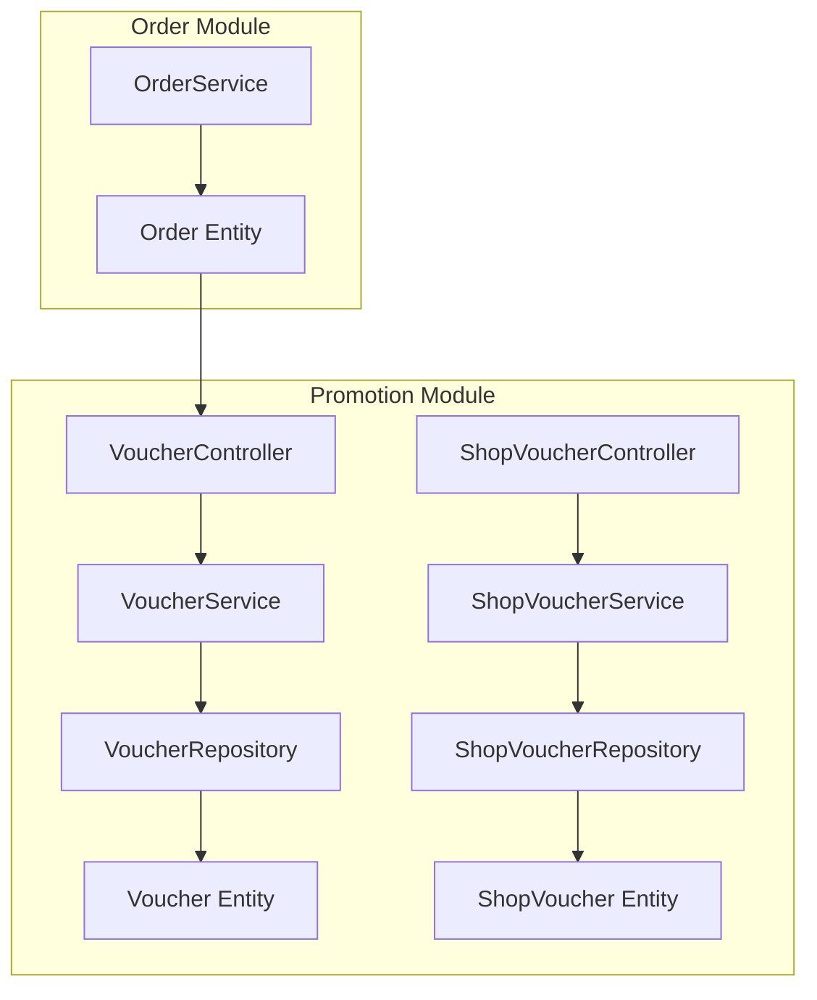
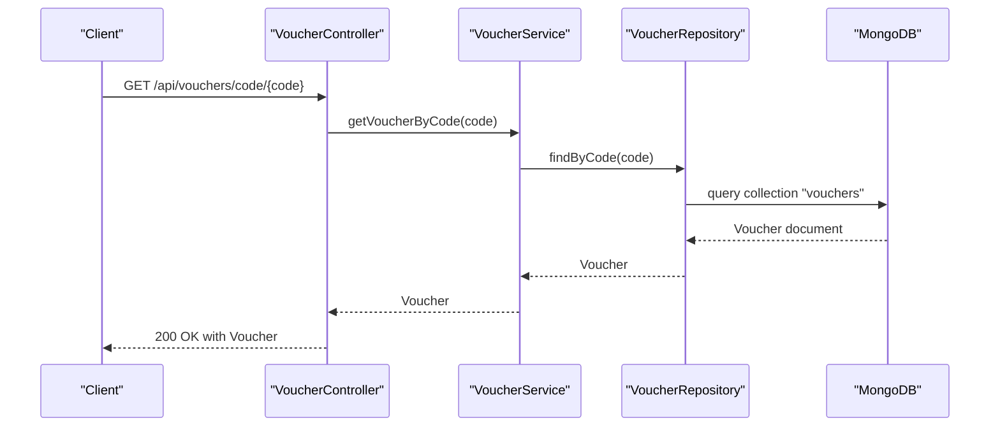
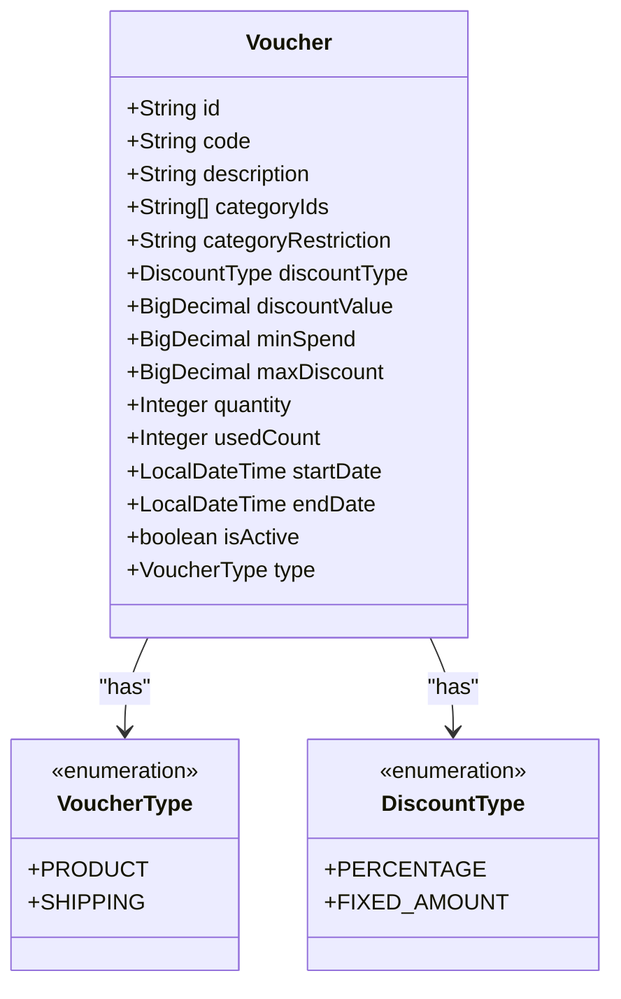
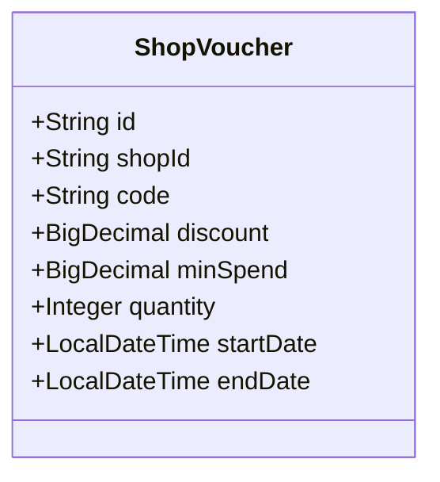
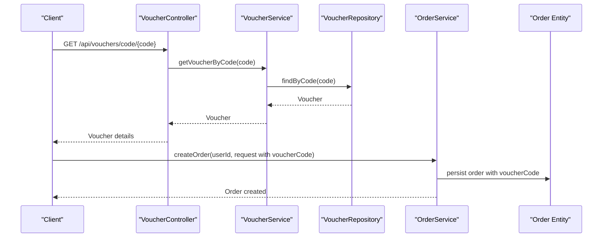
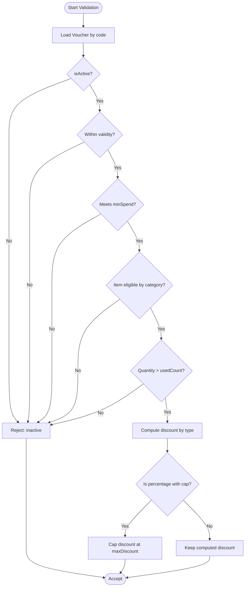
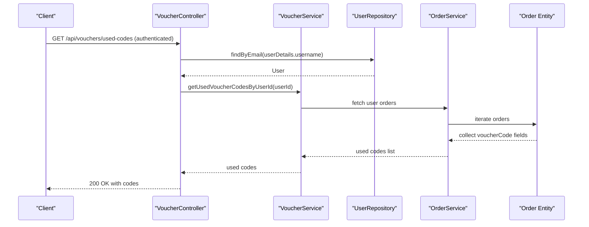
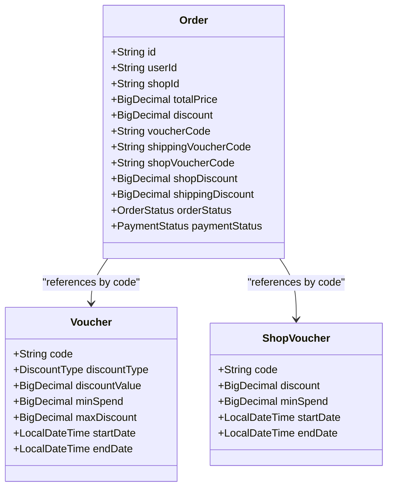
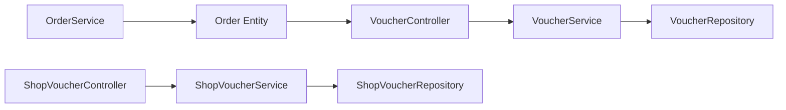

# Voucher Management System

<cite>
**Referenced Files in This Document**
- [Voucher.java](file://src/Backend/src/main/java/com/shoppeclone/backend/promotion/entity/Voucher.java)
- [ShopVoucher.java](file://src/Backend/src/main/java/com/shoppeclone/backend/promotion/entity/ShopVoucher.java)
- [VoucherController.java](file://src/Backend/src/main/java/com/shoppeclone/backend/promotion/controller/VoucherController.java)
- [ShopVoucherController.java](file://src/Backend/src/main/java/com/shoppeclone/backend/promotion/controller/ShopVoucherController.java)
- [VoucherService.java](file://src/Backend/src/main/java/com/shoppeclone/backend/promotion/service/VoucherService.java)
- [ShopVoucherService.java](file://src/Backend/src/main/java/com/shoppeclone/backend/promotion/service/ShopVoucherService.java)
- [VoucherRepository.java](file://src/Backend/src/main/java/com/shoppeclone/backend/promotion/repository/VoucherRepository.java)
- [ShopVoucherRepository.java](file://src/Backend/src/main/java/com/shoppeclone/backend/promotion/repository/ShopVoucherRepository.java)
- [Order.java](file://src/Backend/src/main/java/com/shoppeclone/backend/order/entity/Order.java)
- [OrderService.java](file://src/Backend/src/main/java/com/shoppeclone/backend/order/service/OrderService.java)
- [application.properties](file://src/Backend/src/main/resources/application.properties)
</cite>

## Table of Contents
1. [Introduction](#introduction)
2. [Project Structure](#project-structure)
3. [Core Components](#core-components)
4. [Architecture Overview](#architecture-overview)
5. [Detailed Component Analysis](#detailed-component-analysis)
6. [Dependency Analysis](#dependency-analysis)
7. [Performance Considerations](#performance-considerations)
8. [Troubleshooting Guide](#troubleshooting-guide)
9. [Conclusion](#conclusion)
10. [Appendices](#appendices)

## Introduction
This document describes the Voucher Management System within the backend. It explains how vouchers are modeled, validated, tracked, and redeemed during order processing. It documents the Voucher entity structure (discount types, validity periods, usage limits, eligibility criteria), API endpoints for voucher CRUD and code validation, user-specific usage history retrieval, and integration with order processing. It also covers security considerations, fraud prevention strategies, and audit trail approaches.

## Project Structure
The voucher subsystem resides under the promotion module and integrates with order processing and user authentication. Key elements:
- Entities define voucher models for product-level and shop-level discounts.
- Controllers expose REST endpoints for voucher management and code lookup.
- Services encapsulate business logic for voucher operations.
- Repositories provide persistence access via MongoDB.
- Order entities track applied voucher codes and resulting discounts.

**Diagram sources**
- [VoucherController.java:1-45](file://src/Backend/src/main/java/com/shoppeclone/backend/promotion/controller/VoucherController.java#L1-L45)
- [VoucherService.java:1-17](file://src/Backend/src/main/java/com/shoppeclone/backend/promotion/service/VoucherService.java#L1-L17)
- [VoucherRepository.java:1-13](file://src/Backend/src/main/java/com/shoppeclone/backend/promotion/repository/VoucherRepository.java#L1-L13)
- [Voucher.java:1-51](file://src/Backend/src/main/java/com/shoppeclone/backend/promotion/entity/Voucher.java#L1-L51)
- [ShopVoucherService.java:1-18](file://src/Backend/src/main/java/com/shoppeclone/backend/promotion/service/ShopVoucherService.java#L1-L18)
- [ShopVoucherRepository.java:1-16](file://src/Backend/src/main/java/com/shoppeclone/backend/promotion/repository/ShopVoucherRepository.java#L1-L16)
- [ShopVoucher.java:1-28](file://src/Backend/src/main/java/com/shoppeclone/backend/promotion/entity/ShopVoucher.java#L1-L28)
- [ShopVoucherController.java:1-45](file://src/Backend/src/main/java/com/shoppeclone/backend/promotion/controller/ShopVoucherController.java#L1-L45)
- [OrderService.java:1-33](file://src/Backend/src/main/java/com/shoppeclone/backend/order/service/OrderService.java#L1-L33)
- [Order.java:1-55](file://src/Backend/src/main/java/com/shoppeclone/backend/order/entity/Order.java#L1-L55)

**Section sources**
- [VoucherController.java:1-45](file://src/Backend/src/main/java/com/shoppeclone/backend/promotion/controller/VoucherController.java#L1-L45)
- [ShopVoucherController.java:1-45](file://src/Backend/src/main/java/com/shoppeclone/backend/promotion/controller/ShopVoucherController.java#L1-L45)
- [Voucher.java:1-51](file://src/Backend/src/main/java/com/shoppeclone/backend/promotion/entity/Voucher.java#L1-L51)
- [ShopVoucher.java:1-28](file://src/Backend/src/main/java/com/shoppeclone/backend/promotion/entity/ShopVoucher.java#L1-L28)
- [Order.java:1-55](file://src/Backend/src/main/java/com/shoppeclone/backend/order/entity/Order.java#L1-L55)

## Core Components
- Voucher entity: Defines product-level discount rules, validity period, usage limits, category restrictions, and discount types.
- ShopVoucher entity: Defines shop-level discount rules with minimum spend and validity period.
- VoucherController: Exposes endpoints for retrieving vouchers, validating codes, and fetching user usage history.
- ShopVoucherController: Manages shop-level voucher CRUD operations and code lookup.
- VoucherService and ShopVoucherService: Encapsulate business logic for voucher operations.
- VoucherRepository and ShopVoucherRepository: Provide MongoDB access for voucher entities.
- Order integration: Tracks applied voucher codes and computed discounts on order records.

Key capabilities:
- Product-level voucher validation and discount computation during checkout.
- Shop-level voucher application per shop.
- User-specific usage history retrieval for preventing misuse.

**Section sources**
- [Voucher.java:1-51](file://src/Backend/src/main/java/com/shoppeclone/backend/promotion/entity/Voucher.java#L1-L51)
- [ShopVoucher.java:1-28](file://src/Backend/src/main/java/com/shoppeclone/backend/promotion/entity/ShopVoucher.java#L1-L28)
- [VoucherController.java:1-45](file://src/Backend/src/main/java/com/shoppeclone/backend/promotion/controller/VoucherController.java#L1-L45)
- [ShopVoucherController.java:1-45](file://src/Backend/src/main/java/com/shoppeclone/backend/promotion/controller/ShopVoucherController.java#L1-L45)
- [VoucherService.java:1-17](file://src/Backend/src/main/java/com/shoppeclone/backend/promotion/service/VoucherService.java#L1-L17)
- [ShopVoucherService.java:1-18](file://src/Backend/src/main/java/com/shoppeclone/backend/promotion/service/ShopVoucherService.java#L1-L18)
- [VoucherRepository.java:1-13](file://src/Backend/src/main/java/com/shoppeclone/backend/promotion/repository/VoucherRepository.java#L1-L13)
- [ShopVoucherRepository.java:1-16](file://src/Backend/src/main/java/com/shoppeclone/backend/promotion/repository/ShopVoucherRepository.java#L1-L16)
- [Order.java:1-55](file://src/Backend/src/main/java/com/shoppeclone/backend/order/entity/Order.java#L1-L55)

## Architecture Overview
The system follows a layered architecture:
- Presentation: REST controllers handle requests and return responses.
- Application: Services implement business rules for voucher creation, validation, and usage tracking.
- Persistence: Repositories manage MongoDB collections for vouchers and shop vouchers.
- Integration: Orders record applied voucher codes and resulting discounts.

**Diagram sources**
- [VoucherController.java:40-43](file://src/Backend/src/main/java/com/shoppeclone/backend/promotion/controller/VoucherController.java#L40-L43)
- [VoucherService.java:1-17](file://src/Backend/src/main/java/com/shoppeclone/backend/promotion/service/VoucherService.java#L1-L17)
- [VoucherRepository.java:1-13](file://src/Backend/src/main/java/com/shoppeclone/backend/promotion/repository/VoucherRepository.java#L1-L13)

## Detailed Component Analysis

### Voucher Entity Model
The Voucher entity captures:
- Identity and metadata: code, description, type (PRODUCT or SHIPPING).
- Eligibility: categoryIds and categoryRestriction for product targeting; minSpend threshold.
- Discount mechanics: discountType (PERCENTAGE or FIXED_AMOUNT), discountValue, maxDiscount for capped percentage off.
- Availability: quantity and usedCount for global usage caps; startDate and endDate for validity.
- Status: isActive flag.

**Diagram sources**
- [Voucher.java:1-51](file://src/Backend/src/main/java/com/shoppeclone/backend/promotion/entity/Voucher.java#L1-L51)

**Section sources**
- [Voucher.java:1-51](file://src/Backend/src/main/java/com/shoppeclone/backend/promotion/entity/Voucher.java#L1-L51)

### ShopVoucher Entity Model
The ShopVoucher entity captures:
- Identity and shop association: shopId indexed for fast lookup.
- Discount and eligibility: discount value, minSpend, quantity.
- Validity: startDate and endDate.

**Diagram sources**
- [ShopVoucher.java:1-28](file://src/Backend/src/main/java/com/shoppeclone/backend/promotion/entity/ShopVoucher.java#L1-L28)

**Section sources**
- [ShopVoucher.java:1-28](file://src/Backend/src/main/java/com/shoppeclone/backend/promotion/entity/ShopVoucher.java#L1-L28)

### API Endpoints

- Product Vouchers
  - GET /api/vouchers: Retrieve all vouchers.
  - GET /api/vouchers/code/{code}: Lookup a voucher by code.
  - GET /api/vouchers/used-codes: Return codes this user has used in past orders (requires authentication).
  - POST /api/vouchers: Create a new voucher.

- Shop Vouchers
  - GET /api/shop-vouchers/shop/{shopId}: Retrieve shop’s vouchers.
  - GET /api/shop-vouchers/code/{code}: Lookup a shop voucher by code.
  - POST /api/shop-vouchers: Create a shop voucher.
  - PUT /api/shop-vouchers/{id}: Update a shop voucher.
  - DELETE /api/shop-vouchers/{id}: Delete a shop voucher.

Notes:
- Authentication is required for retrieving used codes endpoint.
- Authorization policies are not enforced in the provided controllers; ensure role-based access controls are configured at the framework level.

**Section sources**
- [VoucherController.java:1-45](file://src/Backend/src/main/java/com/shoppeclone/backend/promotion/controller/VoucherController.java#L1-L45)
- [ShopVoucherController.java:1-45](file://src/Backend/src/main/java/com/shoppeclone/backend/promotion/controller/ShopVoucherController.java#L1-L45)

### Validation and Redemption Workflow

**Diagram sources**
- [VoucherController.java:40-43](file://src/Backend/src/main/java/com/shoppeclone/backend/promotion/controller/VoucherController.java#L40-L43)
- [VoucherRepository.java:1-13](file://src/Backend/src/main/java/com/shoppeclone/backend/promotion/repository/VoucherRepository.java#L1-L13)
- [OrderService.java:1-33](file://src/Backend/src/main/java/com/shoppeclone/backend/order/service/OrderService.java#L1-L33)
- [Order.java:1-55](file://src/Backend/src/main/java/com/shoppeclone/backend/order/entity/Order.java#L1-L55)

### Discount Calculation Algorithms
The system supports two discount types:
- Percentage discount: applied against item/subtotal with optional cap (maxDiscount).
- Fixed amount discount: subtracts a flat amount up to item/subtotal value.

Eligibility checks:
- Validity window: current time within startDate and endDate.
- Minimum spend: order total meets minSpend.
- Category restriction: item belongs to categoryIds or empty implies all categories.
- Quantity and usedCount: global quantity > usedCount.
- Active status: isActive is true.

[No sources needed since this diagram shows conceptual workflow, not actual code structure]

### Usage Tracking and History
- Used codes endpoint returns codes a user has used in prior orders.
- The order entity stores applied voucher codes and computed discounts for auditability.

**Diagram sources**
- [VoucherController.java:28-33](file://src/Backend/src/main/java/com/shoppeclone/backend/promotion/controller/VoucherController.java#L28-L33)
- [Order.java:28-32](file://src/Backend/src/main/java/com/shoppeclone/backend/order/entity/Order.java#L28-L32)

**Section sources**
- [VoucherController.java:28-33](file://src/Backend/src/main/java/com/shoppeclone/backend/promotion/controller/VoucherController.java#L28-L33)
- [Order.java:1-55](file://src/Backend/src/main/java/com/shoppeclone/backend/order/entity/Order.java#L1-L55)

### Integration with Order Processing
- Order entity tracks applied codes for product, shipping, and shop discounts.
- During checkout, the system validates voucher eligibility and computes discounts, then persists them on the order.

**Diagram sources**
- [Order.java:1-55](file://src/Backend/src/main/java/com/shoppeclone/backend/order/entity/Order.java#L1-L55)
- [Voucher.java:1-51](file://src/Backend/src/main/java/com/shoppeclone/backend/promotion/entity/Voucher.java#L1-L51)
- [ShopVoucher.java:1-28](file://src/Backend/src/main/java/com/shoppeclone/backend/promotion/entity/ShopVoucher.java#L1-L28)

**Section sources**
- [Order.java:1-55](file://src/Backend/src/main/java/com/shoppeclone/backend/order/entity/Order.java#L1-L55)

## Dependency Analysis
- Controllers depend on services for business logic.
- Services depend on repositories for persistence.
- Order module depends on voucher entities indirectly via stored codes.

**Diagram sources**
- [VoucherController.java:1-45](file://src/Backend/src/main/java/com/shoppeclone/backend/promotion/controller/VoucherController.java#L1-L45)
- [ShopVoucherController.java:1-45](file://src/Backend/src/main/java/com/shoppeclone/backend/promotion/controller/ShopVoucherController.java#L1-L45)
- [VoucherService.java:1-17](file://src/Backend/src/main/java/com/shoppeclone/backend/promotion/service/VoucherService.java#L1-L17)
- [ShopVoucherService.java:1-18](file://src/Backend/src/main/java/com/shoppeclone/backend/promotion/service/ShopVoucherService.java#L1-L18)
- [VoucherRepository.java:1-13](file://src/Backend/src/main/java/com/shoppeclone/backend/promotion/repository/VoucherRepository.java#L1-L13)
- [ShopVoucherRepository.java:1-16](file://src/Backend/src/main/java/com/shoppeclone/backend/promotion/repository/ShopVoucherRepository.java#L1-L16)
- [OrderService.java:1-33](file://src/Backend/src/main/java/com/shoppeclone/backend/order/service/OrderService.java#L1-L33)
- [Order.java:1-55](file://src/Backend/src/main/java/com/shoppeclone/backend/order/entity/Order.java#L1-L55)

**Section sources**
- [VoucherController.java:1-45](file://src/Backend/src/main/java/com/shoppeclone/backend/promotion/controller/VoucherController.java#L1-L45)
- [ShopVoucherController.java:1-45](file://src/Backend/src/main/java/com/shoppeclone/backend/promotion/controller/ShopVoucherController.java#L1-L45)
- [VoucherService.java:1-17](file://src/Backend/src/main/java/com/shoppeclone/backend/promotion/service/VoucherService.java#L1-L17)
- [ShopVoucherService.java:1-18](file://src/Backend/src/main/java/com/shoppeclone/backend/promotion/service/ShopVoucherService.java#L1-L18)
- [VoucherRepository.java:1-13](file://src/Backend/src/main/java/com/shoppeclone/backend/promotion/repository/VoucherRepository.java#L1-L13)
- [ShopVoucherRepository.java:1-16](file://src/Backend/src/main/java/com/shoppeclone/backend/promotion/repository/ShopVoucherRepository.java#L1-L16)
- [OrderService.java:1-33](file://src/Backend/src/main/java/com/shoppeclone/backend/order/service/OrderService.java#L1-L33)
- [Order.java:1-55](file://src/Backend/src/main/java/com/shoppeclone/backend/order/entity/Order.java#L1-L55)

## Performance Considerations
- Index shopId on ShopVoucher for efficient shop-based queries.
- Index code on both Voucher and ShopVoucher for fast lookups.
- Limit payload sizes for bulk retrieval endpoints.
- Consider caching frequently accessed voucher configurations with TTL.
- Ensure MongoDB connection pool sizing aligns with expected concurrency.

[No sources needed since this section provides general guidance]

## Troubleshooting Guide
Common issues and resolutions:
- Voucher not found by code
  - Verify code spelling and existence in the collection.
  - Confirm the code is not expired or disabled.
  - Check that the user has permission to access the endpoint if authentication is required.

- Voucher appears valid but discount not applied
  - Confirm order total meets minSpend.
  - Ensure items belong to allowed categories (or categoryIds is empty).
  - Check quantity and usedCount thresholds.

- Used codes endpoint returns empty
  - Confirm the user has placed orders with applied vouchers.
  - Verify the user identity is correctly resolved from authentication.

- Performance issues
  - Add missing indexes on shopId and code fields.
  - Monitor database query plans and adjust indexing strategy.

Security and audit:
- Enforce role-based access control on sensitive endpoints.
- Log voucher validation attempts and outcomes for audit trails.
- Rotate secrets and configure secure JWT expiration settings.

**Section sources**
- [application.properties:23-31](file://src/Backend/src/main/resources/application.properties#L23-L31)

## Conclusion
The voucher management system provides a robust foundation for product and shop-level discounting. Its modular design separates concerns across controllers, services, and repositories, while order integration ensures accurate discount tracking. By implementing the recommended validations, indexes, and security measures, the system can reliably support real-world usage patterns and maintain auditability.

## Appendices

### API Reference Summary
- Product Vouchers
  - GET /api/vouchers: List all vouchers.
  - GET /api/vouchers/code/{code}: Get voucher by code.
  - GET /api/vouchers/used-codes: Get user’s used voucher codes (authenticated).
  - POST /api/vouchers: Create a voucher.

- Shop Vouchers
  - GET /api/shop-vouchers/shop/{shopId}: List shop’s vouchers.
  - GET /api/shop-vouchers/code/{code}: Get shop voucher by code.
  - POST /api/shop-vouchers: Create a shop voucher.
  - PUT /api/shop-vouchers/{id}: Update a shop voucher.
  - DELETE /api/shop-vouchers/{id}: Delete a shop voucher.

[No sources needed since this section summarizes without analyzing specific files]