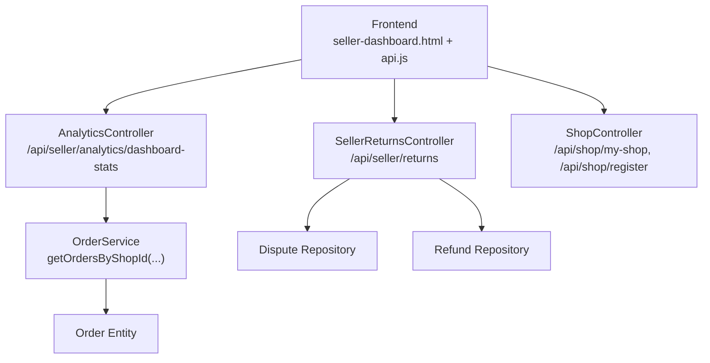
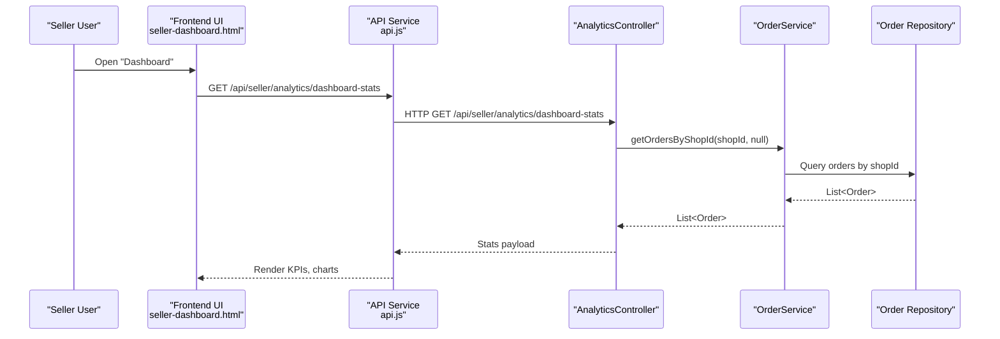
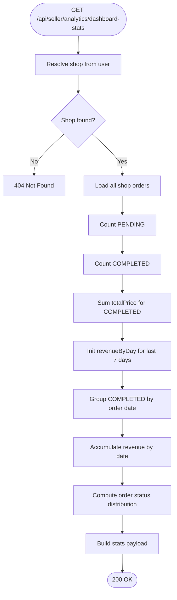
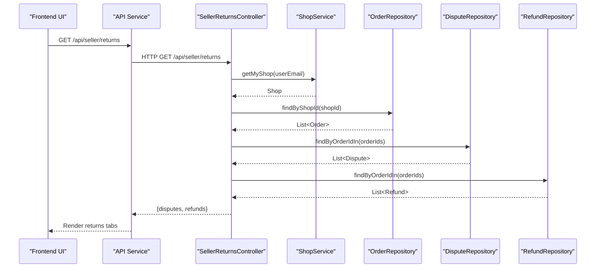
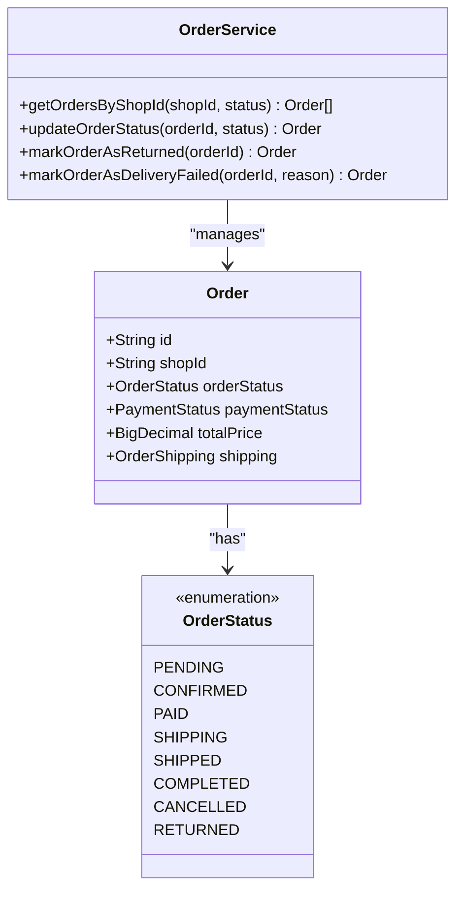
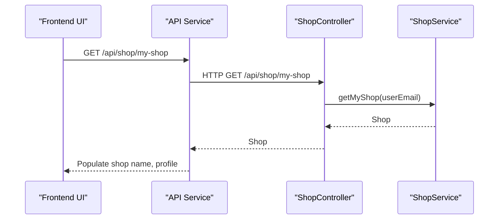
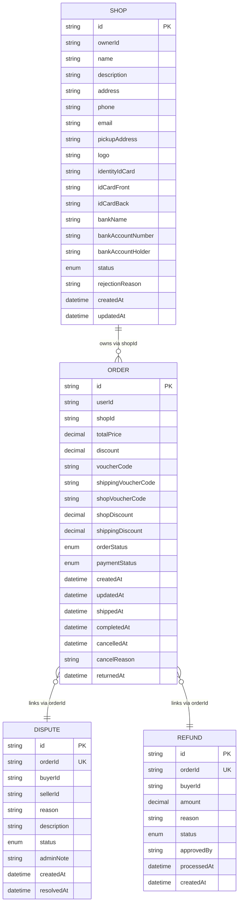
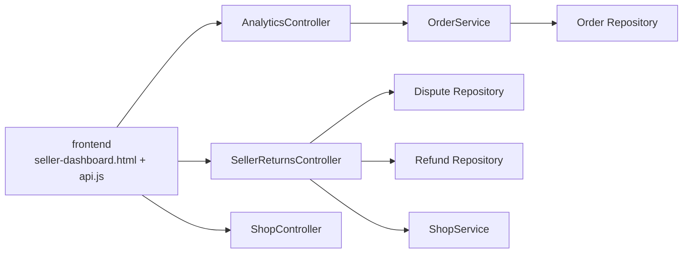

# Seller Dashboard & Analytics

<cite>
**Referenced Files in This Document**
- [AnalyticsController.java](file://src/Backend/src/main/java/com/shoppeclone/backend/shop/controller/AnalyticsController.java)
- [SellerReturnsController.java](file://src/Backend/src/main/java/com/shoppeclone/backend/shop/controller/SellerReturnsController.java)
- [ShopController.java](file://src/Backend/src/main/java/com/shoppeclone/backend/shop/controller/ShopController.java)
- [ShopService.java](file://src/Backend/src/main/java/com/shoppeclone/backend/shop/service/ShopService.java)
- [OrderService.java](file://src/Backend/src/main/java/com/shoppeclone/backend/order/service/OrderService.java)
- [Order.java](file://src/Backend/src/main/java/com/shoppeclone/backend/order/entity/Order.java)
- [OrderStatus.java](file://src/Backend/src/main/java/com/shoppeclone/backend/order/entity/OrderStatus.java)
- [Dispute.java](file://src/Backend/src/main/java/com/shoppeclone/backend/dispute/entity/Dispute.java)
- [Refund.java](file://src/Backend/src/main/java/com/shoppeclone/backend/refund/entity/Refund.java)
- [RefundStatus.java](file://src/Backend/src/main/java/com/shoppeclone/backend/refund/entity/RefundStatus.java)
- [Shop.java](file://src/Backend/src/main/java/com/shoppeclone/backend/shop/entity/Shop.java)
- [seller-dashboard.html](file://src/Frontend/seller-dashboard.html)
- [api.js](file://src/Frontend/js/services/api.js)
</cite>

## Table of Contents
1. [Introduction](#introduction)
2. [Project Structure](#project-structure)
3. [Core Components](#core-components)
4. [Architecture Overview](#architecture-overview)
5. [Detailed Component Analysis](#detailed-component-analysis)
6. [Dependency Analysis](#dependency-analysis)
7. [Performance Considerations](#performance-considerations)
8. [Troubleshooting Guide](#troubleshooting-guide)
9. [Conclusion](#conclusion)
10. [Appendices](#appendices)

## Introduction
This document explains the seller dashboard and analytics reporting capabilities implemented in the backend and frontend. It covers:
- Seller interface features: sales tracking, revenue analytics, order management, and performance metrics
- Analytics dashboard components: sales charts, order status distribution, and revenue trends
- Returns management: dispute and refund handling for sellers
- Data visualization and report generation
- Permissions, access control, and real-time updates in the dashboard

## Project Structure
The seller dashboard spans both backend controllers and services and a frontend HTML page with JavaScript APIs. Key areas:
- Backend controllers expose endpoints for analytics, returns, shop management, and order queries
- Frontend provides views for dashboard, orders, returns/refunds, inventory, and shop profile
- API service layer encapsulates HTTP requests and token handling

**Diagram sources**
- [AnalyticsController.java:25-72](file://src/Backend/src/main/java/com/shoppeclone/backend/shop/controller/AnalyticsController.java#L25-L72)
- [SellerReturnsController.java:37-57](file://src/Backend/src/main/java/com/shoppeclone/backend/shop/controller/SellerReturnsController.java#L37-L57)
- [ShopController.java:82-108](file://src/Backend/src/main/java/com/shoppeclone/backend/shop/controller/ShopController.java#L82-L108)
- [OrderService.java:16-17](file://src/Backend/src/main/java/com/shoppeclone/backend/order/service/OrderService.java#L16-L17)
- [Order.java:23-38](file://src/Backend/src/main/java/com/shoppeclone/backend/order/entity/Order.java#L23-L38)
- [Dispute.java:15-28](file://src/Backend/src/main/java/com/shoppeclone/backend/dispute/entity/Dispute.java#L15-L28)
- [Refund.java:15-26](file://src/Backend/src/main/java/com/shoppeclone/backend/refund/entity/Refund.java#L15-L26)

**Section sources**
- [AnalyticsController.java:17-72](file://src/Backend/src/main/java/com/shoppeclone/backend/shop/controller/AnalyticsController.java#L17-L72)
- [SellerReturnsController.java:24-57](file://src/Backend/src/main/java/com/shoppeclone/backend/shop/controller/SellerReturnsController.java#L24-L57)
- [ShopController.java:22-108](file://src/Backend/src/main/java/com/shoppeclone/backend/shop/controller/ShopController.java#L22-L108)
- [OrderService.java:9-31](file://src/Backend/src/main/java/com/shoppeclone/backend/order/service/OrderService.java#L9-L31)
- [Order.java:16-54](file://src/Backend/src/main/java/com/shoppeclone/backend/order/entity/Order.java#L16-L54)
- [Dispute.java:11-33](file://src/Backend/src/main/java/com/shoppeclone/backend/dispute/entity/Dispute.java#L11-L33)
- [Refund.java:12-32](file://src/Backend/src/main/java/com/shoppeclone/backend/refund/entity/Refund.java#L12-L32)

## Core Components
- Analytics dashboard endpoint aggregates:
  - Pending and completed order counts
  - Total revenue from completed orders
  - Revenue trend by day for the last seven days
  - Order status distribution
- Returns management endpoint returns:
  - Disputes and refunds linked to shop’s orders
- Shop management endpoints:
  - Retrieve current shop by authenticated user
  - Register/update shop profile
- Order management:
  - Query orders by shop ID and status
  - Update order status and shipment
- Data models:
  - Order, OrderStatus, Dispute, Refund, RefundStatus, Shop

**Section sources**
- [AnalyticsController.java:25-72](file://src/Backend/src/main/java/com/shoppeclone/backend/shop/controller/AnalyticsController.java#L25-L72)
- [SellerReturnsController.java:37-57](file://src/Backend/src/main/java/com/shoppeclone/backend/shop/controller/SellerReturnsController.java#L37-L57)
- [ShopController.java:82-108](file://src/Backend/src/main/java/com/shoppeclone/backend/shop/controller/ShopController.java#L82-L108)
- [OrderService.java:16-27](file://src/Backend/src/main/java/com/shoppeclone/backend/order/service/OrderService.java#L16-L27)
- [Order.java:34-35](file://src/Backend/src/main/java/com/shoppeclone/backend/order/entity/Order.java#L34-L35)
- [Dispute.java:20-23](file://src/Backend/src/main/java/com/shoppeclone/backend/dispute/entity/Dispute.java#L20-L23)
- [Refund.java:20-23](file://src/Backend/src/main/java/com/shoppeclone/backend/refund/entity/Refund.java#L20-L23)
- [RefundStatus.java:3-8](file://src/Backend/src/main/java/com/shoppeclone/backend/refund/entity/RefundStatus.java#L3-L8)
- [Shop.java:18-39](file://src/Backend/src/main/java/com/shoppeclone/backend/shop/entity/Shop.java#L18-L39)

## Architecture Overview
The seller dashboard integrates frontend views with backend controllers and repositories. The frontend uses an API service to fetch analytics, returns, orders, and shop data. Controllers enforce access via Spring Security and delegate to services and repositories.

**Diagram sources**
- [seller-dashboard.html:1423-1425](file://src/Frontend/seller-dashboard.html#L1423-L1425)
- [api.js:13-27](file://src/Frontend/js/services/api.js#L13-L27)
- [AnalyticsController.java:25-72](file://src/Backend/src/main/java/com/shoppeclone/backend/shop/controller/AnalyticsController.java#L25-L72)
- [OrderService.java:16-17](file://src/Backend/src/main/java/com/shoppeclone/backend/order/service/OrderService.java#L16-L17)
- [Order.java:23-38](file://src/Backend/src/main/java/com/shoppeclone/backend/order/entity/Order.java#L23-L38)

## Detailed Component Analysis

### Analytics Dashboard
- Endpoint: GET /api/seller/analytics/dashboard-stats
- Responsibilities:
  - Resolve current shop from authenticated user
  - Load all orders for the shop
  - Compute pending/completed counts
  - Sum total revenue from completed orders
  - Build daily revenue map for the last seven days
  - Aggregate order status distribution
- Frontend rendering:
  - KPI cards for total products, pending orders, revenue, completed orders
  - Revenue chart (last 7 days)
  - Order status distribution pie/bar

**Diagram sources**
- [AnalyticsController.java:25-72](file://src/Backend/src/main/java/com/shoppeclone/backend/shop/controller/AnalyticsController.java#L25-L72)

**Section sources**
- [AnalyticsController.java:25-72](file://src/Backend/src/main/java/com/shoppeclone/backend/shop/controller/AnalyticsController.java#L25-L72)
- [seller-dashboard.html:274-353](file://src/Frontend/seller-dashboard.html#L274-L353)

### Returns Management Interface
- Endpoint: GET /api/seller/returns
- Responsibilities:
  - Resolve current shop from authenticated user
  - Find all orders belonging to the shop
  - Fetch disputes and refunds associated with those orders
  - Return combined payload for UI tabs: Disputes, Refunds, Returned Items
- Frontend tabs:
  - Disputes: list disputes with status and timestamps
  - Refunds: list refund requests and statuses
  - Returned Items: list orders marked returned

**Diagram sources**
- [SellerReturnsController.java:37-57](file://src/Backend/src/main/java/com/shoppeclone/backend/shop/controller/SellerReturnsController.java#L37-L57)
- [ShopService.java:12](file://src/Backend/src/main/java/com/shoppeclone/backend/shop/service/ShopService.java#L12)
- [Dispute.java:15-23](file://src/Backend/src/main/java/com/shoppeclone/backend/dispute/entity/Dispute.java#L15-L23)
- [Refund.java:15-23](file://src/Backend/src/main/java/com/shoppeclone/backend/refund/entity/Refund.java#L15-L23)

**Section sources**
- [SellerReturnsController.java:37-57](file://src/Backend/src/main/java/com/shoppeclone/backend/shop/controller/SellerReturnsController.java#L37-L57)
- [seller-dashboard.html:998-1038](file://src/Frontend/seller-dashboard.html#L998-L1038)

### Order Management
- Backend:
  - OrderService.getOrdersByShopId supports filtering by status
  - OrderService.updateOrderStatus allows updating lifecycle stages
  - OrderService.markOrderAsReturned marks returned after delivery
- Frontend:
  - Orders tab with status filter tabs (All, Pending, Confirmed, Shipping, Completed, Cancelled)
  - Order detail modal for actions and status updates

**Diagram sources**
- [OrderService.java:16-27](file://src/Backend/src/main/java/com/shoppeclone/backend/order/service/OrderService.java#L16-L27)
- [Order.java:23-38](file://src/Backend/src/main/java/com/shoppeclone/backend/order/entity/Order.java#L23-L38)
- [OrderStatus.java:3-12](file://src/Backend/src/main/java/com/shoppeclone/backend/order/entity/OrderStatus.java#L3-L12)

**Section sources**
- [OrderService.java:9-31](file://src/Backend/src/main/java/com/shoppeclone/backend/order/service/OrderService.java#L9-L31)
- [Order.java:34-35](file://src/Backend/src/main/java/com/shoppeclone/backend/order/entity/Order.java#L34-L35)
- [seller-dashboard.html:955-996](file://src/Frontend/seller-dashboard.html#L955-L996)

### Shop Management
- Endpoint: GET /api/shop/my-shop
- Responsibilities:
  - Resolve current shop by authenticated user email
  - Return shop details for profile and inventory views
- Additional shop endpoints:
  - POST /api/shop/register
  - PUT /api/shop/my-shop
  - Admin endpoints for pending/active/rejected shops

**Diagram sources**
- [ShopController.java:82-92](file://src/Backend/src/main/java/com/shoppeclone/backend/shop/controller/ShopController.java#L82-L92)
- [ShopService.java:12](file://src/Backend/src/main/java/com/shoppeclone/backend/shop/service/ShopService.java#L12)
- [Shop.java:18-39](file://src/Backend/src/main/java/com/shoppeclone/backend/shop/entity/Shop.java#L18-L39)

**Section sources**
- [ShopController.java:75-108](file://src/Backend/src/main/java/com/shoppeclone/backend/shop/controller/ShopController.java#L75-L108)
- [ShopService.java:9-30](file://src/Backend/src/main/java/com/shoppeclone/backend/shop/service/ShopService.java#L9-L30)
- [Shop.java:14-51](file://src/Backend/src/main/java/com/shoppeclone/backend/shop/entity/Shop.java#L14-L51)

### Data Models and Entities
- Order: includes shopId, orderStatus, paymentStatus, totalPrice, timestamps, and delivery metadata
- OrderStatus: lifecycle states for orders
- Dispute: links to orderId, tracks reason, status, timestamps
- Refund: links to orderId, amount, reason, status, timestamps
- RefundStatus: refund lifecycle states
- Shop: shop profile, identity, bank info, status

**Diagram sources**
- [Order.java:16-54](file://src/Backend/src/main/java/com/shoppeclone/backend/order/entity/Order.java#L16-L54)
- [Dispute.java:11-33](file://src/Backend/src/main/java/com/shoppeclone/backend/dispute/entity/Dispute.java#L11-L33)
- [Refund.java:12-32](file://src/Backend/src/main/java/com/shoppeclone/backend/refund/entity/Refund.java#L12-L32)
- [Shop.java:14-51](file://src/Backend/src/main/java/com/shoppeclone/backend/shop/entity/Shop.java#L14-L51)

**Section sources**
- [Order.java:23-53](file://src/Backend/src/main/java/com/shoppeclone/backend/order/entity/Order.java#L23-L53)
- [OrderStatus.java:3-12](file://src/Backend/src/main/java/com/shoppeclone/backend/order/entity/OrderStatus.java#L3-L12)
- [Dispute.java:15-28](file://src/Backend/src/main/java/com/shoppeclone/backend/dispute/entity/Dispute.java#L15-L28)
- [Refund.java:15-31](file://src/Backend/src/main/java/com/shoppeclone/backend/refund/entity/Refund.java#L15-L31)
- [RefundStatus.java:3-8](file://src/Backend/src/main/java/com/shoppeclone/backend/refund/entity/RefundStatus.java#L3-L8)
- [Shop.java:18-46](file://src/Backend/src/main/java/com/shoppeclone/backend/shop/entity/Shop.java#L18-L46)

## Dependency Analysis
- Controllers depend on services and repositories:
  - AnalyticsController depends on OrderService and ShopService
  - SellerReturnsController depends on ShopService, OrderRepository, DisputeRepository, RefundRepository
- Frontend depends on API service for all backend interactions
- OrderService interacts with Order repository to compute analytics and manage lifecycle

**Diagram sources**
- [AnalyticsController.java:22-23](file://src/Backend/src/main/java/com/shoppeclone/backend/shop/controller/AnalyticsController.java#L22-L23)
- [SellerReturnsController.java:29-32](file://src/Backend/src/main/java/com/shoppeclone/backend/shop/controller/SellerReturnsController.java#L29-L32)
- [ShopController.java:28-29](file://src/Backend/src/main/java/com/shoppeclone/backend/shop/controller/ShopController.java#L28-L29)
- [OrderService.java:16-17](file://src/Backend/src/main/java/com/shoppeclone/backend/order/service/OrderService.java#L16-L17)
- [Dispute.java:15-23](file://src/Backend/src/main/java/com/shoppeclone/backend/dispute/entity/Dispute.java#L15-L23)
- [Refund.java:15-23](file://src/Backend/src/main/java/com/shoppeclone/backend/refund/entity/Refund.java#L15-L23)

**Section sources**
- [AnalyticsController.java:22-23](file://src/Backend/src/main/java/com/shoppeclone/backend/shop/controller/AnalyticsController.java#L22-L23)
- [SellerReturnsController.java:29-32](file://src/Backend/src/main/java/com/shoppeclone/backend/shop/controller/SellerReturnsController.java#L29-L32)
- [ShopController.java:28-29](file://src/Backend/src/main/java/com/shoppeclone/backend/shop/controller/ShopController.java#L28-L29)
- [OrderService.java:16-17](file://src/Backend/src/main/java/com/shoppeclone/backend/order/service/OrderService.java#L16-L17)

## Performance Considerations
- Analytics aggregation:
  - Streaming filters on completed orders reduce memory overhead
  - Precomputing last-seven-day buckets avoids repeated date parsing
- Returns data:
  - Using IN clauses for order IDs minimizes round-trips
- Frontend:
  - Token refresh interceptor prevents redundant login prompts
  - Lazy loading of lists and tables improves perceived performance

[No sources needed since this section provides general guidance]

## Troubleshooting Guide
- 404 Not Found on analytics:
  - Ensure the authenticated user has an associated shop
- Empty returns list:
  - Confirm shop has orders; disputes/refunds require linked order IDs
- Token errors:
  - Frontend automatically refreshes tokens; verify refresh endpoint availability
- Order status not updating:
  - Ensure order belongs to the authenticated shop and status transitions are valid

**Section sources**
- [AnalyticsController.java:28-30](file://src/Backend/src/main/java/com/shoppeclone/backend/shop/controller/AnalyticsController.java#L28-L30)
- [SellerReturnsController.java:43-51](file://src/Backend/src/main/java/com/shoppeclone/backend/shop/controller/SellerReturnsController.java#L43-L51)
- [api.js:7-78](file://src/Frontend/js/services/api.js#L7-L78)

## Conclusion
The seller dashboard integrates analytics, order lifecycle management, and returns handling through clean backend controllers and a responsive frontend. The architecture supports real-time updates, robust access control, and scalable data retrieval for actionable insights.

[No sources needed since this section summarizes without analyzing specific files]

## Appendices

### Dashboard Layout Examples
- Dashboard view displays KPI cards, revenue chart, and order status distribution
- Orders view provides status-filtered tabs and detail modals
- Returns view organizes disputes, refunds, and returned items

**Section sources**
- [seller-dashboard.html:261-413](file://src/Frontend/seller-dashboard.html#L261-L413)
- [seller-dashboard.html:955-996](file://src/Frontend/seller-dashboard.html#L955-L996)
- [seller-dashboard.html:998-1038](file://src/Frontend/seller-dashboard.html#L998-L1038)

### Metric Calculations and Indicators
- Pending/Completed counts: stream filters on OrderStatus
- Revenue: sum of totalPrice for completed orders
- Daily revenue: grouped by order creation date within last seven days
- Order status distribution: frequency map over all orders

**Section sources**
- [AnalyticsController.java:33-62](file://src/Backend/src/main/java/com/shoppeclone/backend/shop/controller/AnalyticsController.java#L33-L62)

### Permissions and Access Controls
- Controllers use Spring Security to resolve authenticated user and shop ownership
- Shop endpoints support admin-only operations for approvals and deletions
- Frontend enforces token presence and refresh logic

**Section sources**
- [AnalyticsController.java:26-29](file://src/Backend/src/main/java/com/shoppeclone/backend/shop/controller/AnalyticsController.java#L26-L29)
- [ShopController.java:110-148](file://src/Backend/src/main/java/com/shoppeclone/backend/shop/controller/ShopController.java#L110-L148)
- [api.js:1373-1391](file://src/Frontend/js/services/api.js#L1373-L1391)