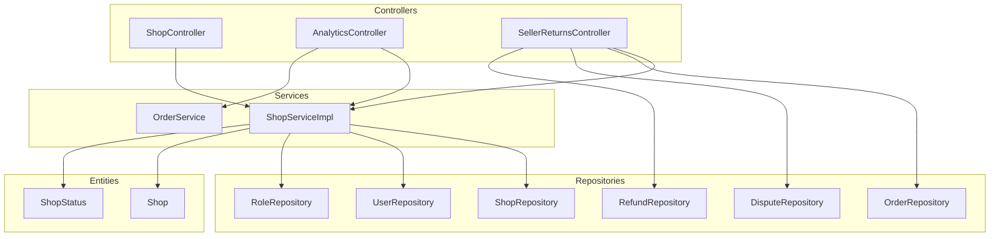
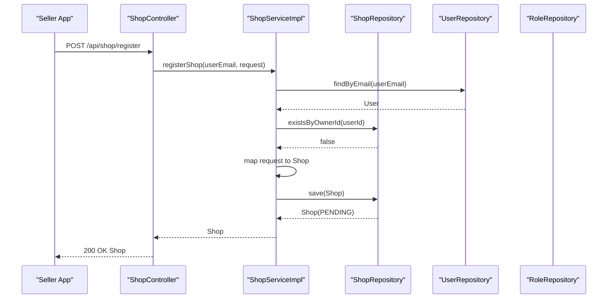
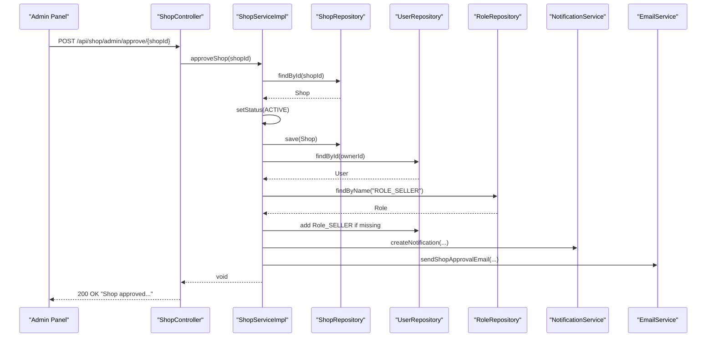
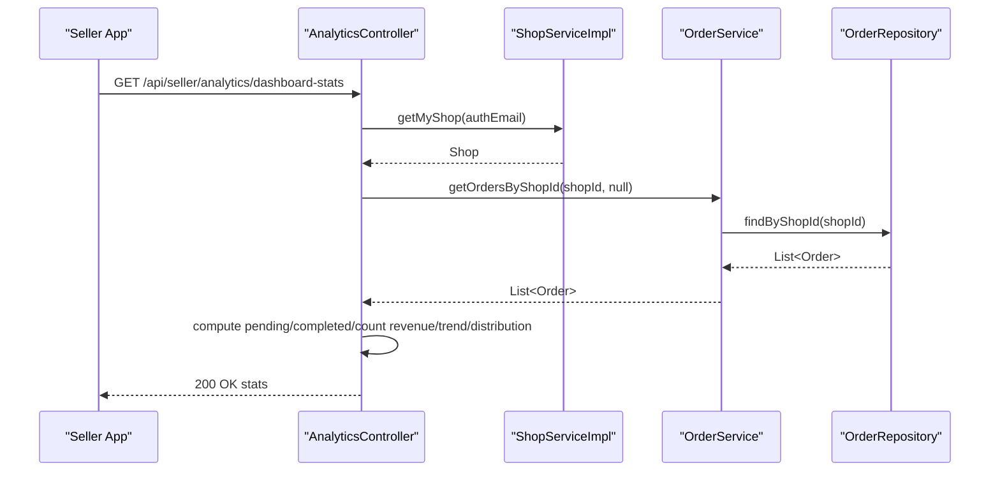
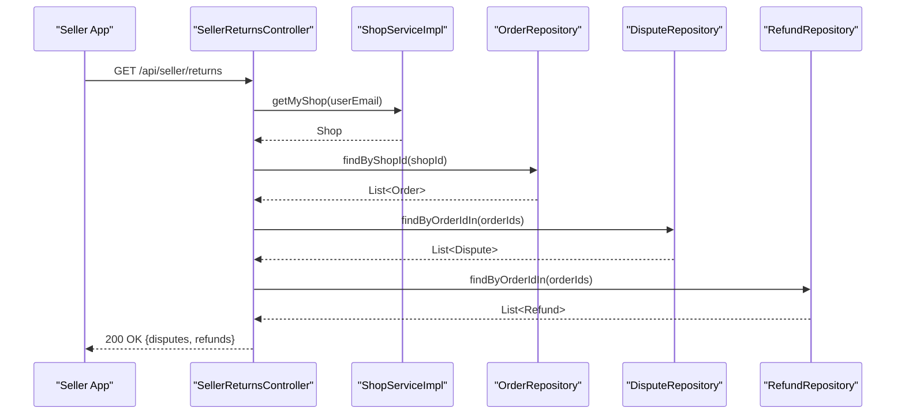
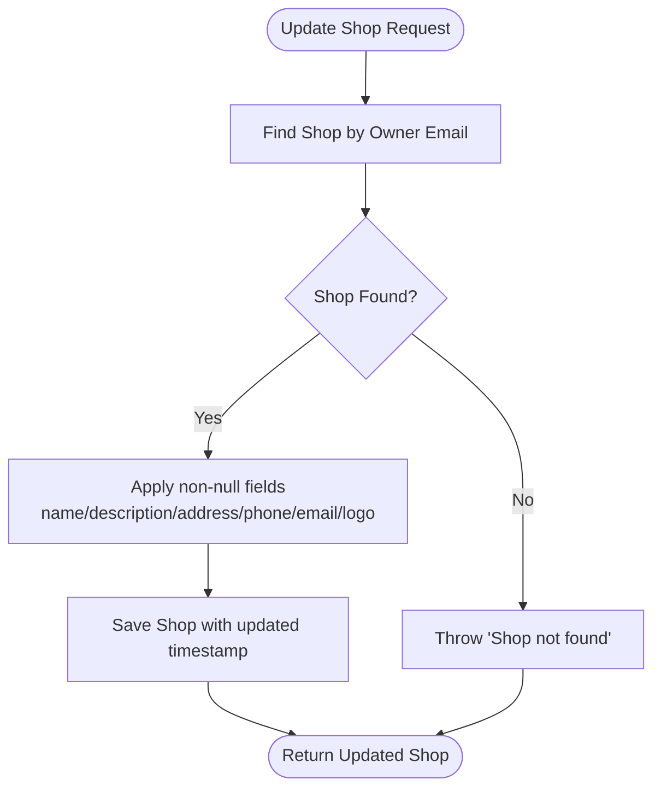
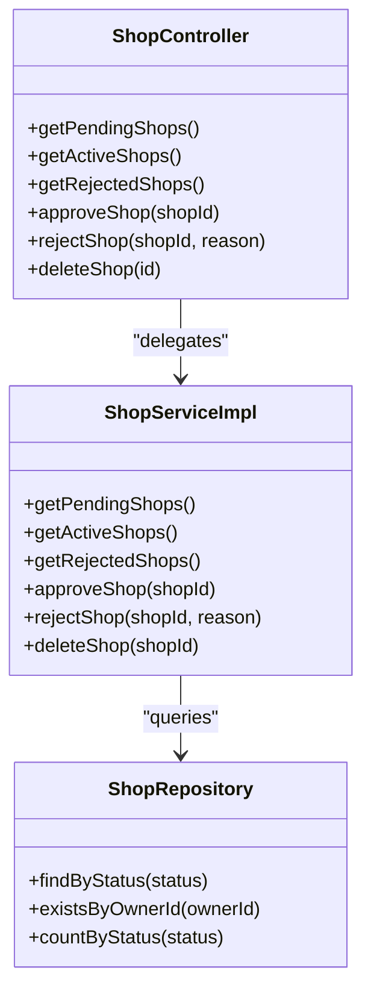
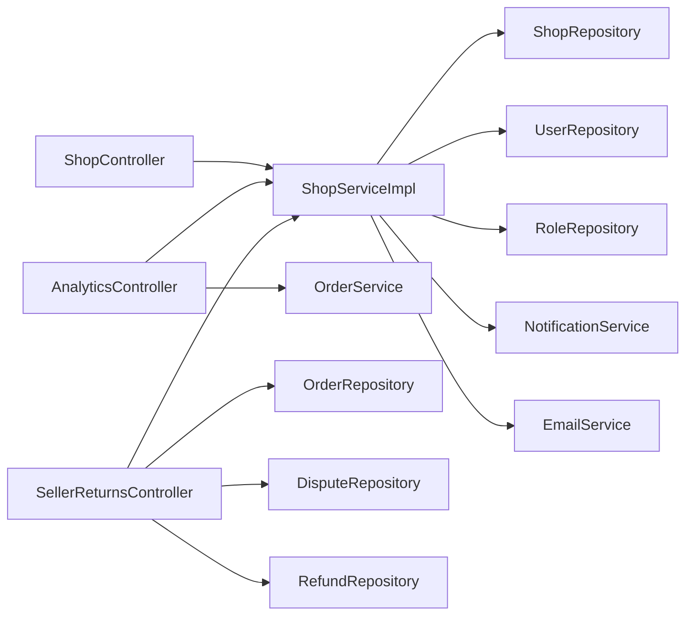

# Shop & Seller Management

<cite>
**Referenced Files in This Document**
- [ShopController.java](file://src/backend/src/main/java/com/shoppeclone/backend/shop/controller/ShopController.java)
- [AnalyticsController.java](file://src/backend/src/main/java/com/shoppeclone/backend/shop/controller/AnalyticsController.java)
- [SellerReturnsController.java](file://src/backend/src/main/java/com/shoppeclone/backend/shop/controller/SellerReturnsController.java)
- [ShopService.java](file://src/backend/src/main/java/com/shoppeclone/backend/shop/service/ShopService.java)
- [ShopServiceImpl.java](file://src/backend/src/main/java/com/shoppeclone/backend/shop/service/impl/ShopServiceImpl.java)
- [ShopRepository.java](file://src/backend/src/main/java/com/shoppeclone/backend/shop/repository/ShopRepository.java)
- [Shop.java](file://src/backend/src/main/java/com/shoppeclone/backend/shop/entity/Shop.java)
- [ShopStatus.java](file://src/backend/src/main/java/com/shoppeclone/backend/shop/entity/ShopStatus.java)
- [ShopRegisterRequest.java](file://src/backend/src/main/java/com/shoppeclone/backend/shop/dto/ShopRegisterRequest.java)
- [UpdateShopRequest.java](file://src/backend/src/main/java/com/shoppeclone/backend/shop/dto/UpdateShopRequest.java)
- [ShopAdminResponse.java](file://src/backend/src/main/java/com/shoppeclone/backend/shop/dto/response/ShopAdminResponse.java)
- [OrderService.java](file://src/backend/src/main/java/com/shoppeclone/backend/order/service/OrderService.java)
- [OrderRepository.java](file://src/backend/src/main/java/com/shoppeclone/backend/order/repository/OrderRepository.java)
- [DisputeRepository.java](file://src/backend/src/main/java/com/shoppeclone/backend/dispute/repository/DisputeRepository.java)
- [RefundRepository.java](file://src/backend/src/main/java/com/shoppeclone/backend/refund/repository/RefundRepository.java)
- [UserRepository.java](file://src/backend/src/main/java/com/shoppeclone/backend/auth/repository/UserRepository.java)
- [RoleRepository.java](file://src/backend/src/main/java/com/shoppeclone/backend/auth/repository/RoleRepository.java)
- [NotificationService.java](file://src/backend/src/main/java/com/shoppeclone/backend/user/service/NotificationService.java)
- [EmailService.java](file://src/backend/src/main/java/com/shoppeclone/backend/common/service/EmailService.java)
</cite>

## Table of Contents
1. [Introduction](#introduction)
2. [Project Structure](#project-structure)
3. [Core Components](#core-components)
4. [Architecture Overview](#architecture-overview)
5. [Detailed Component Analysis](#detailed-component-analysis)
6. [Dependency Analysis](#dependency-analysis)
7. [Performance Considerations](#performance-considerations)
8. [Troubleshooting Guide](#troubleshooting-guide)
9. [Conclusion](#conclusion)

## Introduction
This document explains the Shop & Seller Management system, covering shop registration, verification workflow, seller dashboard analytics, returns management, and administrative controls. It connects shop operations to the product catalog, order processing, and user management systems. The content is designed for both beginners and experienced developers, with concrete references to the codebase and practical guidance.

## Project Structure
The Shop & Seller Management module is organized around controllers, services, repositories, entities, and DTOs. Key areas:
- Controllers expose REST endpoints for shop registration, updates, admin workflows, analytics, and returns.
- Services encapsulate business logic for shop lifecycle, user promotions, notifications, and emails.
- Repositories provide data access for shops, orders, disputes, and refunds.
- Entities define shop data and status.
- DTOs standardize request/response payloads.

**Diagram sources**
- [ShopController.java:22-149](file://src/backend/src/main/java/com/shoppeclone/backend/shop/controller/ShopController.java#L22-L149)
- [AnalyticsController.java:17-73](file://src/backend/src/main/java/com/shoppeclone/backend/shop/controller/AnalyticsController.java#L17-L73)
- [SellerReturnsController.java:24-58](file://src/backend/src/main/java/com/shoppeclone/backend/shop/controller/SellerReturnsController.java#L24-L58)
- [ShopServiceImpl.java:22-252](file://src/backend/src/main/java/com/shoppeclone/backend/shop/service/impl/ShopServiceImpl.java#L22-L252)
- [ShopRepository.java:11-22](file://src/backend/src/main/java/com/shoppeclone/backend/shop/repository/ShopRepository.java#L11-L22)
- [Shop.java:12-51](file://src/backend/src/main/java/com/shoppeclone/backend/shop/entity/Shop.java#L12-L51)
- [ShopStatus.java:3-8](file://src/backend/src/main/java/com/shoppeclone/backend/shop/entity/ShopStatus.java#L3-L8)

**Section sources**
- [ShopController.java:22-149](file://src/backend/src/main/java/com/shoppeclone/backend/shop/controller/ShopController.java#L22-L149)
- [ShopServiceImpl.java:22-252](file://src/backend/src/main/java/com/shoppeclone/backend/shop/service/impl/ShopServiceImpl.java#L22-L252)
- [ShopRepository.java:11-22](file://src/backend/src/main/java/com/shoppeclone/backend/shop/repository/ShopRepository.java#L11-L22)
- [Shop.java:12-51](file://src/backend/src/main/java/com/shoppeclone/backend/shop/entity/Shop.java#L12-L51)

## Core Components
- Shop entity defines shop metadata, identity/bank info, and status lifecycle.
- Shop status enum supports PENDING, ACTIVE, REJECTED, CLOSED.
- Shop registration DTO captures initial and identity/bank details.
- Shop update DTO allows seller-managed shop profile changes.
- Admin response DTO aggregates shop info plus owner details and counts for admin dashboards.

Key responsibilities:
- Registration: validate uniqueness, map request fields, set initial status to PENDING.
- Verification workflow: admin approves/rejects shops, promotes owners to SELLER role, sends notifications and emails.
- Analytics: compute pending/completed orders, total revenue, daily revenue trend, and order status distribution.
- Returns management: fetch disputes and refunds linked to shop orders.

**Section sources**
- [Shop.java:14-46](file://src/backend/src/main/java/com/shoppeclone/backend/shop/entity/Shop.java#L14-L46)
- [ShopStatus.java:3-8](file://src/backend/src/main/java/com/shoppeclone/backend/shop/entity/ShopStatus.java#L3-L8)
- [ShopRegisterRequest.java:7-32](file://src/backend/src/main/java/com/shoppeclone/backend/shop/dto/ShopRegisterRequest.java#L7-L32)
- [UpdateShopRequest.java:6-13](file://src/backend/src/main/java/com/shoppeclone/backend/shop/dto/UpdateShopRequest.java#L6-L13)
- [ShopAdminResponse.java:8-22](file://src/backend/src/main/java/com/shoppeclone/backend/shop/dto/response/ShopAdminResponse.java#L8-L22)

## Architecture Overview
The system follows layered architecture:
- Presentation: REST controllers handle requests and return standardized responses.
- Application: Services orchestrate domain logic, enforce business rules, and coordinate external services.
- Persistence: Repositories abstract MongoDB access for shops, orders, disputes, and refunds.
- Integration: Notifications and email services support user communication during shop lifecycle events.

**Diagram sources**
- [ShopController.java:75-80](file://src/backend/src/main/java/com/shoppeclone/backend/shop/controller/ShopController.java#L75-L80)
- [ShopServiceImpl.java:33-66](file://src/backend/src/main/java/com/shoppeclone/backend/shop/service/impl/ShopServiceImpl.java#L33-L66)
- [ShopRepository.java:13-15](file://src/backend/src/main/java/com/shoppeclone/backend/shop/repository/ShopRepository.java#L13-L15)
- [UserRepository.java](file://src/backend/src/main/java/com/shoppeclone/backend/auth/repository/UserRepository.java)

**Section sources**
- [ShopController.java:75-80](file://src/backend/src/main/java/com/shoppeclone/backend/shop/controller/ShopController.java#L75-L80)
- [ShopServiceImpl.java:33-66](file://src/backend/src/main/java/com/shoppeclone/backend/shop/service/impl/ShopServiceImpl.java#L33-L66)

## Detailed Component Analysis

### Shop Registration and Verification Workflow
- Registration endpoint accepts a structured request, validates uniqueness per user, maps fields, and sets status to PENDING.
- Admin endpoints list pending/active/rejected shops and approve/reject with optional reasons.
- On approval, the shop owner is promoted to SELLER role, and notifications/emails are sent (non-blocking failures logged).
- On rejection, the shop is marked REJECTED with a reason, and notifications/emails are sent.

**Diagram sources**
- [ShopController.java:127-131](file://src/backend/src/main/java/com/shoppeclone/backend/shop/controller/ShopController.java#L127-L131)
- [ShopServiceImpl.java:95-144](file://src/backend/src/main/java/com/shoppeclone/backend/shop/service/impl/ShopServiceImpl.java#L95-L144)
- [UserRepository.java](file://src/backend/src/main/java/com/shoppeclone/backend/auth/repository/UserRepository.java)
- [RoleRepository.java](file://src/backend/src/main/java/com/shoppeclone/backend/auth/repository/RoleRepository.java)
- [NotificationService.java](file://src/backend/src/main/java/com/shoppeclone/backend/user/service/NotificationService.java)
- [EmailService.java](file://src/backend/src/main/java/com/shoppeclone/backend/common/service/EmailService.java)

**Section sources**
- [ShopController.java:110-138](file://src/backend/src/main/java/com/shoppeclone/backend/shop/controller/ShopController.java#L110-L138)
- [ShopServiceImpl.java:95-144](file://src/backend/src/main/java/com/shoppeclone/backend/shop/service/impl/ShopServiceImpl.java#L95-L144)

### Seller Dashboard Analytics
The analytics endpoint computes:
- Pending and completed order counts for the authenticated seller’s shop.
- Total revenue from completed orders.
- Daily revenue trend for the last 7 days.
- Order status distribution across all orders.

**Diagram sources**
- [AnalyticsController.java:25-72](file://src/backend/src/main/java/com/shoppeclone/backend/shop/controller/AnalyticsController.java#L25-L72)
- [OrderService.java](file://src/backend/src/main/java/com/shoppeclone/backend/order/service/OrderService.java)
- [OrderRepository.java](file://src/backend/src/main/java/com/shoppeclone/backend/order/repository/OrderRepository.java)

**Section sources**
- [AnalyticsController.java:25-72](file://src/backend/src/main/java/com/shoppeclone/backend/shop/controller/AnalyticsController.java#L25-L72)

### Returns Management
The returns endpoint aggregates:
- Disputes associated with orders belonging to the seller’s shop.
- Refunds associated with those orders.

**Diagram sources**
- [SellerReturnsController.java:37-57](file://src/backend/src/main/java/com/shoppeclone/backend/shop/controller/SellerReturnsController.java#L37-L57)
- [OrderRepository.java](file://src/backend/src/main/java/com/shoppeclone/backend/order/repository/OrderRepository.java)
- [DisputeRepository.java](file://src/backend/src/main/java/com/shoppeclone/backend/dispute/repository/DisputeRepository.java)
- [RefundRepository.java](file://src/backend/src/main/java/com/shoppeclone/backend/refund/repository/RefundRepository.java)

**Section sources**
- [SellerReturnsController.java:37-57](file://src/backend/src/main/java/com/shoppeclone/backend/shop/controller/SellerReturnsController.java#L37-L57)

### Shop Profile Updates
Sellers can update shop details via a dedicated endpoint. The service applies partial updates only when fields are present.

**Diagram sources**
- [ShopController.java:103-108](file://src/backend/src/main/java/com/shoppeclone/backend/shop/controller/ShopController.java#L103-L108)
- [ShopServiceImpl.java:204-227](file://src/backend/src/main/java/com/shoppeclone/backend/shop/service/impl/ShopServiceImpl.java#L204-L227)

**Section sources**
- [ShopController.java:103-108](file://src/backend/src/main/java/com/shoppeclone/backend/shop/controller/ShopController.java#L103-L108)
- [UpdateShopRequest.java:6-13](file://src/backend/src/main/java/com/shoppeclone/backend/shop/dto/UpdateShopRequest.java#L6-L13)
- [ShopServiceImpl.java:204-227](file://src/backend/src/main/java/com/shoppeclone/backend/shop/service/impl/ShopServiceImpl.java#L204-L227)

### Administrative Shop Management
Administrators can:
- View pending/active/rejected shops.
- Approve shops (promoting owners to SELLER).
- Reject shops with a reason.
- Delete shops after ensuring no products remain.

**Diagram sources**
- [ShopController.java:110-148](file://src/backend/src/main/java/com/shoppeclone/backend/shop/controller/ShopController.java#L110-L148)
- [ShopServiceImpl.java:74-93](file://src/backend/src/main/java/com/shoppeclone/backend/shop/service/impl/ShopServiceImpl.java#L74-L93)
- [ShopRepository.java:13-19](file://src/backend/src/main/java/com/shoppeclone/backend/shop/repository/ShopRepository.java#L13-L19)

**Section sources**
- [ShopController.java:110-148](file://src/backend/src/main/java/com/shoppeclone/backend/shop/controller/ShopController.java#L110-L148)
- [ShopServiceImpl.java:74-93](file://src/backend/src/main/java/com/shoppeclone/backend/shop/service/impl/ShopServiceImpl.java#L74-L93)
- [ShopRepository.java:13-19](file://src/backend/src/main/java/com/shoppeclone/backend/shop/repository/ShopRepository.java#L13-L19)

## Dependency Analysis
- Controllers depend on services for business logic.
- Services depend on repositories for persistence and on external services for notifications and emails.
- Entities and DTOs define contracts for data exchange.
- Analytics integrates with order services and repositories.
- Returns integrates with order, dispute, and refund repositories.

**Diagram sources**
- [ShopController.java:22-149](file://src/backend/src/main/java/com/shoppeclone/backend/shop/controller/ShopController.java#L22-L149)
- [AnalyticsController.java:17-73](file://src/backend/src/main/java/com/shoppeclone/backend/shop/controller/AnalyticsController.java#L17-L73)
- [SellerReturnsController.java:24-58](file://src/backend/src/main/java/com/shoppeclone/backend/shop/controller/SellerReturnsController.java#L24-L58)
- [ShopServiceImpl.java:22-31](file://src/backend/src/main/java/com/shoppeclone/backend/shop/service/impl/ShopServiceImpl.java#L22-L31)

**Section sources**
- [ShopServiceImpl.java:22-31](file://src/backend/src/main/java/com/shoppeclone/backend/shop/service/impl/ShopServiceImpl.java#L22-L31)

## Performance Considerations
- Use repository methods optimized for filtering by status and shop ID to minimize scans.
- Batch operations for admin listings leverage streaming and collection mapping efficiently.
- Analytics aggregation uses in-memory streams; consider pagination or database-side aggregations for very large datasets.
- Notifications and emails are invoked non-blockingly; ensure external service timeouts and retry policies are configured appropriately.

## Troubleshooting Guide
Common issues and resolutions:
- User already has a shop: Registration fails if a shop already exists for the user. Ensure the user does not own another shop before registering.
  - Reference: [ShopServiceImpl.java:38-41](file://src/backend/src/main/java/com/shoppeclone/backend/shop/service/impl/ShopServiceImpl.java#L38-L41)
- Shop not found during approval/rejection/deletion: Verify the shop ID and existence in the database.
  - Reference: [ShopServiceImpl.java:98-99](file://src/backend/src/main/java/com/shoppeclone/backend/shop/service/impl/ShopServiceImpl.java#L98-L99)
- Cannot delete shop with existing products: Remove or transfer all products before deletion.
  - Reference: [ShopServiceImpl.java:245-248](file://src/backend/src/main/java/com/shoppeclone/backend/shop/service/impl/ShopServiceImpl.java#L245-L248)
- Promotion to SELLER role fails: Confirm the ROLE_SELLER exists and user roles are persisted.
  - Reference: [ShopServiceImpl.java:112-120](file://src/backend/src/main/java/com/shoppeclone/backend/shop/service/impl/ShopServiceImpl.java#L112-L120)
- Non-critical failures in notifications/emails: Failures are logged but do not block approval; investigate external service configurations.
  - Reference: [ShopServiceImpl.java:123-143](file://src/backend/src/main/java/com/shoppeclone/backend/shop/service/impl/ShopServiceImpl.java#L123-L143)

**Section sources**
- [ShopServiceImpl.java:38-41](file://src/backend/src/main/java/com/shoppeclone/backend/shop/service/impl/ShopServiceImpl.java#L38-L41)
- [ShopServiceImpl.java:98-99](file://src/backend/src/main/java/com/shoppeclone/backend/shop/service/impl/ShopServiceImpl.java#L98-L99)
- [ShopServiceImpl.java:245-248](file://src/backend/src/main/java/com/shoppeclone/backend/shop/service/impl/ShopServiceImpl.java#L245-L248)
- [ShopServiceImpl.java:112-120](file://src/backend/src/main/java/com/shoppeclone/backend/shop/service/impl/ShopServiceImpl.java#L112-L120)
- [ShopServiceImpl.java:123-143](file://src/backend/src/main/java/com/shoppeclone/backend/shop/service/impl/ShopServiceImpl.java#L123-L143)

## Conclusion
The Shop & Seller Management system provides a robust foundation for sellers to register shops, manage profiles, monitor performance, and handle returns. Administrators can efficiently verify and govern shops, while integrations with user management, order processing, and notifications ensure a cohesive e-commerce experience. The modular design and clear separation of concerns facilitate maintainability and scalability.