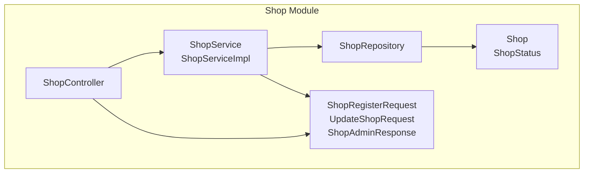
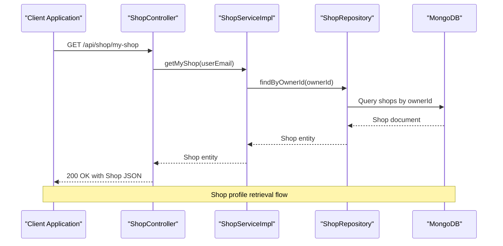
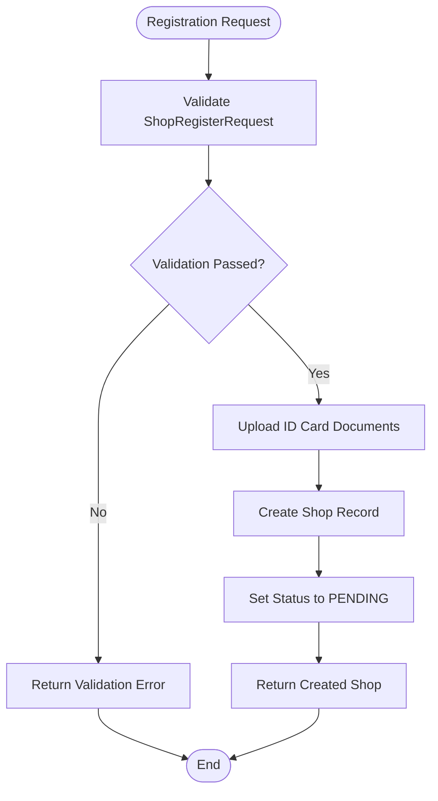
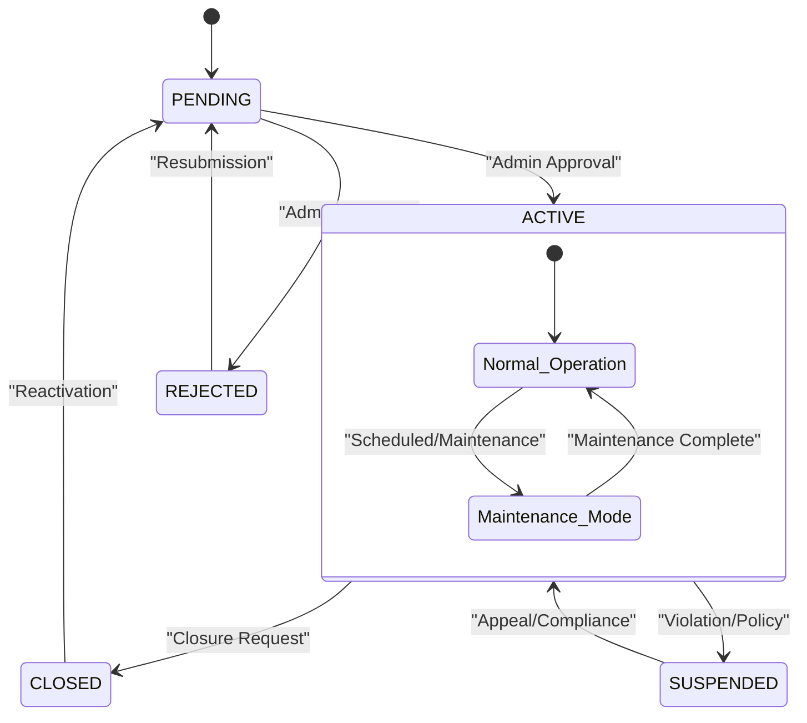
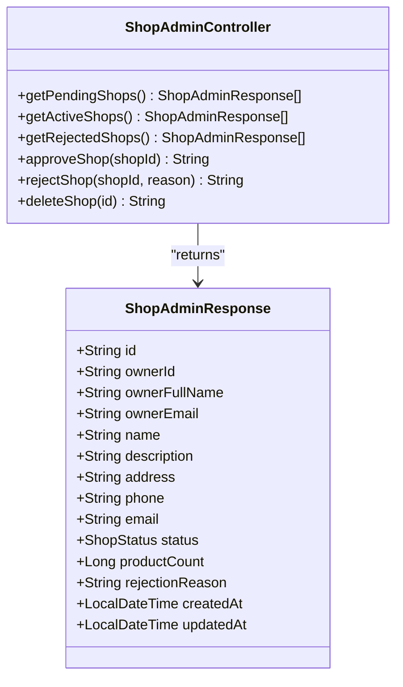
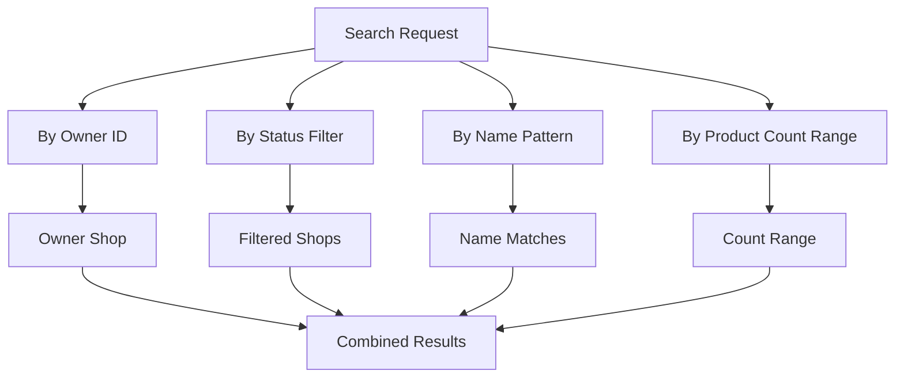
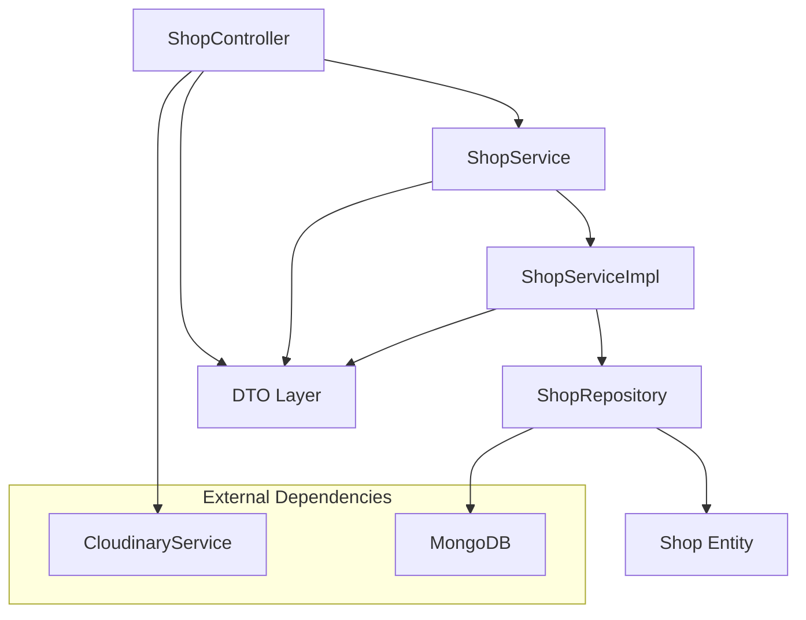

# Shop Management Operations

<cite>
**Referenced Files in This Document**
- [ShopController.java](file://src\Backend\src\main\java\com\shoppeclone\backend\shop\controller\ShopController.java)
- [ShopService.java](file://src\Backend\src\main\java\com\shoppeclone\backend\shop\service\ShopService.java)
- [ShopServiceImpl.java](file://src\Backend\src\main\java\com\shoppeclone\backend\shop\service\impl\ShopServiceImpl.java)
- [ShopRepository.java](file://src\Backend\src\main\java\com\shoppeclone\backend\shop\repository\ShopRepository.java)
- [Shop.java](file://src\Backend\src\main\java\com\shoppeclone\backend\shop\entity\Shop.java)
- [ShopStatus.java](file://src\Backend\src\main\java\com\shoppeclone\backend\shop\entity\ShopStatus.java)
- [ShopRegisterRequest.java](file://src\Backend\src\main\java\com\shoppeclone\backend\shop\dto\ShopRegisterRequest.java)
- [UpdateShopRequest.java](file://src\Backend\src\main\java\com\shoppeclone\backend\shop\dto\UpdateShopRequest.java)
- [ShopAdminResponse.java](file://src\Backend\src\main\java\com\shoppeclone\backend\shop\dto\response\ShopAdminResponse.java)
- [AnalyticsController.java](file://src\Backend\src\main\java\com\shoppeclone\backend\shop\controller\AnalyticsController.java)
- [SellerReturnsController.java](file://src\Backend\src\main\java\com\shoppeclone\backend\shop\controller\SellerReturnsController.java)
</cite>

## Table of Contents
1. [Introduction](#introduction)
2. [Project Structure](#project-structure)
3. [Core Components](#core-components)
4. [Architecture Overview](#architecture-overview)
5. [Detailed Component Analysis](#detailed-component-analysis)
6. [Dependency Analysis](#dependency-analysis)
7. [Performance Considerations](#performance-considerations)
8. [Troubleshooting Guide](#troubleshooting-guide)
9. [Conclusion](#conclusion)

## Introduction
This document provides comprehensive documentation for shop management operations and administrative functions within the backend system. It covers shop profile management, status transitions, deletion procedures, bulk operations, shop transfers, search and filtering, directory management, visibility controls, shop hierarchy, maintenance modes, and operational restrictions. It also outlines API endpoints, request/response formats, and error handling scenarios for shop administration.

## Project Structure
The shop management module follows a layered architecture with clear separation of concerns:
- Controller layer handles HTTP requests and responses
- Service layer encapsulates business logic
- Repository layer manages data persistence
- Entity and DTO layers define data structures and validation rules

**Diagram sources**
- [ShopController.java:22-149](file://src\Backend\src\main\java\com\shoppeclone\backend\shop\controller\ShopController.java#L22-L149)
- [ShopService.java:9-30](file://src\Backend\src\main\java\com\shoppeclone\backend\shop\service\ShopService.java#L9-L30)
- [ShopServiceImpl.java](file://src\Backend\src\main\java\com\shoppeclone\backend\shop\service\impl\ShopServiceImpl.java)
- [ShopRepository.java:11-22](file://src\Backend\src\main\java\com\shoppeclone\backend\shop\repository\ShopRepository.java#L11-L22)
- [Shop.java:12-51](file://src\Backend\src\main\java\com\shoppeclone\backend\shop\entity\Shop.java#L12-L51)
- [ShopRegisterRequest.java:6-32](file://src\Backend\src\main\java\com\shoppeclone\backend\shop\dto\ShopRegisterRequest.java#L6-L32)
- [UpdateShopRequest.java:5-13](file://src\Backend\src\main\java\com\shoppeclone\backend\shop\dto\UpdateShopRequest.java#L5-L13)
- [ShopAdminResponse.java:7-23](file://src\Backend\src\main\java\com\shoppeclone\backend\shop\dto\response\ShopAdminResponse.java#L7-L23)

**Section sources**
- [ShopController.java:22-149](file://src\Backend\src\main\java\com\shoppeclone\backend\shop\controller\ShopController.java#L22-L149)
- [ShopService.java:9-30](file://src\Backend\src\main\java\com\shoppeclone\backend\shop\service\ShopService.java#L9-L30)
- [ShopRepository.java:11-22](file://src\Backend\src\main\java\com\shoppeclone\backend\shop\repository\ShopRepository.java#L11-L22)

## Core Components
The shop management system consists of several core components working together to provide comprehensive shop operations:

### Shop Entity
The Shop entity represents the fundamental data structure for shop records, including identification, contact information, banking details, and status tracking.

### Shop Status Management
The system defines four distinct shop statuses: PENDING, ACTIVE, REJECTED, and CLOSED, each representing different stages in the shop lifecycle.

### Shop Registration and Updates
The system supports both initial shop registration and subsequent updates to shop information, including contact details and profile management.

### Administrative Operations
Administrative functions include shop approval/rejection workflows, bulk status management, and shop deletion procedures.

**Section sources**
- [Shop.java:14-46](file://src\Backend\src\main\java\com\shoppeclone\backend\shop\entity\Shop.java#L14-L46)
- [ShopStatus.java:3-8](file://src\Backend\src\main\java\com\shoppeclone\backend\shop\entity\ShopStatus.java#L3-L8)
- [ShopRegisterRequest.java:7-32](file://src\Backend\src\main\java\com\shoppeclone\backend\shop\dto\ShopRegisterRequest.java#L7-L32)
- [UpdateShopRequest.java:6-13](file://src\Backend\src\main\java\com\shoppeclone\backend\shop\dto\UpdateShopRequest.java#L6-L13)

## Architecture Overview
The shop management architecture follows a clean, layered approach with clear boundaries between presentation, business logic, and data access layers.

**Diagram sources**
- [ShopController.java:82-92](file://src\Backend\src\main\java\com\shoppeclone\backend\shop\controller\ShopController.java#L82-L92)
- [ShopServiceImpl.java](file://src\Backend\src\main\java\com\shoppeclone\backend\shop\service\impl\ShopServiceImpl.java)
- [ShopRepository.java:13](file://src\Backend\src\main\java\com\shoppeclone\backend\shop\repository\ShopRepository.java#L13)

The architecture ensures loose coupling between components while maintaining clear data flow and responsibility segregation.

## Detailed Component Analysis

### Shop Profile Management
Shop profile management encompasses both registration and update operations, allowing sellers to maintain accurate business information.

#### Registration Workflow
The registration process captures essential shop information including business details, contact information, and identification documents.

**Diagram sources**
- [ShopController.java:75-80](file://src\Backend\src\main\java\com\shoppeclone\backend\shop\controller\ShopController.java#L75-L80)
- [ShopRegisterRequest.java:7-32](file://src\Backend\src\main\java\com\shoppeclone\backend\shop\dto\ShopRegisterRequest.java#L7-L32)

#### Update Operations
Shop updates allow modification of contact details, descriptions, and profile images while maintaining data integrity.

**Section sources**
- [ShopController.java:103-108](file://src\Backend\src\main\java\com\shoppeclone\backend\shop\controller\ShopController.java#L103-L108)
- [UpdateShopRequest.java:6-13](file://src\Backend\src\main\java\com\shoppeclone\backend\shop\dto\UpdateShopRequest.java#L6-L13)

### Shop Status Management
The system implements a comprehensive status management system supporting four distinct states with clear business implications.

**Diagram sources**
- [ShopStatus.java:3-8](file://src\Backend\src\main\java\com\shoppeclone\backend\shop\entity\ShopStatus.java#L3-L8)

#### Status Transitions and Business Implications
- **PENDING**: Shop awaits administrative review and approval
- **ACTIVE**: Shop operates normally with full functionality
- **REJECTED**: Shop registration denied with rejection reason
- **CLOSED**: Shop permanently closed, requires reactivation

**Section sources**
- [ShopStatus.java:3-8](file://src\Backend\src\main\java\com\shoppeclone\backend\shop\entity\ShopStatus.java#L3-L8)
- [ShopController.java:111-138](file://src\Backend\src\main\java\com\shoppeclone\backend\shop\controller\ShopController.java#L111-L138)

### Administrative Functions
Administrative operations provide comprehensive oversight and control over shop operations.

#### Bulk Operations Support
The system supports bulk administrative actions through categorized endpoints for pending, active, and rejected shops.

**Diagram sources**
- [ShopController.java:111-148](file://src\Backend\src\main\java\com\shoppeclone\backend\shop\controller\ShopController.java#L111-L148)
- [ShopAdminResponse.java:8-23](file://src\Backend\src\main\java\com\shoppeclone\backend\shop\dto\response\ShopAdminResponse.java#L8-L23)

#### Shop Deletion Procedures
The deletion process includes validation, cascading cleanup, and confirmation responses.

**Section sources**
- [ShopController.java:140-148](file://src\Backend\src\main\java\com\shoppeclone\backend\shop\controller\ShopController.java#L140-L148)

### Shop Search and Filtering
The system provides multiple search and filtering mechanisms for shop discovery and management.

**Diagram sources**
- [ShopRepository.java:13-21](file://src\Backend\src\main\java\com\shoppeclone\backend\shop\repository\ShopRepository.java#L13-L21)

**Section sources**
- [ShopRepository.java:13-21](file://src\Backend\src\main\java\com\shoppeclone\backend\shop\repository\ShopRepository.java#L13-L21)

### Directory Management and Visibility Controls
The system maintains shop directories with visibility controls and administrative oversight.

**Section sources**
- [ShopAdminResponse.java:8-23](file://src\Backend\src\main\java\com\shoppeclone\backend\shop\dto\response\ShopAdminResponse.java#L8-L23)

### Shop Hierarchy and Franchise Operations
The current implementation focuses on individual shop management with owner relationships. Franchise operations would require extension of the current model.

**Section sources**
- [Shop.java:18-19](file://src\Backend\src\main\java\com\shoppeclone\backend\shop\entity\Shop.java#L18-L19)

### Maintenance Modes and Operational Restrictions
The system supports maintenance modes through status transitions and operational restrictions via administrative controls.

**Section sources**
- [ShopStatus.java:3-8](file://src\Backend\src\main\java\com\shoppeclone\backend\shop\entity\ShopStatus.java#L3-L8)

## Dependency Analysis
The shop management system exhibits strong architectural separation with minimal coupling between components.

**Diagram sources**
- [ShopController.java:28-29](file://src\Backend\src\main\java\com\shoppeclone\backend\shop\controller\ShopController.java#L28-L29)
- [ShopRepository.java:11-22](file://src\Backend\src\main\java\com\shoppeclone\backend\shop\repository\ShopRepository.java#L11-L22)

The dependency graph shows clear separation of concerns with the controller depending on the service interface, the service implementing business logic, and the repository handling data access.

**Section sources**
- [ShopController.java:28-29](file://src\Backend\src\main\java\com\shoppeclone\backend\shop\controller\ShopController.java#L28-L29)
- [ShopService.java:9-30](file://src\Backend\src\main\java\com\shoppeclone\backend\shop\service\ShopService.java#L9-L30)

## Performance Considerations
The shop management system incorporates several performance optimization strategies:

- **Indexing**: Unique indexing on owner IDs and shop names for efficient lookups
- **Lazy Loading**: Minimal field loading for administrative responses
- **Batch Operations**: Support for bulk administrative actions
- **Caching Opportunities**: Potential for shop data caching in read-heavy scenarios

## Troubleshooting Guide
Common issues and their resolutions in shop management operations:

### Authentication and Authorization Issues
- Verify proper authentication tokens for shop operations
- Ensure user roles are correctly assigned for administrative functions

### Data Validation Errors
- Check ShopRegisterRequest validation constraints
- Validate UpdateShopRequest field requirements

### Database Connectivity Problems
- Monitor MongoDB connection status
- Verify collection existence and indexing

**Section sources**
- [ShopController.java:84-90](file://src\Backend\src\main\java\com\shoppeclone\backend\shop\controller\ShopController.java#L84-L90)
- [ShopRegisterRequest.java:8-15](file://src\Backend\src\main\java\com\shoppeclone\backend\shop\dto\ShopRegisterRequest.java#L8-L15)

## Conclusion
The shop management system provides comprehensive functionality for shop operations including registration, profile management, status transitions, administrative oversight, and operational controls. The clean architecture ensures maintainability and extensibility while the layered design promotes separation of concerns and clear responsibility allocation. The system supports both individual shop management and administrative oversight with room for future enhancements such as bulk operations, shop transfers, and advanced analytics integration.