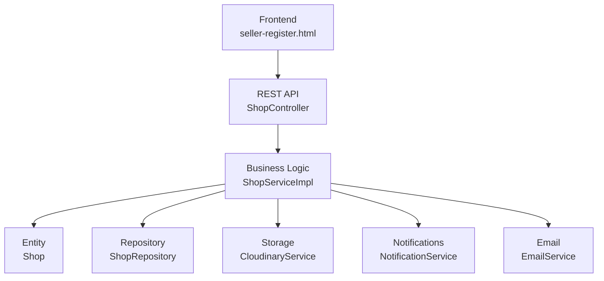
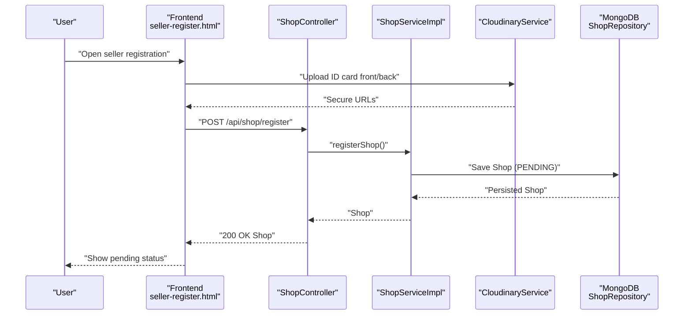
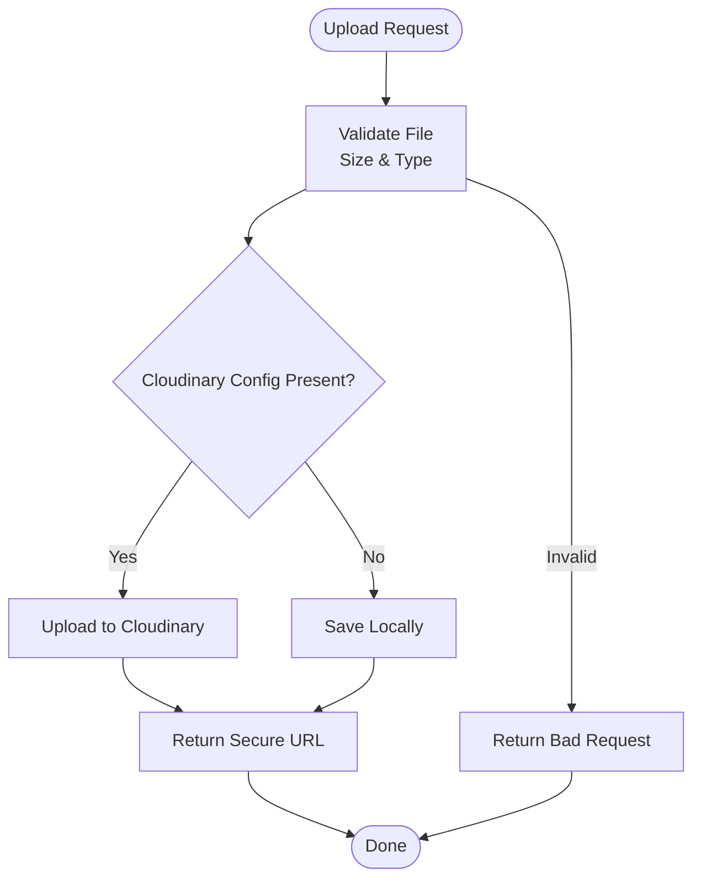
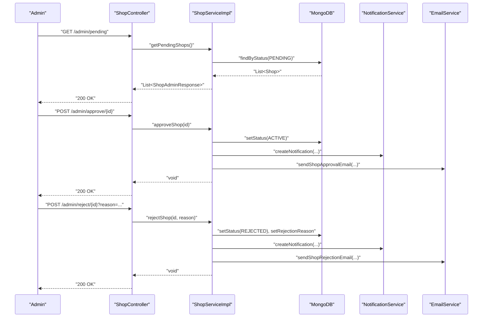
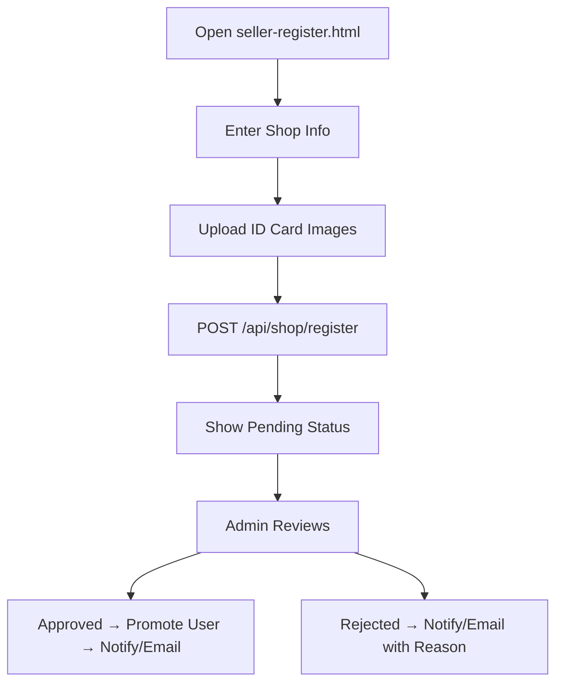
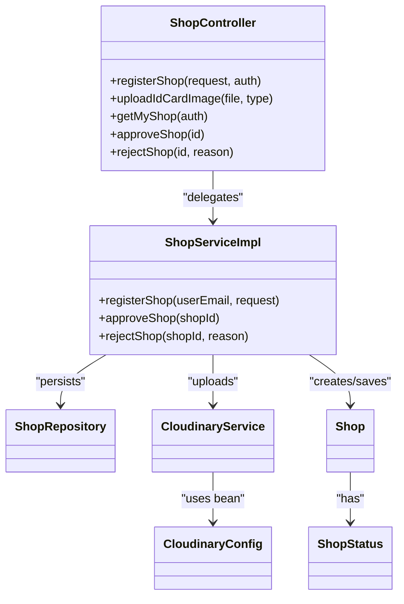

# Shop Registration & Verification

<cite>
**Referenced Files in This Document**
- [ShopRegisterRequest.java](file://src/Backend/src/main/java/com/shoppeclone/backend/shop/dto/ShopRegisterRequest.java)
- [Shop.java](file://src/Backend/src/main/java/com/shoppeclone/backend/shop/entity/Shop.java)
- [ShopStatus.java](file://src/Backend/src/main/java/com/shoppeclone/backend/shop/entity/ShopStatus.java)
- [ShopService.java](file://src/Backend/src/main/java/com/shoppeclone/backend/shop/service/ShopService.java)
- [ShopServiceImpl.java](file://src/Backend/src/main/java/com/shoppeclone/backend/shop/service/impl/ShopServiceImpl.java)
- [ShopController.java](file://src/Backend/src/main/java/com/shoppeclone/backend/shop/controller/ShopController.java)
- [ShopRepository.java](file://src/Backend/src/main/java/com/shoppeclone/backend/shop/repository/ShopRepository.java)
- [CloudinaryService.java](file://src/Backend/src/main/java/com/shoppeclone/backend/common/service/CloudinaryService.java)
- [CloudinaryConfig.java](file://src/Backend/src/main/java/com/shoppeclone/backend/common/config/CloudinaryConfig.java)
- [application.properties](file://src/Backend/src/main/resources/application.properties)
- [seller-register.html](file://src/Frontend/seller-register.html)
- [ShopAdminResponse.java](file://src/Backend/src/main/java/com/shoppeclone/backend/shop/dto/response/ShopAdminResponse.java)
</cite>

## Table of Contents
1. [Introduction](#introduction)
2. [Project Structure](#project-structure)
3. [Core Components](#core-components)
4. [Architecture Overview](#architecture-overview)
5. [Detailed Component Analysis](#detailed-component-analysis)
6. [Dependency Analysis](#dependency-analysis)
7. [Performance Considerations](#performance-considerations)
8. [Troubleshooting Guide](#troubleshooting-guide)
9. [Conclusion](#conclusion)
10. [Appendices](#appendices)

## Introduction
This document explains the complete shop registration and verification workflow in the backend system. It covers:
- Shop registration DTO structure and validation rules
- Business logic for shop creation and status management
- Admin verification pipeline (approval/rejection)
- User notifications and email triggers
- Image upload functionality with Cloudinary integration and fallback to local storage
- Practical examples of registration requests, responses, and error handling
- Common issues, resubmission procedures, and typical timelines

## Project Structure
The shop registration feature spans the following layers:
- DTOs define request/response contracts
- Entities represent persisted shop records
- Services encapsulate business logic
- Controllers expose REST endpoints
- Repositories manage persistence
- Cloud storage utilities handle image uploads

**Diagram sources**
- [ShopController.java:22-150](file://src/Backend/src/main/java/com/shoppeclone/backend/shop/controller/ShopController.java#L22-L150)
- [ShopServiceImpl.java:24-253](file://src/Backend/src/main/java/com/shoppeclone/backend/shop/service/impl/ShopServiceImpl.java#L24-L253)
- [Shop.java:12-52](file://src/Backend/src/main/java/com/shoppeclone/backend/shop/entity/Shop.java#L12-L52)
- [ShopRepository.java:11-23](file://src/Backend/src/main/java/com/shoppeclone/backend/shop/repository/ShopRepository.java#L11-L23)
- [CloudinaryService.java:20-137](file://src/Backend/src/main/java/com/shoppeclone/backend/common/service/CloudinaryService.java#L20-L137)

**Section sources**
- [ShopController.java:22-150](file://src/Backend/src/main/java/com/shoppeclone/backend/shop/controller/ShopController.java#L22-L150)
- [ShopServiceImpl.java:24-253](file://src/Backend/src/main/java/com/shoppeclone/backend/shop/service/impl/ShopServiceImpl.java#L24-L253)
- [CloudinaryService.java:20-137](file://src/Backend/src/main/java/com/shoppeclone/backend/common/service/CloudinaryService.java#L20-L137)

## Core Components
- ShopRegisterRequest: Defines the registration payload including shop info and identity/banking details. Validation ensures required fields are present.
- Shop: Persisted entity with identity and bank fields, plus status and timestamps.
- ShopService and ShopServiceImpl: Implement registration, retrieval, admin queries, and approval/rejection workflows.
- ShopController: Exposes endpoints for registration, image upload, and admin operations.
- CloudinaryService: Validates and uploads images to Cloudinary with fallback to local storage.
- CloudinaryConfig: Provides Cloudinary client bean configured via environment variables.
- ShopStatus: Enumerates lifecycle states (PENDING, ACTIVE, REJECTED, CLOSED).
- ShopAdminResponse: Admin dashboard response shape including counts and metadata.

**Section sources**
- [ShopRegisterRequest.java:6-32](file://src/Backend/src/main/java/com/shoppeclone/backend/shop/dto/ShopRegisterRequest.java#L6-L32)
- [Shop.java:12-52](file://src/Backend/src/main/java/com/shoppeclone/backend/shop/entity/Shop.java#L12-L52)
- [ShopService.java:9-31](file://src/Backend/src/main/java/com/shoppeclone/backend/shop/service/ShopService.java#L9-L31)
- [ShopServiceImpl.java:33-66](file://src/Backend/src/main/java/com/shoppeclone/backend/shop/service/impl/ShopServiceImpl.java#L33-L66)
- [ShopController.java:35-148](file://src/Backend/src/main/java/com/shoppeclone/backend/shop/controller/ShopController.java#L35-L148)
- [CloudinaryService.java:36-123](file://src/Backend/src/main/java/com/shoppeclone/backend/common/service/CloudinaryService.java#L36-L123)
- [CloudinaryConfig.java:9-29](file://src/Backend/src/main/java/com/shoppeclone/backend/common/config/CloudinaryConfig.java#L9-L29)
- [ShopStatus.java:3-8](file://src/Backend/src/main/java/com/shoppeclone/backend/shop/entity/ShopStatus.java#L3-L8)
- [ShopAdminResponse.java:7-24](file://src/Backend/src/main/java/com/shoppeclone/backend/shop/dto/response/ShopAdminResponse.java#L7-L24)

## Architecture Overview
The registration and verification flow integrates frontend, backend, and external storage:

**Diagram sources**
- [ShopController.java:39-80](file://src/Backend/src/main/java/com/shoppeclone/backend/shop/controller/ShopController.java#L39-L80)
- [ShopServiceImpl.java:33-66](file://src/Backend/src/main/java/com/shoppeclone/backend/shop/service/impl/ShopServiceImpl.java#L33-L66)
- [CloudinaryService.java:36-58](file://src/Backend/src/main/java/com/shoppeclone/backend/common/service/CloudinaryService.java#L36-L58)
- [ShopRepository.java:11-23](file://src/Backend/src/main/java/com/shoppeclone/backend/shop/repository/ShopRepository.java#L11-L23)

## Detailed Component Analysis

### Shop Registration DTO and Validation
- Required fields enforced by annotations:
  - Shop name, address, phone number
- Additional fields:
  - Email, description
  - Identity: 12-digit ID card number
  - Bank: bank name, account number, account holder
  - ID card front/back URLs collected from Cloudinary
- Validation occurs at controller entry point.

Practical example request structure:
- name, address, phone, email, description
- identityIdCard, idCardFront, idCardBack
- bankName, bankAccountNumber, bankAccountHolder

Common validation errors:
- Missing required fields trigger bad request responses
- Duplicate shop per user prevents multiple shops

**Section sources**
- [ShopRegisterRequest.java:6-32](file://src/Backend/src/main/java/com/shoppeclone/backend/shop/dto/ShopRegisterRequest.java#L6-L32)
- [ShopController.java:75-80](file://src/Backend/src/main/java/com/shoppeclone/backend/shop/controller/ShopController.java#L75-L80)
- [ShopServiceImpl.java:33-66](file://src/Backend/src/main/java/com/shoppeclone/backend/shop/service/impl/ShopServiceImpl.java#L33-L66)

### Image Upload and Storage Pipeline
- Endpoint: POST /api/shop/upload-id-card
- Accepts multipart file and type ("front" or "back")
- Validation: file presence, size ≤ 3MB, allowed image types (JPEG, JPG, PNG, WEBP)
- Upload path:
  - Cloudinary: secure HTTPS URL returned
  - Fallback: local storage under static/uploads with generated filename
- Returned payload includes url, type, and message

**Diagram sources**
- [ShopController.java:39-73](file://src/Backend/src/main/java/com/shoppeclone/backend/shop/controller/ShopController.java#L39-L73)
- [CloudinaryService.java:36-123](file://src/Backend/src/main/java/com/shoppeclone/backend/common/service/CloudinaryService.java#L36-L123)
- [CloudinaryConfig.java:21-28](file://src/Backend/src/main/java/com/shoppeclone/backend/common/config/CloudinaryConfig.java#L21-L28)

**Section sources**
- [ShopController.java:39-73](file://src/Backend/src/main/java/com/shoppeclone/backend/shop/controller/ShopController.java#L39-L73)
- [CloudinaryService.java:36-123](file://src/Backend/src/main/java/com/shoppeclone/backend/common/service/CloudinaryService.java#L36-L123)
- [application.properties:85-89](file://src/Backend/src/main/resources/application.properties#L85-L89)

### Shop Creation and Persistence
- Controller delegates to service with authenticated user email
- Service checks uniqueness per user, maps request to entity, sets status to PENDING
- Saves to MongoDB via ShopRepository

Key behaviors:
- Prevents duplicate shops per user
- Sets createdAt/updatedAt timestamps

**Section sources**
- [ShopController.java:75-80](file://src/Backend/src/main/java/com/shoppeclone/backend/shop/controller/ShopController.java#L75-L80)
- [ShopServiceImpl.java:33-66](file://src/Backend/src/main/java/com/shoppeclone/backend/shop/service/impl/ShopServiceImpl.java#L33-L66)
- [ShopRepository.java:11-23](file://src/Backend/src/main/java/com/shoppeclone/backend/shop/repository/ShopRepository.java#L11-L23)

### Admin Verification Pipeline
- Admin endpoints:
  - GET /api/shop/admin/pending, /admin/active, /admin/rejected
  - POST /api/shop/admin/approve/{shopId}
  - POST /api/shop/admin/reject/{shopId}?reason=...
  - DELETE /api/shop/admin/delete/{id}
- Approval flow:
  - Transition status to ACTIVE
  - Promote user to ROLE_SELLER if not already
  - Send notification and email
- Rejection flow:
  - Set status to REJECTED with reason
  - Send notification and email

**Diagram sources**
- [ShopController.java:111-138](file://src/Backend/src/main/java/com/shoppeclone/backend/shop/controller/ShopController.java#L111-L138)
- [ShopServiceImpl.java:95-202](file://src/Backend/src/main/java/com/shoppeclone/backend/shop/service/impl/ShopServiceImpl.java#L95-L202)

**Section sources**
- [ShopController.java:111-138](file://src/Backend/src/main/java/com/shoppeclone/backend/shop/controller/ShopController.java#L111-L138)
- [ShopServiceImpl.java:95-202](file://src/Backend/src/main/java/com/shoppeclone/backend/shop/service/impl/ShopServiceImpl.java#L95-L202)

### User Notifications and Emails
- On approval: notification and email sent to shop owner
- On rejection: notification and email include rejection reason
- Non-critical failures are logged and do not block primary operations

**Section sources**
- [ShopServiceImpl.java:122-140](file://src/Backend/src/main/java/com/shoppeclone/backend/shop/service/impl/ShopServiceImpl.java#L122-L140)
- [ShopServiceImpl.java:185-201](file://src/Backend/src/main/java/com/shoppeclone/backend/shop/service/impl/ShopServiceImpl.java#L185-L201)

### Frontend Integration and Workflow
- Multi-step form collects shop info and identity details
- ID card images are uploaded via Cloudinary and stored as URLs
- Submission posts to /api/shop/register with Authorization header
- On success, displays pending status and completion UI

**Diagram sources**
- [seller-register.html:304-759](file://src/Frontend/seller-register.html#L304-L759)
- [ShopController.java:75-80](file://src/Backend/src/main/java/com/shoppeclone/backend/shop/controller/ShopController.java#L75-L80)
- [ShopServiceImpl.java:95-202](file://src/Backend/src/main/java/com/shoppeclone/backend/shop/service/impl/ShopServiceImpl.java#L95-L202)

**Section sources**
- [seller-register.html:304-759](file://src/Frontend/seller-register.html#L304-L759)

## Dependency Analysis
- Controllers depend on Services
- Services depend on Repositories, User/Role repositories, NotificationService, and EmailService
- CloudinaryService depends on Cloudinary client bean configured in CloudinaryConfig
- Shop entity persists to MongoDB collection "shops"

**Diagram sources**
- [ShopController.java:22-150](file://src/Backend/src/main/java/com/shoppeclone/backend/shop/controller/ShopController.java#L22-L150)
- [ShopServiceImpl.java:24-253](file://src/Backend/src/main/java/com/shoppeclone/backend/shop/service/impl/ShopServiceImpl.java#L24-L253)
- [ShopRepository.java:11-23](file://src/Backend/src/main/java/com/shoppeclone/backend/shop/repository/ShopRepository.java#L11-L23)
- [CloudinaryService.java:20-137](file://src/Backend/src/main/java/com/shoppeclone/backend/common/service/CloudinaryService.java#L20-L137)
- [CloudinaryConfig.java:9-29](file://src/Backend/src/main/java/com/shoppeclone/backend/common/config/CloudinaryConfig.java#L9-L29)
- [Shop.java:12-52](file://src/Backend/src/main/java/com/shoppeclone/backend/shop/entity/Shop.java#L12-L52)
- [ShopStatus.java:3-8](file://src/Backend/src/main/java/com/shoppeclone/backend/shop/entity/ShopStatus.java#L3-L8)

**Section sources**
- [ShopController.java:22-150](file://src/Backend/src/main/java/com/shoppeclone/backend/shop/controller/ShopController.java#L22-L150)
- [ShopServiceImpl.java:24-253](file://src/Backend/src/main/java/com/shoppeclone/backend/shop/service/impl/ShopServiceImpl.java#L24-L253)
- [CloudinaryService.java:20-137](file://src/Backend/src/main/java/com/shoppeclone/backend/common/service/CloudinaryService.java#L20-L137)
- [CloudinaryConfig.java:9-29](file://src/Backend/src/main/java/com/shoppeclone/backend/common/config/CloudinaryConfig.java#L9-L29)
- [Shop.java:12-52](file://src/Backend/src/main/java/com/shoppeclone/backend/shop/entity/Shop.java#L12-L52)
- [ShopStatus.java:3-8](file://src/Backend/src/main/java/com/shoppeclone/backend/shop/entity/ShopStatus.java#L3-L8)

## Performance Considerations
- Image validation prevents oversized or unsupported files, reducing downstream processing overhead
- Cloudinary fallback ensures resilience if external service is unavailable
- MongoDB indexing on owner ID supports efficient lookup of user’s shop
- Transactional boundaries around approval minimize inconsistent states
- Consider rate-limiting for image uploads and registration endpoints in production

## Troubleshooting Guide
Common issues and resolutions:
- Duplicate shop per user:
  - Symptom: server returns conflict indicating user already has a shop
  - Resolution: inform user to manage existing shop or contact support
- Invalid image upload:
  - Symptom: 400 Bad Request with validation messages
  - Causes: unsupported format, file too large (>3MB), missing content type
  - Resolution: ensure JPEG/JPG/PNG/WEBP and size ≤ 3MB
- Cloudinary misconfiguration:
  - Symptom: fallback to local storage URLs
  - Cause: missing cloud credentials in environment
  - Resolution: configure cloudinary.cloud-name, api-key, api-secret
- Registration success but no approval:
  - Expectation: status remains PENDING until admin approves
  - Action: admin should review pending list and approve or reject
- Rejection scenarios:
  - Admin can provide a reason; user receives notification/email with reason
  - User can resubmit after correcting issues (no explicit endpoint in current code; implement resubmission flow as needed)

Operational tips:
- Verify Authorization header is present for protected endpoints
- Confirm MongoDB connectivity and collection "shops" availability
- Check CORS settings if frontend origin is blocked

**Section sources**
- [ShopServiceImpl.java:38-41](file://src/Backend/src/main/java/com/shoppeclone/backend/shop/service/impl/ShopServiceImpl.java#L38-L41)
- [CloudinaryService.java:93-123](file://src/Backend/src/main/java/com/shoppeclone/backend/common/service/CloudinaryService.java#L93-L123)
- [application.properties:85-89](file://src/Backend/src/main/resources/application.properties#L85-L89)
- [ShopController.java:111-138](file://src/Backend/src/main/java/com/shoppeclone/backend/shop/controller/ShopController.java#L111-L138)
- [ShopServiceImpl.java:170-202](file://src/Backend/src/main/java/com/shoppeclone/backend/shop/service/impl/ShopServiceImpl.java#L170-L202)

## Conclusion
The shop registration and verification system provides a robust, layered architecture:
- Clear separation of concerns across DTOs, entities, services, and controllers
- Strong validation and controlled image upload with resilient fallback
- Admin-driven approval/rejection with user notifications and emails
- Extensible design supporting future enhancements like resubmission workflows and enhanced verification rules

## Appendices

### API Reference Summary
- POST /api/shop/upload-id-card
  - Params: file (multipart), type ("front"|"back")
  - Returns: { url, type, message } or error
- POST /api/shop/register
  - Body: ShopRegisterRequest
  - Returns: Shop (status initially PENDING)
- GET /api/shop/my-shop
  - Returns: Shop or 404
- GET /api/shop/admin/pending
  - Returns: List<ShopAdminResponse>
- POST /api/shop/admin/approve/{shopId}
  - Returns: success message
- POST /api/shop/admin/reject/{shopId}?reason=...
  - Returns: success message

**Section sources**
- [ShopController.java:39-148](file://src/Backend/src/main/java/com/shoppeclone/backend/shop/controller/ShopController.java#L39-L148)