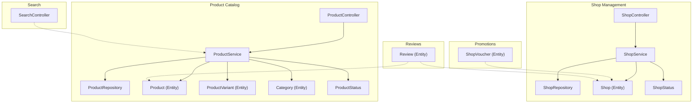
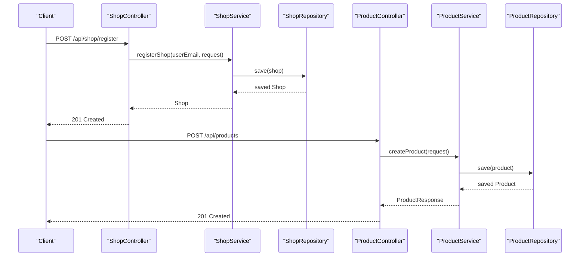
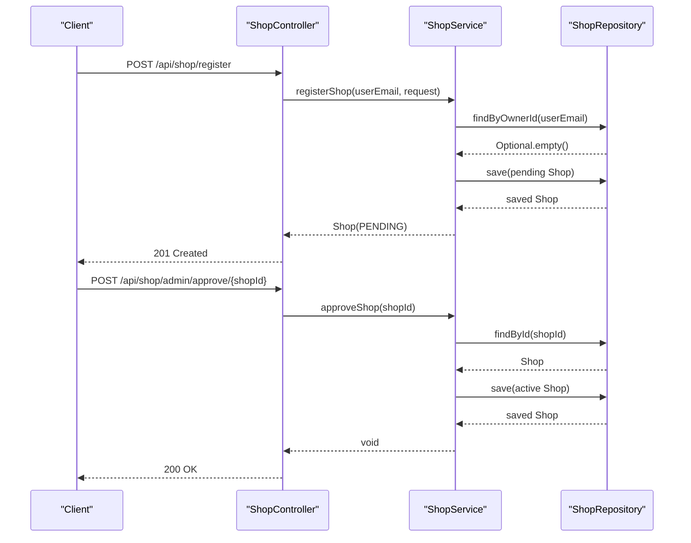
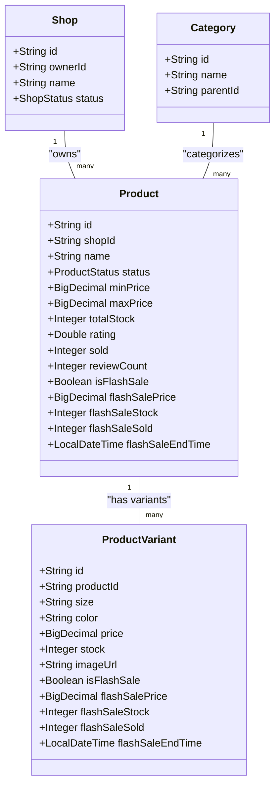
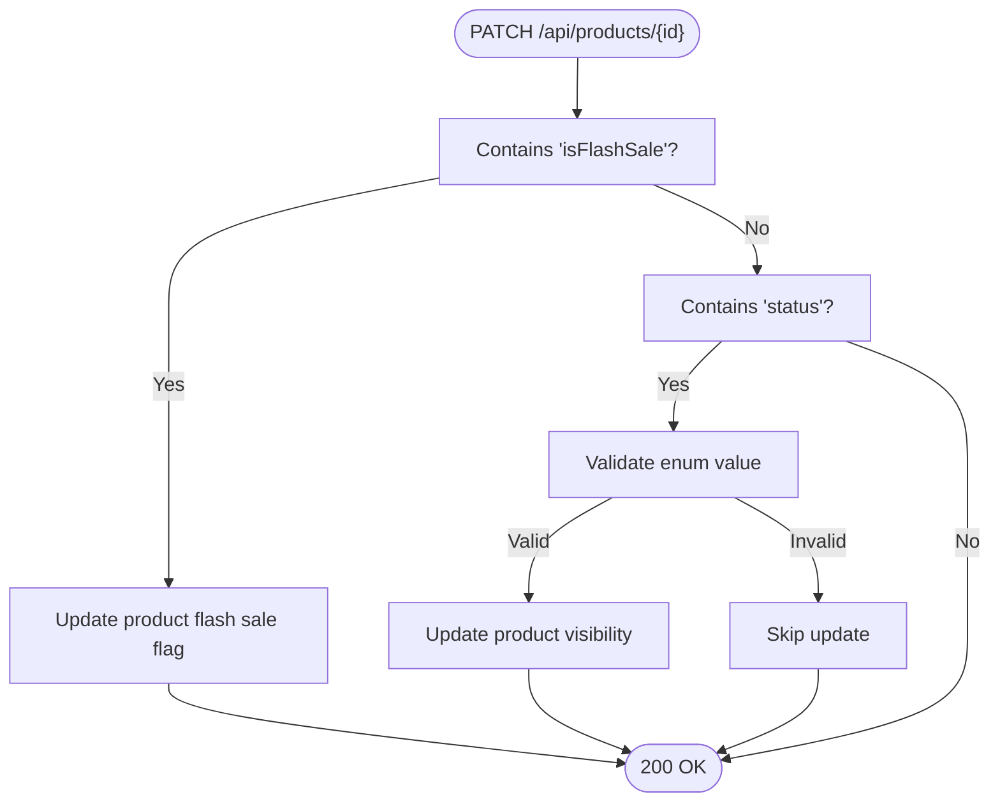
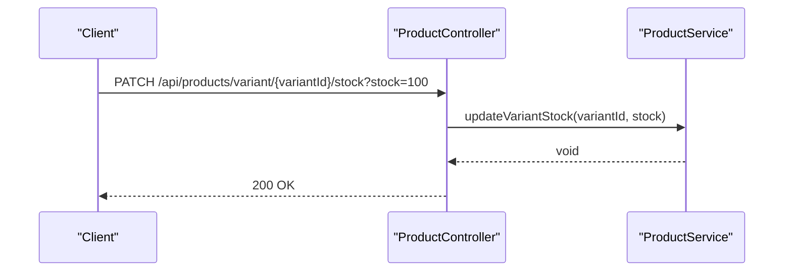
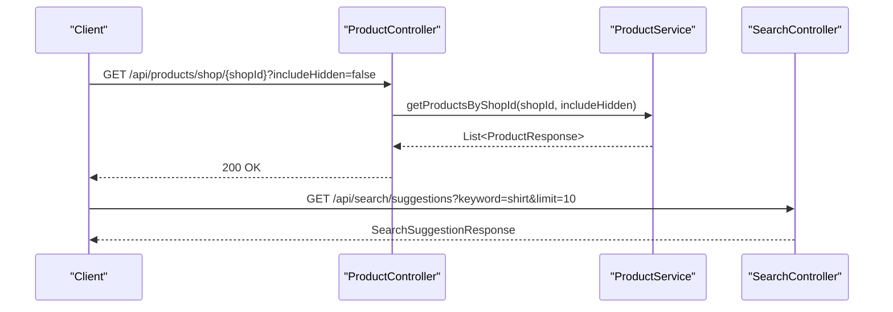
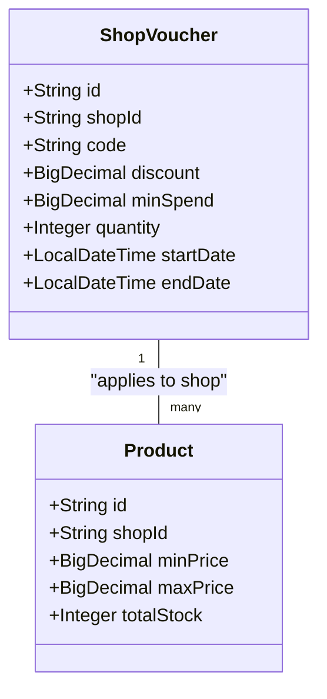
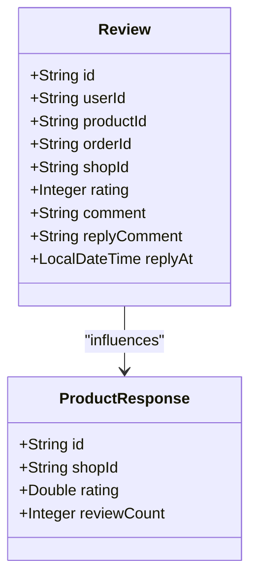
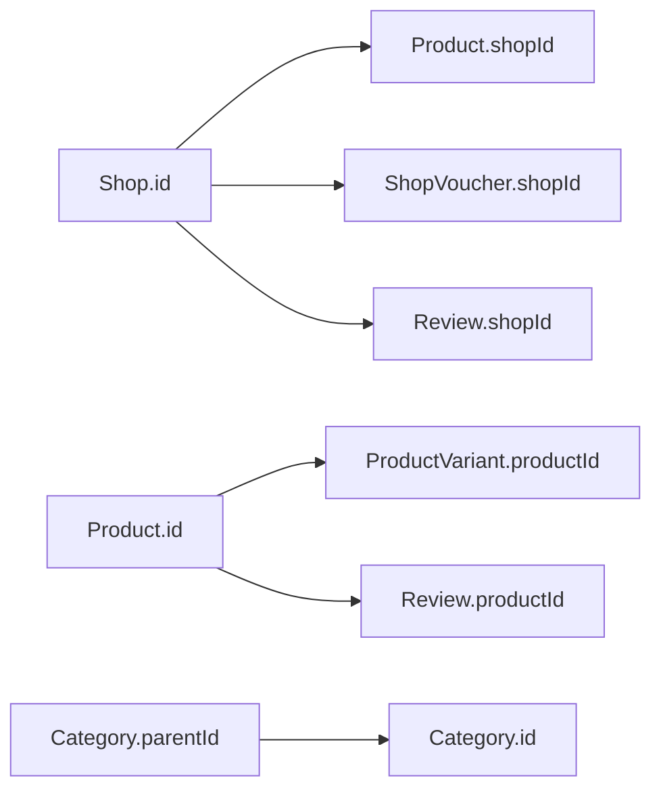

# Shop-Product Catalog Integration

<cite>
**Referenced Files in This Document**
- [Shop.java](file://src/Backend/src/main/java/com/shoppeclone/backend/shop/entity/Shop.java)
- [ShopStatus.java](file://src/Backend/src/main/java/com/shoppeclone/backend/shop/entity/ShopStatus.java)
- [ShopController.java](file://src/Backend/src/main/java/com/shoppeclone/backend/shop/controller/ShopController.java)
- [ShopRepository.java](file://src/Backend/src/main/java/com/shoppeclone/backend/shop/repository/ShopRepository.java)
- [ShopService.java](file://src/Backend/src/main/java/com/shoppeclone/backend/shop/service/ShopService.java)
- [ShopRegisterRequest.java](file://src/Backend/src/main/java/com/shoppeclone/backend/shop/dto/ShopRegisterRequest.java)
- [Product.java](file://src/Backend/src/main/java/com/shoppeclone/backend/product/entity/Product.java)
- [ProductStatus.java](file://src/Backend/src/main/java/com/shoppeclone/backend/product/entity/ProductStatus.java)
- [ProductVariant.java](file://src/Backend/src/main/java/com/shoppeclone/backend/product/entity/ProductVariant.java)
- [Category.java](file://src/Backend/src/main/java/com/shoppeclone/backend/product/entity/Category.java)
- [ProductController.java](file://src/Backend/src/main/java/com/shoppeclone/backend/product/controller/ProductController.java)
- [ProductRepository.java](file://src/Backend/src/main/java/com/shoppeclone/backend/product/repository/ProductRepository.java)
- [ProductService.java](file://src/Backend/src/main/java/com/shoppeclone/backend/product/service/ProductService.java)
- [CreateProductRequest.java](file://src/Backend/src/main/java/com/shoppeclone/backend/product/dto/request/CreateProductRequest.java)
- [ProductResponse.java](file://src/Backend/src/main/java/com/shoppeclone/backend/product/dto/response/ProductResponse.java)
- [ShopVoucher.java](file://src/Backend/src/main/java/com/shoppeclone/backend/promotion/entity/ShopVoucher.java)
- [Review.java](file://src/Backend/src/main/java/com/shoppeclone/backend/review/entity/Review.java)
- [SearchController.java](file://src/Backend/src/main/java/com/shoppeclone/backend/search/controller/SearchController.java)
</cite>

## Table of Contents
1. [Introduction](#introduction)
2. [Project Structure](#project-structure)
3. [Core Components](#core-components)
4. [Architecture Overview](#architecture-overview)
5. [Detailed Component Analysis](#detailed-component-analysis)
6. [Dependency Analysis](#dependency-analysis)
7. [Performance Considerations](#performance-considerations)
8. [Troubleshooting Guide](#troubleshooting-guide)
9. [Conclusion](#conclusion)

## Introduction
This document explains the integration between shop management and the product catalog system. It covers how shops own and manage products, including product listing, categorization, inventory management, approval workflows, shop-specific product variations, pricing strategies, search and filtering within shop contexts, shop-specific promotions, cross-selling opportunities, reputation systems, product quality ratings, seller performance metrics, moderation and quality control, and API endpoints for shop-product interactions and analytics.

## Project Structure
The integration spans several packages:
- Shop management: entities, repositories, services, and controllers for shop lifecycle and administration
- Product catalog: entities, repositories, services, and controllers for product creation, variants, categories, and search
- Promotions: shop-specific vouchers and flash sale mechanisms
- Reviews: product and shop reputation and quality metrics
- Search: homepage suggestions mixing products, categories, keywords, and attributes

**Diagram sources**
- [ShopController.java:22-150](file://src/Backend/src/main/java/com/shoppeclone/backend/shop/controller/ShopController.java#L22-L150)
- [ShopService.java:9-31](file://src/Backend/src/main/java/com/shoppeclone/backend/shop/service/ShopService.java#L9-L31)
- [ShopRepository.java:11-23](file://src/Backend/src/main/java/com/shoppeclone/backend/shop/repository/ShopRepository.java#L11-L23)
- [Shop.java:12-52](file://src/Backend/src/main/java/com/shoppeclone/backend/shop/entity/Shop.java#L12-L52)
- [ShopStatus.java:3-8](file://src/Backend/src/main/java/com/shoppeclone/backend/shop/entity/ShopStatus.java#L3-L8)
- [ProductController.java:18-163](file://src/Backend/src/main/java/com/shoppeclone/backend/product/controller/ProductController.java#L18-L163)
- [ProductService.java:10-54](file://src/Backend/src/main/java/com/shoppeclone/backend/product/service/ProductService.java#L10-L54)
- [ProductRepository.java:11-41](file://src/Backend/src/main/java/com/shoppeclone/backend/product/repository/ProductRepository.java#L11-L41)
- [Product.java:10-51](file://src/Backend/src/main/java/com/shoppeclone/backend/product/entity/Product.java#L10-L51)
- [ProductVariant.java:10-37](file://src/Backend/src/main/java/com/shoppeclone/backend/product/entity/ProductVariant.java#L10-L37)
- [Category.java:8-22](file://src/Backend/src/main/java/com/shoppeclone/backend/product/entity/Category.java#L8-L22)
- [ProductStatus.java:3-6](file://src/Backend/src/main/java/com/shoppeclone/backend/product/entity/ProductStatus.java#L3-L6)
- [ShopVoucher.java:11-28](file://src/Backend/src/main/java/com/shoppeclone/backend/promotion/entity/ShopVoucher.java#L11-L28)
- [Review.java:11-40](file://src/Backend/src/main/java/com/shoppeclone/backend/review/entity/Review.java#L11-L40)
- [SearchController.java:9-38](file://src/Backend/src/main/java/com/shoppeclone/backend/search/controller/SearchController.java#L9-L38)

**Section sources**
- [ShopController.java:22-150](file://src/Backend/src/main/java/com/shoppeclone/backend/shop/controller/ShopController.java#L22-L150)
- [ProductController.java:18-163](file://src/Backend/src/main/java/com/shoppeclone/backend/product/controller/ProductController.java#L18-L163)
- [SearchController.java:9-38](file://src/Backend/src/main/java/com/shoppeclone/backend/search/controller/SearchController.java#L9-L38)

## Core Components
- Shop entity defines ownership, identity, banking info, and status. Shops are owned by users and managed through admin workflows.
- Product entity links to a shop, aggregates pricing and sales metrics, and supports flash sale flags and timing.
- ProductVariant entity captures SKU-level attributes (size, color), pricing, stock, optional variant images, and flash sale overrides.
- Category entity supports hierarchical taxonomy with self-referencing parent-child relations.
- ShopVoucher entity enables shop-specific promotional discounts with constraints like minimum spend and validity dates.
- Review entity connects buyers to products and shops, enabling ratings and replies for reputation tracking.
- Controllers expose REST endpoints for shop registration/approval, product CRUD, variant management, category assignment, image management, and search suggestions.

**Section sources**
- [Shop.java:12-52](file://src/Backend/src/main/java/com/shoppeclone/backend/shop/entity/Shop.java#L12-L52)
- [ShopStatus.java:3-8](file://src/Backend/src/main/java/com/shoppeclone/backend/shop/entity/ShopStatus.java#L3-L8)
- [Product.java:10-51](file://src/Backend/src/main/java/com/shoppeclone/backend/product/entity/Product.java#L10-L51)
- [ProductVariant.java:10-37](file://src/Backend/src/main/java/com/shoppeclone/backend/product/entity/ProductVariant.java#L10-L37)
- [Category.java:8-22](file://src/Backend/src/main/java/com/shoppeclone/backend/product/entity/Category.java#L8-L22)
- [ShopVoucher.java:11-28](file://src/Backend/src/main/java/com/shoppeclone/backend/promotion/entity/ShopVoucher.java#L11-L28)
- [Review.java:11-40](file://src/Backend/src/main/java/com/shoppeclone/backend/review/entity/Review.java#L11-L40)
- [ProductController.java:18-163](file://src/Backend/src/main/java/com/shoppeclone/backend/product/controller/ProductController.java#L18-L163)
- [ShopController.java:22-150](file://src/Backend/src/main/java/com/shoppeclone/backend/shop/controller/ShopController.java#L22-L150)

## Architecture Overview
The system follows a layered architecture:
- Presentation: REST controllers expose endpoints for shop and product operations
- Application: Services orchestrate business logic and coordinate repositories
- Persistence: MongoDB repositories persist entities and support queries
- Entities: POJOs define domain models and relationships

**Diagram sources**
- [ShopController.java:75-80](file://src/Backend/src/main/java/com/shoppeclone/backend/shop/controller/ShopController.java#L75-L80)
- [ShopService.java](file://src/Backend/src/main/java/com/shoppeclone/backend/shop/service/ShopService.java#L10)
- [ShopRepository.java:11-23](file://src/Backend/src/main/java/com/shoppeclone/backend/shop/repository/ShopRepository.java#L11-L23)
- [ProductController.java:26-29](file://src/Backend/src/main/java/com/shoppeclone/backend/product/controller/ProductController.java#L26-L29)
- [ProductService.java](file://src/Backend/src/main/java/com/shoppeclone/backend/product/service/ProductService.java#L11)
- [ProductRepository.java:11-41](file://src/Backend/src/main/java/com/shoppeclone/backend/product/repository/ProductRepository.java#L11-L41)

## Detailed Component Analysis

### Shop Ownership and Approval Workflow
- Shops are owned by users identified by email. Registration stores identity and bank details.
- Admin endpoints allow approving pending shops and rejecting with optional reasons.
- Shop statuses include PENDING, ACTIVE, REJECTED, CLOSED.

**Diagram sources**
- [ShopController.java:75-80](file://src/Backend/src/main/java/com/shoppeclone/backend/shop/controller/ShopController.java#L75-L80)
- [ShopController.java:127-131](file://src/Backend/src/main/java/com/shoppeclone/backend/shop/controller/ShopController.java#L127-L131)
- [ShopService.java](file://src/Backend/src/main/java/com/shoppeclone/backend/shop/service/ShopService.java#L21)
- [ShopRepository.java:11-23](file://src/Backend/src/main/java/com/shoppeclone/backend/shop/repository/ShopRepository.java#L11-L23)
- [ShopStatus.java:3-8](file://src/Backend/src/main/java/com/shoppeclone/backend/shop/entity/ShopStatus.java#L3-L8)

**Section sources**
- [ShopController.java:75-138](file://src/Backend/src/main/java/com/shoppeclone/backend/shop/controller/ShopController.java#L75-L138)
- [ShopRegisterRequest.java:7-33](file://src/Backend/src/main/java/com/shoppeclone/backend/shop/dto/ShopRegisterRequest.java#L7-L33)
- [ShopRepository.java:11-23](file://src/Backend/src/main/java/com/shoppeclone/backend/shop/repository/ShopRepository.java#L11-L23)
- [ShopStatus.java:3-8](file://src/Backend/src/main/java/com/shoppeclone/backend/shop/entity/ShopStatus.java#L3-L8)

### Product Catalog and Variants
- Products belong to shops via shopId and support visibility via ProductStatus.
- Variants capture SKU-level attributes and stock, enabling shop-specific pricing and inventory.
- Categories support hierarchical taxonomy; products can be categorized and filtered.

**Diagram sources**
- [Shop.java:12-52](file://src/Backend/src/main/java/com/shoppeclone/backend/shop/entity/Shop.java#L12-L52)
- [Product.java:10-51](file://src/Backend/src/main/java/com/shoppeclone/backend/product/entity/Product.java#L10-L51)
- [ProductVariant.java:10-37](file://src/Backend/src/main/java/com/shoppeclone/backend/product/entity/ProductVariant.java#L10-L37)
- [Category.java:8-22](file://src/Backend/src/main/java/com/shoppeclone/backend/product/entity/Category.java#L8-L22)

**Section sources**
- [Product.java:10-51](file://src/Backend/src/main/java/com/shoppeclone/backend/product/entity/Product.java#L10-L51)
- [ProductVariant.java:10-37](file://src/Backend/src/main/java/com/shoppeclone/backend/product/entity/ProductVariant.java#L10-L37)
- [Category.java:8-22](file://src/Backend/src/main/java/com/shoppeclone/backend/product/entity/Category.java#L8-L22)
- [ProductStatus.java:3-6](file://src/Backend/src/main/java/com/shoppeclone/backend/product/entity/ProductStatus.java#L3-L6)

### Product Approval and Visibility Controls
- Product visibility is controlled via ProductStatus (ACTIVE/HIDDEN).
- Controllers expose PATCH endpoints to toggle flash sale flags and visibility status.

**Diagram sources**
- [ProductController.java:76-98](file://src/Backend/src/main/java/com/shoppeclone/backend/product/controller/ProductController.java#L76-L98)
- [ProductStatus.java:3-6](file://src/Backend/src/main/java/com/shoppeclone/backend/product/entity/ProductStatus.java#L3-L6)

**Section sources**
- [ProductController.java:76-98](file://src/Backend/src/main/java/com/shoppeclone/backend/product/controller/ProductController.java#L76-L98)

### Inventory Management and Pricing Strategies
- Variants maintain per-SKU stock and price; products aggregate min/max price and total stock.
- Flash sale fields enable time-bound pricing and stock tracking per product and variant.
- Bulk stock updates are supported via dedicated endpoint.

**Diagram sources**
- [ProductController.java:122-128](file://src/Backend/src/main/java/com/shoppeclone/backend/product/controller/ProductController.java#L122-L128)

**Section sources**
- [ProductVariant.java:10-37](file://src/Backend/src/main/java/com/shoppeclone/backend/product/entity/ProductVariant.java#L10-L37)
- [Product.java:10-51](file://src/Backend/src/main/java/com/shoppeclone/backend/product/entity/Product.java#L10-L51)
- [ProductController.java:122-128](file://src/Backend/src/main/java/com/shoppeclone/backend/product/controller/ProductController.java#L122-L128)

### Categorization and Search Within Shop Contexts
- Products can be filtered by shopId and category.
- Search endpoints support keyword-based discovery across product names and descriptions.
- Search suggestions mix products, categories, keywords, and variant attributes.

**Diagram sources**
- [ProductController.java:36-41](file://src/Backend/src/main/java/com/shoppeclone/backend/product/controller/ProductController.java#L36-L41)
- [SearchController.java:29-36](file://src/Backend/src/main/java/com/shoppeclone/backend/search/controller/SearchController.java#L29-L36)

**Section sources**
- [ProductController.java:36-61](file://src/Backend/src/main/java/com/shoppeclone/backend/product/controller/ProductController.java#L36-L61)
- [SearchController.java:29-36](file://src/Backend/src/main/java/com/shoppeclone/backend/search/controller/SearchController.java#L29-L36)

### Shop-Specific Promotions and Cross-Selling
- ShopVoucher enables shop-specific discounts with constraints like minimum spend and validity windows.
- Cross-selling opportunities arise from product aggregation (min/max price, total stock) and category associations.

**Diagram sources**
- [ShopVoucher.java:11-28](file://src/Backend/src/main/java/com/shoppeclone/backend/promotion/entity/ShopVoucher.java#L11-L28)
- [Product.java:10-51](file://src/Backend/src/main/java/com/shoppeclone/backend/product/entity/Product.java#L10-L51)

**Section sources**
- [ShopVoucher.java:11-28](file://src/Backend/src/main/java/com/shoppeclone/backend/promotion/entity/ShopVoucher.java#L11-L28)
- [Product.java:10-51](file://src/Backend/src/main/java/com/shoppeclone/backend/product/entity/Product.java#L10-L51)

### Reputation Systems, Ratings, and Seller Metrics
- Reviews connect users to products and shops, enabling ratings and replies.
- ProductResponse aggregates rating and review count for display.
- Seller performance can be inferred from shop-level activity and product sales metrics.

**Diagram sources**
- [Review.java:11-40](file://src/Backend/src/main/java/com/shoppeclone/backend/review/entity/Review.java#L11-L40)
- [ProductResponse.java:8-36](file://src/Backend/src/main/java/com/shoppeclone/backend/product/dto/response/ProductResponse.java#L8-L36)

**Section sources**
- [Review.java:11-40](file://src/Backend/src/main/java/com/shoppeclone/backend/review/entity/Review.java#L11-L40)
- [ProductResponse.java:8-36](file://src/Backend/src/main/java/com/shoppeclone/backend/product/dto/response/ProductResponse.java#L8-L36)

### Moderation, Spam Prevention, and Quality Control
- Admin endpoints allow retrieving pending, active, and rejected shops for oversight.
- Product visibility can be toggled to hidden for moderation.
- Search suggestions help surface relevant items while preventing low-quality matches.

**Section sources**
- [ShopController.java:110-138](file://src/Backend/src/main/java/com/shoppeclone/backend/shop/controller/ShopController.java#L110-L138)
- [ProductController.java:76-98](file://src/Backend/src/main/java/com/shoppeclone/backend/product/controller/ProductController.java#L76-L98)
- [SearchController.java:29-36](file://src/Backend/src/main/java/com/shoppeclone/backend/search/controller/SearchController.java#L29-L36)

### API Endpoints for Shop-Product Interactions
- Shop endpoints:
  - POST /api/shop/register
  - GET /api/shop/my-shop
  - GET /api/shop/{id}
  - PUT /api/shop/my-shop
  - POST /api/shop/upload-id-card
  - GET /api/shop/admin/pending
  - GET /api/shop/admin/active
  - GET /api/shop/admin/rejected
  - POST /api/shop/admin/approve/{shopId}
  - POST /api/shop/admin/reject/{shopId}?reason={reason}
  - DELETE /api/shop/admin/delete/{id}
- Product endpoints:
  - POST /api/products
  - GET /api/products/{id}
  - GET /api/products/shop/{shopId}?includeHidden={bool}
  - GET /api/products
  - GET /api/products/search?keyword={term}
  - GET /api/products/flash-sale
  - GET /api/products/category/{categoryId}
  - PUT /api/products/{id}
  - DELETE /api/products/{id}
  - PATCH /api/products/{id} (toggle flash sale and visibility)
  - POST /api/products/{productId}/variants
  - DELETE /api/products/variants/{variantId}
  - GET /api/products/variant/{variantId}
  - PATCH /api/products/variant/{variantId}/stock?stock={int}
  - POST /api/products/{productId}/categories/{categoryId}
  - DELETE /api/products/{productId}/categories/{categoryId}
  - POST /api/products/{productId}/images
  - DELETE /api/products/images/{imageId}

**Section sources**
- [ShopController.java:35-148](file://src/Backend/src/main/java/com/shoppeclone/backend/shop/controller/ShopController.java#L35-L148)
- [ProductController.java:26-162](file://src/Backend/src/main/java/com/shoppeclone/backend/product/controller/ProductController.java#L26-L162)

## Dependency Analysis
- Shop ownership is enforced by shop.ownerId linking to users and shop.status controlling lifecycle.
- Product.shopId is the primary foreign key to shops; ProductVariant.productId references products.
- Category supports hierarchical taxonomy via parentId.
- ProductRepository and ProductController provide filtering and search capabilities.
- ShopVoucher is scoped to shops via shopId.
- Reviews reference products and shops for reputation tracking.

**Diagram sources**
- [Shop.java:15-19](file://src/Backend/src/main/java/com/shoppeclone/backend/shop/entity/Shop.java#L15-L19)
- [Product.java:16-17](file://src/Backend/src/main/java/com/shoppeclone/backend/product/entity/Product.java#L16-L17)
- [ProductVariant.java:16-17](file://src/Backend/src/main/java/com/shoppeclone/backend/product/entity/ProductVariant.java#L16-L17)
- [Category.java:16-17](file://src/Backend/src/main/java/com/shoppeclone/backend/product/entity/Category.java#L16-L17)
- [ShopVoucher.java:17-18](file://src/Backend/src/main/java/com/shoppeclone/backend/promotion/entity/ShopVoucher.java#L17-L18)
- [Review.java:17-27](file://src/Backend/src/main/java/com/shoppeclone/backend/review/entity/Review.java#L17-L27)

**Section sources**
- [Shop.java:15-19](file://src/Backend/src/main/java/com/shoppeclone/backend/shop/entity/Shop.java#L15-L19)
- [Product.java:16-17](file://src/Backend/src/main/java/com/shoppeclone/backend/product/entity/Product.java#L16-L17)
- [ProductVariant.java:16-17](file://src/Backend/src/main/java/com/shoppeclone/backend/product/entity/ProductVariant.java#L16-L17)
- [Category.java:16-17](file://src/Backend/src/main/java/com/shoppeclone/backend/product/entity/Category.java#L16-L17)
- [ShopVoucher.java:17-18](file://src/Backend/src/main/java/com/shoppeclone/backend/promotion/entity/ShopVoucher.java#L17-L18)
- [Review.java:17-27](file://src/Backend/src/main/java/com/shoppeclone/backend/review/entity/Review.java#L17-L27)

## Performance Considerations
- Use indexed fields (shopId, productId, category parentId) to optimize lookups.
- Aggregate fields on Product (min/max price, total stock, rating, sold) reduce downstream computations.
- Limit search suggestion counts and leverage regex queries with status filters.
- Batch variant operations and avoid frequent stock recalculations.

## Troubleshooting Guide
- Shop registration failures: validate identity and bank details; ensure unique owner constraints.
- Product visibility issues: confirm ProductStatus transitions and admin approvals.
- Variant stock discrepancies: reconcile variant stock updates against product totals.
- Search relevance: tune keyword matching and suggestion limits; verify status filters.

## Conclusion
The shop-product catalog integration establishes clear ownership and governance boundaries, supports rich product and variant modeling, and provides robust administrative controls for moderation and quality. The APIs enable efficient shop-product interactions, while promotions, reviews, and search enhance discoverability and performance. Extending the system with analytics dashboards and automated moderation rules would further strengthen operational insights and quality assurance.