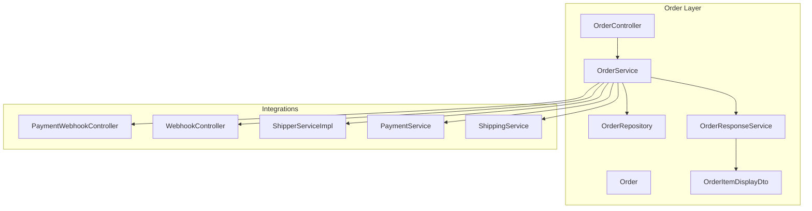
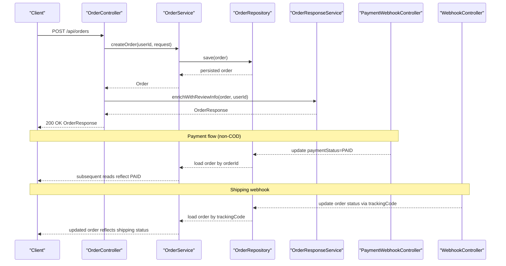
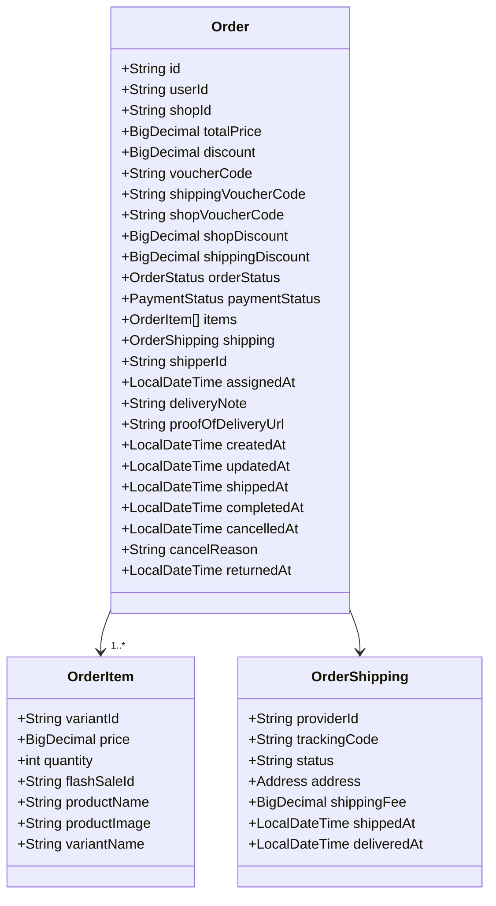
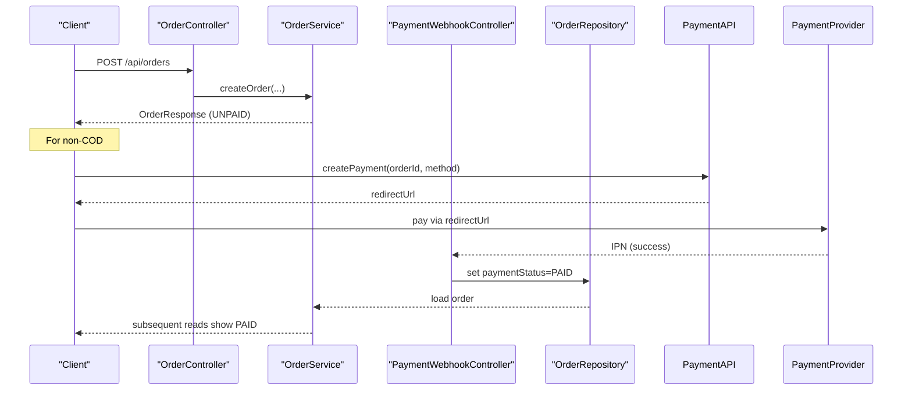
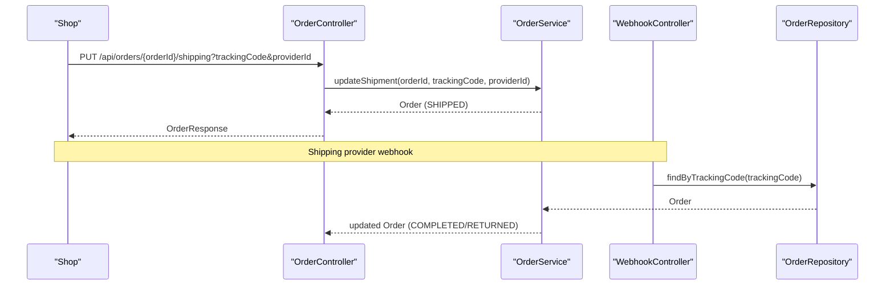
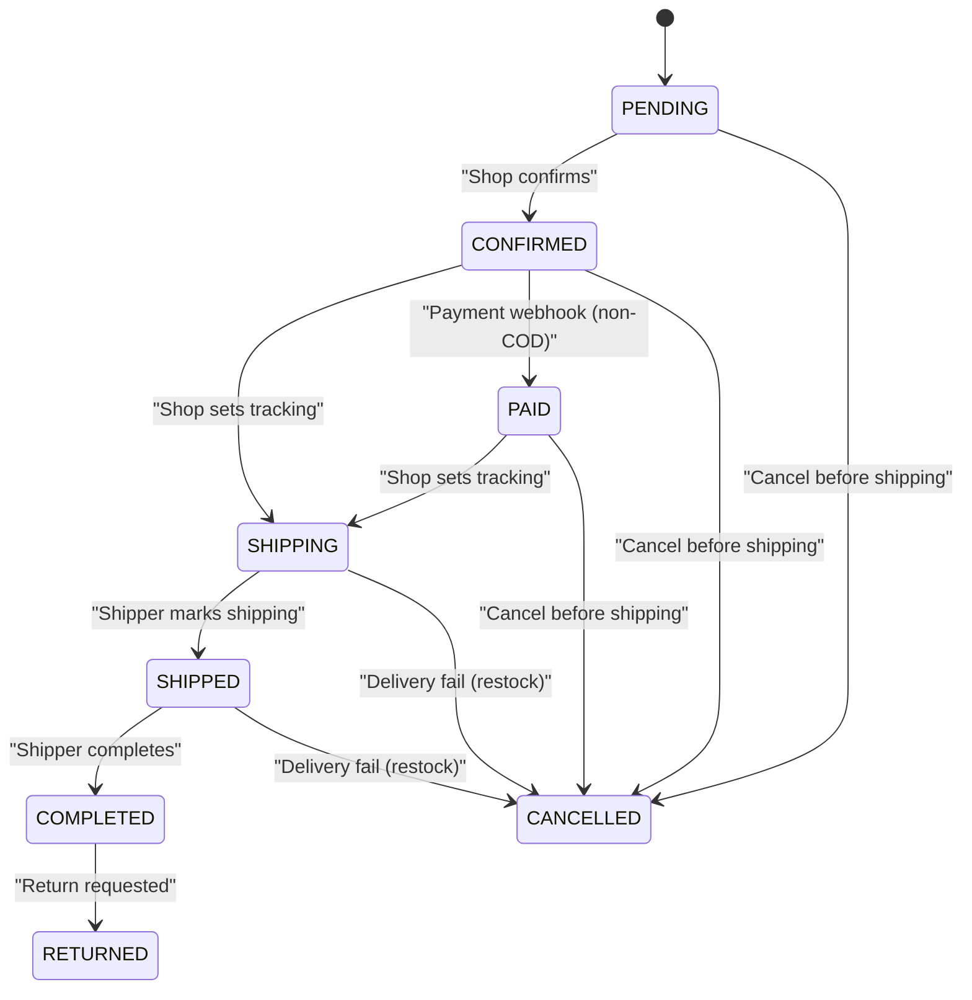
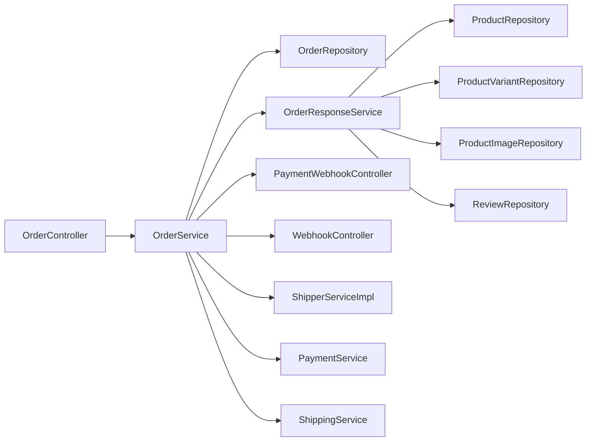

# Order Processing System

<cite>
**Referenced Files in This Document**
- [OrderController.java](file://src/Backend/src/main/java/com/shoppeclone/backend/order/controller/OrderController.java)
- [OrderService.java](file://src/Backend/src/main/java/com/shoppeclone/backend/order/service/OrderService.java)
- [OrderServiceImpl.java](file://src/Backend/src/main/java/com/shoppeclone/backend/order/service/impl/OrderServiceImpl.java)
- [OrderResponseService.java](file://src/Backend/src/main/java/com/shoppeclone/backend/order/service/OrderResponseService.java)
- [Order.java](file://src/Backend/src/main/java/com/shoppeclone/backend/order/entity/Order.java)
- [OrderItem.java](file://src/Backend/src/main/java/com/shoppeclone/backend/order/entity/OrderItem.java)
- [OrderStatus.java](file://src/Backend/src/main/java/com/shoppeclone/backend/order/entity/OrderStatus.java)
- [PaymentStatus.java](file://src/Backend/src/main/java/com/shoppeclone/backend/order/entity/PaymentStatus.java)
- [OrderShipping.java](file://src/Backend/src/main/java/com/shoppeclone/backend/order/entity/OrderShipping.java)
- [OrderRequest.java](file://src/Backend/src/main/java/com/shoppeclone/backend/order/dto/OrderRequest.java)
- [OrderResponse.java](file://src/Backend/src/main/java/com/shoppeclone/backend/order/dto/OrderResponse.java)
- [OrderItemDisplayDto.java](file://src/Backend/src/main/java/com/shoppeclone/backend/order/dto/OrderItemDisplayDto.java)
- [OrderItemRequest.java](file://src/Backend/src/main/java/com/shoppeclone/backend/order/dto/OrderItemRequest.java)
- [OrderRepository.java](file://src/Backend/src/main/java/com/shoppeclone/backend/order/repository/OrderRepository.java)
- [PaymentWebhookController.java](file://src/Backend/src/main/java/com/shoppeclone/backend/payment/controller/PaymentWebhookController.java)
- [WebhookController.java](file://src/Backend/src/main/java/com/shoppeclone/backend/shipping/controller/WebhookController.java)
- [ShipperServiceImpl.java](file://src/Backend/src/main/java/com/shoppeclone/backend/shippers/service/impl/ShipperServiceImpl.java)
- [ShopService.java](file://src/Backend/src/main/java/com/shoppeclone/backend/shop/service/ShopService.java)
- [UserRepository.java](file://src/Backend/src/main/java/com/shoppeclone/backend/auth/repository/UserRepository.java)
</cite>

## Table of Contents
1. [Introduction](#introduction)
2. [Project Structure](#project-structure)
3. [Core Components](#core-components)
4. [Architecture Overview](#architecture-overview)
5. [Detailed Component Analysis](#detailed-component-analysis)
6. [Dependency Analysis](#dependency-analysis)
7. [Performance Considerations](#performance-considerations)
8. [Troubleshooting Guide](#troubleshooting-guide)
9. [Conclusion](#conclusion)

## Introduction
This document provides a comprehensive guide to the order processing system, covering order creation, validation, lifecycle management, controller endpoints, service implementation, and integrations with payment, inventory, and shipping. It explains multi-item order processing, order modification and cancellation, status transitions, and error handling strategies.

## Project Structure
The order processing system resides under the order package and integrates with payment, shipping, shop, and user services. Key components include:
- Controller: exposes REST endpoints for order operations
- Service: orchestrates order creation, updates, and state transitions
- Entity: defines order data model and relationships
- DTO: serializes order responses enriched with product and review metadata
- Repository: persists and queries orders in MongoDB
- Integrations: payment webhooks, shipping webhooks, and shipper APIs

**Diagram sources**
- [OrderController.java:21-175](file://src/Backend/src/main/java/com/shoppeclone/backend/order/controller/OrderController.java#L21-L175)
- [OrderService.java:9-31](file://src/Backend/src/main/java/com/shoppeclone/backend/order/service/OrderService.java#L9-L31)
- [OrderRepository.java:8-25](file://src/Backend/src/main/java/com/shoppeclone/backend/order/repository/OrderRepository.java#L8-L25)
- [OrderResponseService.java:27-183](file://src/Backend/src/main/java/com/shoppeclone/backend/order/service/OrderResponseService.java#L27-L183)
- [Order.java:12-54](file://src/Backend/src/main/java/com/shoppeclone/backend/order/entity/Order.java#L12-L54)
- [OrderItemDisplayDto.java:10-22](file://src/Backend/src/main/java/com/shoppeclone/backend/order/dto/OrderItemDisplayDto.java#L10-L22)
- [PaymentWebhookController.java](file://src/Backend/src/main/java/com/shoppeclone/backend/payment/controller/PaymentWebhookController.java)
- [WebhookController.java](file://src/Backend/src/main/java/com/shoppeclone/backend/shipping/controller/WebhookController.java)
- [ShipperServiceImpl.java](file://src/Backend/src/main/java/com/shoppeclone/backend/shippers/service/impl/ShipperServiceImpl.java)

**Section sources**
- [OrderController.java:21-175](file://src/Backend/src/main/java/com/shoppeclone/backend/order/controller/OrderController.java#L21-L175)
- [OrderService.java:9-31](file://src/Backend/src/main/java/com/shoppeclone/backend/order/service/OrderService.java#L9-L31)
- [OrderRepository.java:8-25](file://src/Backend/src/main/java/com/shoppeclone/backend/order/repository/OrderRepository.java#L8-L25)
- [OrderResponseService.java:27-183](file://src/Backend/src/main/java/com/shoppeclone/backend/order/service/OrderResponseService.java#L27-L183)
- [Order.java:12-54](file://src/Backend/src/main/java/com/shoppeclone/backend/order/entity/Order.java#L12-L54)
- [OrderItemDisplayDto.java:10-22](file://src/Backend/src/main/java/com/shoppeclone/backend/order/dto/OrderItemDisplayDto.java#L10-L22)

## Core Components
- OrderController: exposes endpoints for creating orders, retrieving order history, viewing a single order, updating order status, canceling orders, updating shipment/tracking, and fetching shop-specific orders.
- OrderService: defines the contract for order operations including creation, retrieval, status updates, cancellations, and shipment updates.
- OrderServiceImpl: implements order creation, validation, payment integration triggers, inventory restoration, and state transitions.
- OrderResponseService: enriches order responses with product display metadata, payment method, and review eligibility.
- Order entity and related DTOs: define order structure, items, shipping, statuses, and response envelopes.
- Repositories and Services: OrderRepository, PaymentWebhookController, WebhookController, ShipperServiceImpl coordinate persistence and external integrations.

**Section sources**
- [OrderController.java:37-172](file://src/Backend/src/main/java/com/shoppeclone/backend/order/controller/OrderController.java#L37-L172)
- [OrderService.java:9-31](file://src/Backend/src/main/java/com/shoppeclone/backend/order/service/OrderService.java#L9-L31)
- [OrderResponseService.java:44-171](file://src/Backend/src/main/java/com/shoppeclone/backend/order/service/OrderResponseService.java#L44-L171)
- [Order.java:16-52](file://src/Backend/src/main/java/com/shoppeclone/backend/order/entity/Order.java#L16-L52)
- [OrderItem.java:7-17](file://src/Backend/src/main/java/com/shoppeclone/backend/order/entity/OrderItem.java#L7-L17)
- [OrderStatus.java:3-12](file://src/Backend/src/main/java/com/shoppeclone/backend/order/entity/OrderStatus.java#L3-L12)
- [PaymentStatus.java:3-7](file://src/Backend/src/main/java/com/shoppeclone/backend/order/entity/PaymentStatus.java#L3-L7)
- [OrderShipping.java:9-17](file://src/Backend/src/main/java/com/shoppeclone/backend/order/entity/OrderShipping.java#L9-L17)

## Architecture Overview
The order lifecycle spans multiple systems:
- Order creation: validates request, resolves user/shop, computes totals, applies vouchers, and persists order.
- Payment integration: for non-COD methods, creates payment records and redirects to payment providers; webhook updates payment status.
- Inventory and shipping: shop assigns tracking code; shipping webhook updates order status; shipper APIs support internal delivery flows.
- Reviews: post-completion, eligible items enable customer reviews.

**Diagram sources**
- [OrderController.java:37-70](file://src/Backend/src/main/java/com/shoppeclone/backend/order/controller/OrderController.java#L37-L70)
- [OrderService.java](file://src/Backend/src/main/java/com/shoppeclone/backend/order/service/OrderService.java#L10)
- [OrderRepository.java:8-25](file://src/Backend/src/main/java/com/shoppeclone/backend/order/repository/OrderRepository.java#L8-L25)
- [OrderResponseService.java:44-171](file://src/Backend/src/main/java/com/shoppeclone/backend/order/service/OrderResponseService.java#L44-L171)
- [PaymentWebhookController.java](file://src/Backend/src/main/java/com/shoppeclone/backend/payment/controller/PaymentWebhookController.java)
- [WebhookController.java](file://src/Backend/src/main/java/com/shoppeclone/backend/shipping/controller/WebhookController.java)

## Detailed Component Analysis

### Order Controller Endpoints
- POST /api/orders: Creates an order from a request containing shipping provider, address, payment method, optional vouchers, and items or cart variant IDs.
- GET /api/orders: Retrieves user’s order history and enriches with review info.
- DELETE /api/orders: Deletes all user orders (used to clear test/virtual shop data).
- GET /api/orders/{orderId}: Retrieves a specific order and enriches with review info.
- PUT /api/orders/{orderId}/status?status={status}: Updates order status (seller-only).
- POST /api/orders/{orderId}/cancel: Cancels an order (owner or shop owner).
- PUT /api/orders/{orderId}/shipping?trackingCode&providerId: Updates shipment/tracking (seller-only).
- GET /api/orders/shop/{shopId}: Retrieves shop-specific orders (seller-only).

Authorization and ownership checks:
- User resolution via authentication principal and UserRepository.
- Seller validation via ShopService to ensure shop ownership before status/shipment updates.
- Cancellation allows either order owner or shop owner.

**Section sources**
- [OrderController.java:37-172](file://src/Backend/src/main/java/com/shoppeclone/backend/order/controller/OrderController.java#L37-L172)
- [UserRepository.java](file://src/Backend/src/main/java/com/shoppeclone/backend/auth/repository/UserRepository.java)
- [ShopService.java](file://src/Backend/src/main/java/com/shoppeclone/backend/shop/service/ShopService.java)

### Order Service Implementation
Responsibilities:
- createOrder: Validates request, resolves shop from items, computes totals, applies vouchers, sets initial statuses, persists order, and returns it.
- getUserOrders/getOrdersByShopId: Retrieves orders filtered by user or shop.
- updateOrderStatus: Transitions order status (requires shop ownership).
- cancelOrder: Prevents cancellation in shipping/shipped/completed/cancelled states; restores stock and marks cancelled.
- markOrderAsReturned/markOrderAsDeliveryFailed: Returns items and cancels order with optional reason.
- updateShipment: Sets tracking code/provider; transitions to shipped when tracking exists.
- deleteAllUserOrders: Clears user orders and restores stock for non-cancelled orders.

Validation and error handling:
- Throws runtime exceptions for invalid states or missing data.
- Uses transactional boundaries for state changes and inventory restoration.

**Section sources**
- [OrderService.java:9-31](file://src/Backend/src/main/java/com/shoppeclone/backend/order/service/OrderService.java#L9-L31)
- [OrderServiceImpl.java:654-686](file://src/Backend/src/main/java/com/shoppeclone/backend/order/service/impl/OrderServiceImpl.java#L654-L686)

### Order Entity Relationships
Order aggregates:
- Items: list of ordered variants with snapshot metadata (product/variant names/images).
- Shipping: shipping provider, tracking code, address, fees, and timestamps.
- Statuses: order and payment statuses track lifecycle.
- Timestamps: creation/update/completion/cancellation/return timestamps.
- Shipper fields: assignment and delivery metadata.

Relationships:
- One-to-many with OrderItem.
- Embedded OrderShipping.
- References to user and shop via userId and shopId.

**Diagram sources**
- [Order.java:16-52](file://src/Backend/src/main/java/com/shoppeclone/backend/order/entity/Order.java#L16-L52)
- [OrderItem.java:7-17](file://src/Backend/src/main/java/com/shoppeclone/backend/order/entity/OrderItem.java#L7-L17)
- [OrderShipping.java:9-17](file://src/Backend/src/main/java/com/shoppeclone/backend/order/entity/OrderShipping.java#L9-L17)

**Section sources**
- [Order.java:16-52](file://src/Backend/src/main/java/com/shoppeclone/backend/order/entity/Order.java#L16-L52)
- [OrderItem.java:7-17](file://src/Backend/src/main/java/com/shoppeclone/backend/order/entity/OrderItem.java#L7-L17)
- [OrderShipping.java:9-17](file://src/Backend/src/main/java/com/shoppeclone/backend/order/entity/OrderShipping.java#L9-L17)

### Order DTOs and Responses
- OrderRequest: supports Buy Now mode (direct items) or cart-based checkout (variant IDs).
- OrderResponse: serializable envelope with enriched display items, payment method, timestamps, and review eligibility.
- OrderItemDisplayDto: normalized product/variant metadata for UI rendering.
- OrderItemRequest: minimal item specification for Buy Now.

Enrichment pipeline:
- OrderResponseService enriches orders with product images/variants, payment method, and review eligibility windows.

**Section sources**
- [OrderRequest.java:8-94](file://src/Backend/src/main/java/com/shoppeclone/backend/order/dto/OrderRequest.java#L8-L94)
- [OrderResponse.java:22-112](file://src/Backend/src/main/java/com/shoppeclone/backend/order/dto/OrderResponse.java#L22-L112)
- [OrderItemDisplayDto.java:14-22](file://src/Backend/src/main/java/com/shoppeclone/backend/order/dto/OrderItemDisplayDto.java#L14-L22)
- [OrderItemRequest.java:6-10](file://src/Backend/src/main/java/com/shoppeclone/backend/order/dto/OrderItemRequest.java#L6-L10)
- [OrderResponseService.java:44-171](file://src/Backend/src/main/java/com/shoppeclone/backend/order/service/OrderResponseService.java#L44-L171)

### Payment Integration
- Non-COD payment methods trigger payment creation and redirection to payment providers.
- PaymentWebhookController updates payment and order statuses upon successful payment notifications.
- OrderResponseService defaults to COD when no payment method is found.

**Diagram sources**
- [OrderController.java:37-70](file://src/Backend/src/main/java/com/shoppeclone/backend/order/controller/OrderController.java#L37-L70)
- [PaymentWebhookController.java](file://src/Backend/src/main/java/com/shoppeclone/backend/payment/controller/PaymentWebhookController.java)
- [OrderRepository.java:8-25](file://src/Backend/src/main/java/com/shoppeclone/backend/order/repository/OrderRepository.java#L8-L25)

**Section sources**
- [OrderResponseService.java:47-55](file://src/Backend/src/main/java/com/shoppeclone/backend/order/service/OrderResponseService.java#L47-L55)
- [PaymentWebhookController.java](file://src/Backend/src/main/java/com/shoppeclone/backend/payment/controller/PaymentWebhookController.java)

### Shipping and Fulfillment
- Shop enters tracking code and provider; order transitions to shipped when tracking exists.
- Shipping webhook updates order status based on tracking events.
- Shipper APIs support internal delivery teams: pickup, shipping, complete, fail.

**Diagram sources**
- [OrderController.java:137-154](file://src/Backend/src/main/java/com/shoppeclone/backend/order/controller/OrderController.java#L137-L154)
- [WebhookController.java](file://src/Backend/src/main/java/com/shoppeclone/backend/shipping/controller/WebhookController.java)
- [OrderRepository.java:19-21](file://src/Backend/src/main/java/com/shoppeclone/backend/order/repository/OrderRepository.java#L19-L21)

**Section sources**
- [OrderServiceImpl.java:683-686](file://src/Backend/src/main/java/com/shoppeclone/backend/order/service/impl/OrderServiceImpl.java#L683-L686)
- [WebhookController.java](file://src/Backend/src/main/java/com/shoppeclone/backend/shipping/controller/WebhookController.java)
- [OrderRepository.java:19-21](file://src/Backend/src/main/java/com/shoppeclone/backend/order/repository/OrderRepository.java#L19-L21)

### Order Lifecycle and Status Transitions
States:
- OrderStatus: PENDING → CONFIRMED → PAID → SHIPPING → SHIPPED → COMPLETED, or CANCELLED/RETURNED.
- PaymentStatus: UNPAID → PAID → FAILED.

Transitions:
- Shop confirms order (CONFIRMED).
- Payment webhook sets PAID for non-COD.
- Shop sets tracking code to move to SHIPPED.
- Shipper completes delivery to COMPLETED; COD auto-sets PAID upon completion.
- Failures return inventory and mark CANCELLED.

**Diagram sources**
- [OrderStatus.java:3-12](file://src/Backend/src/main/java/com/shoppeclone/backend/order/entity/OrderStatus.java#L3-L12)
- [PaymentStatus.java:3-7](file://src/Backend/src/main/java/com/shoppeclone/backend/order/entity/PaymentStatus.java#L3-L7)
- [OrderServiceImpl.java:654-686](file://src/Backend/src/main/java/com/shoppeclone/backend/order/service/impl/OrderServiceImpl.java#L654-L686)

**Section sources**
- [OrderStatus.java:3-12](file://src/Backend/src/main/java/com/shoppeclone/backend/order/entity/OrderStatus.java#L3-L12)
- [OrderServiceImpl.java:654-686](file://src/Backend/src/main/java/com/shoppeclone/backend/order/service/impl/OrderServiceImpl.java#L654-L686)

### Multi-Item Orders and Buy Now Mode
- Buy Now mode: items array in request bypasses cart; order created directly from provided items.
- Cart-based mode: variant IDs select items from user’s cart.
- Both modes compute totals, discounts, and shipping fees, then persist a single order with multiple items.

**Section sources**
- [OrderRequest.java:18-19](file://src/Backend/src/main/java/com/shoppeclone/backend/order/dto/OrderRequest.java#L18-L19)
- [OrderRequest.java:79-85](file://src/Backend/src/main/java/com/shoppeclone/backend/order/dto/OrderRequest.java#L79-L85)

### Order Modification and Cancellation
- Modification: update status, shipment/tracking, and assign shipper (seller-only).
- Cancellation: allowed only before shipping; restores inventory and marks cancelled.
- Delivery failures: restock items and mark cancelled with optional reason.

**Section sources**
- [OrderController.java:98-154](file://src/Backend/src/main/java/com/shoppeclone/backend/order/controller/OrderController.java#L98-L154)
- [OrderServiceImpl.java:654-686](file://src/Backend/src/main/java/com/shoppeclone/backend/order/service/impl/OrderServiceImpl.java#L654-L686)

### Error Handling
- Validation failures: thrown as runtime exceptions with explicit messages.
- Ownership checks: 403 forbidden for unauthorized status/shipment updates.
- Serialization logging: controller validates JSON serialization of responses.
- CORS and webhook configurations: ensure proper headers and public endpoints for third-party callbacks.

**Section sources**
- [OrderController.java:65-70](file://src/Backend/src/main/java/com/shoppeclone/backend/order/controller/OrderController.java#L65-L70)
- [OrderController.java:107-109](file://src/Backend/src/main/java/com/shoppeclone/backend/order/controller/OrderController.java#L107-L109)
- [OrderController.java:147-149](file://src/Backend/src/main/java/com/shoppeclone/backend/order/controller/OrderController.java#L147-L149)

## Dependency Analysis
Order processing depends on:
- Authentication and authorization via Spring Security (UserDetails).
- Shop ownership verification via ShopService.
- Payment and shipping webhooks for asynchronous updates.
- Product and variant repositories for display enrichment and inventory snapshots.

**Diagram sources**
- [OrderController.java:21-175](file://src/Backend/src/main/java/com/shoppeclone/backend/order/controller/OrderController.java#L21-L175)
- [OrderService.java:9-31](file://src/Backend/src/main/java/com/shoppeclone/backend/order/service/OrderService.java#L9-L31)
- [OrderRepository.java:8-25](file://src/Backend/src/main/java/com/shoppeclone/backend/order/repository/OrderRepository.java#L8-L25)
- [OrderResponseService.java:31-36](file://src/Backend/src/main/java/com/shoppeclone/backend/order/service/OrderResponseService.java#L31-L36)
- [PaymentWebhookController.java](file://src/Backend/src/main/java/com/shoppeclone/backend/payment/controller/PaymentWebhookController.java)
- [WebhookController.java](file://src/Backend/src/main/java/com/shoppeclone/backend/shipping/controller/WebhookController.java)
- [ShipperServiceImpl.java](file://src/Backend/src/main/java/com/shoppeclone/backend/shippers/service/impl/ShipperServiceImpl.java)

**Section sources**
- [OrderResponseService.java:31-36](file://src/Backend/src/main/java/com/shoppeclone/backend/order/service/OrderResponseService.java#L31-L36)
- [OrderRepository.java:8-25](file://src/Backend/src/main/java/com/shoppeclone/backend/order/repository/OrderRepository.java#L8-L25)

## Performance Considerations
- Minimize round trips: batch enrichment in OrderResponseService to reduce repository calls.
- Indexes: ensure MongoDB indexes on userId, shopId, and trackingCode for efficient queries.
- Transaction boundaries: keep state transitions atomic to prevent inconsistent states.
- Webhook idempotency: deduplicate payment and shipping updates to avoid double-processing.

## Troubleshooting Guide
Common issues and resolutions:
- Serialization errors: controller logs serialization failures; verify Jackson modules and response shape.
- CORS errors: ensure Authorization is explicitly allowed in CORS configuration.
- Payment webhook not updating: verify webhook URL is reachable and payload matches expected format.
- Shipping webhook not updating: confirm tracking code is present and webhook payload includes trackingCode/status.
- Unauthorized status/shipment updates: ensure shop ownership validation passes.

**Section sources**
- [OrderController.java:52-62](file://src/Backend/src/main/java/com/shoppeclone/backend/order/controller/OrderController.java#L52-L62)
- [OrderController.java:107-109](file://src/Backend/src/main/java/com/shoppeclone/backend/order/controller/OrderController.java#L107-L109)
- [OrderController.java:147-149](file://src/Backend/src/main/java/com/shoppeclone/backend/order/controller/OrderController.java#L147-L149)

## Conclusion
The order processing system provides a robust, extensible foundation for order creation, validation, lifecycle management, and integrations with payment, shipping, and review systems. Its modular design enables clear separation of concerns, while controller-level ownership checks and transactional service methods ensure data integrity across complex workflows.