# Order Tracking & Fulfillment

<cite>
**Referenced Files in This Document**
- [OrderController.java](file://src/Backend/src/main/java/com/shoppeclone/backend/order/controller/OrderController.java)
- [OrderService.java](file://src/Backend/src/main/java/com/shoppeclone/backend/order/service/OrderService.java)
- [OrderServiceImpl.java](file://src/Backend/src/main/java/com/shoppeclone/backend/order/service/impl/OrderServiceImpl.java)
- [Order.java](file://src/Backend/src/main/java/com/shoppeclone/backend/order/entity/Order.java)
- [OrderStatus.java](file://src/Backend/src/main/java/com/shoppeclone/backend/order/entity/OrderStatus.java)
- [OrderItem.java](file://src/Backend/src/main/java/com/shoppeclone/backend/order/entity/OrderItem.java)
- [OrderShipping.java](file://src/Backend/src/main/java/com/shoppeclone/backend/order/entity/OrderShipping.java)
- [OrderRequest.java](file://src/Backend/src/main/java/com/shoppeclone/backend/order/dto/OrderRequest.java)
- [OrderResponse.java](file://src/Backend/src/main/java/com/shoppeclone/backend/order/dto/OrderResponse.java)
- [OrderRepository.java](file://src/Backend/src/main/java/com/shoppeclone/backend/order/repository/OrderRepository.java)
- [PaymentService.java](file://src/Backend/src/main/java/com/shoppeclone/backend/payment/service/PaymentService.java)
- [ShippingService.java](file://src/Backend/src/main/java/com/shoppeclone/backend/shipping/service/ShippingService.java)
- [Notification.java](file://src/Backend/src/main/java/com/shoppeclone/backend/user/model/Notification.java)
- [NotificationService.java](file://src/Backend/src/main/java/com/shoppeclone/backend/user/service/NotificationService.java)
- [api.js](file://src/Frontend/js/services/api.js)
- [order-detail.html](file://src/Frontend/order-detail.html)
- [my-orders-backend.html](file://src/Frontend/my-orders-backend.html)
</cite>

## Table of Contents
1. [Introduction](#introduction)
2. [Project Structure](#project-structure)
3. [Core Components](#core-components)
4. [Architecture Overview](#architecture-overview)
5. [Detailed Component Analysis](#detailed-component-analysis)
6. [Dependency Analysis](#dependency-analysis)
7. [Performance Considerations](#performance-considerations)
8. [Troubleshooting Guide](#troubleshooting-guide)
9. [Conclusion](#conclusion)
10. [Appendices](#appendices)

## Introduction
This document explains the order tracking and fulfillment system, focusing on:
- Order status monitoring and transitions
- Customer notifications and communication patterns
- Delivery coordination via shipping providers
- Real-time integration with payments
- Endpoints for customers and sellers
- Practical UI integration examples
- Fulfillment workflows, modification during transit, delivery confirmation, and post-delivery support

## Project Structure
The order tracking and fulfillment system spans backend controllers, services, repositories, and DTOs, plus frontend integration for order retrieval and UI rendering.

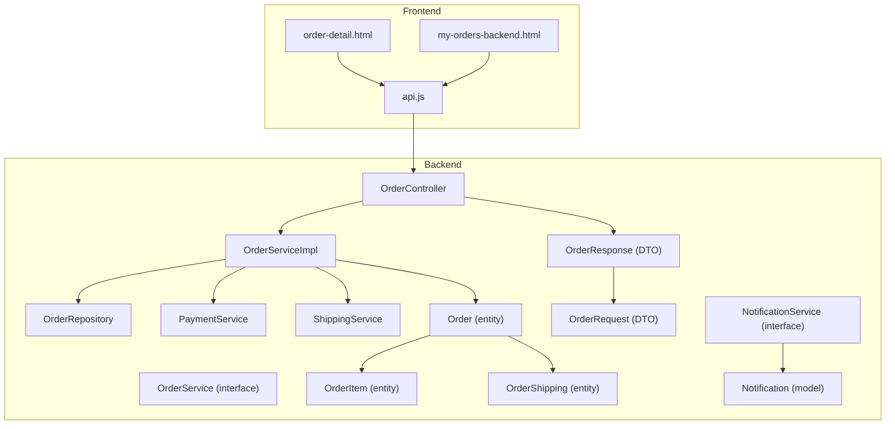

**Diagram sources**
- [OrderController.java:21-175](file://src/Backend/src/main/java/com/shoppeclone/backend/order/controller/OrderController.java#L21-L175)
- [OrderService.java:9-31](file://src/Backend/src/main/java/com/shoppeclone/backend/order/service/OrderService.java#L9-L31)
- [OrderServiceImpl.java:40-881](file://src/Backend/src/main/java/com/shoppeclone/backend/order/service/impl/OrderServiceImpl.java#L40-L881)
- [OrderRepository.java:8-25](file://src/Backend/src/main/java/com/shoppeclone/backend/order/repository/OrderRepository.java#L8-L25)
- [Order.java:12-55](file://src/Backend/src/main/java/com/shoppeclone/backend/order/entity/Order.java#L12-L55)
- [OrderItem.java:7-18](file://src/Backend/src/main/java/com/shoppeclone/backend/order/entity/OrderItem.java#L7-L18)
- [OrderShipping.java:9-18](file://src/Backend/src/main/java/com/shoppeclone/backend/order/entity/OrderShipping.java#L9-L18)
- [OrderRequest.java:8-95](file://src/Backend/src/main/java/com/shoppeclone/backend/order/dto/OrderRequest.java#L8-L95)
- [OrderResponse.java:18-113](file://src/Backend/src/main/java/com/shoppeclone/backend/order/dto/OrderResponse.java#L18-L113)
- [PaymentService.java:8-17](file://src/Backend/src/main/java/com/shoppeclone/backend/payment/service/PaymentService.java#L8-L17)
- [ShippingService.java:9-14](file://src/Backend/src/main/java/com/shoppeclone/backend/shipping/service/ShippingService.java#L9-L14)
- [Notification.java:12-31](file://src/Backend/src/main/java/com/shoppeclone/backend/user/model/Notification.java#L12-L31)
- [NotificationService.java:7-16](file://src/Backend/src/main/java/com/shoppeclone/backend/user/service/NotificationService.java#L7-L16)
- [api.js:82-135](file://src/Frontend/js/services/api.js#L82-L135)
- [order-detail.html:520-800](file://src/Frontend/order-detail.html#L520-L800)
- [my-orders-backend.html:213-347](file://src/Frontend/my-orders-backend.html#L213-L347)

**Section sources**
- [OrderController.java:21-175](file://src/Backend/src/main/java/com/shoppeclone/backend/order/controller/OrderController.java#L21-L175)
- [OrderServiceImpl.java:40-881](file://src/Backend/src/main/java/com/shoppeclone/backend/order/service/impl/OrderServiceImpl.java#L40-L881)
- [OrderRepository.java:8-25](file://src/Backend/src/main/java/com/shoppeclone/backend/order/repository/OrderRepository.java#L8-L25)
- [Order.java:12-55](file://src/Backend/src/main/java/com/shoppeclone/backend/order/entity/Order.java#L12-L55)
- [OrderItem.java:7-18](file://src/Backend/src/main/java/com/shoppeclone/backend/order/entity/OrderItem.java#L7-L18)
- [OrderShipping.java:9-18](file://src/Backend/src/main/java/com/shoppeclone/backend/order/entity/OrderShipping.java#L9-L18)
- [OrderRequest.java:8-95](file://src/Backend/src/main/java/com/shoppeclone/backend/order/dto/OrderRequest.java#L8-L95)
- [OrderResponse.java:18-113](file://src/Backend/src/main/java/com/shoppeclone/backend/order/dto/OrderResponse.java#L18-L113)
- [PaymentService.java:8-17](file://src/Backend/src/main/java/com/shoppeclone/backend/payment/service/PaymentService.java#L8-L17)
- [ShippingService.java:9-14](file://src/Backend/src/main/java/com/shoppeclone/backend/shipping/service/ShippingService.java#L9-L14)
- [Notification.java:12-31](file://src/Backend/src/main/java/com/shoppeclone/backend/user/model/Notification.java#L12-L31)
- [NotificationService.java:7-16](file://src/Backend/src/main/java/com/shoppeclone/backend/user/service/NotificationService.java#L7-L16)
- [api.js:82-135](file://src/Frontend/js/services/api.js#L82-L135)
- [order-detail.html:520-800](file://src/Frontend/order-detail.html#L520-L800)
- [my-orders-backend.html:213-347](file://src/Frontend/my-orders-backend.html#L213-L347)

## Core Components
- OrderController: Exposes REST endpoints for order creation, retrieval, cancellation, status updates, and shipment tracking updates. It enforces role-based access (customer vs seller) and enriches responses with review metadata.
- OrderServiceImpl: Implements order lifecycle logic including stock deduction, voucher application, shipping fee calculation, payment initiation, and status transitions with timestamps.
- Order entity and related DTOs: Define order structure, items, shipping, statuses, and response enrichment for UI.
- OrderRepository: MongoDB repository with queries for user orders, shop orders, and tracking code lookup.
- PaymentService and ShippingService: Integrations for payment creation/status and shipping fee calculation.
- Frontend API layer (api.js) and pages (my-orders-backend.html, order-detail.html): Provide order listing, detail view, timeline rendering, and actions (cancel, dispute, review).

**Section sources**
- [OrderController.java:37-172](file://src/Backend/src/main/java/com/shoppeclone/backend/order/controller/OrderController.java#L37-L172)
- [OrderServiceImpl.java:60-383](file://src/Backend/src/main/java/com/shoppeclone/backend/order/service/impl/OrderServiceImpl.java#L60-L383)
- [Order.java:16-55](file://src/Backend/src/main/java/com/shoppeclone/backend/order/entity/Order.java#L16-L55)
- [OrderResponse.java:22-113](file://src/Backend/src/main/java/com/shoppeclone/backend/order/dto/OrderResponse.java#L22-L113)
- [OrderRepository.java:8-25](file://src/Backend/src/main/java/com/shoppeclone/backend/order/repository/OrderRepository.java#L8-L25)
- [PaymentService.java:8-17](file://src/Backend/src/main/java/com/shoppeclone/backend/payment/service/PaymentService.java#L8-L17)
- [ShippingService.java:9-14](file://src/Backend/src/main/java/com/shoppeclone/backend/shipping/service/ShippingService.java#L9-L14)
- [api.js:82-135](file://src/Frontend/js/services/api.js#L82-L135)
- [my-orders-backend.html:213-347](file://src/Frontend/my-orders-backend.html#L213-L347)
- [order-detail.html:520-800](file://src/Frontend/order-detail.html#L520-L800)

## Architecture Overview
The system follows a layered architecture:
- Presentation layer: Frontend HTML/JS calls OrderAPI to retrieve and update orders.
- Application layer: OrderController handles requests, validates roles, and delegates to services.
- Domain and persistence: OrderServiceImpl orchestrates stock, discounts, shipping, and payments; persists via OrderRepository.

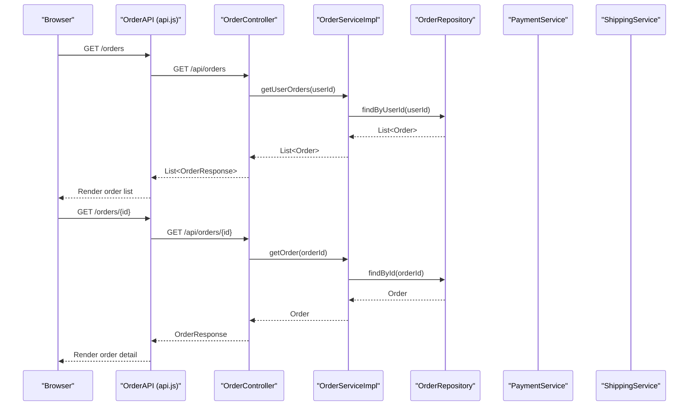

**Diagram sources**
- [OrderController.java:72-96](file://src/Backend/src/main/java/com/shoppeclone/backend/order/controller/OrderController.java#L72-L96)
- [OrderServiceImpl.java:548-583](file://src/Backend/src/main/java/com/shoppeclone/backend/order/service/impl/OrderServiceImpl.java#L548-L583)
- [OrderRepository.java:8-25](file://src/Backend/src/main/java/com/shoppeclone/backend/order/repository/OrderRepository.java#L8-L25)
- [api.js:93-107](file://src/Frontend/js/services/api.js#L93-L107)

## Detailed Component Analysis

### Order Lifecycle and Status Transitions
OrderStatus defines the canonical states. OrderServiceImpl manages transitions and timestamps:
- PENDING → CONFIRMED → PAID → SHIPPING → SHIPPED → COMPLETED
- CANCELLED and RETURNED are terminal states with associated logic for stock restoration and reasons.

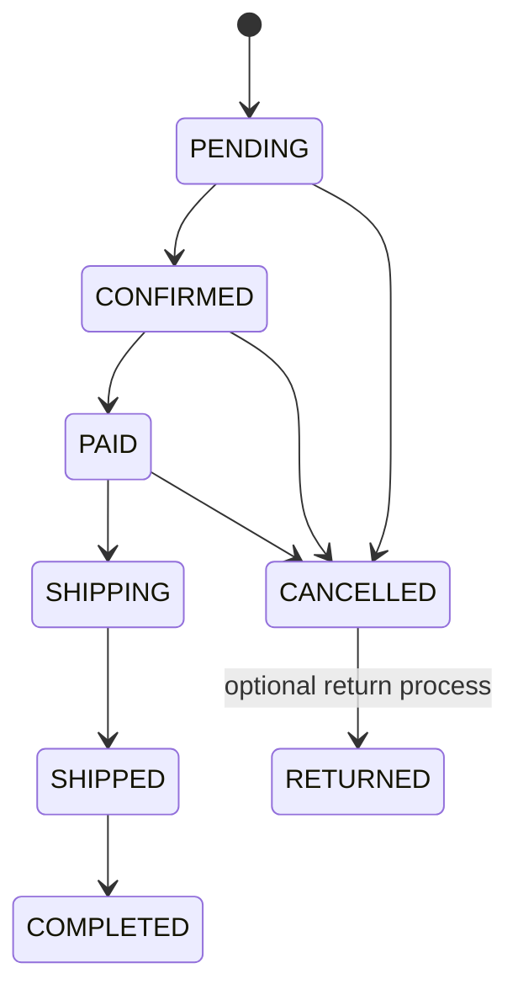

**Diagram sources**
- [OrderStatus.java:3-12](file://src/Backend/src/main/java/com/shoppeclone/backend/order/entity/OrderStatus.java#L3-L12)
- [OrderServiceImpl.java:618-652](file://src/Backend/src/main/java/com/shoppeclone/backend/order/service/impl/OrderServiceImpl.java#L618-L652)

**Section sources**
- [OrderStatus.java:3-12](file://src/Backend/src/main/java/com/shoppeclone/backend/order/entity/OrderStatus.java#L3-L12)
- [OrderServiceImpl.java:618-652](file://src/Backend/src/main/java/com/shoppeclone/backend/order/service/impl/OrderServiceImpl.java#L618-L652)

### Order Creation Workflow
Order creation supports two modes:
- Buy Now: Direct items passed in the request
- Cart-based: Items fetched from the user’s cart

Key steps:
- Resolve shipping address
- Validate items and stock
- Deduct stock and update flash sale sold counts
- Calculate discounts (product, shop, shipping)
- Compute shipping fee via ShippingService
- Persist order and initiate payment via PaymentService

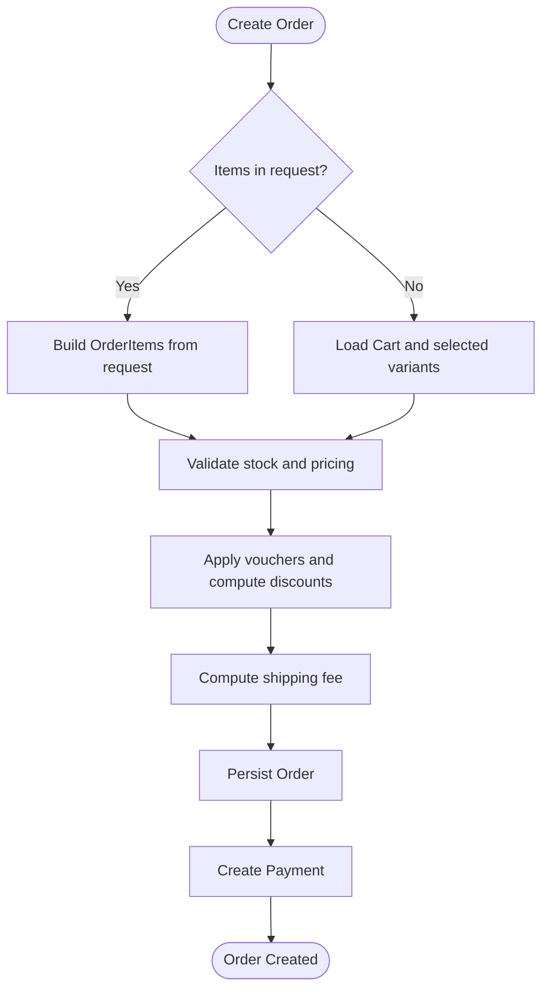

**Diagram sources**
- [OrderServiceImpl.java:60-189](file://src/Backend/src/main/java/com/shoppeclone/backend/order/service/impl/OrderServiceImpl.java#L60-L189)
- [OrderServiceImpl.java:290-383](file://src/Backend/src/main/java/com/shoppeclone/backend/order/service/impl/OrderServiceImpl.java#L290-L383)
- [OrderRequest.java:8-95](file://src/Backend/src/main/java/com/shoppeclone/backend/order/dto/OrderRequest.java#L8-L95)
- [Order.java:16-55](file://src/Backend/src/main/java/com/shoppeclone/backend/order/entity/Order.java#L16-L55)

**Section sources**
- [OrderServiceImpl.java:60-189](file://src/Backend/src/main/java/com/shoppeclone/backend/order/service/impl/OrderServiceImpl.java#L60-L189)
- [OrderServiceImpl.java:290-383](file://src/Backend/src/main/java/com/shoppeclone/backend/order/service/impl/OrderServiceImpl.java#L290-L383)
- [OrderRequest.java:8-95](file://src/Backend/src/main/java/com/shoppeclone/backend/order/dto/OrderRequest.java#L8-L95)
- [Order.java:16-55](file://src/Backend/src/main/java/com/shoppeclone/backend/order/entity/Order.java#L16-L55)

### Order Retrieval Endpoints
- Customer endpoints:
  - GET /api/orders: List all orders for the authenticated user
  - GET /api/orders/{orderId}: Retrieve a single order detail for the user
- Seller endpoints:
  - GET /api/orders/shop/{shopId}: Retrieve shop orders filtered by optional status
  - PUT /api/orders/{orderId}/status: Update order status (seller only)
  - PUT /api/orders/{orderId}/shipping: Update tracking code/provider (seller only)

Access control ensures only the order owner or the shop owner can access sensitive operations.

**Section sources**
- [OrderController.java:72-172](file://src/Backend/src/main/java/com/shoppeclone/backend/order/controller/OrderController.java#L72-L172)

### Delivery Coordination and Tracking Updates
- Sellers set tracking code and provider via PUT /api/orders/{orderId}/shipping
- When a tracking code is provided, the system auto-updates shipping status to SHIPPED and sets shippedAt
- OrderRepository supports lookup by tracking code for external integrations

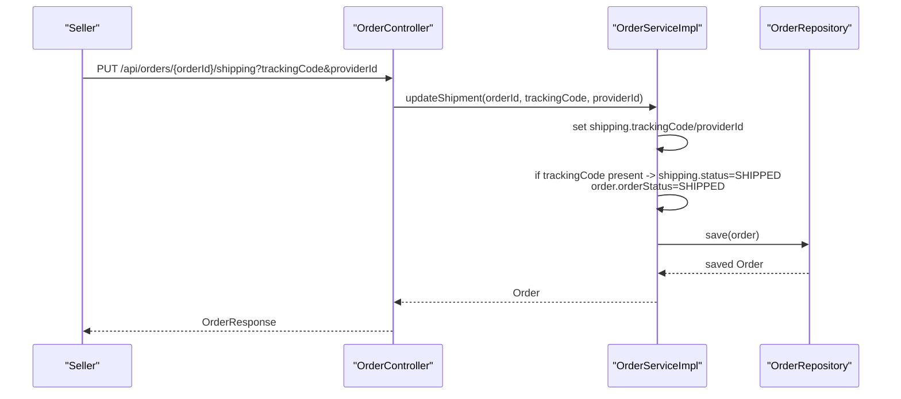

**Diagram sources**
- [OrderController.java:137-154](file://src/Backend/src/main/java/com/shoppeclone/backend/order/controller/OrderController.java#L137-L154)
- [OrderServiceImpl.java:681-710](file://src/Backend/src/main/java/com/shoppeclone/backend/order/service/impl/OrderServiceImpl.java#L681-L710)
- [OrderRepository.java:19-21](file://src/Backend/src/main/java/com/shoppeclone/backend/order/repository/OrderRepository.java#L19-L21)

**Section sources**
- [OrderController.java:137-154](file://src/Backend/src/main/java/com/shoppeclone/backend/order/controller/OrderController.java#L137-L154)
- [OrderServiceImpl.java:681-710](file://src/Backend/src/main/java/com/shoppeclone/backend/order/service/impl/OrderServiceImpl.java#L681-L710)
- [OrderRepository.java:19-21](file://src/Backend/src/main/java/com/shoppeclone/backend/order/repository/OrderRepository.java#L19-L21)

### Payment Integration for Real-Time Tracking
- On successful order creation, PaymentService is invoked to create a payment record linked to the order
- PaymentService exposes methods to create and update payment status
- Payment status is part of the order model and influences downstream workflows (e.g., PAID state)

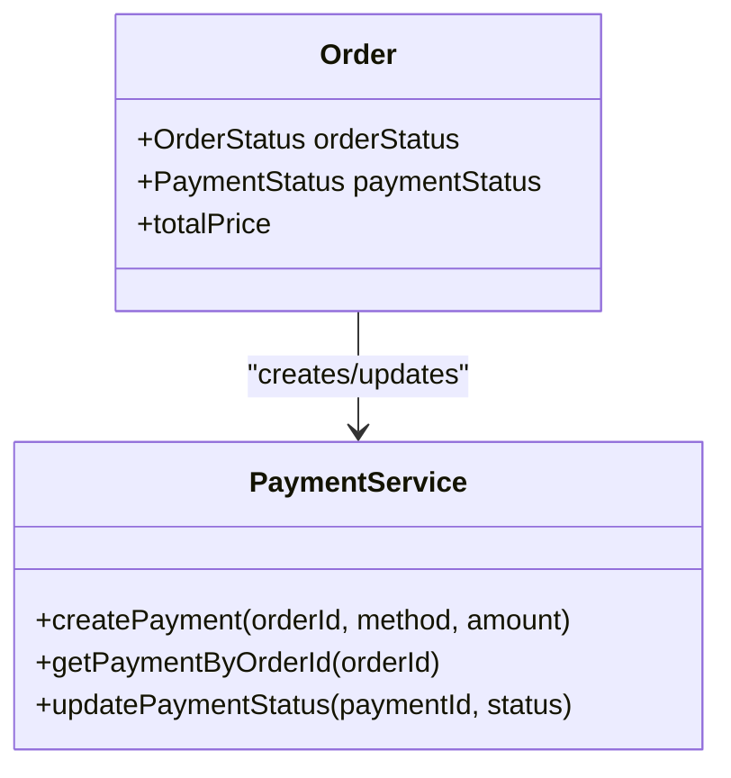

**Diagram sources**
- [Order.java:34-35](file://src/Backend/src/main/java/com/shoppeclone/backend/order/entity/Order.java#L34-L35)
- [PaymentService.java:8-17](file://src/Backend/src/main/java/com/shoppeclone/backend/payment/service/PaymentService.java#L8-L17)

**Section sources**
- [OrderServiceImpl.java:374-382](file://src/Backend/src/main/java/com/shoppeclone/backend/order/service/impl/OrderServiceImpl.java#L374-L382)
- [Order.java:34-35](file://src/Backend/src/main/java/com/shoppeclone/backend/order/entity/Order.java#L34-L35)
- [PaymentService.java:8-17](file://src/Backend/src/main/java/com/shoppeclone/backend/payment/service/PaymentService.java#L8-L17)

### Customer Notifications and Communication Patterns
- Notification model captures title, message, type (ORDER, SYSTEM, SECURITY), read status, and timestamps
- NotificationService interface provides methods to create notifications, list user notifications, and mark as read
- While the order domain does not directly emit notifications, NotificationService enables integrating order events (e.g., status changes) into the notification stream

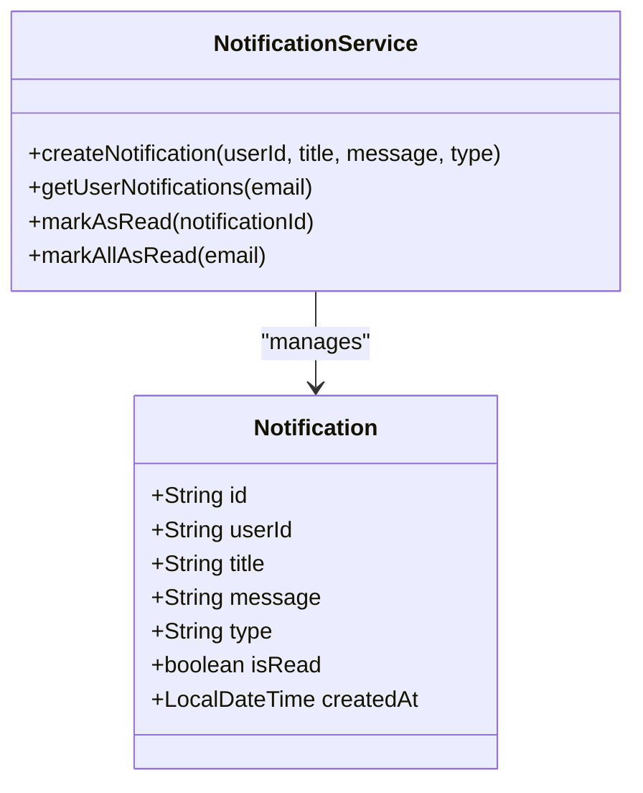

**Diagram sources**
- [Notification.java:12-31](file://src/Backend/src/main/java/com/shoppeclone/backend/user/model/Notification.java#L12-L31)
- [NotificationService.java:7-16](file://src/Backend/src/main/java/com/shoppeclone/backend/user/service/NotificationService.java#L7-L16)

**Section sources**
- [Notification.java:12-31](file://src/Backend/src/main/java/com/shoppeclone/backend/user/model/Notification.java#L12-L31)
- [NotificationService.java:7-16](file://src/Backend/src/main/java/com/shoppeclone/backend/user/service/NotificationService.java#L7-L16)

### Order Modification During Transit
- Orders can be canceled only if not in SHIPPING, SHIPPED, COMPLETED, or CANCELLED states
- Marking as returned restores stock and resolves the order to RETURNED
- Delivery failure can be recorded with a reason, restoring stock and resolving to CANCELLED

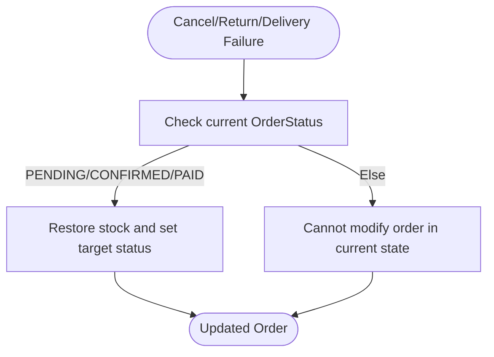

**Diagram sources**
- [OrderServiceImpl.java:654-680](file://src/Backend/src/main/java/com/shoppeclone/backend/order/service/impl/OrderServiceImpl.java#L654-L680)

**Section sources**
- [OrderServiceImpl.java:654-680](file://src/Backend/src/main/java/com/shoppeclone/backend/order/service/impl/OrderServiceImpl.java#L654-L680)

### Delivery Confirmation and Post-Delivery Support
- Delivery confirmation is represented by shipping status and timestamps; COMPLETED sets completedAt
- Post-delivery support includes disputes and refunds; UI surfaces actions based on eligibility windows and statuses

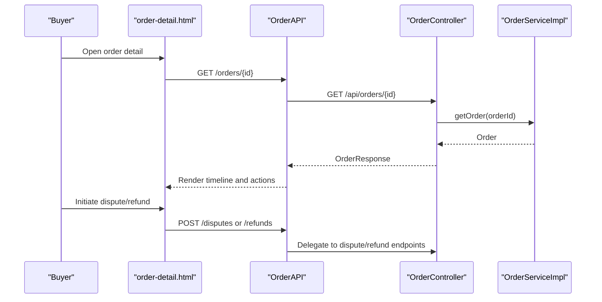

**Diagram sources**
- [order-detail.html:520-800](file://src/Frontend/order-detail.html#L520-L800)
- [OrderController.java:72-96](file://src/Backend/src/main/java/com/shoppeclone/backend/order/controller/OrderController.java#L72-L96)

**Section sources**
- [order-detail.html:520-800](file://src/Frontend/order-detail.html#L520-L800)
- [OrderServiceImpl.java:626-631](file://src/Backend/src/main/java/com/shoppeclone/backend/order/service/impl/OrderServiceImpl.java#L626-L631)

### Practical Examples: UI Integration
- Order list page (my-orders-backend.html):
  - Loads orders via OrderAPI.getOrders()
  - Renders status badges, cancellation buttons for cancellable states, and navigation to detail
- Order detail page (order-detail.html):
  - Loads a single order via OrderAPI.getOrderById()
  - Renders order timeline, summary, shipping address, and action buttons (cancel, dispute)
  - Integrates dispute and refund checks and displays outcomes

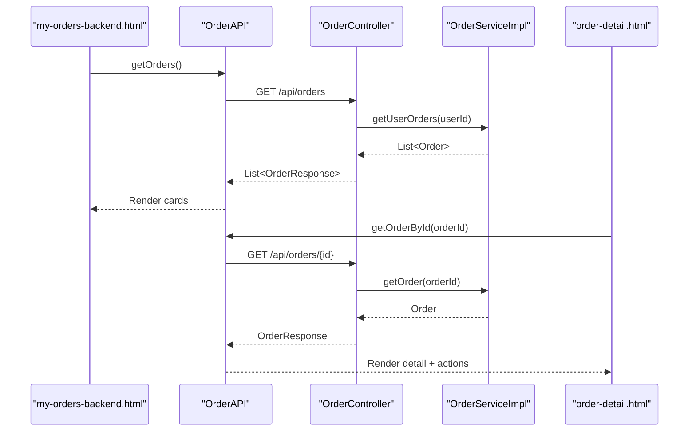

**Diagram sources**
- [my-orders-backend.html:213-347](file://src/Frontend/my-orders-backend.html#L213-L347)
- [order-detail.html:552-590](file://src/Frontend/order-detail.html#L552-L590)
- [OrderController.java:72-96](file://src/Backend/src/main/java/com/shoppeclone/backend/order/controller/OrderController.java#L72-L96)
- [OrderServiceImpl.java:548-583](file://src/Backend/src/main/java/com/shoppeclone/backend/order/service/impl/OrderServiceImpl.java#L548-L583)

**Section sources**
- [my-orders-backend.html:213-347](file://src/Frontend/my-orders-backend.html#L213-L347)
- [order-detail.html:552-590](file://src/Frontend/order-detail.html#L552-L590)
- [api.js:93-107](file://src/Frontend/js/services/api.js#L93-L107)

## Dependency Analysis
- Controllers depend on services and repositories
- Services orchestrate domain logic and integrate with external services (payment, shipping)
- Entities encapsulate state and relationships
- Frontend depends on backend APIs for order operations

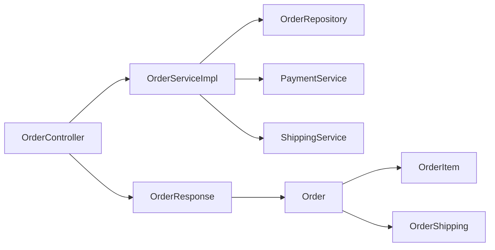

**Diagram sources**
- [OrderController.java:21-175](file://src/Backend/src/main/java/com/shoppeclone/backend/order/controller/OrderController.java#L21-L175)
- [OrderServiceImpl.java:40-881](file://src/Backend/src/main/java/com/shoppeclone/backend/order/service/impl/OrderServiceImpl.java#L40-L881)
- [OrderResponse.java:18-113](file://src/Backend/src/main/java/com/shoppeclone/backend/order/dto/OrderResponse.java#L18-L113)
- [Order.java:16-55](file://src/Backend/src/main/java/com/shoppeclone/backend/order/entity/Order.java#L16-L55)
- [OrderItem.java:7-18](file://src/Backend/src/main/java/com/shoppeclone/backend/order/entity/OrderItem.java#L7-L18)
- [OrderShipping.java:9-18](file://src/Backend/src/main/java/com/shoppeclone/backend/order/entity/OrderShipping.java#L9-L18)

**Section sources**
- [OrderController.java:21-175](file://src/Backend/src/main/java/com/shoppeclone/backend/order/controller/OrderController.java#L21-L175)
- [OrderServiceImpl.java:40-881](file://src/Backend/src/main/java/com/shoppeclone/backend/order/service/impl/OrderServiceImpl.java#L40-L881)
- [OrderResponse.java:18-113](file://src/Backend/src/main/java/com/shoppeclone/backend/order/dto/OrderResponse.java#L18-L113)
- [Order.java:16-55](file://src/Backend/src/main/java/com/shoppeclone/backend/order/entity/Order.java#L16-L55)
- [OrderItem.java:7-18](file://src/Backend/src/main/java/com/shoppeclone/backend/order/entity/OrderItem.java#L7-L18)
- [OrderShipping.java:9-18](file://src/Backend/src/main/java/com/shoppeclone/backend/order/entity/OrderShipping.java#L9-L18)

## Performance Considerations
- Sorting orders by creation time (newest first) reduces UI scanning overhead
- Using repository queries for tracking code enables efficient external tracking integrations
- Minimizing repeated stock updates and ensuring atomic transactions prevents race conditions
- Applying discounts and shipping calculations in a single pass reduces redundant computations

[No sources needed since this section provides general guidance]

## Troubleshooting Guide
Common issues and resolutions:
- Serialization failures during order creation: The controller logs serialization errors and throws exceptions; verify OrderResponse serialization and Jackson configuration
- Order not found: Repository throws exceptions for missing orders; ensure correct orderId and authentication
- Voucher validation errors: Voucher processing enforces type, category restrictions, min spend, and expiry; confirm voucher eligibility and usage limits
- Cannot cancel order: Certain states prevent cancellation; verify current order status before attempting cancellation
- Tracking code updates: Ensure tracking code presence triggers shipping status and timestamps; verify providerId and trackingCode parameters

**Section sources**
- [OrderController.java:42-69](file://src/Backend/src/main/java/com/shoppeclone/backend/order/controller/OrderController.java#L42-L69)
- [OrderServiceImpl.java:385-444](file://src/Backend/src/main/java/com/shoppeclone/backend/order/service/impl/OrderServiceImpl.java#L385-L444)
- [OrderServiceImpl.java:654-664](file://src/Backend/src/main/java/com/shoppeclone/backend/order/service/impl/OrderServiceImpl.java#L654-L664)
- [OrderServiceImpl.java:681-710](file://src/Backend/src/main/java/com/shoppeclone/backend/order/service/impl/OrderServiceImpl.java#L681-L710)

## Conclusion
The order tracking and fulfillment system integrates order lifecycle management, shipping, and payments with a robust set of endpoints and UI pages. It supports customer and seller workflows, real-time tracking updates, and post-delivery support through disputes and refunds. The modular design and clear separation of concerns enable maintainability and extensibility.

[No sources needed since this section summarizes without analyzing specific files]

## Appendices

### API Reference Summary
- Customer
  - GET /api/orders
  - GET /api/orders/{orderId}
- Seller
  - GET /api/orders/shop/{shopId}?status={status}
  - PUT /api/orders/{orderId}/status?status={OrderStatus}
  - PUT /api/orders/{orderId}/shipping?trackingCode&providerId
  - DELETE /api/orders (clears user orders)

**Section sources**
- [OrderController.java:72-172](file://src/Backend/src/main/java/com/shoppeclone/backend/order/controller/OrderController.java#L72-L172)