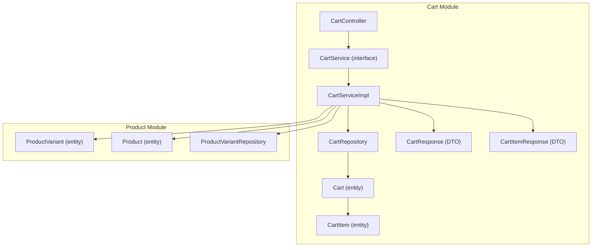
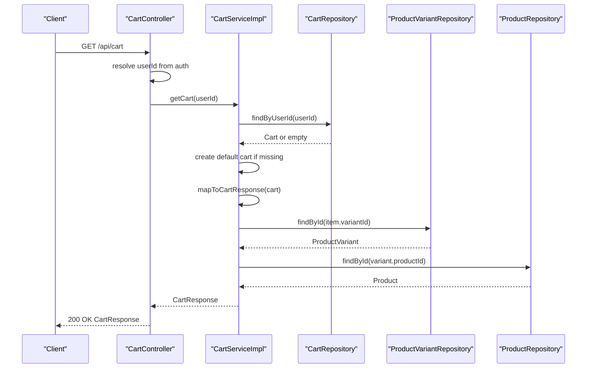
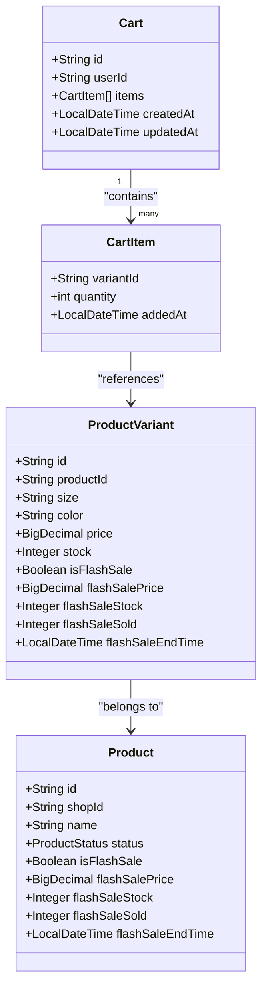
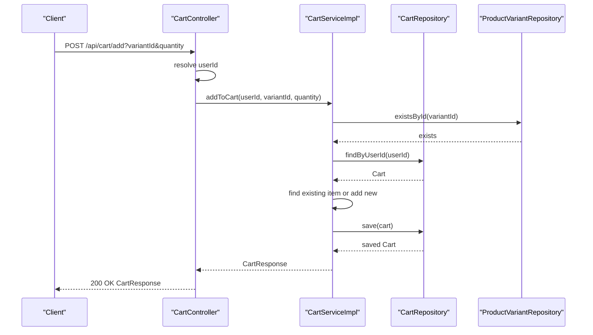
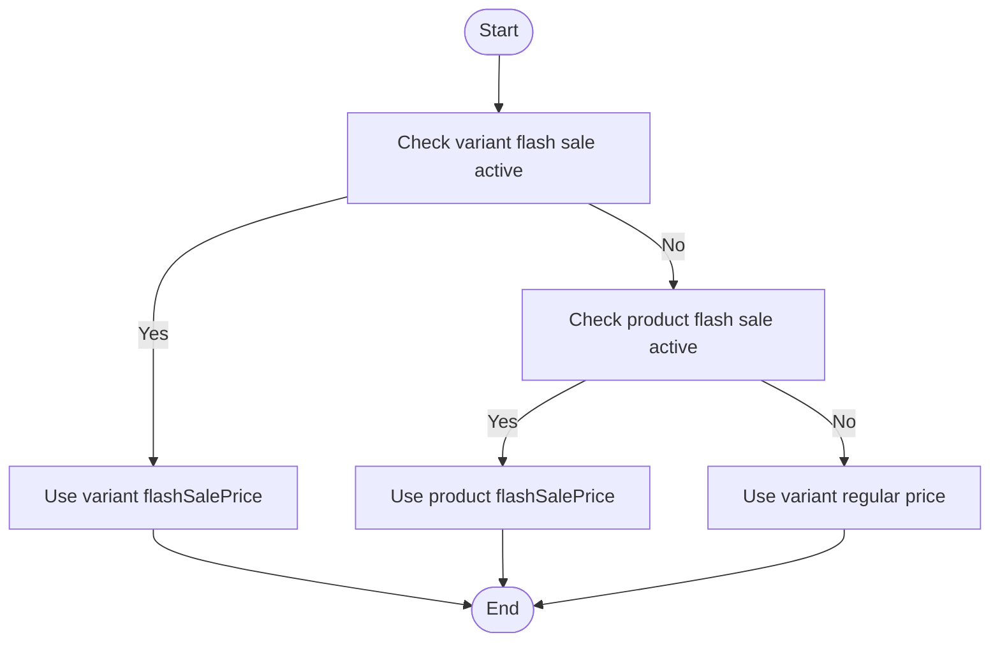
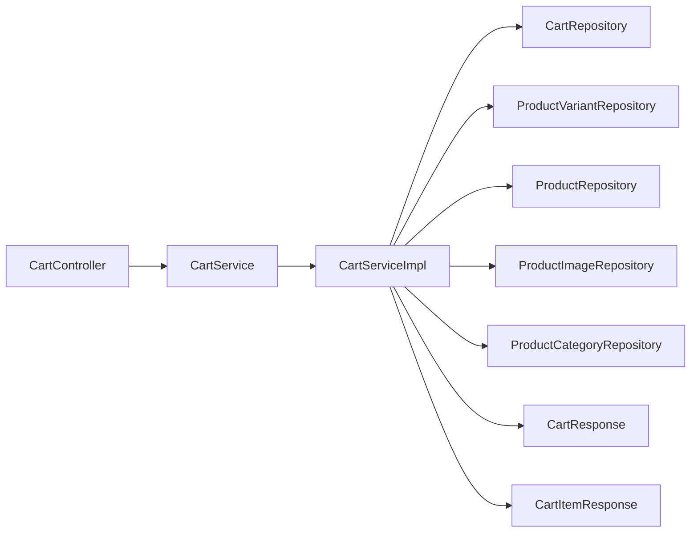

# Shopping Cart Management

<cite>
**Referenced Files in This Document**
- [CartController.java](file://src/Backend/src/main/java/com/shoppeclone/backend/cart/controller/CartController.java)
- [CartService.java](file://src/Backend/src/main/java/com/shoppeclone/backend/cart/service/CartService.java)
- [CartServiceImpl.java](file://src/Backend/src/main/java/com/shoppeclone/backend/cart/service/impl/CartServiceImpl.java)
- [Cart.java](file://src/Backend/src/main/java/com/shoppeclone/backend/cart/entity/Cart.java)
- [CartItem.java](file://src/Backend/src/main/java/com/shoppeclone/backend/cart/entity/CartItem.java)
- [CartRepository.java](file://src/Backend/src/main/java/com/shoppeclone/backend/cart/repository/CartRepository.java)
- [CartResponse.java](file://src/Backend/src/main/java/com/shoppeclone/backend/cart/dto/CartResponse.java)
- [CartItemResponse.java](file://src/Backend/src/main/java/com/shoppeclone/backend/cart/dto/CartItemResponse.java)
- [ProductVariant.java](file://src/Backend/src/main/java/com/shoppeclone/backend/product/entity/ProductVariant.java)
- [Product.java](file://src/Backend/src/main/java/com/shoppeclone/backend/product/entity/Product.java)
- [ProductVariantRepository.java](file://src/Backend/src/main/java/com/shoppeclone/backend/product/repository/ProductVariantRepository.java)
- [GlobalExceptionHandler.java](file://src/Backend/src/main/java/com/shoppeclone/backend/common/exception/GlobalExceptionHandler.java)
- [api.js](file://src/Backend/src/main/resources/static/js/services/api.js)
</cite>

## Table of Contents
1. [Introduction](#introduction)
2. [Project Structure](#project-structure)
3. [Core Components](#core-components)
4. [Architecture Overview](#architecture-overview)
5. [Detailed Component Analysis](#detailed-component-analysis)
6. [Dependency Analysis](#dependency-analysis)
7. [Performance Considerations](#performance-considerations)
8. [Troubleshooting Guide](#troubleshooting-guide)
9. [Conclusion](#conclusion)

## Introduction
This document explains the shopping cart management system, focusing on cart persistence, item lifecycle, and user session handling. It documents the cart controller endpoints, the cart service implementation, business logic for quantity validation, stock checking, and price calculations, and the relationships between carts, products, and variants. Practical examples, error handling, concurrency considerations, and performance optimization strategies are included to help developers implement robust cart functionality.

## Project Structure
The cart module follows a layered architecture:
- Controller layer exposes REST endpoints for cart operations
- Service layer encapsulates business logic and orchestrates repositories
- Repository layer persists and queries cart data
- DTOs define API responses and request payloads
- Entities represent persisted models

**Diagram sources**
- [CartController.java:1-66](file://src/Backend/src/main/java/com/shoppeclone/backend/cart/controller/CartController.java#L1-66)
- [CartService.java:1-16](file://src/Backend/src/main/java/com/shoppeclone/backend/cart/service/CartService.java#L1-16)
- [CartServiceImpl.java:1-240](file://src/Backend/src/main/java/com/shoppeclone/backend/cart/service/impl/CartServiceImpl.java#L1-240)
- [CartRepository.java:1-10](file://src/Backend/src/main/java/com/shoppeclone/backend/cart/repository/CartRepository.java#L1-10)
- [Cart.java:1-25](file://src/Backend/src/main/java/com/shoppeclone/backend/cart/entity/Cart.java#L1-25)
- [CartItem.java:1-12](file://src/Backend/src/main/java/com/shoppeclone/backend/cart/entity/CartItem.java#L1-12)
- [CartResponse.java:1-21](file://src/Backend/src/main/java/com/shoppeclone/backend/cart/dto/CartResponse.java#L1-21)
- [CartItemResponse.java:1-29](file://src/Backend/src/main/java/com/shoppeclone/backend/cart/dto/CartItemResponse.java#L1-29)
- [ProductVariant.java:1-37](file://src/Backend/src/main/java/com/shoppeclone/backend/product/entity/ProductVariant.java#L1-37)
- [Product.java:1-51](file://src/Backend/src/main/java/com/shoppeclone/backend/product/entity/Product.java#L1-51)
- [ProductVariantRepository.java:1-23](file://src/Backend/src/main/java/com/shoppeclone/backend/product/repository/ProductVariantRepository.java#L1-23)

**Section sources**
- [CartController.java:1-66](file://src/Backend/src/main/java/com/shoppeclone/backend/cart/controller/CartController.java#L1-66)
- [CartService.java:1-16](file://src/Backend/src/main/java/com/shoppeclone/backend/cart/service/CartService.java#L1-16)
- [CartServiceImpl.java:1-240](file://src/Backend/src/main/java/com/shoppeclone/backend/cart/service/impl/CartServiceImpl.java#L1-240)
- [CartRepository.java:1-10](file://src/Backend/src/main/java/com/shoppeclone/backend/cart/repository/CartRepository.java#L1-10)
- [Cart.java:1-25](file://src/Backend/src/main/java/com/shoppeclone/backend/cart/entity/Cart.java#L1-25)
- [CartItem.java:1-12](file://src/Backend/src/main/java/com/shoppeclone/backend/cart/entity/CartItem.java#L1-12)
- [CartResponse.java:1-21](file://src/Backend/src/main/java/com/shoppeclone/backend/cart/dto/CartResponse.java#L1-21)
- [CartItemResponse.java:1-29](file://src/Backend/src/main/java/com/shoppeclone/backend/cart/dto/CartItemResponse.java#L1-29)
- [ProductVariant.java:1-37](file://src/Backend/src/main/java/com/shoppeclone/backend/product/entity/ProductVariant.java#L1-37)
- [Product.java:1-51](file://src/Backend/src/main/java/com/shoppeclone/backend/product/entity/Product.java#L1-51)
- [ProductVariantRepository.java:1-23](file://src/Backend/src/main/java/com/shoppeclone/backend/product/repository/ProductVariantRepository.java#L1-23)

## Core Components
- CartController: Exposes REST endpoints for cart operations and delegates to CartService. It resolves the authenticated user’s ID from the security context and ensures requests are authenticated.
- CartService: Defines the contract for cart operations (get, add, update, remove, clear).
- CartServiceImpl: Implements business logic for cart operations, including persistence, item updates, and response mapping. It validates variant existence and computes derived fields like total price.
- Cart/CartItem: Persisted entities representing the cart and individual items.
- CartRepository: Provides MongoDB operations for cart retrieval by user ID.
- DTOs: CartResponse and CartItemResponse define the API surface for cart data transfer, including pricing and inventory metadata.

Key responsibilities:
- Persistence: CartRepository persists per-user carts; CartServiceImpl lazily creates a cart if none exists.
- Item management: Add, update, remove, and clear operations maintain item quantities and timestamps.
- Price calculation: Unit price resolution considers flash sale pricing when applicable; total price aggregates per-item totals.

**Section sources**
- [CartController.java:27-64](file://src/Backend/src/main/java/com/shoppeclone/backend/cart/controller/CartController.java#L27-L64)
- [CartService.java:5-15](file://src/Backend/src/main/java/com/shoppeclone/backend/cart/service/CartService.java#L5-L15)
- [CartServiceImpl.java:38-122](file://src/Backend/src/main/java/com/shoppeclone/backend/cart/service/impl/CartServiceImpl.java#L38-L122)
- [CartRepository.java:7-9](file://src/Backend/src/main/java/com/shoppeclone/backend/cart/repository/CartRepository.java#L7-L9)
- [Cart.java:11-24](file://src/Backend/src/main/java/com/shoppeclone/backend/cart/entity/Cart.java#L11-L24)
- [CartItem.java:7-11](file://src/Backend/src/main/java/com/shoppeclone/backend/cart/entity/CartItem.java#L7-L11)
- [CartResponse.java:15-20](file://src/Backend/src/main/java/com/shoppeclone/backend/cart/dto/CartResponse.java#L15-L20)
- [CartItemResponse.java:15-28](file://src/Backend/src/main/java/com/shoppeclone/backend/cart/dto/CartItemResponse.java#L15-L28)

## Architecture Overview
The cart subsystem integrates with product data to enrich cart items with product metadata, pricing, and stock. The service layer coordinates repositories and constructs responses.

**Diagram sources**
- [CartController.java:27-31](file://src/Backend/src/main/java/com/shoppeclone/backend/cart/controller/CartController.java#L27-L31)
- [CartServiceImpl.java:38-47](file://src/Backend/src/main/java/com/shoppeclone/backend/cart/service/impl/CartServiceImpl.java#L38-L47)
- [CartRepository.java:7-9](file://src/Backend/src/main/java/com/shoppeclone/backend/cart/repository/CartRepository.java#L7-L9)
- [CartServiceImpl.java:222-238](file://src/Backend/src/main/java/com/shoppeclone/backend/cart/service/impl/CartServiceImpl.java#L222-L238)
- [ProductVariantRepository.java:8-11](file://src/Backend/src/main/java/com/shoppeclone/backend/product/repository/ProductVariantRepository.java#L8-L11)
- [Product.java:13-14](file://src/Backend/src/main/java/com/shoppeclone/backend/product/entity/Product.java#L13-L14)

## Detailed Component Analysis

### Cart Controller Endpoints
- GET /api/cart: Returns the current user’s cart as a CartResponse.
- POST /api/cart/add: Adds a product variant to the cart with a specified quantity.
- PUT /api/cart/update: Updates the quantity of an existing cart item; zero or negative quantity removes the item.
- DELETE /api/cart/remove: Removes a specific variant from the cart.
- DELETE /api/cart/clear: Empties the cart for the current user.

User session handling:
- AuthenticationPrincipal is used to extract the current user’s details.
- The controller resolves the user ID from the database using the authenticated email.

Practical examples:
- Adding an item: POST /api/cart/add?variantId=<variantId>&quantity=<qty>
- Updating quantity: PUT /api/cart/update?variantId=<variantId>&quantity=<qty>
- Removing an item: DELETE /api/cart/remove?variantId=<variantId>
- Clearing cart: DELETE /api/cart/clear

Error handling:
- Missing user or invalid cart state triggers runtime exceptions handled by the global exception handler.

**Section sources**
- [CartController.java:27-64](file://src/Backend/src/main/java/com/shoppeclone/backend/cart/controller/CartController.java#L27-L64)
- [GlobalExceptionHandler.java:72-82](file://src/Backend/src/main/java/com/shoppeclone/backend/common/exception/GlobalExceptionHandler.java#L72-L82)

### Cart Service Implementation
Business logic highlights:
- Variant existence validation: Ensures the requested variant exists before adding to cart.
- Lazy cart creation: Creates a default cart if none exists for the user.
- Quantity updates: Increments quantity if the variant already exists; otherwise adds a new item.
- Timestamp updates: Sets updatedAt on cart modifications.
- Response mapping: Builds CartItemResponse with product metadata, pricing, and stock.

Price calculation:
- resolveCartItemPrice selects the appropriate price considering flash sale conditions at both product and variant levels.
- mapToCartResponse computes total price by summing item totals.

Stock checking:
- CartItemResponse exposes stock from ProductVariant, enabling UI and service-level checks.

Concurrency considerations:
- Transactional boundaries protect cart updates.
- No explicit optimistic/pessimistic locking is present; consider database-level uniqueness and atomic updates for high contention.

Cleanup strategies:
- clearCart removes all items while preserving the cart record.
- Consider periodic cleanup of carts without recent activity if needed.

**Section sources**
- [CartServiceImpl.java:49-80](file://src/Backend/src/main/java/com/shoppeclone/backend/cart/service/impl/CartServiceImpl.java#L49-L80)
- [CartServiceImpl.java:82-100](file://src/Backend/src/main/java/com/shoppeclone/backend/cart/service/impl/CartServiceImpl.java#L82-L100)
- [CartServiceImpl.java:102-112](file://src/Backend/src/main/java/com/shoppeclone/backend/cart/service/impl/CartServiceImpl.java#L102-L112)
- [CartServiceImpl.java:114-122](file://src/Backend/src/main/java/com/shoppeclone/backend/cart/service/impl/CartServiceImpl.java#L114-L122)
- [CartServiceImpl.java:168-180](file://src/Backend/src/main/java/com/shoppeclone/backend/cart/service/impl/CartServiceImpl.java#L168-L180)
- [CartServiceImpl.java:222-238](file://src/Backend/src/main/java/com/shoppeclone/backend/cart/service/impl/CartServiceImpl.java#L222-L238)

### Entity Relationships
Cart and items:
- Cart has a unique user ID and a list of CartItem entries.
- CartItem holds variantId and quantity with an added timestamp.

Product and variant enrichment:
- CartItemResponse derives product name, images, category IDs, shop ID, and variant name from Product and ProductVariant.
- Stock and pricing are sourced from ProductVariant and Product, with flash sale overrides considered.

**Diagram sources**
- [Cart.java:13-24](file://src/Backend/src/main/java/com/shoppeclone/backend/cart/entity/Cart.java#L13-L24)
- [CartItem.java:7-11](file://src/Backend/src/main/java/com/shoppeclone/backend/cart/entity/CartItem.java#L7-L11)
- [ProductVariant.java:12-36](file://src/Backend/src/main/java/com/shoppeclone/backend/product/entity/ProductVariant.java#L12-L36)
- [Product.java:13-49](file://src/Backend/src/main/java/com/shoppeclone/backend/product/entity/Product.java#L13-L49)

**Section sources**
- [Cart.java:11-24](file://src/Backend/src/main/java/com/shoppeclone/backend/cart/entity/Cart.java#L11-L24)
- [CartItem.java:7-11](file://src/Backend/src/main/java/com/shoppeclone/backend/cart/entity/CartItem.java#L7-L11)
- [ProductVariant.java:10-36](file://src/Backend/src/main/java/com/shoppeclone/backend/product/entity/ProductVariant.java#L10-L36)
- [Product.java:10-49](file://src/Backend/src/main/java/com/shoppeclone/backend/product/entity/Product.java#L10-L49)

### API Workflow: Add to Cart

**Diagram sources**
- [CartController.java:33-40](file://src/Backend/src/main/java/com/shoppeclone/backend/cart/controller/CartController.java#L33-L40)
- [CartServiceImpl.java:50-80](file://src/Backend/src/main/java/com/shoppeclone/backend/cart/service/impl/CartServiceImpl.java#L50-L80)
- [ProductVariantRepository.java:8-11](file://src/Backend/src/main/java/com/shoppeclone/backend/product/repository/ProductVariantRepository.java#L8-L11)
- [CartRepository.java:7-9](file://src/Backend/src/main/java/com/shoppeclone/backend/cart/repository/CartRepository.java#L7-L9)

**Section sources**
- [CartController.java:33-40](file://src/Backend/src/main/java/com/shoppeclone/backend/cart/controller/CartController.java#L33-L40)
- [CartServiceImpl.java:50-80](file://src/Backend/src/main/java/com/shoppeclone/backend/cart/service/impl/CartServiceImpl.java#L50-L80)

### Algorithm: Price Resolution

**Diagram sources**
- [CartServiceImpl.java:168-180](file://src/Backend/src/main/java/com/shoppeclone/backend/cart/service/impl/CartServiceImpl.java#L168-L180)
- [CartServiceImpl.java:182-200](file://src/Backend/src/main/java/com/shoppeclone/backend/cart/service/impl/CartServiceImpl.java#L182-L200)
- [CartServiceImpl.java:202-220](file://src/Backend/src/main/java/com/shoppeclone/backend/cart/service/impl/CartServiceImpl.java#L202-L220)

**Section sources**
- [CartServiceImpl.java:168-180](file://src/Backend/src/main/java/com/shoppeclone/backend/cart/service/impl/CartServiceImpl.java#L168-L180)
- [CartServiceImpl.java:182-200](file://src/Backend/src/main/java/com/shoppeclone/backend/cart/service/impl/CartServiceImpl.java#L182-L200)
- [CartServiceImpl.java:202-220](file://src/Backend/src/main/java/com/shoppeclone/backend/cart/service/impl/CartServiceImpl.java#L202-L220)

## Dependency Analysis
- CartController depends on CartService and UserRepository to resolve the current user.
- CartServiceImpl depends on CartRepository, ProductVariantRepository, ProductRepository, ProductImageRepository, and ProductCategoryRepository to enrich cart items.
- DTOs decouple persistence entities from API responses.

**Diagram sources**
- [CartController.java:18-19](file://src/Backend/src/main/java/com/shoppeclone/backend/cart/controller/CartController.java#L18-L19)
- [CartServiceImpl.java:32-36](file://src/Backend/src/main/java/com/shoppeclone/backend/cart/service/impl/CartServiceImpl.java#L32-L36)
- [CartResponse.java:15-20](file://src/Backend/src/main/java/com/shoppeclone/backend/cart/dto/CartResponse.java#L15-L20)
- [CartItemResponse.java:15-28](file://src/Backend/src/main/java/com/shoppeclone/backend/cart/dto/CartItemResponse.java#L15-L28)

**Section sources**
- [CartController.java:18-19](file://src/Backend/src/main/java/com/shoppeclone/backend/cart/controller/CartController.java#L18-L19)
- [CartServiceImpl.java:32-36](file://src/Backend/src/main/java/com/shoppeclone/backend/cart/service/impl/CartServiceImpl.java#L32-L36)

## Performance Considerations
- Minimize round trips: CartServiceImpl already batches reads by item and variant IDs; keep this pattern to reduce repository calls.
- Indexing: Ensure Cart.userId is indexed (already annotated as unique index) and consider indexing CartItem.variantId for frequent lookups.
- DTO projection: Avoid loading unnecessary fields; CartItemResponse already includes only required fields.
- Pagination and limits: If carts grow very large, consider pagination or item limits.
- Caching: Cache frequently accessed product metadata (e.g., images, categories) at the service level to reduce repeated repository queries.
- Asynchronous enrichment: For high throughput, consider asynchronous enrichment of cart items to avoid blocking requests.

[No sources needed since this section provides general guidance]

## Troubleshooting Guide
Common issues and resolutions:
- Variant not found when adding to cart: The service throws a runtime exception if the variant does not exist. Verify the variantId and that the variant is active.
- Cart not found during update/remove/clear: The service throws a runtime exception if the cart does not exist for the user. Ensure the user is authenticated and the cart was created earlier.
- Global exception handling: The global exception handler converts runtime exceptions to standardized error responses with appropriate HTTP status codes.

Frontend integration tips:
- Use the CartAPI helper to call cart endpoints; ensure Authorization headers are included.
- Handle empty cart responses gracefully in the UI.

**Section sources**
- [CartServiceImpl.java:52-54](file://src/Backend/src/main/java/com/shoppeclone/backend/cart/service/impl/CartServiceImpl.java#L52-L54)
- [CartServiceImpl.java:84-86](file://src/Backend/src/main/java/com/shoppeclone/backend/cart/service/impl/CartServiceImpl.java#L84-L86)
- [CartServiceImpl.java:105-106](file://src/Backend/src/main/java/com/shoppeclone/backend/cart/service/impl/CartServiceImpl.java#L105-L106)
- [GlobalExceptionHandler.java:72-82](file://src/Backend/src/main/java/com/shoppeclone/backend/common/exception/GlobalExceptionHandler.java#L72-L82)
- [api.js:33-40](file://src/Backend/src/main/resources/static/js/services/api.js#L33-L40)

## Conclusion
The cart management system provides a clear separation of concerns with a RESTful controller, a transactional service layer, and MongoDB-backed persistence. It enriches cart items with product metadata, supports flash sale pricing, and offers straightforward endpoints for managing cart state. By following the outlined best practices—such as minimizing repository calls, leveraging DTOs, and handling errors centrally—you can ensure reliable and performant cart operations under typical and high-concurrency workloads.