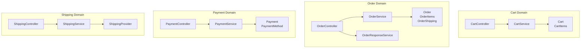
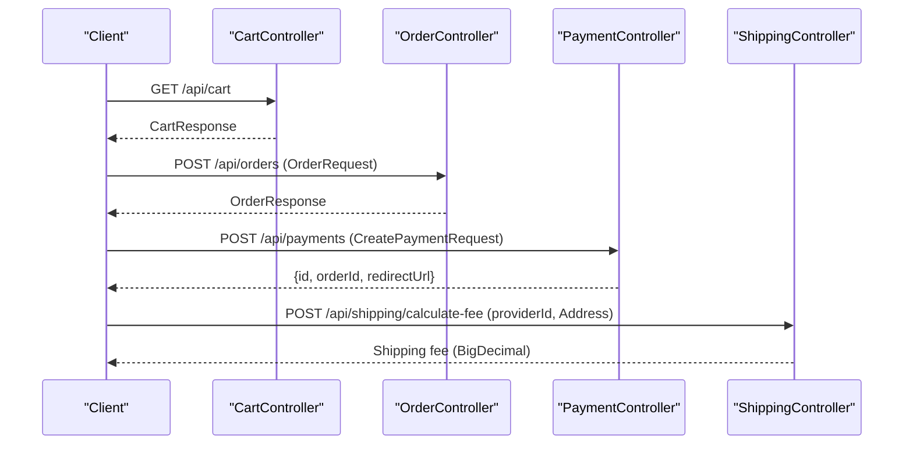
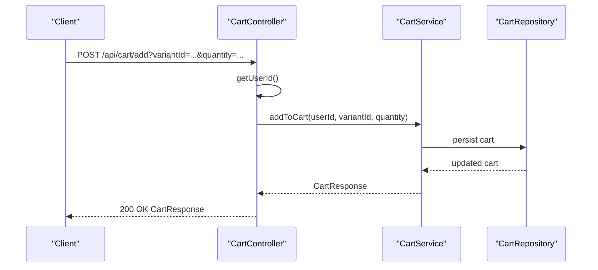
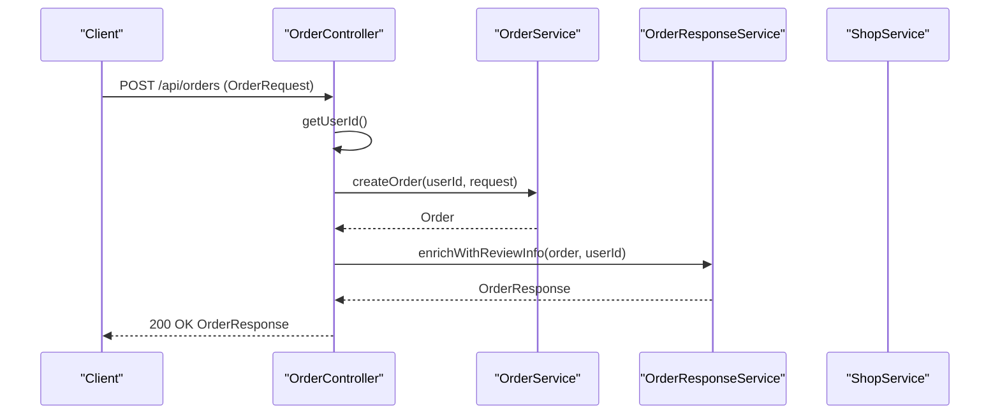
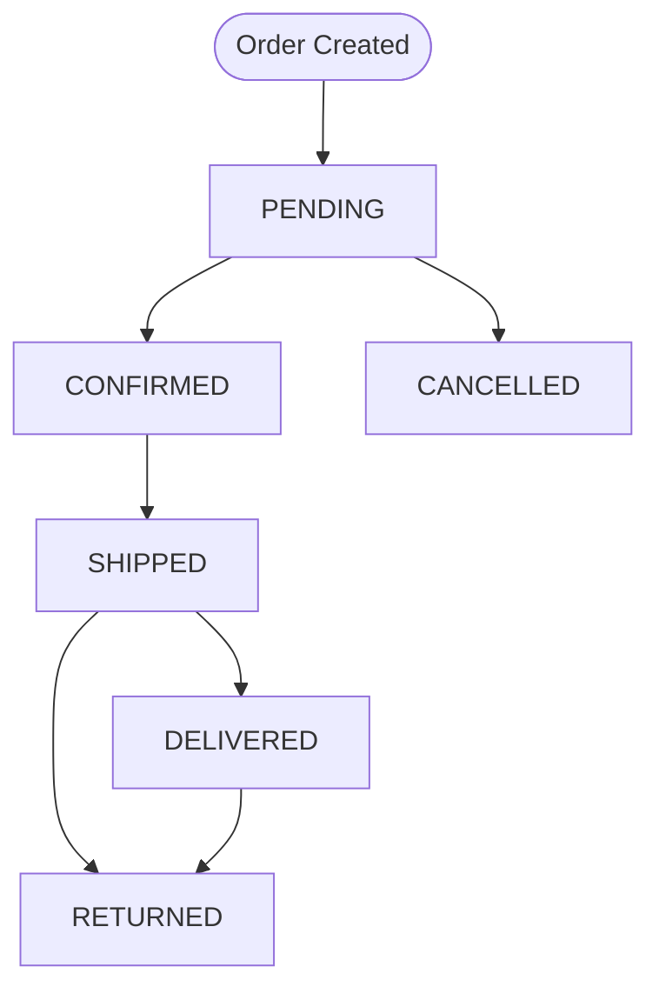
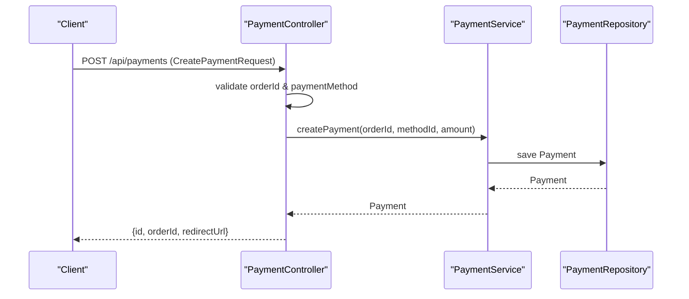
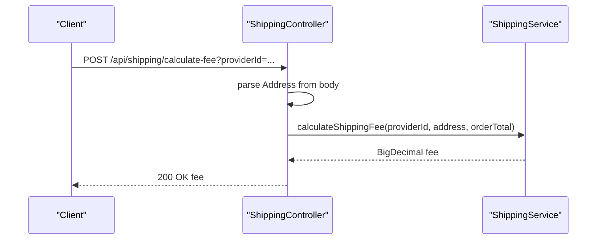
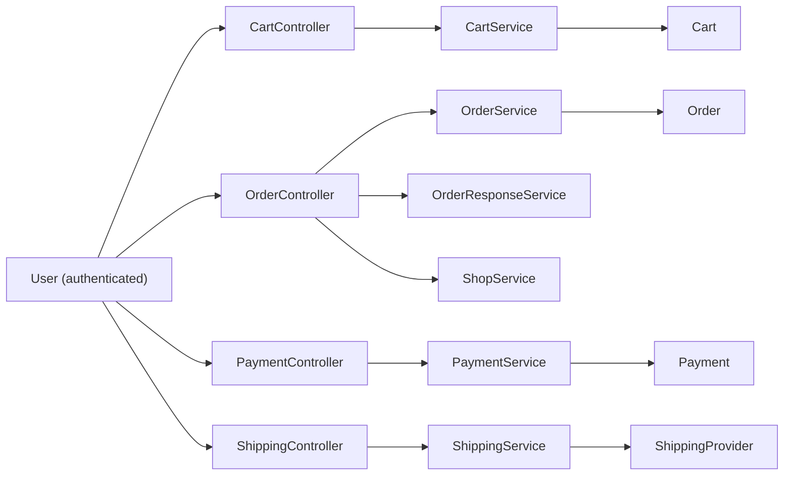

# Shopping Experience System

<cite>
**Referenced Files in This Document**
- [CartController.java](file://src/backend/src/main/java/com/shoppeclone/backend/cart/controller/CartController.java)
- [CartService.java](file://src/backend/src/main/java/com/shoppeclone/backend/cart/service/CartService.java)
- [Cart.java](file://src/backend/src/main/java/com/shoppeclone/backend/cart/entity/Cart.java)
- [OrderController.java](file://src/backend/src/main/java/com/shoppeclone/backend/order/controller/OrderController.java)
- [OrderService.java](file://src/backend/src/main/java/com/shoppeclone/backend/order/service/OrderService.java)
- [Order.java](file://src/backend/src/main/java/com/shoppeclone/backend/order/entity/Order.java)
- [OrderStatus.java](file://src/backend/src/main/java/com/shoppeclone/backend/order/entity/OrderStatus.java)
- [PaymentController.java](file://src/backend/src/main/java/com/shoppeclone/backend/payment/controller/PaymentController.java)
- [PaymentService.java](file://src/backend/src/main/java/com/shoppeclone/backend/payment/service/PaymentService.java)
- [Payment.java](file://src/backend/src/main/java/com/shoppeclone/backend/payment/entity/Payment.java)
- [PaymentStatus.java](file://src/backend/src/main/java/com/shoppeclone/backend/payment/entity/PaymentStatus.java)
- [ShippingController.java](file://src/backend/src/main/java/com/shoppeclone/backend/shipping/controller/ShippingController.java)
- [ShippingService.java](file://src/backend/src/main/java/com/shoppeclone/backend/shipping/service/ShippingService.java)
- [ShippingProvider.java](file://src/backend/src/main/java/com/shoppeclone/backend/shipping/entity/ShippingProvider.java)
- [Address.java](file://src/backend/src/main/java/com/shoppeclone/backend/user/model/Address.java)
- [ShopService.java](file://src/backend/src/main/java/com/shoppeclone/backend/shop/service/ShopService.java)
- [Shop.java](file://src/backend/src/main/java/com/shoppeclone/backend/shop/entity/Shop.java)
- [UserRepository.java](file://src/backend/src/main/java/com/shoppeclone/backend/auth/repository/UserRepository.java)
- [OrderResponseService.java](file://src/backend/src/main/java/com/shoppeclone/backend/order/service/OrderResponseService.java)
- [OrderResponse.java](file://src/backend/src/main/java/com/shoppeclone/backend/order/dto/OrderResponse.java)
- [OrderRequest.java](file://src/backend/src/main/java/com/shoppeclone/backend/order/dto/OrderRequest.java)
- [CartResponse.java](file://src/backend/src/main/java/com/shoppeclone/backend/cart/dto/CartResponse.java)
- [CartItemResponse.java](file://src/backend/src/main/java/com/shoppeclone/backend/cart/dto/CartItemResponse.java)
- [OrderItemDisplayDto.java](file://src/backend/src/main/java/com/shoppeclone/backend/order/dto/OrderItemDisplayDto.java)
- [OrderItemRequest.java](file://src/backend/src/main/java/com/shoppeclone/backend/order/dto/OrderItemRequest.java)
- [OrderItemReviewInfo.java](file://src/backend/src/main/java/com/shoppeclone/backend/order/dto/OrderItemReviewInfo.java)
- [ShippingAddressRequest.java](file://src/backend/src/main/java/com/shoppeclone/backend/order/dto/ShippingAddressRequest.java)
- [GlobalExceptionHandler.java](file://src/backend/src/main/java/com/shoppeclone/backend/common/exception/GlobalExceptionHandler.java)
</cite>

## Table of Contents
1. [Introduction](#introduction)
2. [Project Structure](#project-structure)
3. [Core Components](#core-components)
4. [Architecture Overview](#architecture-overview)
5. [Detailed Component Analysis](#detailed-component-analysis)
6. [Dependency Analysis](#dependency-analysis)
7. [Performance Considerations](#performance-considerations)
8. [Troubleshooting Guide](#troubleshooting-guide)
9. [Conclusion](#conclusion)

## Introduction
This document explains the shopping experience system covering shopping cart management, order placement, order tracking, and multi-item processing. It documents configuration options, parameters, and return values, and clarifies relationships with payment processing, shipping integration, and inventory systems. The content is designed for both beginners and experienced developers, with practical examples mapped to actual code paths.

## Project Structure
The shopping experience spans four primary domains:
- Cart: user session-based shopping cart management
- Order: order creation, status transitions, and retrieval
- Payment: payment initiation and status updates
- Shipping: shipping provider lookup and fee calculation

**Diagram sources**
- [CartController.java:1-66](file://src/backend/src/main/java/com/shoppeclone/backend/cart/controller/CartController.java#L1-L66)
- [CartService.java:1-16](file://src/backend/src/main/java/com/shoppeclone/backend/cart/service/CartService.java#L1-L16)
- [Cart.java:1-25](file://src/backend/src/main/java/com/shoppeclone/backend/cart/entity/Cart.java#L1-L25)
- [OrderController.java:1-175](file://src/backend/src/main/java/com/shoppeclone/backend/order/controller/OrderController.java#L1-L175)
- [OrderService.java:1-33](file://src/backend/src/main/java/com/shoppeclone/backend/order/service/OrderService.java#L1-L33)
- [Order.java:1-55](file://src/backend/src/main/java/com/shoppeclone/backend/order/entity/Order.java#L1-L55)
- [OrderResponseService.java](file://src/backend/src/main/java/com/shoppeclone/backend/order/service/OrderResponseService.java)
- [PaymentController.java:1-74](file://src/backend/src/main/java/com/shoppeclone/backend/payment/controller/PaymentController.java#L1-L74)
- [PaymentService.java:1-17](file://src/backend/src/main/java/com/shoppeclone/backend/payment/service/PaymentService.java#L1-L17)
- [Payment.java:1-27](file://src/backend/src/main/java/com/shoppeclone/backend/payment/entity/Payment.java#L1-L27)
- [ShippingController.java:1-34](file://src/backend/src/main/java/com/shoppeclone/backend/shipping/controller/ShippingController.java#L1-L34)
- [ShippingService.java:1-14](file://src/backend/src/main/java/com/shoppeclone/backend/shipping/service/ShippingService.java#L1-L14)
- [ShippingProvider.java](file://src/backend/src/main/java/com/shoppeclone/backend/shipping/entity/ShippingProvider.java)

**Section sources**
- [CartController.java:1-66](file://src/backend/src/main/java/com/shoppeclone/backend/cart/controller/CartController.java#L1-L66)
- [OrderController.java:1-175](file://src/backend/src/main/java/com/shoppeclone/backend/order/controller/OrderController.java#L1-L175)
- [PaymentController.java:1-74](file://src/backend/src/main/java/com/shoppeclone/backend/payment/controller/PaymentController.java#L1-L74)
- [ShippingController.java:1-34](file://src/backend/src/main/java/com/shoppeclone/backend/shipping/controller/ShippingController.java#L1-L34)

## Core Components
- Cart Management
  - Endpoints: GET /api/cart, POST /api/cart/add, PUT /api/cart/update, DELETE /api/cart/remove, DELETE /api/cart/clear
  - Parameters: variantId, quantity (integer), authentication via @AuthenticationPrincipal
  - Returns: CartResponse
  - Implementation: CartController delegates to CartService; CartService interface defines operations; Cart entity stores items and timestamps
- Order Placement
  - Endpoint: POST /api/orders
  - Request: OrderRequest (contains shipping address, items, and optional promotions/vouchers)
  - Returns: OrderResponse (enriched with review info)
  - Implementation: OrderController validates user, delegates to OrderService and OrderResponseService
- Payment Processing
  - Endpoint: POST /api/payments
  - Request: CreatePaymentRequest (orderId, paymentMethod)
  - Returns: Map with id, orderId, redirectUrl (null for COD)
  - Implementation: PaymentController validates and resolves payment method; PaymentService manages Payment entity
- Shipping Integration
  - Endpoints: GET /api/shipping/providers, POST /api/shipping/calculate-fee
  - Parameters: providerId, Address
  - Returns: List<ShippingProvider>, BigDecimal fee
  - Implementation: ShippingController delegates to ShippingService

**Section sources**
- [CartController.java:27-64](file://src/backend/src/main/java/com/shoppeclone/backend/cart/controller/CartController.java#L27-L64)
- [CartService.java:5-15](file://src/backend/src/main/java/com/shoppeclone/backend/cart/service/CartService.java#L5-L15)
- [Cart.java:11-24](file://src/backend/src/main/java/com/shoppeclone/backend/cart/entity/Cart.java#L11-L24)
- [OrderController.java:37-70](file://src/backend/src/main/java/com/shoppeclone/backend/order/controller/OrderController.java#L37-L70)
- [OrderService.java:9-31](file://src/backend/src/main/java/com/shoppeclone/backend/order/service/OrderService.java#L9-L31)
- [Order.java:12-54](file://src/backend/src/main/java/com/shoppeclone/backend/order/entity/Order.java#L12-L54)
- [PaymentController.java:27-48](file://src/backend/src/main/java/com/shoppeclone/backend/payment/controller/PaymentController.java#L27-L48)
- [PaymentService.java:8-16](file://src/backend/src/main/java/com/shoppeclone/backend/payment/service/PaymentService.java#L8-L16)
- [Payment.java:11-26](file://src/backend/src/main/java/com/shoppeclone/backend/payment/entity/Payment.java#L11-L26)
- [ShippingController.java:20-32](file://src/backend/src/main/java/com/shoppeclone/backend/shipping/controller/ShippingController.java#L20-L32)
- [ShippingService.java:9-13](file://src/backend/src/main/java/com/shoppeclone/backend/shipping/service/ShippingService.java#L9-L13)

## Architecture Overview
The system follows a layered REST architecture with clear separation of concerns:
- Controllers handle HTTP requests and responses
- Services encapsulate business logic
- Entities represent domain models persisted in MongoDB
- DTOs shape request/response payloads

**Diagram sources**
- [CartController.java:27-31](file://src/backend/src/main/java/com/shoppeclone/backend/cart/controller/CartController.java#L27-L31)
- [OrderController.java:37-70](file://src/backend/src/main/java/com/shoppeclone/backend/order/controller/OrderController.java#L37-L70)
- [PaymentController.java:27-48](file://src/backend/src/main/java/com/shoppeclone/backend/payment/controller/PaymentController.java#L27-L48)
- [ShippingController.java:25-32](file://src/backend/src/main/java/com/shoppeclone/backend/shipping/controller/ShippingController.java#L25-L32)

## Detailed Component Analysis

### Shopping Cart Management
- Purpose: Maintain user cart state, support add/update/remove/clear operations
- Key endpoints:
  - GET /api/cart → returns current cart for the authenticated user
  - POST /api/cart/add → adds item with variantId and quantity
  - PUT /api/cart/update → updates item quantity
  - DELETE /api/cart/remove → removes item by variantId
  - DELETE /api/cart/clear → clears entire cart
- Parameters:
  - variantId: product variant identifier
  - quantity: integer quantity
- Return values:
  - CartResponse containing items, totals, and metadata
- Implementation highlights:
  - CartController.getUserId resolves authenticated user ID via UserRepository
  - CartController delegates to CartService interface
  - Cart entity stores items as a list and tracks timestamps

**Diagram sources**
- [CartController.java:33-40](file://src/backend/src/main/java/com/shoppeclone/backend/cart/controller/CartController.java#L33-L40)
- [CartService.java:8-8](file://src/backend/src/main/java/com/shoppeclone/backend/cart/service/CartService.java#L8-L8)
- [Cart.java:20-23](file://src/backend/src/main/java/com/shoppeclone/backend/cart/entity/Cart.java#L20-L23)

**Section sources**
- [CartController.java:27-64](file://src/backend/src/main/java/com/shoppeclone/backend/cart/controller/CartController.java#L27-L64)
- [CartService.java:5-15](file://src/backend/src/main/java/com/shoppeclone/backend/cart/service/CartService.java#L5-L15)
- [Cart.java:11-24](file://src/backend/src/main/java/com/shoppeclone/backend/cart/entity/Cart.java#L11-L24)

### Order Placement and Multi-Item Processing
- Purpose: Create orders from cart or direct item requests, manage order lifecycle, and expose seller/customer views
- Key endpoints:
  - POST /api/orders → creates order from OrderRequest
  - GET /api/orders → lists user orders
  - GET /api/orders/{orderId} → retrieves single order
  - PUT /api/orders/{orderId}/status → updates order status (seller only)
  - POST /api/orders/{orderId}/cancel → cancels order (owner or shop)
  - PUT /api/orders/{orderId}/shipping → updates shipment tracking/provider (seller only)
  - GET /api/orders/shop/{shopId} → seller shop orders (filtered by status)
- Parameters:
  - OrderRequest: items, shipping address, optional vouchers
  - OrderStatus: enum accepted by status update
  - trackingCode/providerId: for shipment updates
- Return values:
  - OrderResponse (enriched with review info)
  - List<OrderResponse> for user orders
  - List<Order> for shop orders
- Implementation highlights:
  - OrderController.getUserId resolves authenticated user ID
  - OrderController validates seller permissions for sensitive operations
  - OrderResponseService enriches orders with review-related info
  - OrderService exposes createOrder, updateOrderStatus, cancelOrder, updateShipment

**Diagram sources**
- [OrderController.java:37-70](file://src/backend/src/main/java/com/shoppeclone/backend/order/controller/OrderController.java#L37-L70)
- [OrderService.java:10-10](file://src/backend/src/main/java/com/shoppeclone/backend/order/service/OrderService.java#L10-L10)
- [OrderResponseService.java](file://src/backend/src/main/java/com/shoppeclone/backend/order/service/OrderResponseService.java)

**Section sources**
- [OrderController.java:37-172](file://src/backend/src/main/java/com/shoppeclone/backend/order/controller/OrderController.java#L37-L172)
- [OrderService.java:9-31](file://src/backend/src/main/java/com/shoppeclone/backend/order/service/OrderService.java#L9-L31)
- [Order.java:16-54](file://src/backend/src/main/java/com/shoppeclone/backend/order/entity/Order.java#L16-L54)

### Order Tracking and Status Transitions
- Status lifecycle (typical progression):
  - PENDING → CONFIRMED → SHIPPED → DELIVERED
  - CANCELLED (initiated by user or shop)
  - RETURNED (after delivery failure or return process)
- Seller actions:
  - Update status via PUT /api/orders/{orderId}/status
  - Update shipment via PUT /api/orders/{orderId}/shipping
  - Cancel order via POST /api/orders/{orderId}/cancel (if eligible)
- Customer actions:
  - View order history via GET /api/orders
  - View single order via GET /api/orders/{orderId}
- Access control:
  - Sellers can only modify orders belonging to their shop
  - Users can cancel their own orders under conditions

**Diagram sources**
- [OrderStatus.java](file://src/backend/src/main/java/com/shoppeclone/backend/order/entity/OrderStatus.java)

**Section sources**
- [OrderController.java:98-154](file://src/backend/src/main/java/com/shoppeclone/backend/order/controller/OrderController.java#L98-L154)
- [OrderService.java:19-27](file://src/backend/src/main/java/com/shoppeclone/backend/order/service/OrderService.java#L19-L27)

### Payment Processing Integration
- Purpose: Initiate payment for an order and manage payment status updates
- Key endpoints:
  - POST /api/payments → creates payment record
  - GET /api/payments/methods → lists available payment methods
  - GET /api/payments/order/{orderId} → retrieves payment by order
  - POST /api/payments/{paymentId}/status → updates payment status (internal/webhook)
- Parameters:
  - CreatePaymentRequest: orderId, paymentMethod (code)
  - Payment status: PAID, FAILED
- Return values:
  - Map with id, orderId, redirectUrl (may be null for COD)
  - List<PaymentMethod>
  - Payment entity
- Implementation highlights:
  - PaymentController validates required fields and resolves payment method by code
  - PaymentService persists Payment entity linked to orderId and paymentMethodId
  - PaymentStatus enum drives payment state transitions

**Diagram sources**
- [PaymentController.java:27-48](file://src/backend/src/main/java/com/shoppeclone/backend/payment/controller/PaymentController.java#L27-L48)
- [PaymentService.java:11-11](file://src/backend/src/main/java/com/shoppeclone/backend/payment/service/PaymentService.java#L11-L11)
- [Payment.java:17-24](file://src/backend/src/main/java/com/shoppeclone/backend/payment/entity/Payment.java#L17-L24)

**Section sources**
- [PaymentController.java:27-72](file://src/backend/src/main/java/com/shoppeclone/backend/payment/controller/PaymentController.java#L27-L72)
- [PaymentService.java:8-16](file://src/backend/src/main/java/com/shoppeclone/backend/payment/service/PaymentService.java#L8-L16)
- [Payment.java:11-26](file://src/backend/src/main/java/com/shoppeclone/backend/payment/entity/Payment.java#L11-L26)

### Shipping Integration
- Purpose: Discover shipping providers and estimate shipping fees
- Key endpoints:
  - GET /api/shipping/providers → lists all providers
  - POST /api/shipping/calculate-fee → estimates fee for an address
- Parameters:
  - providerId: shipping provider identifier
  - Address: street, city, postal code, etc.
- Return values:
  - List<ShippingProvider>
  - BigDecimal fee
- Implementation highlights:
  - ShippingController delegates to ShippingService
  - ShippingService calculates fee based on providerId, address, and orderTotal

**Diagram sources**
- [ShippingController.java:25-32](file://src/backend/src/main/java/com/shoppeclone/backend/shipping/controller/ShippingController.java#L25-L32)
- [ShippingService.java:12-12](file://src/backend/src/main/java/com/shoppeclone/backend/shipping/service/ShippingService.java#L12-L12)
- [Address.java](file://src/backend/src/main/java/com/shoppeclone/backend/user/model/Address.java)

**Section sources**
- [ShippingController.java:20-32](file://src/backend/src/main/java/com/shoppeclone/backend/shipping/controller/ShippingController.java#L20-L32)
- [ShippingService.java:9-13](file://src/backend/src/main/java/com/shoppeclone/backend/shipping/service/ShippingService.java#L9-L13)

### Inventory Systems and Multi-Item Processing
- Current state:
  - Cart and Order entities store items as lists
  - No explicit inventory decrement or stock validation is present in the examined controllers/services
- Recommendations:
  - Validate stock availability during order creation
  - Decrement inventory upon payment confirmation or order placement
  - Revert stock on cancellation/refund
- Multi-item processing:
  - Orders can contain multiple OrderItem entries
  - Each item corresponds to a product variant
  - Discounts and vouchers are tracked per order and per item

**Section sources**
- [Cart.java:20-20](file://src/backend/src/main/java/com/shoppeclone/backend/cart/entity/Cart.java#L20-L20)
- [Order.java:37-37](file://src/backend/src/main/java/com/shoppeclone/backend/order/entity/Order.java#L37-L37)
- [OrderItemDisplayDto.java](file://src/backend/src/main/java/com/shoppeclone/backend/order/dto/OrderItemDisplayDto.java)
- [OrderItemRequest.java](file://src/backend/src/main/java/com/shoppeclone/backend/order/dto/OrderItemRequest.java)

## Dependency Analysis
- Authentication and authorization:
  - Controllers use @AuthenticationPrincipal to resolve user identity
  - Sellers must own the shop associated with an order for privileged operations
- Cross-domain dependencies:
  - OrderController depends on ShopService to verify seller ownership
  - OrderController depends on OrderResponseService for enriched responses
  - CartController depends on UserRepository for user resolution
- Data models:
  - Cart holds CartItem entries
  - Order holds OrderItem entries and OrderShipping
  - Payment links to PaymentMethod and Order

**Diagram sources**
- [CartController.java:21-25](file://src/backend/src/main/java/com/shoppeclone/backend/cart/controller/CartController.java#L21-L25)
- [OrderController.java:31-35](file://src/backend/src/main/java/com/shoppeclone/backend/order/controller/OrderController.java#L31-L35)
- [OrderController.java:104-104](file://src/backend/src/main/java/com/shoppeclone/backend/order/controller/OrderController.java#L104-L104)
- [OrderController.java:164-164](file://src/backend/src/main/java/com/shoppeclone/backend/order/controller/OrderController.java#L164-L164)
- [PaymentController.java:32-33](file://src/backend/src/main/java/com/shoppeclone/backend/payment/controller/PaymentController.java#L32-L33)
- [ShippingController.java:21-22](file://src/backend/src/main/java/com/shoppeclone/backend/shipping/controller/ShippingController.java#L21-L22)

**Section sources**
- [OrderController.java:98-154](file://src/backend/src/main/java/com/shoppeclone/backend/order/controller/OrderController.java#L98-L154)
- [ShopService.java](file://src/backend/src/main/java/com/shoppeclone/backend/shop/service/ShopService.java)
- [UserRepository.java](file://src/backend/src/main/java/com/shoppeclone/backend/auth/repository/UserRepository.java)

## Performance Considerations
- Minimize round-trips:
  - Batch cart operations (add/update/remove) when possible
  - Use OrderResponseService to avoid repeated enrichment
- Caching:
  - Cache frequently accessed shipping provider lists
  - Cache payment method lists if dynamic updates are rare
- Validation early:
  - Validate inputs (variantId, quantities, addresses) before persistence
- Asynchronous processing:
  - Consider async payment status updates and notifications
- Pagination:
  - Use pagination for user orders listing when data grows

## Troubleshooting Guide
- Common issues and resolutions:
  - User not found during cart/order operations:
    - Cause: Invalid or missing authentication
    - Resolution: Ensure @AuthenticationPrincipal is present and user exists in UserRepository
  - Forbidden access for sellers:
    - Cause: Attempting to update order/status for a shop the user does not own
    - Resolution: Verify shop ownership via ShopService before performing privileged operations
  - Payment method not found:
    - Cause: Invalid paymentMethod code
    - Resolution: Use GET /api/payments/methods to fetch valid codes
  - Serialization failures in order responses:
    - Cause: Missing Jackson JavaTimeModule registration
    - Resolution: Ensure ObjectMapper is configured with JavaTimeModule before serialization
- Logging and error handling:
  - OrderController logs debug messages and exceptions
  - GlobalExceptionHandler handles uncaught exceptions centrally

**Section sources**
- [CartController.java:21-25](file://src/backend/src/main/java/com/shoppeclone/backend/cart/controller/CartController.java#L21-L25)
- [OrderController.java:107-109](file://src/backend/src/main/java/com/shoppeclone/backend/order/controller/OrderController.java#L107-L109)
- [OrderController.java:52-62](file://src/backend/src/main/java/com/shoppeclone/backend/order/controller/OrderController.java#L52-L62)
- [GlobalExceptionHandler.java](file://src/backend/src/main/java/com/shoppeclone/backend/common/exception/GlobalExceptionHandler.java)

## Conclusion
The shopping experience system provides a clean separation between cart, order, payment, and shipping domains. While the current implementation focuses on orchestration and DTO shaping, integrating inventory validation and stock management would complete the end-to-end flow. The documented APIs, parameters, and return values enable both beginner and advanced developers to extend and maintain the system effectively.