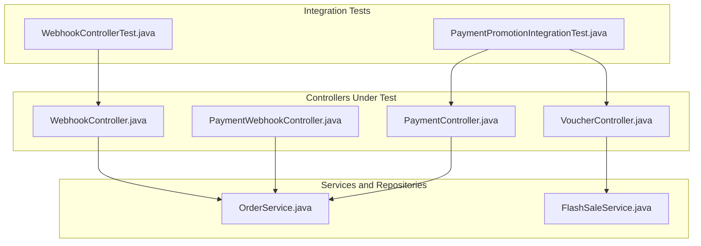
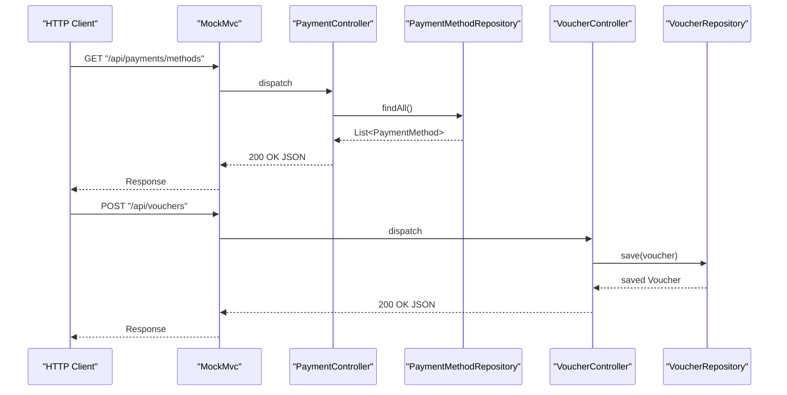
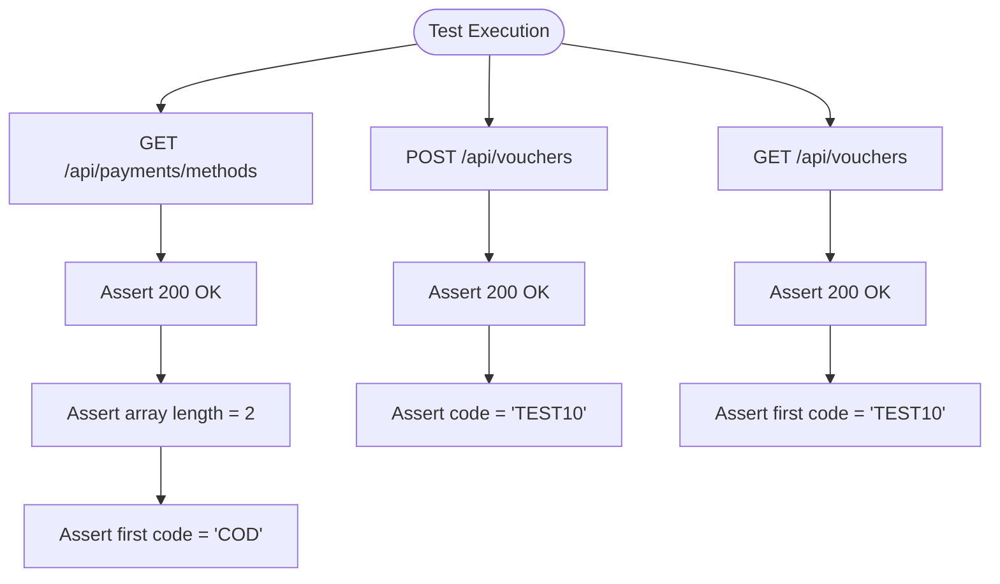
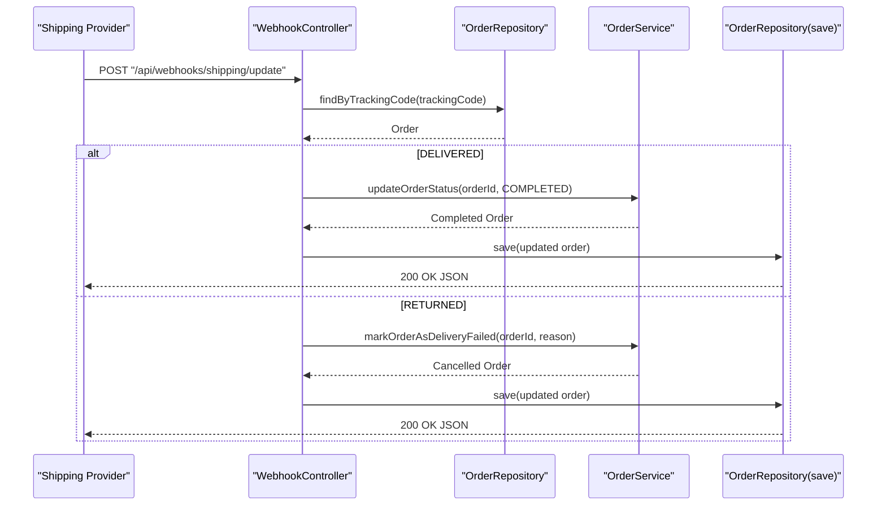
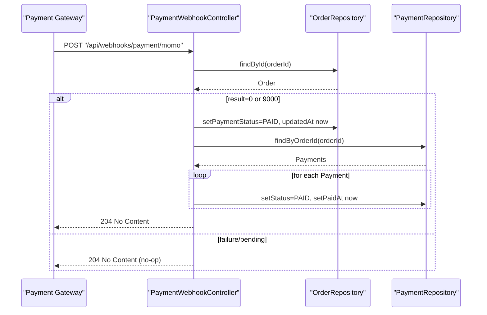
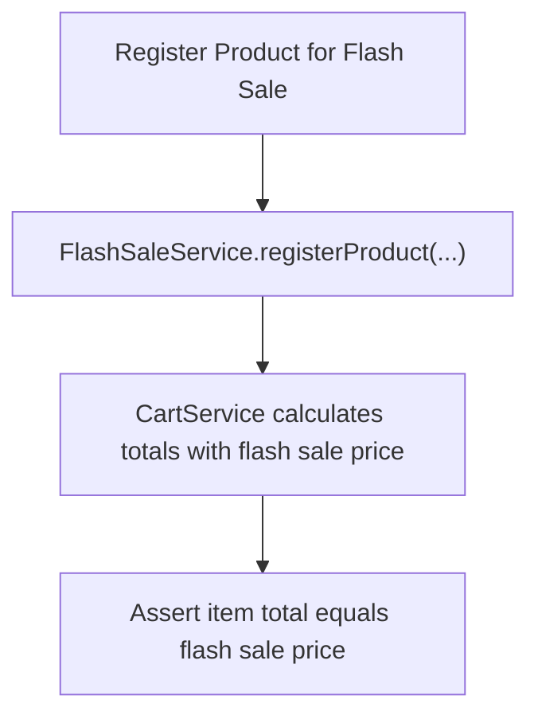
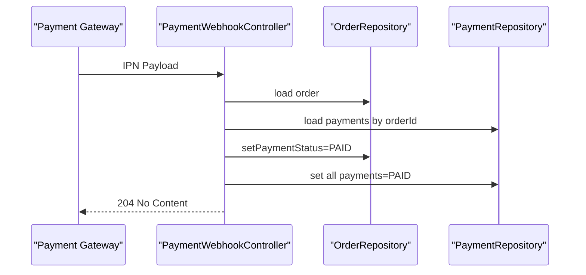
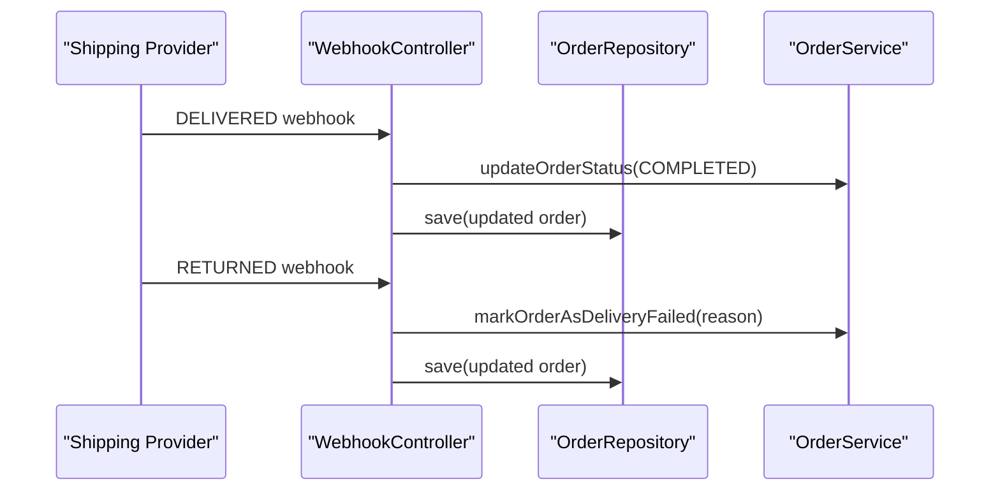
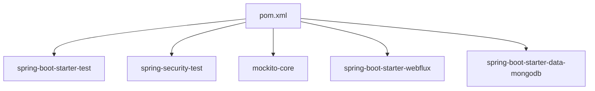

# Integration Testing

<cite>
**Referenced Files in This Document**
- [PaymentPromotionIntegrationTest.java](file://src/Backend/src/test/java/com/shoppeclone/backend/integration/PaymentPromotionIntegrationTest.java)
- [WebhookControllerTest.java](file://src/Backend/src/test/java/com/shoppeclone/backend/shipping/controller/WebhookControllerTest.java)
- [PaymentController.java](file://src/Backend/src/main/java/com/shoppeclone/backend/payment/controller/PaymentController.java)
- [PaymentWebhookController.java](file://src/Backend/src/main/java/com/shoppeclone/backend/payment/controller/PaymentWebhookController.java)
- [VoucherController.java](file://src/Backend/src/main/java/com/shoppeclone/backend/promotion/controller/VoucherController.java)
- [WebhookController.java](file://src/Backend/src/main/java/com/shoppeclone/backend/shipping/controller/WebhookController.java)
- [OrderService.java](file://src/Backend/src/main/java/com/shoppeclone/backend/order/service/OrderService.java)
- [FlashSaleService.java](file://src/Backend/src/main/java/com/shoppeclone/backend/promotion/flashsale/service/FlashSaleService.java)
- [pom.xml](file://src/Backend/pom.xml)
- [application.properties](file://src/Backend/src/main/resources/application.properties)
</cite>

## Table of Contents
1. [Introduction](#introduction)
2. [Project Structure](#project-structure)
3. [Core Components](#core-components)
4. [Architecture Overview](#architecture-overview)
5. [Detailed Component Analysis](#detailed-component-analysis)
6. [Dependency Analysis](#dependency-analysis)
7. [Performance Considerations](#performance-considerations)
8. [Troubleshooting Guide](#troubleshooting-guide)
9. [Conclusion](#conclusion)
10. [Appendices](#appendices)

## Introduction
This document explains how integration tests validate end-to-end workflows across multiple components and external systems. It focuses on:
- PaymentPromotionIntegrationTest for payment and promotion interactions
- Webhook testing strategies for shipping provider integration
- Real-world scenario examples: flash sale order processing, payment completion, and webhook event handling
- Test environment setup, database state management, and cleanup procedures
- Guidance on testing external API integrations, handling asynchronous operations, and validating system-wide behavior

## Project Structure
The integration tests reside under the test package and exercise controllers and repositories via HTTP and service boundaries. Supporting controllers handle payment webhooks and shipping webhooks, enabling realistic end-to-end flows.

**Diagram sources**
- [PaymentPromotionIntegrationTest.java:1-108](file://src/Backend/src/test/java/com/shoppeclone/backend/integration/PaymentPromotionIntegrationTest.java#L1-L108)
- [WebhookControllerTest.java:1-103](file://src/Backend/src/test/java/com/shoppeclone/backend/shipping/controller/WebhookControllerTest.java#L1-L103)
- [PaymentController.java:1-74](file://src/Backend/src/main/java/com/shoppeclone/backend/payment/controller/PaymentController.java#L1-L74)
- [PaymentWebhookController.java:1-136](file://src/Backend/src/main/java/com/shoppeclone/backend/payment/controller/PaymentWebhookController.java#L1-L136)
- [VoucherController.java:1-45](file://src/Backend/src/main/java/com/shoppeclone/backend/promotion/controller/VoucherController.java#L1-L45)
- [WebhookController.java:1-83](file://src/Backend/src/main/java/com/shoppeclone/backend/shipping/controller/WebhookController.java#L1-L83)
- [OrderService.java:1-33](file://src/Backend/src/main/java/com/shoppeclone/backend/order/service/OrderService.java#L1-L33)
- [FlashSaleService.java:1-63](file://src/Backend/src/main/java/com/shoppeclone/backend/promotion/flashsale/service/FlashSaleService.java#L1-L63)

**Section sources**
- [PaymentPromotionIntegrationTest.java:1-108](file://src/Backend/src/test/java/com/shoppeclone/backend/integration/PaymentPromotionIntegrationTest.java#L1-L108)
- [WebhookControllerTest.java:1-103](file://src/Backend/src/test/java/com/shoppeclone/backend/shipping/controller/WebhookControllerTest.java#L1-L103)
- [PaymentController.java:1-74](file://src/Backend/src/main/java/com/shoppeclone/backend/payment/controller/PaymentController.java#L1-L74)
- [PaymentWebhookController.java:1-136](file://src/Backend/src/main/java/com/shoppeclone/backend/payment/controller/PaymentWebhookController.java#L1-L136)
- [VoucherController.java:1-45](file://src/Backend/src/main/java/com/shoppeclone/backend/promotion/controller/VoucherController.java#L1-L45)
- [WebhookController.java:1-83](file://src/Backend/src/main/java/com/shoppeclone/backend/shipping/controller/WebhookController.java#L1-L83)
- [OrderService.java:1-33](file://src/Backend/src/main/java/com/shoppeclone/backend/order/service/OrderService.java#L1-L33)
- [FlashSaleService.java:1-63](file://src/Backend/src/main/java/com/shoppeclone/backend/promotion/flashsale/service/FlashSaleService.java#L1-L63)

## Core Components
- PaymentPromotionIntegrationTest: Validates HTTP endpoints for payment methods retrieval, voucher creation, and listing. Uses @MockBean to isolate repositories and focus on controller and service orchestration.
- WebhookControllerTest: Exercises shipping webhook logic for delivered and returned packages, verifying order status transitions and payment status alignment.
- Controllers under test:
  - PaymentController: Exposes endpoints for payment creation and retrieval, and internal status updates.
  - PaymentWebhookController: Handles payment gateway IPNs (Momo, VNPAY) to mark orders and payments as paid.
  - VoucherController: Manages voucher CRUD and queries.
  - WebhookController: Processes shipping updates and updates order/payment statuses accordingly.
- Services and repositories:
  - OrderService: Defines order lifecycle operations used by webhooks and controllers.
  - FlashSaleService: Supports flash sale item registration and campaign management used in cart and pricing logic.

**Section sources**
- [PaymentPromotionIntegrationTest.java:31-107](file://src/Backend/src/test/java/com/shoppeclone/backend/integration/PaymentPromotionIntegrationTest.java#L31-L107)
- [WebhookControllerTest.java:23-101](file://src/Backend/src/test/java/com/shoppeclone/backend/shipping/controller/WebhookControllerTest.java#L23-L101)
- [PaymentController.java:27-64](file://src/Backend/src/main/java/com/shoppeclone/backend/payment/controller/PaymentController.java#L27-L64)
- [PaymentWebhookController.java:36-107](file://src/Backend/src/main/java/com/shoppeclone/backend/payment/controller/PaymentWebhookController.java#L36-L107)
- [VoucherController.java:23-43](file://src/Backend/src/main/java/com/shoppeclone/backend/promotion/controller/VoucherController.java#L23-L43)
- [WebhookController.java:36-79](file://src/Backend/src/main/java/com/shoppeclone/backend/shipping/controller/WebhookController.java#L36-L79)
- [OrderService.java:9-31](file://src/Backend/src/main/java/com/shoppeclone/backend/order/service/OrderService.java#L9-L31)
- [FlashSaleService.java:11-62](file://src/Backend/src/main/java/com/shoppeclone/backend/promotion/flashsale/service/FlashSaleService.java#L11-L62)

## Architecture Overview
The integration tests simulate real-world flows by invoking HTTP endpoints and webhook handlers, asserting cross-component behavior without hitting live external providers.

**Diagram sources**
- [PaymentPromotionIntegrationTest.java:57-94](file://src/Backend/src/test/java/com/shoppeclone/backend/integration/PaymentPromotionIntegrationTest.java#L57-L94)
- [PaymentController.java:56-59](file://src/Backend/src/main/java/com/shoppeclone/backend/payment/controller/PaymentController.java#L56-L59)
- [VoucherController.java:35-38](file://src/Backend/src/main/java/com/shoppeclone/backend/promotion/controller/VoucherController.java#L35-L38)

## Detailed Component Analysis

### PaymentPromotionIntegrationTest
This test suite validates:
- Retrieval of payment methods via HTTP
- Creation and listing of vouchers via HTTP
- Behavior under @WithMockUser to simulate authenticated users

Key aspects:
- Uses @MockBean to stub repositories, ensuring deterministic outcomes and isolation from external databases during HTTP-level tests.
- Leverages MockMvc to assert HTTP status codes and JSON responses.
- Focuses on controller-layer behavior and repository interactions without invoking live payment gateways.

**Diagram sources**
- [PaymentPromotionIntegrationTest.java:57-106](file://src/Backend/src/test/java/com/shoppeclone/backend/integration/PaymentPromotionIntegrationTest.java#L57-L106)

**Section sources**
- [PaymentPromotionIntegrationTest.java:31-107](file://src/Backend/src/test/java/com/shoppeclone/backend/integration/PaymentPromotionIntegrationTest.java#L31-L107)

### WebhookControllerTest
This test validates shipping webhook behavior for two scenarios:
- DELIVERED: Transitions order to COMPLETED, sets payment status to PAID, records deliveredAt, and persists the order.
- RETURNED: Marks order as CANCELLED with a reason, updates shipping status to RETURNED, and persists the order.

**Diagram sources**
- [WebhookControllerTest.java:34-100](file://src/Backend/src/test/java/com/shoppeclone/backend/shipping/controller/WebhookControllerTest.java#L34-L100)
- [WebhookController.java:36-79](file://src/Backend/src/main/java/com/shoppeclone/backend/shipping/controller/WebhookController.java#L36-L79)
- [OrderService.java:19-25](file://src/Backend/src/main/java/com/shoppeclone/backend/order/service/OrderService.java#L19-L25)

**Section sources**
- [WebhookControllerTest.java:23-101](file://src/Backend/src/test/java/com/shoppeclone/backend/shipping/controller/WebhookControllerTest.java#L23-L101)
- [WebhookController.java:23-79](file://src/Backend/src/main/java/com/shoppeclone/backend/shipping/controller/WebhookController.java#L23-L79)
- [OrderService.java:9-31](file://src/Backend/src/main/java/com/shoppeclone/backend/order/service/OrderService.java#L9-L31)

### Payment Webhook Handling (PaymentWebhookController)
Payment webhooks update order and payment statuses upon successful electronic payments:
- Momo IPN: Accepts JSON payload, validates result code, marks order and payment as PAID, and responds with HTTP 204.
- VNPAY IPN: Similar pattern using response code "00".

**Diagram sources**
- [PaymentWebhookController.java:36-75](file://src/Backend/src/main/java/com/shoppeclone/backend/payment/controller/PaymentWebhookController.java#L36-L75)
- [PaymentWebhookController.java:109-124](file://src/Backend/src/main/java/com/shoppeclone/backend/payment/controller/PaymentWebhookController.java#L109-L124)

**Section sources**
- [PaymentWebhookController.java:21-107](file://src/Backend/src/main/java/com/shoppeclone/backend/payment/controller/PaymentWebhookController.java#L21-L107)

### Real-World Scenario Examples

#### Flash Sale Order Processing
- Register a product for flash sale via FlashSaleService.
- During cart retrieval, items may use flash sale pricing when active.
- Integration tests can validate that cart totals reflect flash sale prices when applicable.

**Diagram sources**
- [FlashSaleService.java:31](file://src/Backend/src/main/java/com/shoppeclone/backend/promotion/flashsale/service/FlashSaleService.java#L31)
- [CartServiceImplTest.java:48-87](file://src/Backend/src/test/java/com/shoppeclone/backend/cart/service/impl/CartServiceImplTest.java#L48-L87)

**Section sources**
- [FlashSaleService.java:11-62](file://src/Backend/src/main/java/com/shoppeclone/backend/promotion/flashsale/service/FlashSaleService.java#L11-L62)
- [CartServiceImplTest.java:28-87](file://src/Backend/src/test/java/com/shoppeclone/backend/cart/service/impl/CartServiceImplTest.java#L28-L87)

#### Payment Completion via Webhook
- Simulate a payment webhook (Momo/VNPAY) to mark an order as paid.
- Verify order payment status transitions and associated payment records.

**Diagram sources**
- [PaymentWebhookController.java:36-107](file://src/Backend/src/main/java/com/shoppeclone/backend/payment/controller/PaymentWebhookController.java#L36-L107)

**Section sources**
- [PaymentWebhookController.java:21-107](file://src/Backend/src/main/java/com/shoppeclone/backend/payment/controller/PaymentWebhookController.java#L21-L107)

#### Webhook Event Handling (Shipping)
- Simulate shipping provider webhook events for delivered and returned packages.
- Validate order status transitions and persistence.

**Diagram sources**
- [WebhookControllerTest.java:34-100](file://src/Backend/src/test/java/com/shoppeclone/backend/shipping/controller/WebhookControllerTest.java#L34-L100)
- [WebhookController.java:36-79](file://src/Backend/src/main/java/com/shoppeclone/backend/shipping/controller/WebhookController.java#L36-L79)

**Section sources**
- [WebhookControllerTest.java:23-101](file://src/Backend/src/test/java/com/shoppeclone/backend/shipping/controller/WebhookControllerTest.java#L23-L101)
- [WebhookController.java:23-79](file://src/Backend/src/main/java/com/shoppeclone/backend/shipping/controller/WebhookController.java#L23-L79)

## Dependency Analysis
Testing dependencies and runtime dependencies are configured in the Maven POM. Integration tests rely on Spring Boot Test, Spring Security Test, and Mockito extensions.

**Diagram sources**
- [pom.xml:82-133](file://src/Backend/pom.xml#L82-L133)

**Section sources**
- [pom.xml:18-133](file://src/Backend/pom.xml#L18-L133)

## Performance Considerations
- Prefer @MockBean for repositories in integration tests to avoid database overhead and ensure deterministic results.
- Use lightweight assertions (status codes, JSON field checks) to keep tests fast.
- Keep test data minimal and scoped to the tested endpoint or handler.
- Avoid real network calls; simulate external provider callbacks via direct controller invocations or webhook handlers.

## Troubleshooting Guide
Common issues and resolutions:
- Missing or empty orderId in payment webhook payloads: Ensure payloads include valid order identifiers; handlers return HTTP 204 without error when missing.
- Tracking code not found in shipping webhook: Handlers throw exceptions when tracking code is not present; ensure test payloads include valid tracking codes.
- Payment method not found: PaymentController expects valid payment method codes; ensure mocks return expected values.
- Voucher creation failures: Validate request body shape and permissions; tests use @WithMockUser to simulate authenticated users.

**Section sources**
- [PaymentWebhookController.java:44-53](file://src/Backend/src/main/java/com/shoppeclone/backend/payment/controller/PaymentWebhookController.java#L44-L53)
- [WebhookController.java:40-41](file://src/Backend/src/main/java/com/shoppeclone/backend/shipping/controller/WebhookController.java#L40-L41)
- [PaymentController.java:29-33](file://src/Backend/src/main/java/com/shoppeclone/backend/payment/controller/PaymentController.java#L29-L33)
- [PaymentPromotionIntegrationTest.java:78-94](file://src/Backend/src/test/java/com/shoppeclone/backend/integration/PaymentPromotionIntegrationTest.java#L78-L94)

## Conclusion
Integration tests in this codebase validate end-to-end workflows by combining HTTP-level controller tests with targeted webhook handler validations. By mocking repositories and focusing on cross-component behavior, tests remain fast, reliable, and representative of real-world usage. The PaymentPromotionIntegrationTest and WebhookControllerTest demonstrate how to simulate payment completion and shipping updates, while supporting services and repositories enable realistic order lifecycle transitions.

## Appendices

### Test Environment Setup
- Application properties: Configure test-specific properties under the main resource directory to control logging, database connections, and feature toggles.
- Dependencies: Ensure spring-boot-starter-test, spring-security-test, and webflux are included for testing web controllers and asynchronous flows.

**Section sources**
- [application.properties](file://src/Backend/src/main/resources/application.properties)
- [pom.xml:82-106](file://src/Backend/pom.xml#L82-L106)

### Database State Management and Cleanup
- Use @MockBean to isolate repositories and avoid mutating persistent state during tests.
- For tests requiring database-backed state, prefer temporary test containers or in-memory databases and clean up after each test using repository-level cleanup or transaction rollback strategies.

### Asynchronous Operations
- For asynchronous flows (e.g., notifications, batch jobs), use @ExtendWith(MockitoExtension.class) and verify interactions via verify() to ensure operations occur without relying on timing-sensitive waits.