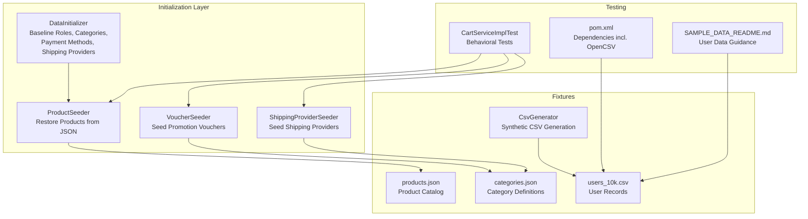
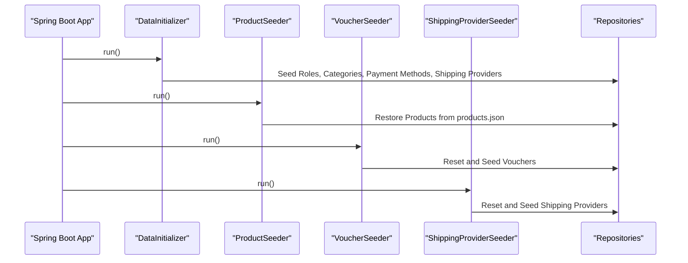
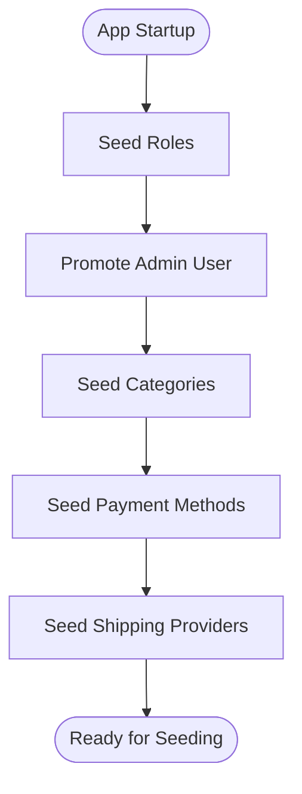
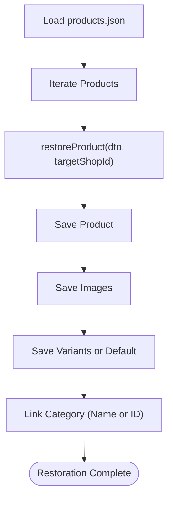
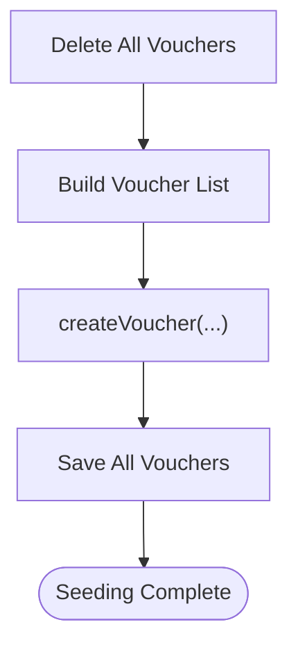
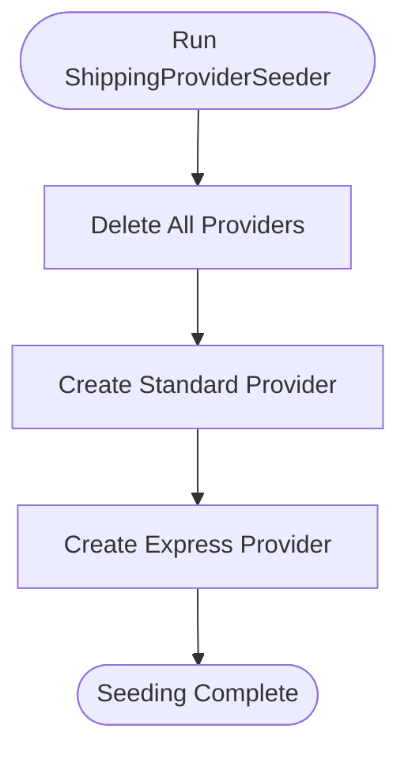
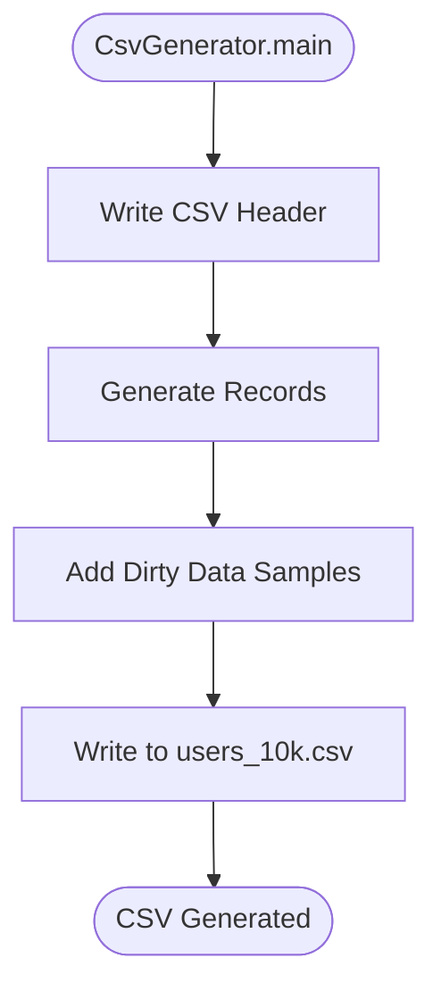
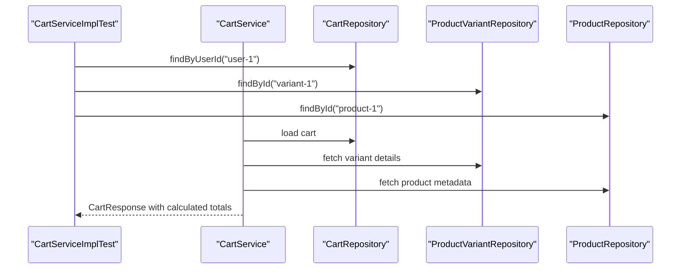
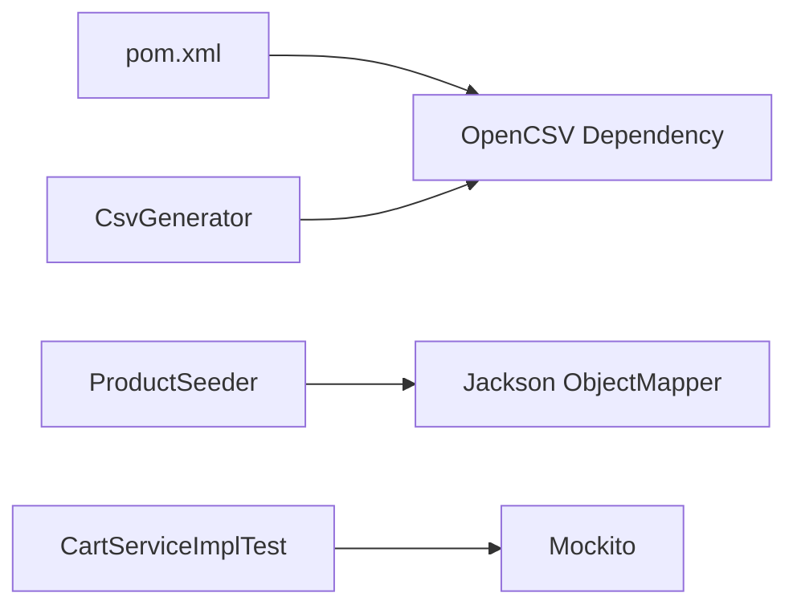

# Test Data Management

<cite>
**Referenced Files in This Document**
- [DataInitializer.java](file://src/backend/src/main/java/com/shoppeclone/backend/common/config/DataInitializer.java)
- [ProductSeeder.java](file://src/backend/src/main/java/com/shoppeclone/backend/product/seeder/ProductSeeder.java)
- [VoucherSeeder.java](file://src/backend/src/main/java/com/shoppeclone/backend/promotion/seeder/VoucherSeeder.java)
- [ShippingProviderSeeder.java](file://src/backend/src/main/java/com/shoppeclone/backend/shipping/seeder/ShippingProviderSeeder.java)
- [CsvGenerator.java](file://src/backend/src/main/java/com/shoppeclone/backend/common/utils/CsvGenerator.java)
- [users_10k.csv](file://src/backend/users_10k.csv)
- [products.json](file://data_dumps/products.json)
- [categories.json](file://data_dumps/categories.json)
- [CartServiceImplTest.java](file://src/backend/src/test/java/com/shoppeclone/backend/cart/service/impl/CartServiceImplTest.java)
- [pom.xml](file://src/backend/pom.xml)
- [SAMPLE_DATA_README.md](file://src/backend/SAMPLE_DATA_README.md)
</cite>

## Table of Contents
1. [Introduction](#introduction)
2. [Project Structure](#project-structure)
3. [Core Components](#core-components)
4. [Architecture Overview](#architecture-overview)
5. [Detailed Component Analysis](#detailed-component-analysis)
6. [Dependency Analysis](#dependency-analysis)
7. [Performance Considerations](#performance-considerations)
8. [Troubleshooting Guide](#troubleshooting-guide)
9. [Conclusion](#conclusion)

## Introduction
This document explains how test data is structured, created, and maintained for reliable testing in the backend system. It covers the use of JSON dumps and CSV files for test fixtures, outlines data seeding strategies, and describes database state preparation. It also provides practical examples for creating realistic test scenarios involving products, users, orders, and cart items, along with data isolation techniques and strategies for maintaining consistent test environments across different setups.

## Project Structure
The test data management system integrates several components:
- Command-line runners that initialize and seed baseline data
- JSON fixtures for product catalogs
- CSV fixtures for user data
- Test utilities for generating synthetic datasets
- Test suites that validate behavior against seeded data

**Diagram sources**
- [DataInitializer.java:27-49](file://src/backend/src/main/java/com/shoppeclone/backend/common/config/DataInitializer.java#L27-L49)
- [ProductSeeder.java:38-84](file://src/backend/src/main/java/com/shoppeclone/backend/product/seeder/ProductSeeder.java#L38-L84)
- [VoucherSeeder.java:22-139](file://src/backend/src/main/java/com/shoppeclone/backend/promotion/seeder/VoucherSeeder.java#L22-L139)
- [ShippingProviderSeeder.java:13-40](file://src/backend/src/main/java/com/shoppeclone/backend/shipping/seeder/ShippingProviderSeeder.java#L13-L40)
- [products.json:1-50](file://data_dumps/products.json#L1-L50)
- [categories.json:1-2](file://data_dumps/categories.json#L1-L2)
- [users_10k.csv:1-50](file://src/backend/users_10k.csv#L1-L50)
- [CsvGenerator.java:9-79](file://src/backend/src/main/java/com/shoppeclone/backend/common/utils/CsvGenerator.java#L9-L79)
- [CartServiceImplTest.java:28-87](file://src/backend/src/test/java/com/shoppeclone/backend/cart/service/impl/CartServiceImplTest.java#L28-L87)
- [pom.xml:120-125](file://src/backend/pom.xml#L120-L125)
- [SAMPLE_DATA_README.md:1-154](file://src/backend/SAMPLE_DATA_README.md#L1-L154)

**Section sources**
- [DataInitializer.java:27-49](file://src/backend/src/main/java/com/shoppeclone/backend/common/config/DataInitializer.java#L27-L49)
- [ProductSeeder.java:38-84](file://src/backend/src/main/java/com/shoppeclone/backend/product/seeder/ProductSeeder.java#L38-L84)
- [VoucherSeeder.java:22-139](file://src/backend/src/main/java/com/shoppeclone/backend/promotion/seeder/VoucherSeeder.java#L22-L139)
- [ShippingProviderSeeder.java:13-40](file://src/backend/src/main/java/com/shoppeclone/backend/shipping/seeder/ShippingProviderSeeder.java#L13-L40)
- [products.json:1-50](file://data_dumps/products.json#L1-L50)
- [categories.json:1-2](file://data_dumps/categories.json#L1-L2)
- [users_10k.csv:1-50](file://src/backend/users_10k.csv#L1-L50)
- [CsvGenerator.java:9-79](file://src/backend/src/main/java/com/shoppeclone/backend/common/utils/CsvGenerator.java#L9-L79)
- [CartServiceImplTest.java:28-87](file://src/backend/src/test/java/com/shoppeclone/backend/cart/service/impl/CartServiceImplTest.java#L28-L87)
- [pom.xml:120-125](file://src/backend/pom.xml#L120-L125)
- [SAMPLE_DATA_README.md:1-154](file://src/backend/SAMPLE_DATA_README.md#L1-L154)

## Core Components
- DataInitializer: Seeds baseline roles, categories, payment methods, and shipping providers at application startup.
- ProductSeeder: Restores product catalog from a JSON fixture, linking categories and variants while normalizing shop associations.
- VoucherSeeder: Resets and seeds promotional vouchers with category restrictions and validity windows.
- ShippingProviderSeeder: Ensures shipping providers exist with deterministic IDs for downstream tests.
- CsvGenerator: Generates synthetic CSV datasets for users with realistic names, emails, and phone numbers.
- users_10k.csv: Large CSV fixture containing 10,000 user records for load and integration testing.
- Test suite: Behavioral tests that validate cart pricing logic using mocked repositories and seeded data.

**Section sources**
- [DataInitializer.java:27-49](file://src/backend/src/main/java/com/shoppeclone/backend/common/config/DataInitializer.java#L27-L49)
- [ProductSeeder.java:38-84](file://src/backend/src/main/java/com/shoppeclone/backend/product/seeder/ProductSeeder.java#L38-L84)
- [VoucherSeeder.java:22-139](file://src/backend/src/main/java/com/shoppeclone/backend/promotion/seeder/VoucherSeeder.java#L22-L139)
- [ShippingProviderSeeder.java:13-40](file://src/backend/src/main/java/com/shoppeclone/backend/shipping/seeder/ShippingProviderSeeder.java#L13-L40)
- [CsvGenerator.java:9-79](file://src/backend/src/main/java/com/shoppeclone/backend/common/utils/CsvGenerator.java#L9-L79)
- [users_10k.csv:1-50](file://src/backend/users_10k.csv#L1-L50)
- [CartServiceImplTest.java:28-87](file://src/backend/src/test/java/com/shoppeclone/backend/cart/service/impl/CartServiceImplTest.java#L28-L87)

## Architecture Overview
The test data lifecycle spans initialization, seeding, and testing phases. Initialization ensures baseline entities exist. Seeding restores product catalogs and promotions. Tests consume these fixtures to validate business logic deterministically.

**Diagram sources**
- [DataInitializer.java:37-49](file://src/backend/src/main/java/com/shoppeclone/backend/common/config/DataInitializer.java#L37-L49)
- [ProductSeeder.java:48-84](file://src/backend/src/main/java/com/shoppeclone/backend/product/seeder/ProductSeeder.java#L48-L84)
- [VoucherSeeder.java:27-139](file://src/backend/src/main/java/com/shoppeclone/backend/promotion/seeder/VoucherSeeder.java#L27-L139)
- [ShippingProviderSeeder.java:17-40](file://src/backend/src/main/java/com/shoppeclone/backend/shipping/seeder/ShippingProviderSeeder.java#L17-L40)

## Detailed Component Analysis

### Data Initialization and Baseline Setup
- Roles, categories, payment methods, and shipping providers are created if missing, ensuring a consistent baseline for all tests.
- Admin user promotion and cleanup steps maintain a stable identity for administrative operations during development and testing.

**Diagram sources**
- [DataInitializer.java:37-151](file://src/backend/src/main/java/com/shoppeclone/backend/common/config/DataInitializer.java#L37-L151)

**Section sources**
- [DataInitializer.java:37-151](file://src/backend/src/main/java/com/shoppeclone/backend/common/config/DataInitializer.java#L37-L151)

### Product Catalog Restoration from JSON
- Loads product definitions from a JSON fixture and restores them into the database.
- Normalizes shop associations and rebuilds category links, falling back to auto-detection when explicit categories are unavailable.
- Creates default product variants when variants are absent.

**Diagram sources**
- [ProductSeeder.java:48-162](file://src/backend/src/main/java/com/shoppeclone/backend/product/seeder/ProductSeeder.java#L48-L162)
- [products.json:1-50](file://data_dumps/products.json#L1-L50)

**Section sources**
- [ProductSeeder.java:48-162](file://src/backend/src/main/java/com/shoppeclone/backend/product/seeder/ProductSeeder.java#L48-L162)
- [products.json:1-50](file://data_dumps/products.json#L1-L50)

### Voucher and Promotion Seeding
- Clears existing vouchers and seeds a curated set of promotional vouchers with category restrictions and validity windows.
- Ensures deterministic test conditions by resetting state before seeding.

**Diagram sources**
- [VoucherSeeder.java:27-139](file://src/backend/src/main/java/com/shoppeclone/backend/promotion/seeder/VoucherSeeder.java#L27-L139)

**Section sources**
- [VoucherSeeder.java:27-139](file://src/backend/src/main/java/com/shoppeclone/backend/promotion/seeder/VoucherSeeder.java#L27-L139)

### Shipping Provider Seeding
- Resets and seeds shipping providers with predefined IDs to ensure consistent behavior across tests.

**Diagram sources**
- [ShippingProviderSeeder.java:17-40](file://src/backend/src/main/java/com/shoppeclone/backend/shipping/seeder/ShippingProviderSeeder.java#L17-L40)

**Section sources**
- [ShippingProviderSeeder.java:17-40](file://src/backend/src/main/java/com/shoppeclone/backend/shipping/seeder/ShippingProviderSeeder.java#L17-L40)

### CSV-Based User Data Generation and Seeding
- CsvGenerator creates synthetic user datasets with realistic names, emails, and phone numbers, including dirty data samples for validation.
- users_10k.csv provides a large dataset suitable for load testing and integration scenarios.
- SAMPLE_DATA_README.md documents CSV structure, API endpoints for importing CSV data, and performance characteristics.

**Diagram sources**
- [CsvGenerator.java:16-77](file://src/backend/src/main/java/com/shoppeclone/backend/common/utils/CsvGenerator.java#L16-L77)
- [users_10k.csv:1-50](file://src/backend/users_10k.csv#L1-L50)
- [SAMPLE_DATA_README.md:21-154](file://src/backend/SAMPLE_DATA_README.md#L21-L154)

**Section sources**
- [CsvGenerator.java:16-77](file://src/backend/src/main/java/com/shoppeclone/backend/common/utils/CsvGenerator.java#L16-L77)
- [users_10k.csv:1-50](file://src/backend/users_10k.csv#L1-L50)
- [SAMPLE_DATA_README.md:21-154](file://src/backend/SAMPLE_DATA_README.md#L21-L154)

### Test Scenarios with Products, Users, Orders, and Cart Items
- CartServiceImplTest demonstrates validating cart pricing logic using seeded products and variants, including flash sale pricing overrides.
- This pattern can be extended to simulate orders and checkout flows by combining product, user, and cart fixtures.

**Diagram sources**
- [CartServiceImplTest.java:48-87](file://src/backend/src/test/java/com/shoppeclone/backend/cart/service/impl/CartServiceImplTest.java#L48-L87)

**Section sources**
- [CartServiceImplTest.java:48-87](file://src/backend/src/test/java/com/shoppeclone/backend/cart/service/impl/CartServiceImplTest.java#L48-L87)

## Dependency Analysis
- OpenCSV dependency supports CSV parsing and import workflows.
- JSON deserialization is handled via Jackson for product fixtures.
- Test dependencies enable mocking and behavioral validation.

**Diagram sources**
- [pom.xml:120-125](file://src/backend/pom.xml#L120-L125)
- [ProductSeeder.java:46-46](file://src/backend/src/main/java/com/shoppeclone/backend/product/seeder/ProductSeeder.java#L46-L46)
- [CsvGenerator.java:3-3](file://src/backend/src/main/java/com/shoppeclone/backend/common/utils/CsvGenerator.java#L3-L3)
- [CartServiceImplTest.java:13-25](file://src/backend/src/test/java/com/shoppeclone/backend/cart/service/impl/CartServiceImplTest.java#L13-L25)

**Section sources**
- [pom.xml:120-125](file://src/backend/pom.xml#L120-L125)
- [ProductSeeder.java:46-46](file://src/backend/src/main/java/com/shoppeclone/backend/product/seeder/ProductSeeder.java#L46-L46)
- [CsvGenerator.java:3-3](file://src/backend/src/main/java/com/shoppeclone/backend/common/utils/CsvGenerator.java#L3-L3)
- [CartServiceImplTest.java:13-25](file://src/backend/src/test/java/com/shoppeclone/backend/cart/service/impl/CartServiceImplTest.java#L13-L25)

## Performance Considerations
- Use batch processing for large CSV imports to optimize memory usage and throughput.
- Prefer deterministic fixtures (IDs, names) to reduce variability and improve test stability.
- Keep JSON fixtures minimal and focused on essential attributes to speed up restoration.
- Ensure seeding order avoids foreign key violations and reduces transaction overhead.

## Troubleshooting Guide
- If products are not restored, verify the presence of the JSON fixture and correct shop association logic.
- If vouchers appear inconsistent, confirm that seeding runs after product and category initialization.
- For shipping provider mismatches, ensure seeding occurs after category initialization and that IDs match expected values.
- When importing CSV data, confirm the application property locations and dependencies are correctly configured.

**Section sources**
- [ProductSeeder.java:64-84](file://src/backend/src/main/java/com/shoppeclone/backend/product/seeder/ProductSeeder.java#L64-L84)
- [VoucherSeeder.java:27-139](file://src/backend/src/main/java/com/shoppeclone/backend/promotion/seeder/VoucherSeeder.java#L27-L139)
- [ShippingProviderSeeder.java:17-40](file://src/backend/src/main/java/com/shoppeclone/backend/shipping/seeder/ShippingProviderSeeder.java#L17-L40)
- [pom.xml:120-125](file://src/backend/pom.xml#L120-L125)

## Conclusion
The test data management system combines command-line initialization, JSON fixtures, and CSV datasets to establish a reproducible and isolated test environment. By seeding baseline entities, restoring product catalogs, and preparing promotional contexts, teams can reliably validate business logic across products, users, orders, and cart items. Following the outlined strategies ensures consistent results across environments and scalable handling of large datasets.