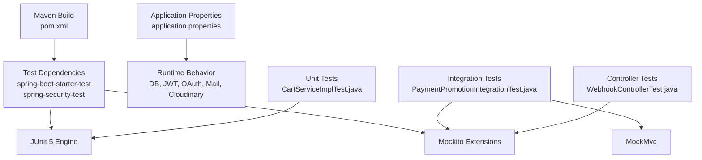
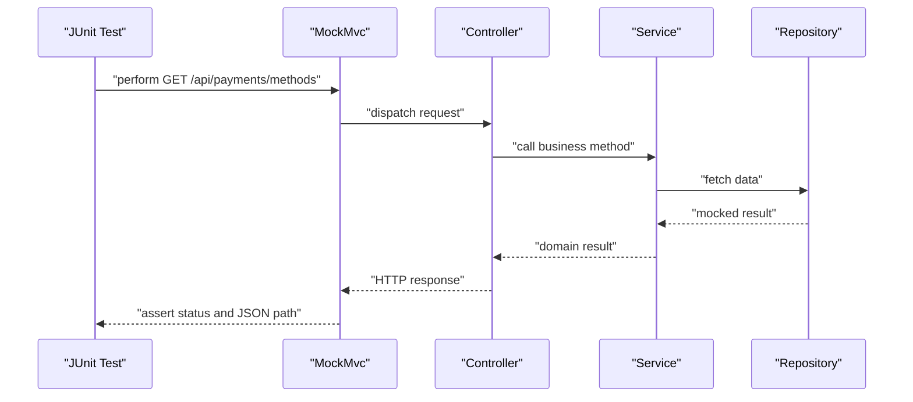
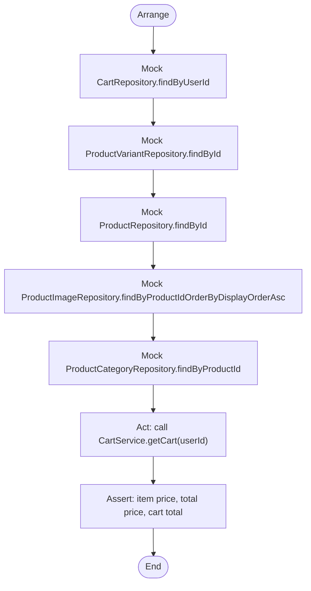
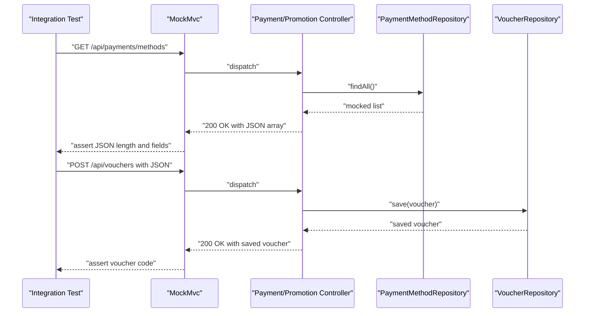
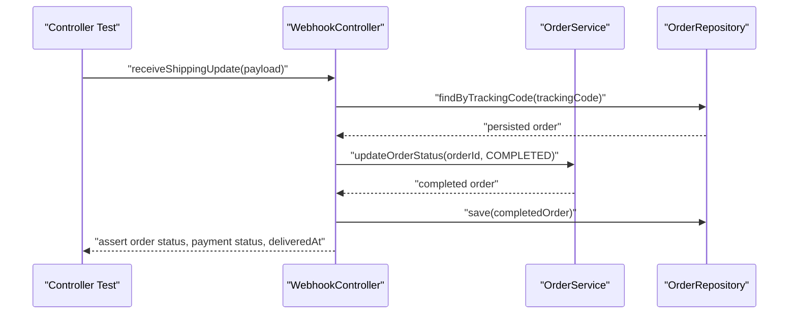
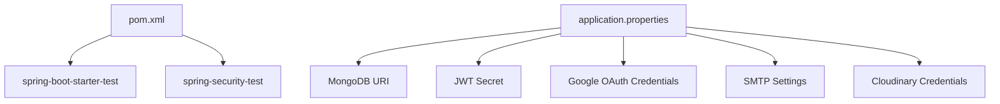

# Testing Strategy & Implementation

<cite>
**Referenced Files in This Document**
- [README.md](file://README.md)
- [pom.xml](file://src/Backend/pom.xml)
- [application.properties](file://src/Backend/src/main/resources/application.properties)
- [PaymentPromotionIntegrationTest.java](file://src/Backend/src/test/java/com/shoppeclone/backend/integration/PaymentPromotionIntegrationTest.java)
- [CartServiceImplTest.java](file://src/Backend/src/test/java/com/shoppeclone/backend/cart/service/impl/CartServiceImplTest.java)
- [WebhookControllerTest.java](file://src/Backend/src/test/java/com/shoppeclone/backend/shipping/controller/WebhookControllerTest.java)
</cite>

## Table of Contents
1. [Introduction](#introduction)
2. [Project Structure](#project-structure)
3. [Core Components](#core-components)
4. [Architecture Overview](#architecture-overview)
5. [Detailed Component Analysis](#detailed-component-analysis)
6. [Dependency Analysis](#dependency-analysis)
7. [Performance Considerations](#performance-considerations)
8. [Troubleshooting Guide](#troubleshooting-guide)
9. [Conclusion](#conclusion)
10. [Appendices](#appendices)

## Introduction
This document defines the testing strategy and implementation for the backend. It covers unit testing approaches, integration testing patterns, and test coverage strategies. It documents the testing framework setup, test utilities, and mock implementations. It also provides practical examples for common testing scenarios, guidance on test execution and CI/CD integration, and advice for managing test data and environments.

## Project Structure
The testing effort is organized around:
- Unit tests for service-layer logic using Mockito and JUnit 5
- Integration tests using Spring Boot’s test slices and MockMvc
- Minimal test configuration via Maven dependencies and shared application properties

**Diagram sources**
- [pom.xml:82-92](file://src/Backend/pom.xml#L82-L92)
- [application.properties:14-17](file://src/Backend/src/main/resources/application.properties#L14-L17)
- [CartServiceImplTest.java:13-27](file://src/Backend/src/test/java/com/shoppeclone/backend/cart/service/impl/CartServiceImplTest.java#L13-L27)
- [PaymentPromotionIntegrationTest.java:9-31](file://src/Backend/src/test/java/com/shoppeclone/backend/integration/PaymentPromotionIntegrationTest.java#L9-L31)
- [WebhookControllerTest.java:9-22](file://src/Backend/src/test/java/com/shoppeclone/backend/shipping/controller/WebhookControllerTest.java#L9-L22)

**Section sources**
- [README.md:272-286](file://README.md#L272-L286)
- [pom.xml:82-92](file://src/Backend/pom.xml#L82-L92)
- [application.properties:14-17](file://src/Backend/src/main/resources/application.properties#L14-L17)

## Core Components
- Unit tests with Mockito and JUnit 5:
  - Use @ExtendWith(MockitoExtension.class) to enable Mockito in JUnit 5
  - Use @Mock to create mocks and @InjectMocks to inject them into the tested service
  - Use AssertJ assertions for readable expectations
- Integration tests with Spring Boot test slices:
  - Use @SpringBootTest and @AutoConfigureMockMvc for web layer tests
  - Use @MockBean to replace repositories/services with mocks
  - Use @WithMockUser to simulate authenticated users
  - Use MockMvc to send HTTP requests and assert responses
- Controller tests:
  - Use @ExtendWith(MockitoExtension.class) and @InjectMocks for controller under test
  - Use @Mock for collaborators and verify interactions and state changes

Examples of test files:
- Service unit test: [CartServiceImplTest.java](file://src/Backend/src/test/java/com/shoppeclone/backend/cart/service/impl/CartServiceImplTest.java)
- Integration test: [PaymentPromotionIntegrationTest.java](file://src/Backend/src/test/java/com/shoppeclone/backend/integration/PaymentPromotionIntegrationTest.java)
- Controller test: [WebhookControllerTest.java](file://src/Backend/src/test/java/com/shoppeclone/backend/shipping/controller/WebhookControllerTest.java)

**Section sources**
- [CartServiceImplTest.java:13-27](file://src/Backend/src/test/java/com/shoppeclone/backend/cart/service/impl/CartServiceImplTest.java#L13-L27)
- [PaymentPromotionIntegrationTest.java:9-31](file://src/Backend/src/test/java/com/shoppeclone/backend/integration/PaymentPromotionIntegrationTest.java#L9-L31)
- [WebhookControllerTest.java:9-22](file://src/Backend/src/test/java/com/shoppeclone/backend/shipping/controller/WebhookControllerTest.java#L9-L22)

## Architecture Overview
The testing architecture separates concerns:
- Unit tests focus on service logic and repository interactions using mocks
- Integration tests validate end-to-end HTTP flows with realistic request/response cycles
- Controller tests validate handler behavior and interactions with services

**Diagram sources**
- [PaymentPromotionIntegrationTest.java:57-76](file://src/Backend/src/test/java/com/shoppeclone/backend/integration/PaymentPromotionIntegrationTest.java#L57-L76)

## Detailed Component Analysis

### Unit Testing: Cart Service
- Purpose: Validate pricing logic considering flash sale price when applicable
- Approach:
  - Create test doubles for CartRepository, ProductVariantRepository, ProductRepository, ProductImageRepository, ProductCategoryRepository
  - Inject mocks into CartServiceImpl using @InjectMocks
  - Arrange: set up repository return values
  - Act: call service method
  - Assert: verify calculated prices and totals

**Diagram sources**
- [CartServiceImplTest.java:49-87](file://src/Backend/src/test/java/com/shoppeclone/backend/cart/service/impl/CartServiceImplTest.java#L49-L87)

**Section sources**
- [CartServiceImplTest.java:49-87](file://src/Backend/src/test/java/com/shoppeclone/backend/cart/service/impl/CartServiceImplTest.java#L49-L87)

### Integration Testing: Payment and Promotion Endpoints
- Purpose: Validate HTTP endpoints for payment methods retrieval, voucher creation, and listing
- Approach:
  - Use @SpringBootTest to load application context
  - Use @AutoConfigureMockMvc to enable MockMvc
  - Use @MockBean to replace repositories with mocks
  - Use @WithMockUser to simulate authenticated users
  - Use MockMvc to issue HTTP requests and assert status and JSON path

**Diagram sources**
- [PaymentPromotionIntegrationTest.java:57-106](file://src/Backend/src/test/java/com/shoppeclone/backend/integration/PaymentPromotionIntegrationTest.java#L57-L106)

**Section sources**
- [PaymentPromotionIntegrationTest.java:57-106](file://src/Backend/src/test/java/com/shoppeclone/backend/integration/PaymentPromotionIntegrationTest.java#L57-L106)

### Controller Testing: Shipping Webhook
- Purpose: Validate webhook handler behavior for delivery updates and return handling
- Approach:
  - Use @ExtendWith(MockitoExtension.class) and @InjectMocks for controller
  - Use @Mock for OrderRepository and OrderService
  - Arrange: prepare persisted order and payload
  - Act: call controller method
  - Assert: verify service calls, repository save, and resulting order state

**Diagram sources**
- [WebhookControllerTest.java:34-65](file://src/Backend/src/test/java/com/shoppeclone/backend/shipping/controller/WebhookControllerTest.java#L34-L65)

**Section sources**
- [WebhookControllerTest.java:34-65](file://src/Backend/src/test/java/com/shoppeclone/backend/shipping/controller/WebhookControllerTest.java#L34-L65)

## Dependency Analysis
- Test dependencies:
  - spring-boot-starter-test: provides JUnit Jupiter, Spring Boot test support, and JSON assertion helpers
  - spring-security-test: enables @WithMockUser and Spring Security test support
- Runtime dependencies used by tests:
  - MongoDB connection configured via application.properties
  - JWT secret, OAuth client credentials, mail SMTP, and Cloudinary credentials are externalized via environment variables

**Diagram sources**
- [pom.xml:82-92](file://src/Backend/pom.xml#L82-L92)
- [application.properties:14-17](file://src/Backend/src/main/resources/application.properties#L14-L17)
- [application.properties:24-25](file://src/Backend/src/main/resources/application.properties#L24-L25)
- [application.properties:58-67](file://src/Backend/src/main/resources/application.properties#L58-L67)
- [application.properties:73-79](file://src/Backend/src/main/resources/application.properties#L73-L79)
- [application.properties:87-89](file://src/Backend/src/main/resources/application.properties#L87-L89)

**Section sources**
- [pom.xml:82-92](file://src/Backend/pom.xml#L82-L92)
- [application.properties:14-17](file://src/Backend/src/main/resources/application.properties#L14-L17)
- [application.properties:24-25](file://src/Backend/src/main/resources/application.properties#L24-L25)
- [application.properties:58-67](file://src/Backend/src/main/resources/application.properties#L58-L67)
- [application.properties:73-79](file://src/Backend/src/main/resources/application.properties#L73-L79)
- [application.properties:87-89](file://src/Backend/src/main/resources/application.properties#L87-L89)

## Performance Considerations
- Prefer unit tests for pure logic and fast feedback loops
- Use @MockBean and @Mock to avoid real database writes and network calls
- Keep integration tests focused on critical paths and avoid heavy payloads
- Use @WithMockUser to simulate roles without full authentication overhead
- For high-load scenarios (e.g., flash sale), complement unit and integration tests with dedicated simulators and load tests outside the scope of this repository

## Troubleshooting Guide
Common issues and resolutions:
- Missing environment variables:
  - Symptom: Tests fail due to unresolved placeholders for JWT secret, OAuth credentials, mail SMTP, or Cloudinary
  - Resolution: Provide environment variables or configure application properties for tests
- MongoDB connectivity:
  - Symptom: Tests requiring live DB connections fail
  - Resolution: Use @MockBean to stub repositories or configure a test database URI via environment variable
- Assertion failures:
  - Symptom: JSON path assertions mismatch
  - Resolution: Align expected fields with actual DTOs and endpoints; verify HTTP status codes and response shapes
- Role-based access:
  - Symptom: Unauthorized responses when expecting protected endpoints
  - Resolution: Add @WithMockUser with appropriate roles in integration tests

Practical references:
- Running tests locally: [README.md:280-286](file://README.md#L280-L286)
- Test dependencies: [pom.xml:82-92](file://src/Backend/pom.xml#L82-L92)
- Application configuration: [application.properties:14-17](file://src/Backend/src/main/resources/application.properties#L14-L17)

**Section sources**
- [README.md:280-286](file://README.md#L280-L286)
- [pom.xml:82-92](file://src/Backend/pom.xml#L82-L92)
- [application.properties:14-17](file://src/Backend/src/main/resources/application.properties#L14-L17)

## Conclusion
The repository employs a pragmatic testing strategy:
- Unit tests validate service logic with mocks
- Integration tests validate HTTP endpoints and security annotations
- Controller tests validate handler behavior and interactions
This approach balances speed, reliability, and coverage while leveraging Spring Boot’s testing infrastructure and Mockito for isolation.

## Appendices

### Test Execution and CI/CD Integration
- Execute tests locally using Maven:
  - Command: [README.md:280-286](file://README.md#L280-L286)
- CI/CD considerations:
  - Provide environment variables for secrets and external services
  - Use Maven wrapper to run tests consistently across environments
  - Separate test and integration test suites if needed for pipeline stages

**Section sources**
- [README.md:280-286](file://README.md#L280-L286)

### Test Coverage Strategies
- Target high coverage for:
  - Service methods with branching logic (e.g., flash sale price selection)
  - Controller handlers for critical flows (e.g., shipping webhook)
  - Integration paths for key endpoints (e.g., payment methods, promotions)
- Complement with property-based or randomized tests for edge cases if needed

### Test Data Management and Environment Setup
- Use @MockBean to isolate tests from persistent state
- Externalize configuration via environment variables or application properties
- For database-backed tests, prefer test containers or in-memory databases if broader integration is required

**Section sources**
- [application.properties:14-17](file://src/Backend/src/main/resources/application.properties#L14-L17)
- [application.properties:24-25](file://src/Backend/src/main/resources/application.properties#L24-L25)
- [application.properties:58-67](file://src/Backend/src/main/resources/application.properties#L58-L67)
- [application.properties:73-79](file://src/Backend/src/main/resources/application.properties#L73-L79)
- [application.properties:87-89](file://src/Backend/src/main/resources/application.properties#L87-L89)