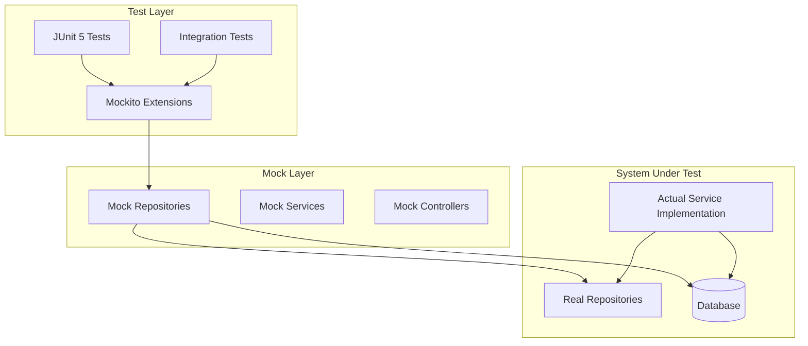
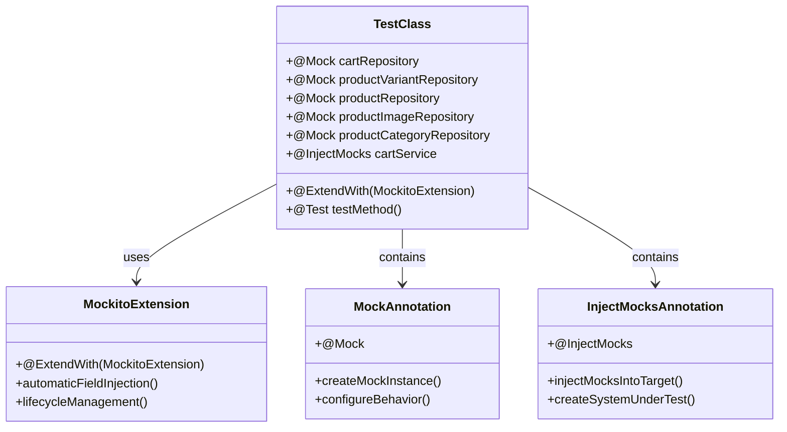
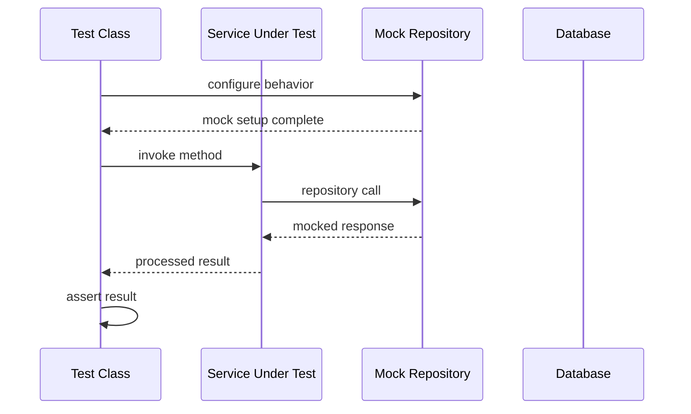
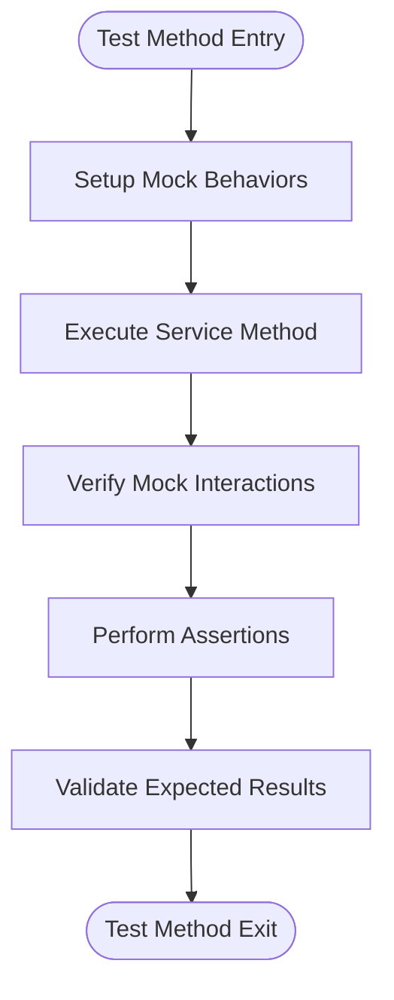
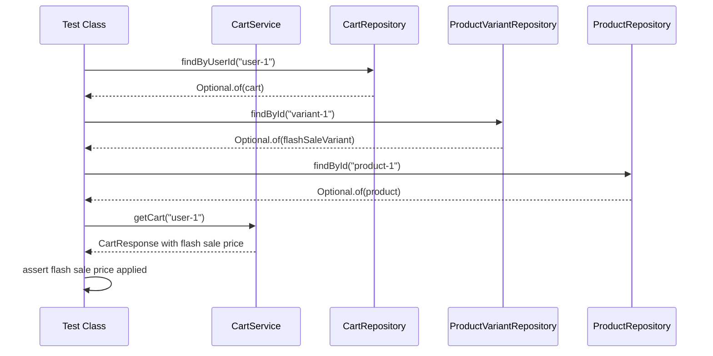

# Unit Testing Framework

<cite>
**Referenced Files in This Document**
- [CartServiceImplTest.java](file://src/Backend/src/test/java/com/shoppeclone/backend/cart/service/impl/CartServiceImplTest.java)
- [WebhookControllerTest.java](file://src/Backend/src/test/java/com/shoppeclone/backend/shipping/controller/WebhookControllerTest.java)
- [PaymentPromotionIntegrationTest.java](file://src/Backend/src/test/java/com/shoppeclone/backend/integration/PaymentPromotionIntegrationTest.java)
- [pom.xml](file://src/Backend/pom.xml)
</cite>

## Table of Contents
1. [Introduction](#introduction)
2. [Testing Architecture Overview](#testing-architecture-overview)
3. [JUnit 5 Setup and Configuration](#junit-5-setup-and-configuration)
4. [Mockito Integration](#mockito-integration)
5. [Test Class Structure and Annotations](#test-class-structure-and-annotations)
6. [Mock Repository Patterns](#mock-repository-patterns)
7. [Assertion Strategies](#assertion-strategies)
8. [Practical Test Examples](#practical-test-examples)
9. [Testing Philosophy and Best Practices](#testing-philosophy-and-best-practices)
10. [Test Organization Guidelines](#test-organization-guidelines)
11. [Troubleshooting Common Issues](#troubleshooting-common-issues)
12. [Conclusion](#conclusion)

## Introduction

The ShoppeClone backend project employs a comprehensive unit testing framework built on JUnit 5 and Mockito, designed to ensure reliable and maintainable code quality. This testing infrastructure follows modern testing practices with a focus on isolation, dependency injection, and realistic test scenarios.

The testing framework utilizes Spring Boot's test starter alongside Mockito for mocking dependencies, enabling developers to test individual components in isolation while maintaining confidence in the overall system behavior. The setup supports both pure unit tests and integration tests, providing flexibility for different testing scenarios.

## Testing Architecture Overview

The testing architecture follows a layered approach that separates concerns between unit testing and integration testing:

**Diagram sources**
- [CartServiceImplTest.java:27-46](file://src/Backend/src/test/java/com/shoppeclone/backend/cart/service/impl/CartServiceImplTest.java#L27-L46)
- [WebhookControllerTest.java:22-32](file://src/Backend/src/test/java/com/shoppeclone/backend/shipping/controller/WebhookControllerTest.java#L22-L32)

The architecture ensures that tests remain isolated from external dependencies while still validating the complete business logic flow.

## JUnit 5 Setup and Configuration

The project uses JUnit 5 as the primary testing framework, configured through Maven dependencies in the project's POM file. The testing setup includes:

### Core Dependencies

The testing infrastructure relies on several key dependencies:

- **JUnit Jupiter Engine**: Provides the testing engine and annotations
- **Mockito JUnit Jupiter Extension**: Integrates Mockito with JUnit 5 lifecycle
- **AssertJ**: Fluent assertion library for readable test assertions
- **Spring Boot Test Starter**: Enables Spring Boot-specific testing capabilities

### Version Compatibility

The project targets Java 21 with Spring Boot 3.2.3, ensuring compatibility with modern testing frameworks and best practices. The dependency configuration supports both unit testing and integration testing scenarios.

**Section sources**
- [pom.xml:82-92](file://src/Backend/pom.xml#L82-L92)

## Mockito Integration

Mockito serves as the primary mocking framework, integrated seamlessly with JUnit 5 through the Mockito JUnit Jupiter extension. The integration provides automatic lifecycle management and enhanced test readability.

### Key Mockito Features Used

- **@ExtendWith(MockitoExtension.class)**: Enables automatic field injection and lifecycle management
- **@Mock**: Creates mock instances for dependencies
- **@InjectMocks**: Injects mocks into the system under test
- **@Spy**: Creates spy instances for partial mocking scenarios
- **@MockBean**: Spring-specific mock bean replacement for integration tests

### Mock Behavior Configuration

Mockito allows precise control over mock behavior through method stubbing and verification patterns, enabling realistic test scenarios while maintaining test isolation.

**Section sources**
- [CartServiceImplTest.java:13-17](file://src/Backend/src/test/java/com/shoppeclone/backend/cart/service/impl/CartServiceImplTest.java#L13-L17)
- [WebhookControllerTest.java:9-13](file://src/Backend/src/test/java/com/shoppeclone/backend/shipping/controller/WebhookControllerTest.java#L9-L13)

## Test Class Structure and Annotations

The testing framework employs a consistent structure across all test classes, following established conventions for clarity and maintainability.

### Annotation Usage Pattern

**Diagram sources**
- [CartServiceImplTest.java:27-46](file://src/Backend/src/test/java/com/shoppeclone/backend/cart/service/impl/CartServiceImplTest.java#L27-L46)

### Field Declaration Pattern

Each test class follows a standardized field declaration pattern:

1. **Mock Fields**: Declare all dependencies as `@Mock` annotated fields
2. **System Under Test**: Declare the target service as `@InjectMocks`
3. **Test Methods**: Implement individual test scenarios as `@Test` methods

**Section sources**
- [CartServiceImplTest.java:28-46](file://src/Backend/src/test/java/com/shoppeclone/backend/cart/service/impl/CartServiceImplTest.java#L28-L46)
- [WebhookControllerTest.java:23-32](file://src/Backend/src/test/java/com/shoppeclone/backend/shipping/controller/WebhookControllerTest.java#L23-L32)

## Mock Repository Patterns

The testing framework extensively uses Mockito to mock repository dependencies, enabling isolated testing of service layer logic without database dependencies.

### Repository Mock Configuration

**Diagram sources**
- [CartServiceImplTest.java:75-79](file://src/Backend/src/test/java/com/shoppeclone/backend/cart/service/impl/CartServiceImplTest.java#L75-L79)

### Common Mocking Patterns

The test classes demonstrate several effective mocking patterns:

1. **Optional Return Values**: Using `Optional.of()` for successful scenarios
2. **Empty Collections**: Returning empty lists for negative scenarios
3. **Entity Creation**: Building test entities with realistic data
4. **Method Chaining**: Configuring multiple repository behaviors

**Section sources**
- [CartServiceImplTest.java:48-87](file://src/Backend/src/test/java/com/shoppeclone/backend/cart/service/impl/CartServiceImplTest.java#L48-L87)

## Assertion Strategies

The testing framework employs AssertJ for fluent and readable assertions, providing comprehensive validation capabilities across different data types and structures.

### Assertion Types Used

The project demonstrates several assertion patterns:

1. **Size Assertions**: Verifying collection sizes and counts
2. **Value Comparisons**: Using `isEqualByComparingTo()` for decimal precision
3. **Equality Checks**: Standard equality assertions for primitive types
4. **Null Checks**: Validating null safety and optional handling
5. **Property Assertions**: Verifying object property values

### Assertion Flow Patterns

**Diagram sources**
- [CartServiceImplTest.java:81-87](file://src/Backend/src/test/java/com/shoppeclone/backend/cart/service/impl/CartServiceImplTest.java#L81-L87)

**Section sources**
- [CartServiceImplTest.java:83-86](file://src/Backend/src/test/java/com/shoppeclone/backend/cart/service/impl/CartServiceImplTest.java#L83-L86)
- [WebhookControllerTest.java:58-65](file://src/Backend/src/test/java/com/shoppeclone/backend/shipping/controller/WebhookControllerTest.java#L58-L65)

## Practical Test Examples

### Cart Service Test Example

The `CartServiceImplTest` provides an excellent example of testing service layer logic with realistic data scenarios:

#### Test Scenario: Flash Sale Price Application

The test validates that the cart service correctly applies flash sale pricing when applicable:

**Diagram sources**
- [CartServiceImplTest.java:49-87](file://src/Backend/src/test/java/com/shoppeclone/backend/cart/service/impl/CartServiceImplTest.java#L49-L87)

#### Test Data Creation Pattern

The test demonstrates structured test data creation:

1. **Cart Entity**: Creates cart with user ID and items
2. **CartItem**: Defines quantity and variant association
3. **ProductVariant**: Configures flash sale attributes
4. **Product**: Provides product metadata

**Section sources**
- [CartServiceImplTest.java:50-78](file://src/Backend/src/test/java/com/shoppeclone/backend/cart/service/impl/CartServiceImplTest.java#L50-L78)

### Controller Test Example

The `WebhookControllerTest` showcases controller-level testing with realistic payload handling:

#### Test Scenario: Shipping Status Updates

The test validates controller behavior for different shipping status scenarios:

1. **Delivery Success**: Tests completion workflow
2. **Return Processing**: Tests cancellation workflow
3. **State Validation**: Ensures proper state transitions

**Section sources**
- [WebhookControllerTest.java:34-65](file://src/Backend/src/test/java/com/shoppeclone/backend/shipping/controller/WebhookControllerTest.java#L34-L65)
- [WebhookControllerTest.java:67-100](file://src/Backend/src/test/java/com/shoppeclone/backend/shipping/controller/WebhookControllerTest.java#L67-L100)

## Testing Philosophy and Best Practices

The project adheres to several core testing philosophies that ensure maintainable and reliable test suites.

### Isolation Principle

Tests are designed to be completely isolated from external dependencies:

- **Database Independence**: All repository calls are mocked
- **Network Independence**: External API calls are simulated
- **Environment Independence**: Tests run consistently across environments

### Mock-Driven Development

The testing approach follows mock-driven development principles:

1. **Behavior Verification**: Focus on what methods are called, not just return values
2. **State Verification**: Validate resulting state changes
3. **Interaction Testing**: Ensure proper collaboration between components

### Realistic Test Scenarios

Tests incorporate realistic business scenarios:

- **Edge Cases**: Handles boundary conditions and error states
- **Business Rules**: Validates complex business logic
- **Data Integrity**: Ensures data consistency and validation

## Test Organization Guidelines

Effective test organization is crucial for maintainable test suites. The project follows several organizational principles:

### Naming Conventions

Test method names should clearly describe the scenario being tested:

- **Descriptive Names**: Include the action, condition, and expected outcome
- **Camel Case**: Use camelCase for method names
- **Avoid Negative Words**: Prefer positive descriptions

### Test Structure

Each test should follow the Arrange-Act-Assert pattern:

1. **Arrange**: Setup test data and mock behaviors
2. **Act**: Execute the method under test
3. **Assert**: Verify the results and side effects

### Test Data Management

- **Test Data Builders**: Create reusable test data builders
- **Shared Fixtures**: Use shared test data where appropriate
- **Data Validation**: Ensure test data validity and completeness

## Troubleshooting Common Issues

Several common issues can arise when working with the testing framework:

### Mock Configuration Issues

**Problem**: Mocks not properly injected
**Solution**: Ensure `@ExtendWith(MockitoExtension.class)` is present and fields are properly annotated

**Problem**: Mock behavior not applied
**Solution**: Verify method signatures match exactly and use appropriate argument matchers

### Assertion Failures

**Problem**: Decimal comparison failures
**Solution**: Use `isEqualByComparingTo()` for precise decimal comparisons

**Problem**: Null pointer exceptions in assertions
**Solution**: Verify optional values are properly handled before assertions

### Test Isolation Problems

**Problem**: Tests interfering with each other
**Solution**: Ensure proper cleanup and avoid shared mutable state

## Conclusion

The ShoppeClone backend project demonstrates a mature and comprehensive unit testing framework that effectively balances isolation, realism, and maintainability. The combination of JUnit 5, Mockito, and AssertJ provides a robust foundation for reliable software development.

Key strengths of the testing approach include:

- **Consistent Structure**: Uniform test patterns across all components
- **Realistic Scenarios**: Business-focused test cases that validate actual functionality
- **Proper Isolation**: Effective mocking strategies that prevent external dependencies
- **Clear Assertions**: Readable and maintainable assertion patterns

The framework successfully supports both unit testing and integration testing scenarios, providing flexibility for different testing needs while maintaining code quality and reliability standards.

Future enhancements could include expanding test coverage, implementing parameterized tests for edge cases, and adding performance testing capabilities to ensure optimal system behavior under load conditions.