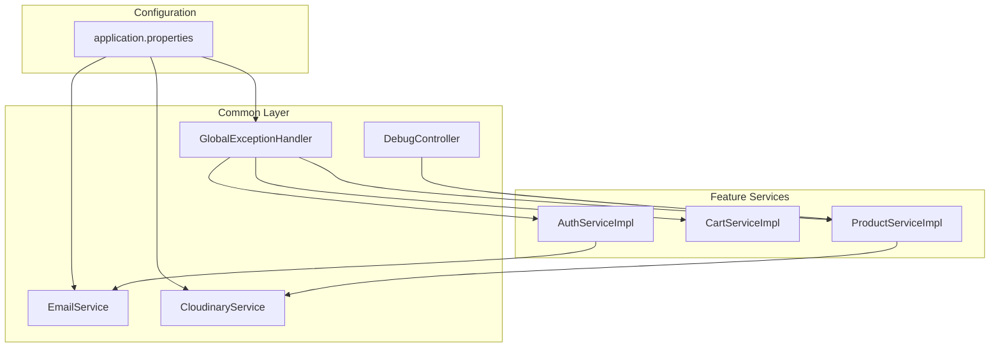
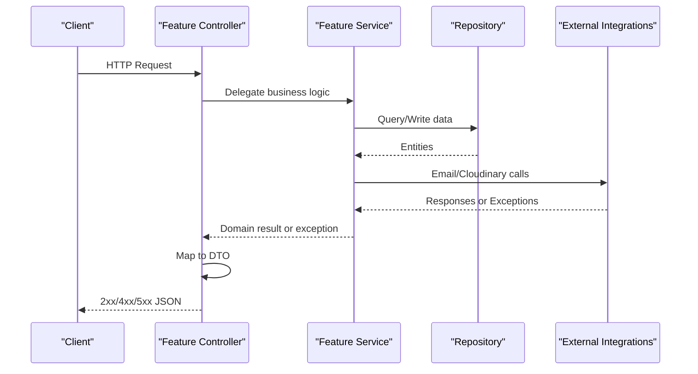
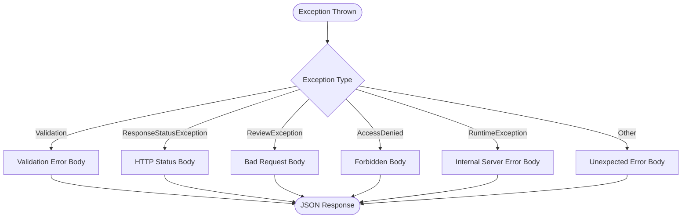
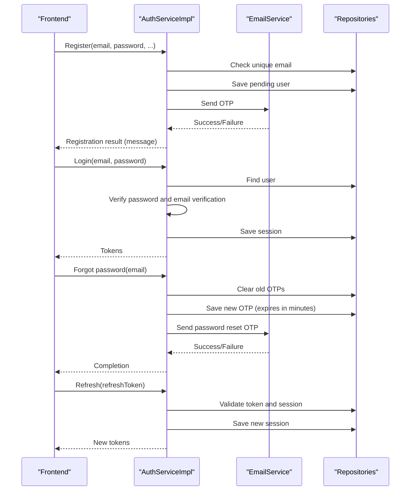
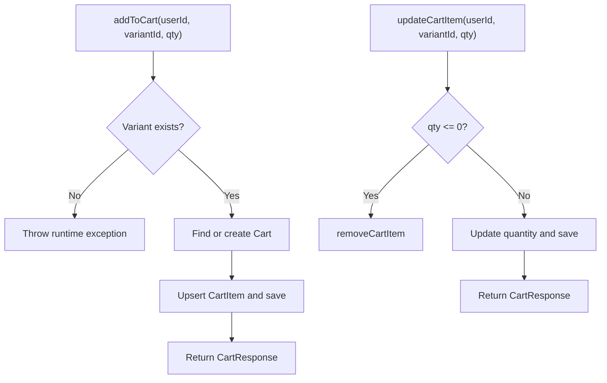
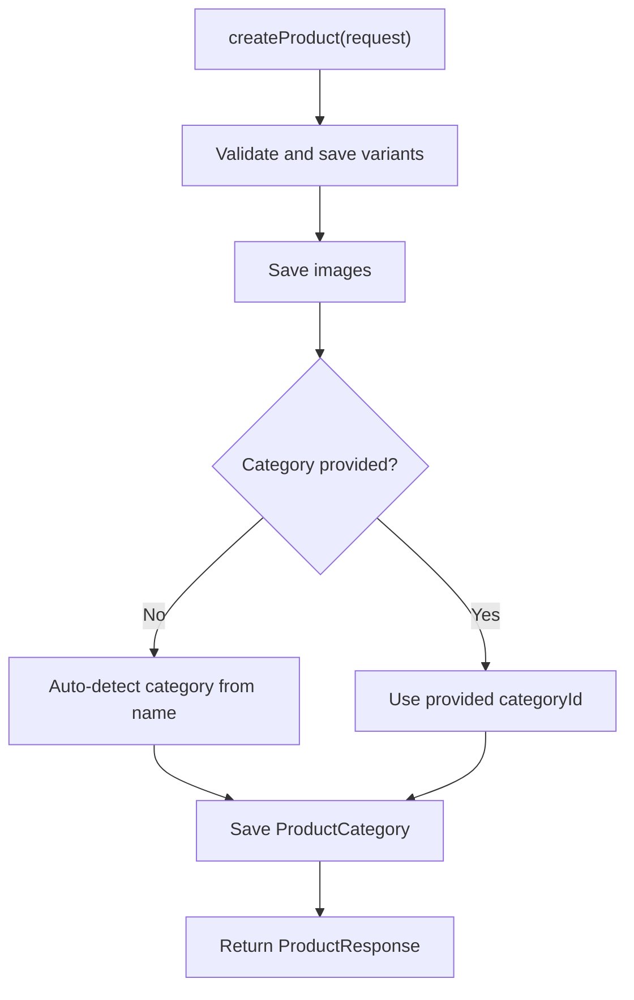
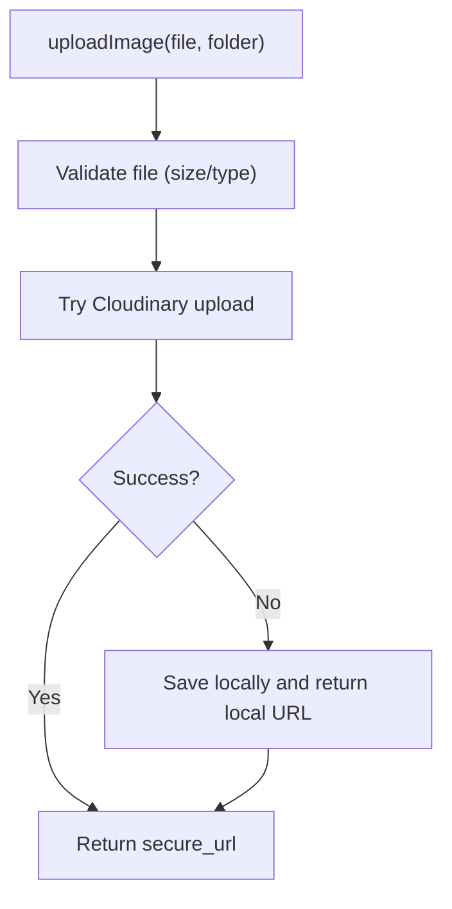
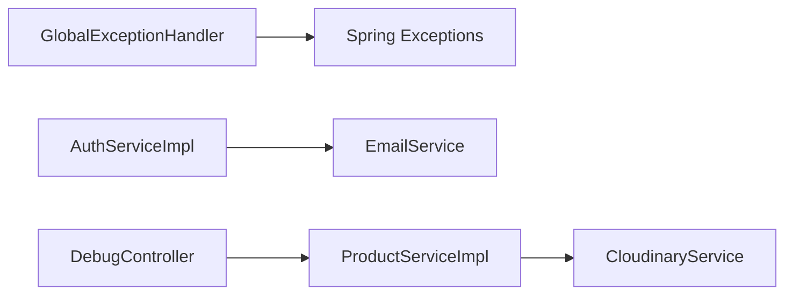

# Troubleshooting & FAQ

<cite>
**Referenced Files in This Document**
- [GlobalExceptionHandler.java](file://src\Backend\src\main\java\com\shoppeclone\backend\common\exception\GlobalExceptionHandler.java)
- [DebugController.java](file://src\Backend\src\main\java\com\shoppeclone\backend\common\controller\DebugController.java)
- [application.properties](file://src\Backend\src\main\resources\application.properties)
- [ReviewException.java](file://src\Backend\src\main\java\com\shoppeclone\backend\review\exception\ReviewException.java)
- [AuthServiceImpl.java](file://src\Backend\src\main\java\com\shoppeclone\backend\auth\service\impl\AuthServiceImpl.java)
- [CartServiceImpl.java](file://src\Backend\src\main\java\com\shoppeclone\backend\cart\service\impl\CartServiceImpl.java)
- [ProductServiceImpl.java](file://src\Backend\src\main\java\com\shoppeclone\backend\product\service\impl\ProductServiceImpl.java)
- [EmailService.java](file://src\Backend\src\main\java\com\shoppeclone\backend\common\service\EmailService.java)
- [CloudinaryService.java](file://src\Backend\src\main\java\com\shoppeclone\backend\common\service\CloudinaryService.java)
</cite>

## Table of Contents
1. [Introduction](#introduction)
2. [Project Structure](#project-structure)
3. [Core Components](#core-components)
4. [Architecture Overview](#architecture-overview)
5. [Detailed Component Analysis](#detailed-component-analysis)
6. [Dependency Analysis](#dependency-analysis)
7. [Performance Considerations](#performance-considerations)
8. [Troubleshooting Guide](#troubleshooting-guide)
9. [Conclusion](#conclusion)
10. [Appendices](#appendices)

## Introduction
This section provides a comprehensive troubleshooting guide and FAQ for the backend. It covers common issues, symptoms, step-by-step resolutions, debugging techniques, log analysis, and diagnostic tools. It also documents error codes, warning messages, and their meanings, along with performance, integration, and configuration pitfalls and fixes.

## Project Structure
The backend follows a layered Spring Boot structure with modular packages for features (auth, product, cart, order, payment, etc.), shared components (common exceptions, services, utilities), and configuration (application.properties). The global exception handler centralizes error responses, while debug endpoints help diagnose data inconsistencies.

**Diagram sources**
- [application.properties:1-114](file://src\Backend\src\main\resources\application.properties#L1-L114)
- [GlobalExceptionHandler.java:1-109](file://src\Backend\src\main\java\com\shoppeclone\backend\common\exception\GlobalExceptionHandler.java#L1-L109)
- [DebugController.java:1-58](file://src\Backend\src\main\java\com\shoppeclone\backend\common\controller\DebugController.java#L1-L58)
- [EmailService.java:1-197](file://src\Backend\src\main\java\com\shoppeclone\backend\common\service\EmailService.java#L1-L197)
- [CloudinaryService.java:1-137](file://src\Backend\src\main\java\com\shoppeclone\backend\common\service\CloudinaryService.java#L1-L137)
- [AuthServiceImpl.java:1-294](file://src\Backend\src\main\java\com\shoppeclone\backend\auth\service\impl\AuthServiceImpl.java#L1-L294)
- [CartServiceImpl.java:1-240](file://src\Backend\src\main\java\com\shoppeclone\backend\cart\service\impl\CartServiceImpl.java#L1-L240)
- [ProductServiceImpl.java:1-657](file://src\Backend\src\main\java\com\shoppeclone\backend\product\service\impl\ProductServiceImpl.java#L1-L657)

**Section sources**
- [application.properties:1-114](file://src\Backend\src\main\resources\application.properties#L1-L114)
- [GlobalExceptionHandler.java:1-109](file://src\Backend\src\main\java\com\shoppeclone\backend\common\exception\GlobalExceptionHandler.java#L1-L109)
- [DebugController.java:1-58](file://src\Backend\src\main\java\com\shoppeclone\backend\common\controller\DebugController.java#L1-L58)
- [EmailService.java:1-197](file://src\Backend\src\main\java\com\shoppeclone\backend\common\service\EmailService.java#L1-L197)
- [CloudinaryService.java:1-137](file://src\Backend\src\main\java\com\shoppeclone\backend\common\service\CloudinaryService.java#L1-L137)
- [AuthServiceImpl.java:1-294](file://src\Backend\src\main\java\com\shoppeclone\backend\auth\service\impl\AuthServiceImpl.java#L1-L294)
- [CartServiceImpl.java:1-240](file://src\Backend\src\main\java\com\shoppeclone\backend\cart\service\impl\CartServiceImpl.java#L1-L240)
- [ProductServiceImpl.java:1-657](file://src\Backend\src\main\java\com\shoppeclone\backend\product\service\impl\ProductServiceImpl.java#L1-L657)

## Core Components
- GlobalExceptionHandler centralizes error responses for validation failures, business exceptions, runtime errors, access denied, and generic server errors. It standardizes JSON error payloads with timestamps, status codes, error reasons, messages, and request paths.
- DebugController exposes endpoints to inspect and fix product-category mappings, aiding diagnosis of promotional eligibility issues.
- application.properties defines environment-driven configuration for MongoDB, JWT, OAuth, email, OTP, Cloudinary, CORS, Tomcat threads, and timezone.
- Feature services (Auth, Cart, Product) throw domain-specific exceptions and rely on shared services (Email, Cloudinary) for integrations.

**Section sources**
- [GlobalExceptionHandler.java:1-109](file://src\Backend\src\main\java\com\shoppeclone\backend\common\exception\GlobalExceptionHandler.java#L1-L109)
- [DebugController.java:1-58](file://src\Backend\src\main\java\com\shoppeclone\backend\common\controller\DebugController.java#L1-L58)
- [application.properties:1-114](file://src\Backend\src\main\resources\application.properties#L1-L114)
- [AuthServiceImpl.java:1-294](file://src\Backend\src\main\java\com\shoppeclone\backend\auth\service\impl\AuthServiceImpl.java#L1-L294)
- [CartServiceImpl.java:1-240](file://src\Backend\src\main\java\com\shoppeclone\backend\cart\service\impl\CartServiceImpl.java#L1-L240)
- [ProductServiceImpl.java:1-657](file://src\Backend\src\main\java\com\shoppeclone\backend\product\service\impl\ProductServiceImpl.java#L1-L657)

## Architecture Overview
The backend routes requests through controllers to services, repositories, and external integrations. Errors are captured centrally and returned as structured JSON. Debug endpoints provide operational diagnostics.

**Diagram sources**
- [GlobalExceptionHandler.java:1-109](file://src\Backend\src\main\java\com\shoppeclone\backend\common\exception\GlobalExceptionHandler.java#L1-L109)
- [EmailService.java:1-197](file://src\Backend\src\main\java\com\shoppeclone\backend\common\service\EmailService.java#L1-L197)
- [CloudinaryService.java:1-137](file://src\Backend\src\main\java\com\shoppeclone\backend\common\service\CloudinaryService.java#L1-L137)
- [AuthServiceImpl.java:1-294](file://src\Backend\src\main\java\com\shoppeclone\backend\auth\service\impl\AuthServiceImpl.java#L1-L294)
- [CartServiceImpl.java:1-240](file://src\Backend\src\main\java\com\shoppeclone\backend\cart\service\impl\CartServiceImpl.java#L1-L240)
- [ProductServiceImpl.java:1-657](file://src\Backend\src\main\java\com\shoppeclone\backend\product\service\impl\ProductServiceImpl.java#L1-L657)

## Detailed Component Analysis

### Global Exception Handling
- Handles validation failures, business exceptions, runtime errors, access denied, and generic server errors.
- Returns standardized JSON with timestamp, status, error reason, message, and path.
- Useful for correlating client-side errors with server logs.

**Diagram sources**
- [GlobalExceptionHandler.java:24-107](file://src\Backend\src\main\java\com\shoppeclone\backend\common\exception\GlobalExceptionHandler.java#L24-L107)

**Section sources**
- [GlobalExceptionHandler.java:1-109](file://src\Backend\src\main\java\com\shoppeclone\backend\common\exception\GlobalExceptionHandler.java#L1-L109)
- [ReviewException.java:1-8](file://src\Backend\src\main\java\com\shoppeclone\backend\review\exception\ReviewException.java#L1-L8)

### Authentication and OTP Flow
- Registration creates a pending user and attempts OTP delivery; logs and exceptions indicate duplicate emails or OTP failures.
- Login requires verified email and active account; otherwise throws runtime exceptions.
- Forgot password generates and persists a time-bound OTP and attempts email delivery; logs backup OTP details if email fails.
- Refresh token validates token and session, then regenerates tokens and updates sessions.

**Diagram sources**
- [AuthServiceImpl.java:46-294](file://src\Backend\src\main\java\com\shoppeclone\backend\auth\service\impl\AuthServiceImpl.java#L46-L294)
- [EmailService.java:14-46](file://src\Backend\src\main\java\com\shoppeclone\backend\common\service\EmailService.java#L14-L46)

**Section sources**
- [AuthServiceImpl.java:1-294](file://src\Backend\src\main\java\com\shoppeclone\backend\auth\service\impl\AuthServiceImpl.java#L1-L294)
- [EmailService.java:1-197](file://src\Backend\src\main\java\com\shoppeclone\backend\common\service\EmailService.java#L1-L197)

### Cart Management
- Retrieves or initializes a user cart, adds/upserts items, updates quantities, removes items, and clears carts.
- Throws runtime exceptions when variants or carts are missing.
- Computes prices considering flash sale availability and stock.

**Diagram sources**
- [CartServiceImpl.java:50-122](file://src\Backend\src\main\java\com\shoppeclone\backend\cart\service\impl\CartServiceImpl.java#L50-L122)

**Section sources**
- [CartServiceImpl.java:1-240](file://src\Backend\src\main\java\com\shoppeclone\backend\cart\service\impl\CartServiceImpl.java#L1-L240)

### Product Catalog and Categories
- Creates products with variants, images, and auto-detected categories; updates and deletes with transactional safeguards.
- Provides search, category filtering, and visibility controls.
- Uses real-time flash sale sold counts from related entities with fallback logging.

**Diagram sources**
- [ProductServiceImpl.java:48-127](file://src\Backend\src\main\java\com\shoppeclone\backend\product\service\impl\ProductServiceImpl.java#L48-L127)

**Section sources**
- [ProductServiceImpl.java:1-657](file://src\Backend\src\main\java\com\shoppeclone\backend\product\service\impl\ProductServiceImpl.java#L1-L657)

### Image Uploads and Cloudinary Integration
- Validates images (type, size), attempts Cloudinary upload, and falls back to local storage with a generated URL.
- Supports deletion by public ID with graceful fallback logging.

**Diagram sources**
- [CloudinaryService.java:36-88](file://src\Backend\src\main\java\com\shoppeclone\backend\common\service\CloudinaryService.java#L36-L88)

**Section sources**
- [CloudinaryService.java:1-137](file://src\Backend\src\main\java\com\shoppeclone\backend\common\service\CloudinaryService.java#L1-L137)

## Dependency Analysis
- GlobalExceptionHandler depends on Spring’s exception types and request context to produce uniform responses.
- Feature services depend on repositories and shared services (Email, Cloudinary).
- DebugController depends on product-related repositories/utilities to fix category mappings.

**Diagram sources**
- [GlobalExceptionHandler.java:1-109](file://src\Backend\src\main\java\com\shoppeclone\backend\common\exception\GlobalExceptionHandler.java#L1-L109)
- [AuthServiceImpl.java:1-294](file://src\Backend\src\main\java\com\shoppeclone\backend\auth\service\impl\AuthServiceImpl.java#L1-L294)
- [ProductServiceImpl.java:1-657](file://src\Backend\src\main\java\com\shoppeclone\backend\product\service\impl\ProductServiceImpl.java#L1-L657)
- [DebugController.java:1-58](file://src\Backend\src\main\java\com\shoppeclone\backend\common\controller\DebugController.java#L1-L58)
- [EmailService.java:1-197](file://src\Backend\src\main\java\com\shoppeclone\backend\common\service\EmailService.java#L1-L197)
- [CloudinaryService.java:1-137](file://src\Backend\src\main\java\com\shoppeclone\backend\common\service\CloudinaryService.java#L1-L137)

**Section sources**
- [GlobalExceptionHandler.java:1-109](file://src\Backend\src\main\java\com\shoppeclone\backend\common\exception\GlobalExceptionHandler.java#L1-L109)
- [AuthServiceImpl.java:1-294](file://src\Backend\src\main\java\com\shoppeclone\backend\auth\service\impl\AuthServiceImpl.java#L1-L294)
- [ProductServiceImpl.java:1-657](file://src\Backend\src\main\java\com\shoppeclone\backend\product\service\impl\ProductServiceImpl.java#L1-L657)
- [DebugController.java:1-58](file://src\Backend\src\main\java\com\shoppeclone\backend\common\controller\DebugController.java#L1-L58)
- [EmailService.java:1-197](file://src\Backend\src\main\java\com\shoppeclone\backend\common\service\EmailService.java#L1-L197)
- [CloudinaryService.java:1-137](file://src\Backend\src\main\java\com\shoppeclone\backend\common\service\CloudinaryService.java#L1-L137)

## Performance Considerations
- Tomcat thread tuning is configured to support high concurrency during flash sales. Adjust max threads and accept count based on load testing.
- Logging levels are set to DEBUG for development; reduce to INFO/WARN in production to minimize overhead.
- Real-time flash sale sold counts involve cross-table queries; cache or precompute where appropriate to reduce latency.

[No sources needed since this section provides general guidance]

## Troubleshooting Guide

### 1) Authentication and OTP Issues
Symptoms:
- Registration completes but OTP email fails to send.
- Login blocked with “verify OTP” message.
- “Account is locked” on login.
- Forgot password OTP not received.

Resolution steps:
- Confirm email credentials and SMTP settings in configuration.
- Check email service logs for exceptions and verify OTP expiration settings.
- Ensure user email verification flag is set after OTP completion.
- For OTP failures, confirm environment variables for mail username/password are set.

Common error indicators:
- Registration message indicating OTP send failure.
- Runtime exceptions indicating duplicate email or wrong password.
- AccessDenied or forbidden responses when accessing protected endpoints without verified OTP.

**Section sources**
- [AuthServiceImpl.java:78-94](file://src\Backend\src\main\java\com\shoppeclone\backend\auth\service\impl\AuthServiceImpl.java#L78-L94)
- [AuthServiceImpl.java:107-122](file://src\Backend\src\main\java\com\shoppeclone\backend\auth\service\impl\AuthServiceImpl.java#L107-L122)
- [AuthServiceImpl.java:211-253](file://src\Backend\src\main\java\com\shoppeclone\backend\auth\service\impl\AuthServiceImpl.java#L211-L253)
- [EmailService.java:14-46](file://src\Backend\src\main\java\com\shoppeclone\backend\common\service\EmailService.java#L14-L46)

### 2) Cart Operations Failures
Symptoms:
- “Product variant not found” when adding items.
- “Cart not found” when updating/removing items.
- Unexpected price or stock not reflected.

Resolution steps:
- Verify variant IDs exist in the product variant repository.
- Ensure cart initialization occurs per user ID.
- Confirm flash sale pricing logic and stock thresholds.

**Section sources**
- [CartServiceImpl.java:52-80](file://src\Backend\src\main\java\com\shoppeclone\backend\cart\service\impl\CartServiceImpl.java#L52-L80)
- [CartServiceImpl.java:84-100](file://src\Backend\src\main\java\com\shoppeclone\backend\cart\service\impl\CartServiceImpl.java#L84-L100)
- [CartServiceImpl.java:104-112](file://src\Backend\src\main\java\com\shoppeclone\backend\cart\service\impl\CartServiceImpl.java#L104-L112)

### 3) Product Creation and Category Mapping
Symptoms:
- Product created without category; promotional discounts not applied.
- Auto-detection returns no category.

Resolution steps:
- Use the debug endpoint to fix category by product ID.
- Manually assign category if auto-detection fails.
- Ensure category names match expected detection logic.

**Section sources**
- [DebugController.java:36-56](file://src\Backend\src\main\java\com\shoppeclone\backend\common\controller\DebugController.java#L36-L56)
- [ProductServiceImpl.java:114-124](file://src\Backend\src\main\java\com\shoppeclone\backend\product\service\impl\ProductServiceImpl.java#L114-L124)

### 4) Image Upload Failures
Symptoms:
- Cloudinary upload fails; fallback to local storage.
- Unsupported image format or oversized file.

Resolution steps:
- Verify Cloudinary environment variables are set.
- Check allowed image types and size limits.
- Confirm fallback local storage directories exist and are writable.

**Section sources**
- [CloudinaryService.java:40-58](file://src\Backend\src\main\java\com\shoppeclone\backend\common\service\CloudinaryService.java#L40-L58)
- [CloudinaryService.java:93-123](file://src\Backend\src\main\java\com\shoppeclone\backend\common\service\CloudinaryService.java#L93-L123)

### 5) Flash Sale Pricing and Stock
Symptoms:
- Prices not reflecting flash sale rates.
- Stock not updating in real time.

Resolution steps:
- Confirm current flash sale campaigns and timing.
- Validate flash sale item records and sold/remaining stock.
- Check logs for exceptions when computing real-time sold counts.

**Section sources**
- [ProductServiceImpl.java:534-550](file://src\Backend\src\main\java\com\shoppeclone\backend\product\service\impl\ProductServiceImpl.java#L534-L550)
- [ProductServiceImpl.java:592-611](file://src\Backend\src\main\java\com\shoppeclone\backend\product\service\impl\ProductServiceImpl.java#L592-L611)

### 6) CORS and Cross-Origin Issues
Symptoms:
- Browser blocks requests from frontend origins.
- Preflight OPTIONS requests fail.

Resolution steps:
- Ensure allowed origins, methods, and headers are configured.
- For production, restrict origins to trusted domains.

**Section sources**
- [application.properties:92-95](file://src\Backend\src\main\resources\application.properties#L92-L95)

### 7) MongoDB Connectivity
Symptoms:
- Startup errors or connection timeouts.
- Circular dependency warnings.

Resolution steps:
- Verify MongoDB URI and database name.
- Confirm network connectivity and credentials.
- Allow circular references only during development if needed.

**Section sources**
- [application.properties:15-17](file://src\Backend\src\main\resources\application.properties#L15-L17)
- [application.properties](file://src\Backend\src\main\resources\application.properties#L98)

### 8) JWT and Security
Symptoms:
- 403 Forbidden on protected endpoints.
- Invalid refresh token errors.

Resolution steps:
- Confirm JWT secret and expiration settings.
- Ensure refresh tokens are stored and validated against sessions.
- Check security filters and roles.

**Section sources**
- [application.properties:25-31](file://src\Backend\src\main\resources\application.properties#L25-L31)
- [AuthServiceImpl.java:144-150](file://src\Backend\src\main\java\com\shoppeclone\backend\auth\service\impl\AuthServiceImpl.java#L144-L150)
- [GlobalExceptionHandler.java:96-107](file://src\Backend\src\main\java\com\shoppeclone\backend\common\exception\GlobalExceptionHandler.java#L96-L107)

### 9) Logging and Diagnostics
Symptoms:
- Insufficient logs for debugging.
- Excessive logs in production.

Resolution steps:
- Increase logging levels for development (as configured).
- Reduce log levels in production.
- Use the debug endpoints to inspect internal state.

**Section sources**
- [application.properties:46-49](file://src\Backend\src\main\resources\application.properties#L46-L49)
- [DebugController.java:25-28](file://src\Backend\src\main\java\com\shoppeclone\backend\common\controller\DebugController.java#L25-L28)

### 10) Error Codes and Messages
Common HTTP statuses and causes:
- 400 Bad Request
  - Validation failures (field-level messages).
  - Business rule violations (e.g., duplicate email, invalid OTP).
- 401 Unauthorized
  - Missing or invalid authentication.
- 403 Forbidden
  - Access denied (e.g., unverified user attempting protected action).
- 404 Not Found
  - Missing resources (e.g., user, cart, product, variant).
- 500 Internal Server Error
  - Unexpected errors and unhandled exceptions.

Standardized error payload fields:
- timestamp: server time of error.
- status: HTTP status code.
- error: human-readable reason.
- message: detailed error message.
- path: requested URI.

**Section sources**
- [GlobalExceptionHandler.java:24-94](file://src\Backend\src\main\java\com\shoppeclone\backend\common\exception\GlobalExceptionHandler.java#L24-L94)

## Conclusion
This guide consolidates actionable troubleshooting procedures, diagnostic techniques, and configuration checks for the backend. By leveraging standardized error responses, debug endpoints, and environment configurations, teams can quickly isolate and resolve issues across authentication, cart, product, and integration layers.

[No sources needed since this section summarizes without analyzing specific files]

## Appendices

### A) Quick Reference: Common Commands and Endpoints
- Debug product categories: GET /api/debug/product-categories
- Fix product category: POST /api/debug/products/{productId}/fix-category
- Typical auth endpoints: POST /api/auth/register, POST /api/auth/login, POST /api/auth/forgot-password, POST /api/auth/refresh

**Section sources**
- [DebugController.java:25-56](file://src\Backend\src\main\java\com\shoppeclone\backend\common\controller\DebugController.java#L25-L56)

### B) Environment Variables Checklist
- JWT_SECRET, JWT_EXPIRATION, JWT_REFRESH_EXPIRATION
- GOOGLE_CLIENT_ID, GOOGLE_CLIENT_SECRET
- MAIL_USERNAME, MAIL_PASSWORD
- OTP_EXPIRATION
- CLOUDINARY_CLOUD_NAME, CLOUDINARY_API_KEY, CLOUDINARY_API_SECRET
- MongoDB URI and database name

**Section sources**
- [application.properties:25-28](file://src\Backend\src\main\resources\application.properties#L25-L28)
- [application.properties:59-67](file://src\Backend\src\main\resources\application.properties#L59-L67)
- [application.properties:75-80](file://src\Backend\src\main\resources\application.properties#L75-L80)
- [application.properties:87-89](file://src\Backend\src\main\resources\application.properties#L87-L89)
- [application.properties:15-17](file://src\Backend\src\main\resources\application.properties#L15-L17)