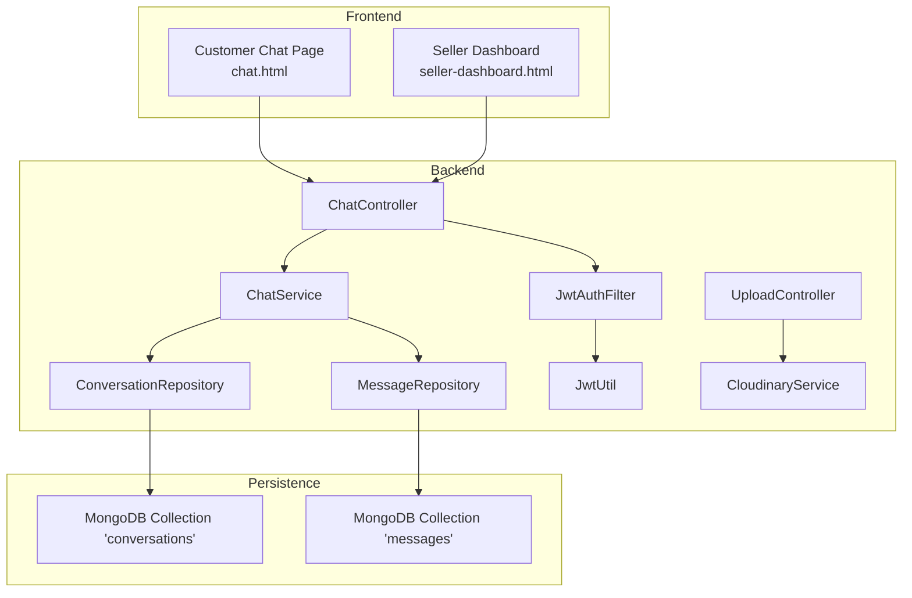
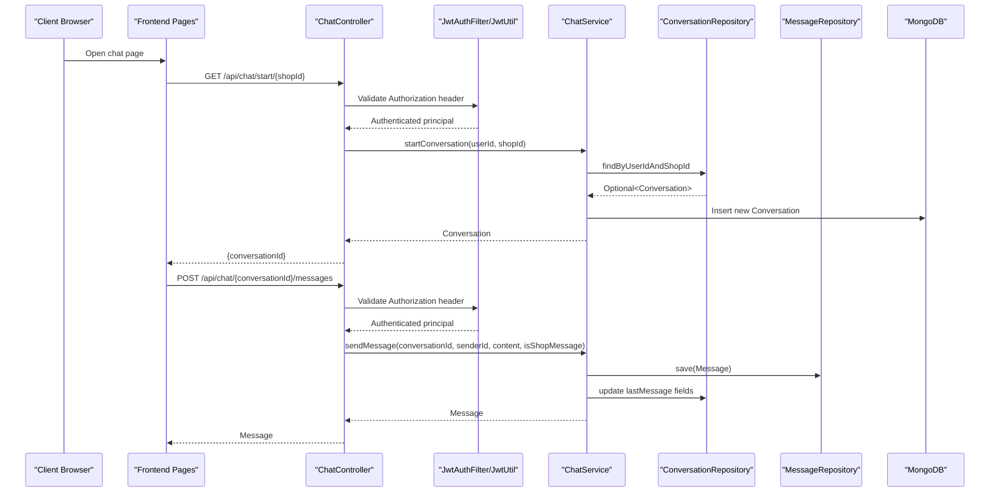
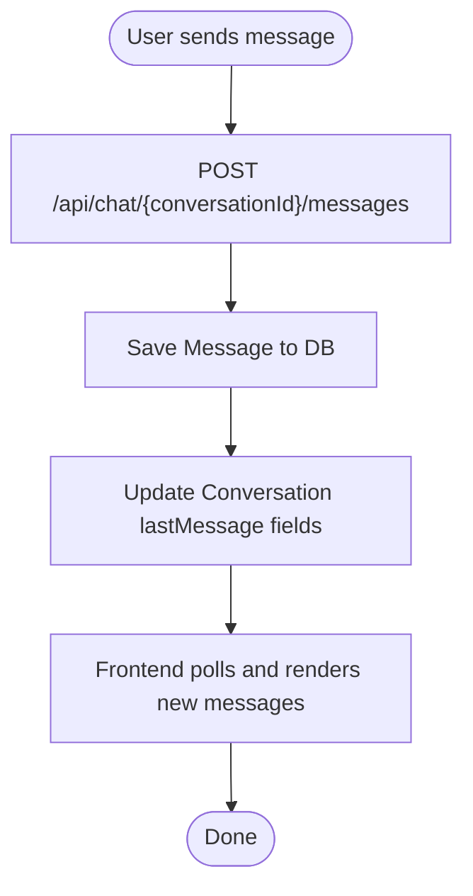
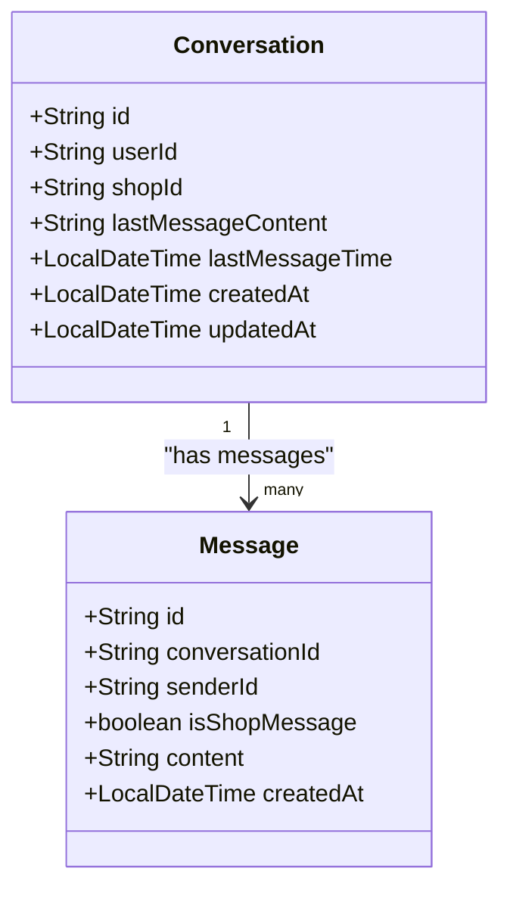
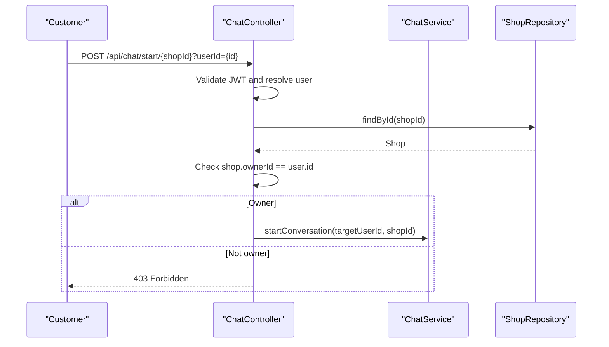
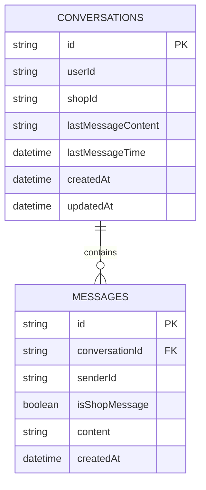
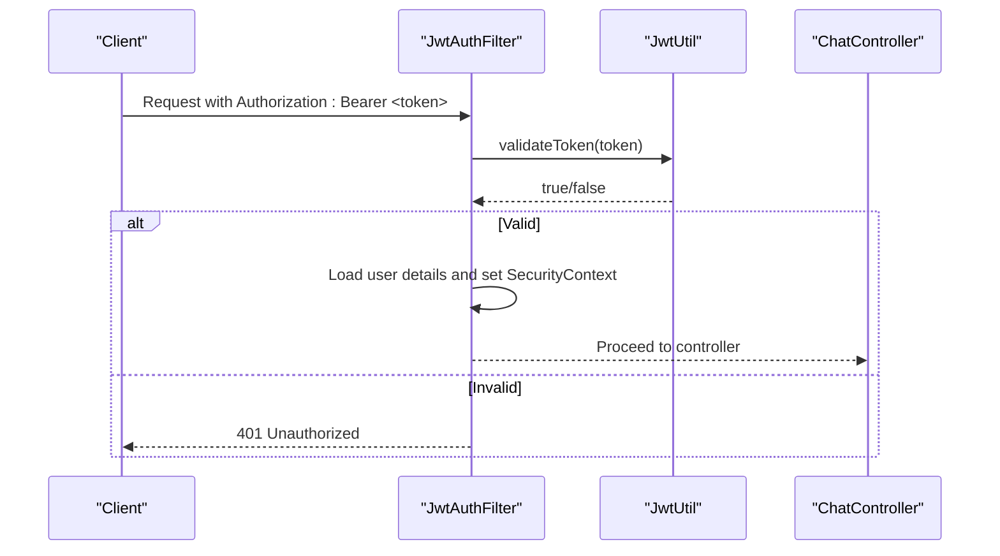
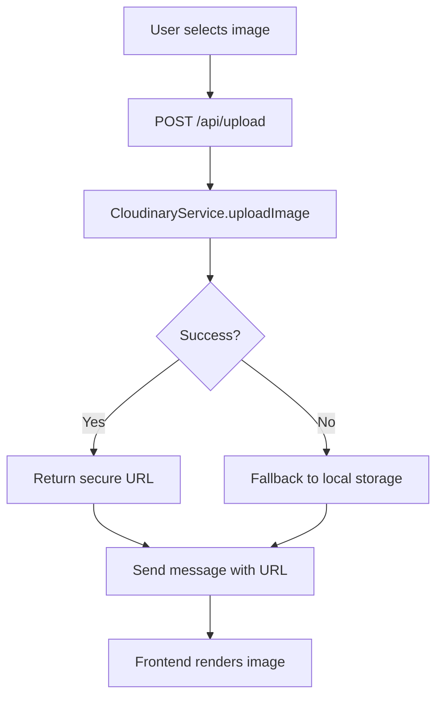
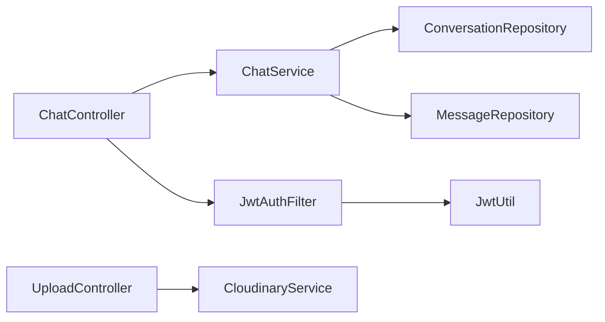

# Customer Chat System

<cite>
**Referenced Files in This Document**
- [ChatController.java](file://src/Backend/src/main/java/com/shoppeclone/backend/chat/controller/ChatController.java)
- [ChatService.java](file://src/Backend/src/main/java/com/shoppeclone/backend/chat/service/ChatService.java)
- [Conversation.java](file://src/Backend/src/main/java/com/shoppeclone/backend/chat/entity/Conversation.java)
- [Message.java](file://src/Backend/src/main/java/com/shoppeclone/backend/chat/entity/Message.java)
- [ConversationRepository.java](file://src/Backend/src/main/java/com/shoppeclone/backend/chat/repository/ConversationRepository.java)
- [MessageRepository.java](file://src/Backend/src/main/java/com/shoppeclone/backend/chat/repository/MessageRepository.java)
- [User.java](file://src/Backend/src/main/java/com/shoppeclone/backend/auth/model/User.java)
- [Shop.java](file://src/Backend/src/main/java/com/shoppeclone/backend/shop/entity/Shop.java)
- [JwtUtil.java](file://src/Backend/src/main/java/com/shoppeclone/backend/auth/security/JwtUtil.java)
- [JwtAuthFilter.java](file://src/Backend/src/main/java/com/shoppeclone/backend/auth/security/JwtAuthFilter.java)
- [UploadController.java](file://src/Backend/src/main/java/com/shoppeclone/backend/common/controller/UploadController.java)
- [CloudinaryService.java](file://src/Backend/src/main/java/com/shoppeclone/backend/common/service/CloudinaryService.java)
- [application.properties](file://src/Backend/src/main/resources/application.properties)
- [chat.html](file://src/Frontend/chat.html)
- [seller-dashboard.html](file://src/Frontend/seller-dashboard.html)
</cite>

## Table of Contents
1. [Introduction](#introduction)
2. [Project Structure](#project-structure)
3. [Core Components](#core-components)
4. [Architecture Overview](#architecture-overview)
5. [Detailed Component Analysis](#detailed-component-analysis)
6. [Dependency Analysis](#dependency-analysis)
7. [Performance Considerations](#performance-considerations)
8. [Troubleshooting Guide](#troubleshooting-guide)
9. [Conclusion](#conclusion)
10. [Appendices](#appendices)

## Introduction
This document describes the customer chat system that powers real-time messaging between buyers and sellers, with optional administrative oversight. It explains the real-time messaging infrastructure, conversation management, participant roles (customer, seller, admin), chat API endpoints, message persistence, delivery confirmation, read receipts, authentication integration, conversation threading, and attachment handling. It also covers chat workflows, escalation to human agents, automated responses, compliance considerations, and performance optimization for concurrent conversations and message history management.

## Project Structure
The chat system spans backend Spring Boot controllers, services, repositories, and MongoDB entities, plus frontend pages for customer and seller experiences. Authentication is JWT-based and enforced via a servlet filter. Attachments are handled via Cloudinary or local fallback.

**Diagram sources**
- [ChatController.java:20-134](file://src/Backend/src/main/java/com/shoppeclone/backend/chat/controller/ChatController.java#L20-L134)
- [ChatService.java:20-125](file://src/Backend/src/main/java/com/shoppeclone/backend/chat/service/ChatService.java#L20-L125)
- [ConversationRepository.java:10-17](file://src/Backend/src/main/java/com/shoppeclone/backend/chat/repository/ConversationRepository.java#L10-L17)
- [MessageRepository.java:9-14](file://src/Backend/src/main/java/com/shoppeclone/backend/chat/repository/MessageRepository.java#L9-L14)
- [JwtAuthFilter.java:16-46](file://src/Backend/src/main/java/com/shoppeclone/backend/auth/security/JwtAuthFilter.java#L16-L46)
- [JwtUtil.java:12-65](file://src/Backend/src/main/java/com/shoppeclone/backend/auth/security/JwtUtil.java#L12-L65)
- [UploadController.java:12-34](file://src/Backend/src/main/java/com/shoppeclone/backend/common/controller/UploadController.java#L12-L34)
- [CloudinaryService.java:20-137](file://src/Backend/src/main/java/com/shoppeclone/backend/common/service/CloudinaryService.java#L20-L137)

**Section sources**
- [ChatController.java:20-134](file://src/Backend/src/main/java/com/shoppeclone/backend/chat/controller/ChatController.java#L20-L134)
- [ChatService.java:20-125](file://src/Backend/src/main/java/com/shoppeclone/backend/chat/service/ChatService.java#L20-L125)
- [ConversationRepository.java:10-17](file://src/Backend/src/main/java/com/shoppeclone/backend/chat/repository/ConversationRepository.java#L10-L17)
- [MessageRepository.java:9-14](file://src/Backend/src/main/java/com/shoppeclone/backend/chat/repository/MessageRepository.java#L9-L14)
- [JwtAuthFilter.java:16-46](file://src/Backend/src/main/java/com/shoppeclone/backend/auth/security/JwtAuthFilter.java#L16-L46)
- [JwtUtil.java:12-65](file://src/Backend/src/main/java/com/shoppeclone/backend/auth/security/JwtUtil.java#L12-L65)
- [UploadController.java:12-34](file://src/Backend/src/main/java/com/shoppeclone/backend/common/controller/UploadController.java#L12-L34)
- [CloudinaryService.java:20-137](file://src/Backend/src/main/java/com/shoppeclone/backend/common/service/CloudinaryService.java#L20-L137)

## Core Components
- ChatController: Exposes REST endpoints for starting conversations, sending/retrieving messages, retrieving a single conversation, deleting messages/conversations, and listing shop conversations.
- ChatService: Orchestrates conversation creation, message sending, retrieval, deduplication by user per shop, and deletion with participant verification.
- Conversation and Message entities: Persisted in MongoDB collections with indexes for efficient lookups.
- Repositories: Typed Spring Data MongoDB repositories for conversations and messages.
- Authentication: JWT-based authentication validated by JwtAuthFilter and JwtUtil.
- Upload and Cloudinary: Image upload endpoint and service supporting Cloudinary with local fallback.

**Section sources**
- [ChatController.java:20-134](file://src/Backend/src/main/java/com/shoppeclone/backend/chat/controller/ChatController.java#L20-L134)
- [ChatService.java:20-125](file://src/Backend/src/main/java/com/shoppeclone/backend/chat/service/ChatService.java#L20-L125)
- [Conversation.java:13-35](file://src/Backend/src/main/java/com/shoppeclone/backend/chat/entity/Conversation.java#L13-L35)
- [Message.java:11-32](file://src/Backend/src/main/java/com/shoppeclone/backend/chat/entity/Message.java#L11-L32)
- [ConversationRepository.java:10-17](file://src/Backend/src/main/java/com/shoppeclone/backend/chat/repository/ConversationRepository.java#L10-L17)
- [MessageRepository.java:9-14](file://src/Backend/src/main/java/com/shoppeclone/backend/chat/repository/MessageRepository.java#L9-L14)
- [JwtUtil.java:12-65](file://src/Backend/src/main/java/com/shoppeclone/backend/auth/security/JwtUtil.java#L12-L65)
- [JwtAuthFilter.java:16-46](file://src/Backend/src/main/java/com/shoppeclone/backend/auth/security/JwtAuthFilter.java#L16-L46)
- [UploadController.java:12-34](file://src/Backend/src/main/java/com/shoppeclone/backend/common/controller/UploadController.java#L12-L34)
- [CloudinaryService.java:20-137](file://src/Backend/src/main/java/com/shoppeclone/backend/common/service/CloudinaryService.java#L20-L137)

## Architecture Overview
The system uses a layered architecture:
- Presentation: Frontend pages for customer and seller chat.
- API: ChatController handles requests and delegates to ChatService.
- Domain: ChatService encapsulates business logic.
- Persistence: Repositories manage MongoDB collections.
- Security: JwtAuthFilter validates JWT tokens and populates SecurityContext.
- Media: UploadController and CloudinaryService handle image attachments.

**Diagram sources**
- [ChatController.java:28-101](file://src/Backend/src/main/java/com/shoppeclone/backend/chat/controller/ChatController.java#L28-L101)
- [ChatService.java:27-66](file://src/Backend/src/main/java/com/shoppeclone/backend/chat/service/ChatService.java#L27-L66)
- [ConversationRepository.java:11-16](file://src/Backend/src/main/java/com/shoppeclone/backend/chat/repository/ConversationRepository.java#L11-L16)
- [MessageRepository.java:9-14](file://src/Backend/src/main/java/com/shoppeclone/backend/chat/repository/MessageRepository.java#L9-L14)
- [JwtAuthFilter.java:23-42](file://src/Backend/src/main/java/com/shoppeclone/backend/auth/security/JwtAuthFilter.java#L23-L42)
- [JwtUtil.java:45-56](file://src/Backend/src/main/java/com/shoppeclone/backend/auth/security/JwtUtil.java#L45-L56)

## Detailed Component Analysis

### Real-Time Messaging Infrastructure
- Frontend polling: The customer chat page polls for new messages at intervals to simulate near-real-time updates.
- Message rendering: Messages are aligned by sender identity; customer and shop-side views differ slightly in alignment logic.
- Attachment support: Images are uploaded via a dedicated endpoint and returned as URLs embedded as message content.

**Diagram sources**
- [ChatController.java:74-101](file://src/Backend/src/main/java/com/shoppeclone/backend/chat/controller/ChatController.java#L74-L101)
- [ChatService.java:47-66](file://src/Backend/src/main/java/com/shoppeclone/backend/chat/service/ChatService.java#L47-L66)
- [chat.html:333-337](file://src/Frontend/chat.html#L333-L337)
- [chat.html:396-410](file://src/Frontend/chat.html#L396-L410)

**Section sources**
- [chat.html:333-337](file://src/Frontend/chat.html#L333-L337)
- [chat.html:396-410](file://src/Frontend/chat.html#L396-L410)
- [UploadController.java:20-32](file://src/Backend/src/main/java/com/shoppeclone/backend/common/controller/UploadController.java#L20-L32)
- [CloudinaryService.java:36-58](file://src/Backend/src/main/java/com/shoppeclone/backend/common/service/CloudinaryService.java#L36-L58)

### Conversation Management
- Conversation lifecycle:
  - Creation: startConversation associates a user and shop, deduplicating by user-shop pair.
  - Retrieval: getConversation and getMessages fetch by conversationId.
  - Listing: getConversationsByShop returns latest conversation per user per shop.
  - Deletion: deleteConversation verifies participant (user or shop owner) and cascades deletes messages.

**Diagram sources**
- [Conversation.java:13-35](file://src/Backend/src/main/java/com/shoppeclone/backend/chat/entity/Conversation.java#L13-L35)
- [Message.java:11-32](file://src/Backend/src/main/java/com/shoppeclone/backend/chat/entity/Message.java#L11-L32)

**Section sources**
- [ChatService.java:27-88](file://src/Backend/src/main/java/com/shoppeclone/backend/chat/service/ChatService.java#L27-L88)
- [ConversationRepository.java:11-16](file://src/Backend/src/main/java/com/shoppeclone/backend/chat/repository/ConversationRepository.java#L11-L16)
- [MessageRepository.java:9-14](file://src/Backend/src/main/java/com/shoppeclone/backend/chat/repository/MessageRepository.java#L9-L14)

### Participant Roles and Permissions
- Participants:
  - Customer: Starts chats, sends messages, deletes own messages, lists personal conversations.
  - Seller (via dashboard): Can view and manage conversations for their shop.
  - Admin: Not directly modeled in chat endpoints; administrative oversight is outside the scope of the documented endpoints.
- Permission checks:
  - Controllers validate JWT and resolve the current user.
  - Controllers restrict starting a chat with a specific user to the shop owner.
  - Message deletion requires the logged-in user to match the message’s senderId.
  - Conversation deletion requires the logged-in user to be the conversation participant or the shop owner.

**Diagram sources**
- [ChatController.java:28-51](file://src/Backend/src/main/java/com/shoppeclone/backend/chat/controller/ChatController.java#L28-L51)
- [ChatService.java:27-41](file://src/Backend/src/main/java/com/shoppeclone/backend/chat/service/ChatService.java#L27-L41)

**Section sources**
- [ChatController.java:28-51](file://src/Backend/src/main/java/com/shoppeclone/backend/chat/controller/ChatController.java#L28-L51)
- [ChatController.java:103-131](file://src/Backend/src/main/java/com/shoppeclone/backend/chat/controller/ChatController.java#L103-L131)
- [ChatService.java:90-123](file://src/Backend/src/main/java/com/shoppeclone/backend/chat/service/ChatService.java#L90-L123)

### Chat API Endpoints
- Start a conversation
  - Method: POST
  - Path: /api/chat/start/{shopId}
  - Query: userId (optional)
  - Auth: Required
  - Behavior: Creates or retrieves a conversation for the given user and shop; shop owner may initiate on behalf of a specific user.
- Retrieve messages
  - Method: GET
  - Path: /api/chat/{conversationId}/messages
  - Auth: Required
  - Behavior: Returns all messages ordered chronologically.
- Retrieve a conversation
  - Method: GET
  - Path: /api/chat/conversation/{conversationId}
  - Auth: Not enforced in controller (returns 404 if not found)
  - Behavior: Returns the conversation metadata.
- List shop conversations
  - Method: GET
  - Path: /api/chat/shop/{shopId}/conversations
  - Auth: Not enforced in controller
  - Behavior: Returns latest conversation per user for the shop.
- Send a message
  - Method: POST
  - Path: /api/chat/{conversationId}/messages
  - Auth: Required
  - Body: { content: string }
  - Behavior: Stores message and updates conversation lastMessage fields; distinguishes shop vs customer messages.
- Delete a message
  - Method: DELETE
  - Path: /api/chat/messages/{messageId}
  - Auth: Required
  - Behavior: Only the sender can delete.
- Delete a conversation
  - Method: DELETE
  - Path: /api/chat/conversations/{conversationId}
  - Auth: Required
  - Behavior: Only participants (user or shop owner) can delete.

**Section sources**
- [ChatController.java:28-101](file://src/Backend/src/main/java/com/shoppeclone/backend/chat/controller/ChatController.java#L28-L101)
- [ChatController.java:103-131](file://src/Backend/src/main/java/com/shoppeclone/backend/chat/controller/ChatController.java#L103-L131)
- [ChatService.java:43-88](file://src/Backend/src/main/java/com/shoppeclone/backend/chat/service/ChatService.java#L43-L88)
- [ChatService.java:90-123](file://src/Backend/src/main/java/com/shoppeclone/backend/chat/service/ChatService.java#L90-L123)

### Message Persistence Strategy
- Conversations:
  - Indexed compound index on (userId, shopId) ensures uniqueness and fast lookup.
  - Tracks lastMessageContent and lastMessageTime for efficient listing.
- Messages:
  - Indexed conversationId for fast retrieval.
  - Created timestamps enable chronological ordering.
- Transactionality:
  - Message send and conversation update occur in a single transactional unit.

**Diagram sources**
- [Conversation.java:13-35](file://src/Backend/src/main/java/com/shoppeclone/backend/chat/entity/Conversation.java#L13-L35)
- [Message.java:11-32](file://src/Backend/src/main/java/com/shoppeclone/backend/chat/entity/Message.java#L11-L32)
- [ConversationRepository.java:11-16](file://src/Backend/src/main/java/com/shoppeclone/backend/chat/repository/ConversationRepository.java#L11-L16)
- [MessageRepository.java:9-14](file://src/Backend/src/main/java/com/shoppeclone/backend/chat/repository/MessageRepository.java#L9-L14)

**Section sources**
- [Conversation.java:13-35](file://src/Backend/src/main/java/com/shoppeclone/backend/chat/entity/Conversation.java#L13-L35)
- [Message.java:11-32](file://src/Backend/src/main/java/com/shoppeclone/backend/chat/entity/Message.java#L11-L32)
- [ConversationRepository.java:11-16](file://src/Backend/src/main/java/com/shoppeclone/backend/chat/repository/ConversationRepository.java#L11-L16)
- [MessageRepository.java:9-14](file://src/Backend/src/main/java/com/shoppeclone/backend/chat/repository/MessageRepository.java#L9-L14)
- [ChatService.java:47-66](file://src/Backend/src/main/java/com/shoppeclone/backend/chat/service/ChatService.java#L47-L66)

### Delivery Confirmation and Read Receipts
- Delivery confirmation: The system records message creation time and updates the conversation’s lastMessage fields upon send.
- Read receipts: Not implemented in the documented endpoints; no explicit read/unread indicators are present.

**Section sources**
- [ChatService.java:47-66](file://src/Backend/src/main/java/com/shoppeclone/backend/chat/service/ChatService.java#L47-L66)
- [Message.java:29-30](file://src/Backend/src/main/java/com/shoppeclone/backend/chat/entity/Message.java#L29-L30)

### Authentication Integration
- JWT-based authentication:
  - JwtUtil generates and validates access and refresh tokens.
  - JwtAuthFilter extracts Authorization headers, validates tokens, loads user details, and sets SecurityContext.
- Controller usage:
  - @AuthenticationPrincipal resolves the current user for endpoints requiring authentication.

**Diagram sources**
- [JwtAuthFilter.java:23-42](file://src/Backend/src/main/java/com/shoppeclone/backend/auth/security/JwtAuthFilter.java#L23-L42)
- [JwtUtil.java:45-56](file://src/Backend/src/main/java/com/shoppeclone/backend/auth/security/JwtUtil.java#L45-L56)
- [ChatController.java:30-34](file://src/Backend/src/main/java/com/shoppeclone/backend/chat/controller/ChatController.java#L30-L34)

**Section sources**
- [JwtUtil.java:12-65](file://src/Backend/src/main/java/com/shoppeclone/backend/auth/security/JwtUtil.java#L12-L65)
- [JwtAuthFilter.java:16-46](file://src/Backend/src/main/java/com/shoppeclone/backend/auth/security/JwtAuthFilter.java#L16-L46)
- [ChatController.java:30-34](file://src/Backend/src/main/java/com/shoppeclone/backend/chat/controller/ChatController.java#L30-L34)

### Conversation Threading and Attachment Handling
- Conversation threading:
  - Messages are retrieved ordered by creation time for a given conversationId.
  - Frontend renders messages with sender-specific alignment and supports deletion of owned messages.
- Attachments:
  - Upload endpoint accepts multipart/form-data and returns a URL.
  - CloudinaryService validates image type/size and uploads to Cloudinary; falls back to local storage if Cloudinary is unavailable.
  - Frontend detects image URLs and displays images inline.

**Diagram sources**
- [UploadController.java:20-32](file://src/Backend/src/main/java/com/shoppeclone/backend/common/controller/UploadController.java#L20-L32)
- [CloudinaryService.java:36-58](file://src/Backend/src/main/java/com/shoppeclone/backend/common/service/CloudinaryService.java#L36-L58)
- [chat.html:523-554](file://src/Frontend/chat.html#L523-L554)

**Section sources**
- [MessageRepository.java:9-14](file://src/Backend/src/main/java/com/shoppeclone/backend/chat/repository/MessageRepository.java#L9-L14)
- [UploadController.java:20-32](file://src/Backend/src/main/java/com/shoppeclone/backend/common/controller/UploadController.java#L20-L32)
- [CloudinaryService.java:36-58](file://src/Backend/src/main/java/com/shoppeclone/backend/common/service/CloudinaryService.java#L36-L58)
- [chat.html:461-476](file://src/Frontend/chat.html#L461-L476)

### Escalation to Human Agents and Automated Responses
- Escalation: Not modeled in the documented endpoints; seller can manage conversations via the seller dashboard.
- Automated responses: Not implemented in the documented endpoints; future enhancements could integrate AI or rule-based responders.

**Section sources**
- [seller-dashboard.html:5024-5057](file://src/Frontend/seller-dashboard.html#L5024-L5057)

### Compliance Considerations
- Data retention: The system persists messages and conversation metadata; ensure policies for retention and deletion are defined.
- Auditability: Message timestamps and sender identification support audit trails.
- Privacy: JWT-based authentication protects endpoints; ensure secure token storage and rotation.

**Section sources**
- [Message.java:29-30](file://src/Backend/src/main/java/com/shoppeclone/backend/chat/entity/Message.java#L29-L30)
- [JwtUtil.java:12-65](file://src/Backend/src/main/java/com/shoppeclone/backend/auth/security/JwtUtil.java#L12-L65)

## Dependency Analysis
- Controllers depend on services and repositories.
- Services depend on repositories and model entities.
- Authentication filter depends on JwtUtil and user details service.
- Upload controller depends on CloudinaryService.

**Diagram sources**
- [ChatController.java:20-134](file://src/Backend/src/main/java/com/shoppeclone/backend/chat/controller/ChatController.java#L20-L134)
- [ChatService.java:20-125](file://src/Backend/src/main/java/com/shoppeclone/backend/chat/service/ChatService.java#L20-L125)
- [JwtAuthFilter.java:16-46](file://src/Backend/src/main/java/com/shoppeclone/backend/auth/security/JwtAuthFilter.java#L16-L46)
- [JwtUtil.java:12-65](file://src/Backend/src/main/java/com/shoppeclone/backend/auth/security/JwtUtil.java#L12-L65)
- [UploadController.java:12-34](file://src/Backend/src/main/java/com/shoppeclone/backend/common/controller/UploadController.java#L12-L34)
- [CloudinaryService.java:20-137](file://src/Backend/src/main/java/com/shoppeclone/backend/common/service/CloudinaryService.java#L20-L137)

**Section sources**
- [ChatController.java:20-134](file://src/Backend/src/main/java/com/shoppeclone/backend/chat/controller/ChatController.java#L20-L134)
- [ChatService.java:20-125](file://src/Backend/src/main/java/com/shoppeclone/backend/chat/service/ChatService.java#L20-L125)
- [JwtAuthFilter.java:16-46](file://src/Backend/src/main/java/com/shoppeclone/backend/auth/security/JwtAuthFilter.java#L16-L46)
- [JwtUtil.java:12-65](file://src/Backend/src/main/java/com/shoppeclone/backend/auth/security/JwtUtil.java#L12-L65)
- [UploadController.java:12-34](file://src/Backend/src/main/java/com/shoppeclone/backend/common/controller/UploadController.java#L12-L34)
- [CloudinaryService.java:20-137](file://src/Backend/src/main/java/com/shoppeclone/backend/common/service/CloudinaryService.java#L20-L137)

## Performance Considerations
- Concurrency:
  - Tomcat thread pool configured for higher concurrency to support peak traffic.
- Indexing:
  - Compound index on (userId, shopId) for conversations and indexed conversationId for messages improve query performance.
- Polling cadence:
  - Frontend polls every few seconds; tune interval based on expected message volume and latency tolerance.
- Pagination:
  - Current retrieval returns all messages; consider pagination for long histories.
- Caching:
  - Consider caching recent conversation summaries for shop owners.

**Section sources**
- [application.properties:100-109](file://src/Backend/src/main/resources/application.properties#L100-L109)
- [Conversation.java:15-15](file://src/Backend/src/main/java/com/shoppeclone/backend/chat/entity/Conversation.java#L15-L15)
- [MessageRepository.java:10-11](file://src/Backend/src/main/java/com/shoppeclone/backend/chat/repository/MessageRepository.java#L10-L11)
- [chat.html:333-337](file://src/Frontend/chat.html#L333-L337)

## Troubleshooting Guide
- 401 Unauthorized:
  - Ensure Authorization header contains a valid Bearer token.
- 403 Forbidden:
  - Starting a chat with a specific user is restricted to the shop owner.
- Message deletion errors:
  - Only the original sender can delete a message.
- Conversation deletion errors:
  - Only participants (user or shop owner) can delete a conversation.
- Upload failures:
  - Verify Cloudinary configuration or rely on local fallback.

**Section sources**
- [ChatController.java:32-34](file://src/Backend/src/main/java/com/shoppeclone/backend/chat/controller/ChatController.java#L32-L34)
- [ChatController.java:40-42](file://src/Backend/src/main/java/com/shoppeclone/backend/chat/controller/ChatController.java#L40-L42)
- [ChatService.java:90-123](file://src/Backend/src/main/java/com/shoppeclone/backend/chat/service/ChatService.java#L90-L123)
- [CloudinaryService.java:52-57](file://src/Backend/src/main/java/com/shoppeclone/backend/common/service/CloudinaryService.java#L52-L57)

## Conclusion
The chat system provides a robust foundation for customer-seller communication with clear role boundaries, secure authentication, and scalable persistence. Real-time simulation is achieved via client-side polling, while attachments are supported through Cloudinary or local fallback. Future enhancements can include explicit read receipts, escalation workflows, and automated responses, along with pagination and caching for improved performance.

## Appendices

### API Endpoint Reference
- POST /api/chat/start/{shopId}?userId={id}
- GET /api/chat/{conversationId}/messages
- GET /api/chat/conversation/{conversationId}
- GET /api/chat/shop/{shopId}/conversations
- POST /api/chat/{conversationId}/messages
- DELETE /api/chat/messages/{messageId}
- DELETE /api/chat/conversations/{conversationId}
- POST /api/upload

**Section sources**
- [ChatController.java:28-131](file://src/Backend/src/main/java/com/shoppeclone/backend/chat/controller/ChatController.java#L28-L131)
- [UploadController.java:20-32](file://src/Backend/src/main/java/com/shoppeclone/backend/common/controller/UploadController.java#L20-L32)