# Dispute Resolution System

<cite>
**Referenced Files in This Document**
- [DisputeController.java](file://src/Backend/src/main/java/com/shoppeclone/backend/dispute/controller/DisputeController.java)
- [AdminDisputeController.java](file://src/Backend/src/main/java/com/shoppeclone/backend/dispute/controller/AdminDisputeController.java)
- [DisputeService.java](file://src/Backend/src/main/java/com/shoppeclone/backend/dispute/service/DisputeService.java)
- [DisputeServiceImpl.java](file://src/Backend/src/main/java/com/shoppeclone/backend/dispute/service/impl/DisputeServiceImpl.java)
- [Dispute.java](file://src/Backend/src/main/java/com/shoppeclone/backend/dispute/entity/Dispute.java)
- [DisputeStatus.java](file://src/Backend/src/main/java/com/shoppeclone/backend/dispute/entity/DisputeStatus.java)
- [DisputeImage.java](file://src/Backend/src/main/java/com/shoppeclone/backend/dispute/entity/DisputeImage.java)
- [DisputeRepository.java](file://src/Backend/src/main/java/com/shoppeclone/backend/dispute/repository/DisputeRepository.java)
- [DisputeImageRepository.java](file://src/Backend/src/main/java/com/shoppeclone/backend/dispute/repository/DisputeImageRepository.java)
- [CreateDisputeRequest.java](file://src/Backend/src/main/java/com/shoppeclone/backend/dispute/dto/request/CreateDisputeRequest.java)
- [UploadDisputeImageRequest.java](file://src/Backend/src/main/java/com/shoppeclone/backend/dispute/dto/request/UploadDisputeImageRequest.java)
- [AdminReviewDisputeRequest.java](file://src/Backend/src/main/java/com/shoppeclone/backend/dispute/dto/request/AdminReviewDisputeRequest.java)
- [Refund.java](file://src/Backend/src/main/java/com/shoppeclone/backend/refund/entity/Refund.java)
- [RefundStatus.java](file://src/Backend/src/main/java/com/shoppeclone/backend/refund/entity/RefundStatus.java)
- [Order.java](file://src/Backend/src/main/java/com/shoppeclone/backend/order/entity/Order.java)
- [Luong_TraHang_Dispute.md](file://docs/Luong_TraHang_Dispute.md)
</cite>

## Table of Contents
1. [Introduction](#introduction)
2. [System Architecture](#system-architecture)
3. [Core Components](#core-components)
4. [Multi-Stage Dispute Process](#multi-stage-dispute-process)
5. [API Endpoints](#api-endpoints)
6. [Dispute Categorization](#dispute-categorization)
7. [Escalation Workflows](#escalation-workflows)
8. [Integration with Order and Refund Systems](#integration-with-order-and-refund-systems)
9. [Admin Review Process](#admin-review-process)
10. [Evidence Management](#evidence-management)
11. [Timeline Management](#timeline-management)
2. [Common Dispute Scenarios](#common-dispute-scenarios)
3. [Troubleshooting Guide](#troubleshooting-guide)
4. [Conclusion](#conclusion)

## Introduction

The Dispute Resolution System is a comprehensive framework designed to handle customer disputes efficiently and transparently. This system provides a structured multi-stage process for customers to file disputes, submit evidence, and receive resolutions while maintaining seamless integration with order management and refund processing systems.

The system operates on a streamlined approach where customer-initiated disputes automatically trigger administrative review, and approved disputes result in automatic refund processing without requiring separate return procedures. This eliminates complexity for both customers and administrators while ensuring fair resolution outcomes.

## System Architecture

The dispute resolution system follows a layered architecture pattern with clear separation of concerns:

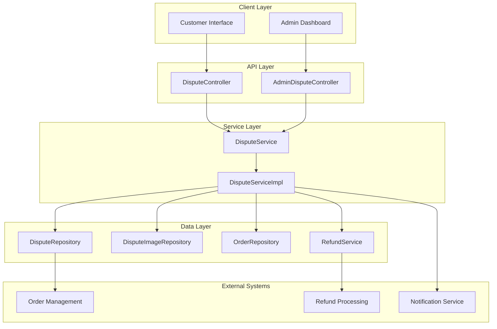

**Diagram sources**
- [DisputeController.java:24-129](file://src/Backend/src/main/java/com/shoppeclone/backend/dispute/controller/DisputeController.java#L24-L129)
- [AdminDisputeController.java:16-45](file://src/Backend/src/main/java/com/shoppeclone/backend/dispute/controller/AdminDisputeController.java#L16-L45)
- [DisputeServiceImpl.java:23-178](file://src/Backend/src/main/java/com/shoppeclone/backend/dispute/service/impl/DisputeServiceImpl.java#L23-L178)

The architecture ensures loose coupling between components while maintaining clear data flow and responsibility segregation. The system leverages Spring Boot's dependency injection and MongoDB for data persistence.

## Core Components

### Dispute Entity

The core dispute entity represents the fundamental unit of the dispute resolution process:

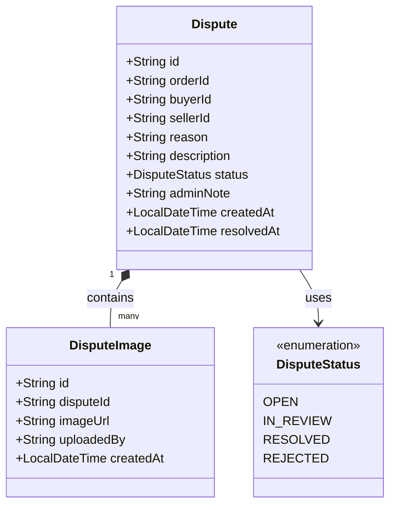

**Diagram sources**
- [Dispute.java:11-33](file://src/Backend/src/main/java/com/shoppeclone/backend/dispute/entity/Dispute.java#L11-L33)
- [DisputeImage.java:10-23](file://src/Backend/src/main/java/com/shoppeclone/backend/dispute/entity/DisputeImage.java#L10-L23)
- [DisputeStatus.java:3-8](file://src/Backend/src/main/java/com/shoppeclone/backend/dispute/entity/DisputeStatus.java#L3-L8)

### Service Layer Architecture

The service layer implements the business logic for dispute management:

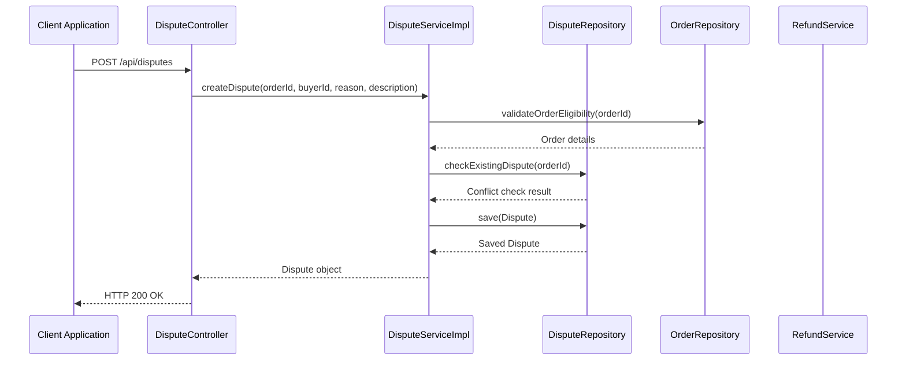

**Diagram sources**
- [DisputeController.java:76-87](file://src/Backend/src/main/java/com/shoppeclone/backend/dispute/controller/DisputeController.java#L76-L87)
- [DisputeServiceImpl.java:52-106](file://src/Backend/src/main/java/com/shoppeclone/backend/dispute/service/impl/DisputeServiceImpl.java#L52-L106)

**Section sources**
- [Dispute.java:1-34](file://src/Backend/src/main/java/com/shoppeclone/backend/dispute/entity/Dispute.java#L1-L34)
- [DisputeImage.java:1-24](file://src/Backend/src/main/java/com/shoppeclone/backend/dispute/entity/DisputeImage.java#L1-L24)
- [DisputeStatus.java:1-9](file://src/Backend/src/main/java/com/shoppeclone/backend/dispute/entity/DisputeStatus.java#L1-L9)
- [DisputeService.java:1-28](file://src/Backend/src/main/java/com/shoppeclone/backend/dispute/service/DisputeService.java#L1-L28)
- [DisputeServiceImpl.java:1-179](file://src/Backend/src/main/java/com/shoppeclone/backend/dispute/service/impl/DisputeServiceImpl.java#L1-L179)

## Multi-Stage Dispute Process

The dispute resolution process follows a structured four-stage workflow:

### Stage 1: Customer Filing
Customers initiate disputes through a simple form containing reason selection and detailed description. The system validates order eligibility and prevents duplicate filings.

### Stage 2: Evidence Submission
Parties can submit supporting evidence including images, documents, and additional information. The system maintains a comprehensive evidence trail for each dispute.

### Stage 3: Admin Review
Administrators review disputes with access to complete evidence, order history, and system-generated recommendations. They can approve refunds or reject disputes based on evidence quality and policy compliance.

### Stage 4: Resolution Outcomes
Approved disputes trigger automatic refund processing, while rejected disputes close the case with appropriate notifications to all parties.

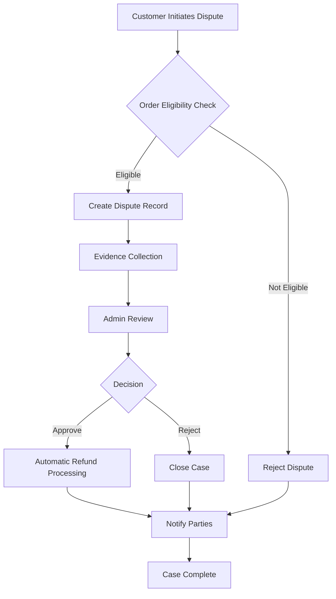

**Diagram sources**
- [DisputeServiceImpl.java:52-106](file://src/Backend/src/main/java/com/shoppeclone/backend/dispute/service/impl/DisputeServiceImpl.java#L52-L106)
- [DisputeServiceImpl.java:134-155](file://src/Backend/src/main/java/com/shoppeclone/backend/dispute/service/impl/DisputeServiceImpl.java#L134-L155)

**Section sources**
- [Luong_TraHang_Dispute.md:13-44](file://docs/Luong_TraHang_Dispute.md#L13-L44)

## API Endpoints

### Customer APIs

The customer-facing API provides comprehensive functionality for dispute management:

#### Create Dispute
**Endpoint**: `POST /api/disputes`
**Description**: Allows customers to file new disputes for eligible orders
**Authentication**: Required (Buyer or Authorized User)
**Request Body**: [CreateDisputeRequest:7-15](file://src/Backend/src/main/java/com/shoppeclone/backend/dispute/dto/request/CreateDisputeRequest.java#L7-L15)
**Response**: [Dispute:11-33](file://src/Backend/src/main/java/com/shoppeclone/backend/dispute/entity/Dispute.java#L11-L33)

#### Upload Evidence Images
**Endpoint**: `POST /api/disputes/{id}/images`
**Description**: Enables image upload as evidence for existing disputes
**Authentication**: Required (Authorized User)
**Request Body**: [UploadDisputeImageRequest:7-9](file://src/Backend/src/main/java/com/shoppeclone/backend/dispute/dto/request/UploadDisputeImageRequest.java#L7-L9)
**Response**: [DisputeImage:10-23](file://src/Backend/src/main/java/com/shoppeclone/backend/dispute/entity/DisputeImage.java#L10-L23)

#### Retrieve Dispute Details
**Endpoint**: `GET /api/disputes/{id}`
**Description**: Fetches complete dispute information with evidence
**Authentication**: Required (Authorized User)

#### Retrieve Dispute Images
**Endpoint**: `GET /api/disputes/{id}/images`
**Description**: Lists all submitted evidence for a dispute
**Authentication**: Required (Authorized User)

#### Find Dispute by Order
**Endpoint**: `GET /api/disputes/order/{orderId}`
**Description**: Locates dispute associated with a specific order
**Authentication**: Required (Authorized User)

### Admin APIs

The administrative API provides comprehensive oversight and decision-making capabilities:

#### List All Disputes
**Endpoint**: `GET /api/admin/disputes`
**Description**: Retrieves all disputes for administrative review
**Authentication**: Required (ADMIN role)
**Authorization**: ADMIN role required

#### Review and Resolve Disputes
**Endpoint**: `PUT /api/admin/disputes/{id}/review`
**Description**: Updates dispute status and optionally approves refunds
**Authentication**: Required (ADMIN role)
**Authorization**: ADMIN role required
**Request Body**: [AdminReviewDisputeRequest:10-19](file://src/Backend/src/main/java/com/shoppeclone/backend/dispute/dto/request/AdminReviewDisputeRequest.java#L10-L19)
**Response**: [Dispute:11-33](file://src/Backend/src/main/java/com/shoppeclone/backend/dispute/entity/Dispute.java#L11-L33)

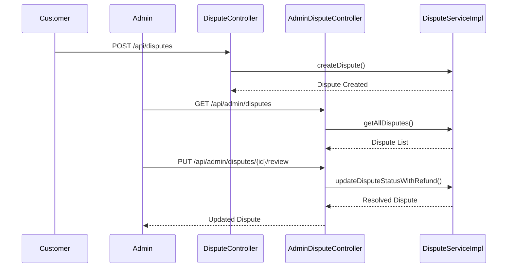

**Diagram sources**
- [DisputeController.java:76-128](file://src/Backend/src/main/java/com/shoppeclone/backend/dispute/controller/DisputeController.java#L76-L128)
- [AdminDisputeController.java:24-44](file://src/Backend/src/main/java/com/shoppeclone/backend/dispute/controller/AdminDisputeController.java#L24-L44)

**Section sources**
- [DisputeController.java:24-129](file://src/Backend/src/main/java/com/shoppeclone/backend/dispute/controller/DisputeController.java#L24-L129)
- [AdminDisputeController.java:16-45](file://src/Backend/src/main/java/com/shoppeclone/backend/dispute/controller/AdminDisputeController.java#L16-L45)

## Dispute Categorization

### Dispute Status Management

The system uses a standardized status tracking mechanism:

| Status | Description | Action Required | System Behavior |
|--------|-------------|----------------|-----------------|
| **OPEN** | New dispute filed | Customer evidence submission | Initial state after creation |
| **IN_REVIEW** | Under administrator review | Administrator decision | Pending resolution |
| **RESOLVED** | Dispute closed with outcome | Automatic refund processing | Final state with resolution |
| **REJECTED** | Dispute denied | Case closure | Final state without resolution |

### Evidence Categories

Evidence submission supports multiple formats and types:

- **Image Evidence**: Photos, screenshots, and visual documentation
- **Document Evidence**: PDFs, scanned documents, and official records  
- **Text Evidence**: Descriptions, explanations, and supporting statements
- **Order History**: Transaction records and purchase details

**Section sources**
- [DisputeStatus.java:1-9](file://src/Backend/src/main/java/com/shoppeclone/backend/dispute/entity/DisputeStatus.java#L1-L9)
- [DisputeImage.java:1-24](file://src/Backend/src/main/java/com/shoppeclone/backend/dispute/entity/DisputeImage.java#L1-L24)

## Escalation Workflows

### Automatic Escalation Triggers

The system implements intelligent escalation mechanisms:

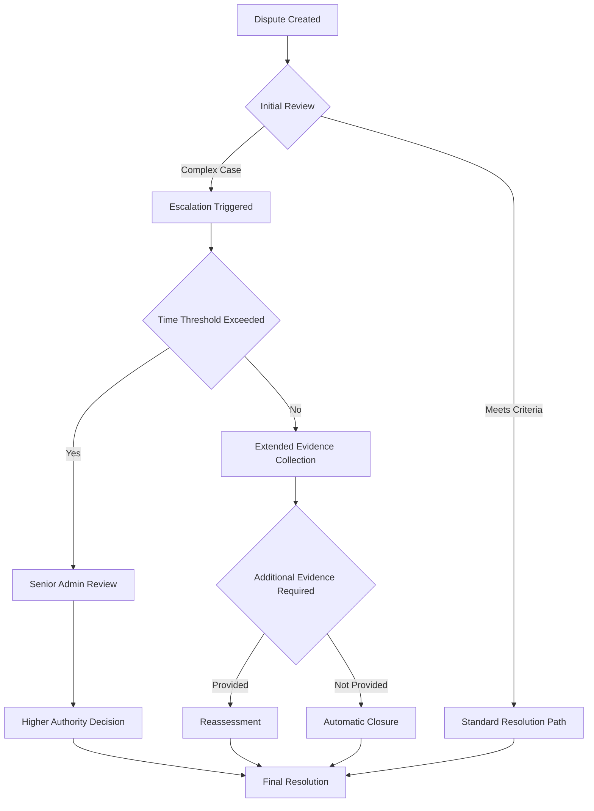

### Escalation Criteria

Escalation occurs automatically when:
- Dispute remains unresolved beyond predefined time limits
- Complex evidence requires specialized expertise
- Multiple parties dispute the same issue
- Policy violations are suspected

**Diagram sources**
- [DisputeServiceImpl.java:108-132](file://src/Backend/src/main/java/com/shoppeclone/backend/dispute/service/impl/DisputeServiceImpl.java#L108-L132)

## Integration with Order and Refund Systems

### Order System Integration

The dispute system maintains tight integration with the order management system:

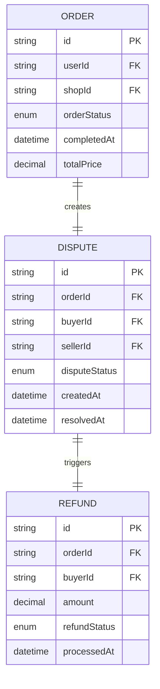

**Diagram sources**
- [Order.java:16-54](file://src/Backend/src/main/java/com/shoppeclone/backend/order/entity/Order.java#L16-L54)
- [Dispute.java:11-33](file://src/Backend/src/main/java/com/shoppeclone/backend/dispute/entity/Dispute.java#L11-L33)
- [Refund.java:12-32](file://src/Backend/src/main/java/com/shoppeclone/backend/refund/entity/Refund.java#L12-L32)

### Automatic Refund Processing

Approved disputes trigger immediate refund processing:

1. **Refund Creation**: System generates refund record with dispute details
2. **Amount Calculation**: Uses dispute amount or full order value
3. **Approval Workflow**: Automatically approves refunds for resolved disputes
4. **Processing**: Initiates refund to customer's original payment method
5. **Stock Management**: Restocks inventory and adjusts seller metrics

**Section sources**
- [DisputeServiceImpl.java:134-155](file://src/Backend/src/main/java/com/shoppeclone/backend/dispute/service/impl/DisputeServiceImpl.java#L134-L155)
- [Refund.java:1-33](file://src/Backend/src/main/java/com/shoppeclone/backend/refund/entity/Refund.java#L1-L33)

## Admin Review Process

### Review Criteria and Decision Matrix

Administrators evaluate disputes using standardized criteria:

| Evaluation Factor | Weight | Decision Impact |
|-------------------|--------|-----------------|
| **Order Compliance** | 25% | Determines eligibility |
| **Evidence Quality** | 30% | Supports factual claims |
| **Policy Adherence** | 20% | Aligns with platform rules |
| **Customer Service** | 15% | Considers relationship factors |
| **Financial Impact** | 10% | Assesses monetary considerations |

### Decision-Making Workflow

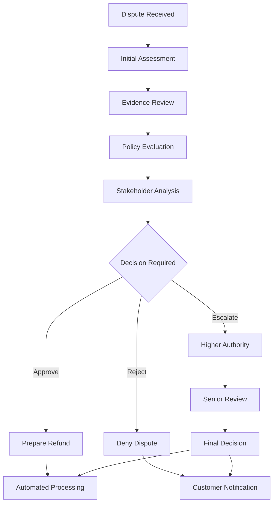

**Diagram sources**
- [AdminDisputeController.java:29-44](file://src/Backend/src/main/java/com/shoppeclone/backend/dispute/controller/AdminDisputeController.java#L29-L44)

### Communication Protocols

The system ensures comprehensive communication throughout the review process:

- **Automated Notifications**: Email/SMS alerts for status changes
- **Progress Updates**: Real-time case status monitoring
- **Evidence Requests**: Structured requests for additional documentation
- **Resolution Announcements**: Clear explanations of decisions and reasoning

**Section sources**
- [AdminDisputeController.java:1-46](file://src/Backend/src/main/java/com/shoppeclone/backend/dispute/controller/AdminDisputeController.java#L1-L46)

## Evidence Management

### Evidence Submission Standards

The system enforces quality standards for evidence submission:

#### Image Requirements
- **Format**: JPEG, PNG, PDF supported
- **Size Limit**: Maximum 10MB per file
- **Quality**: Minimum 300 DPI recommended
- **Relevance**: Directly supports dispute claims

#### Document Standards
- **Legibility**: Clear, readable copies
- **Completeness**: Full documents, not partial scans
- **Authenticity**: Verified originals or certified copies
- **Relevance**: Directly related to dispute circumstances

### Evidence Processing Pipeline

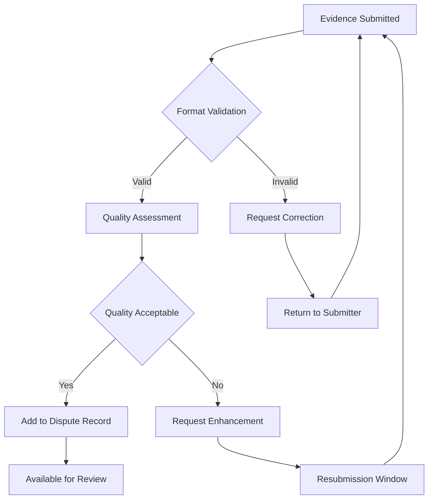

**Diagram sources**
- [DisputeController.java:89-100](file://src/Backend/src/main/java/com/shoppeclone/backend/dispute/controller/DisputeController.java#L89-L100)
- [DisputeServiceImpl.java:33-50](file://src/Backend/src/main/java/com/shoppeclone/backend/dispute/service/impl/DisputeServiceImpl.java#L33-L50)

**Section sources**
- [UploadDisputeImageRequest.java:1-11](file://src/Backend/src/main/java/com/shoppeclone/backend/dispute/dto/request/UploadDisputeImageRequest.java#L1-L11)
- [DisputeImageRepository.java:1-13](file://src/Backend/src/main/java/com/shoppeclone/backend/dispute/repository/DisputeImageRepository.java#L1-L13)

## Timeline Management

### Standard Processing Timelines

| Process | Standard Timeline | Escalation Threshold |
|---------|-------------------|---------------------|
| **Dispute Filing** | 24 hours | Immediate |
| **Initial Review** | 3-5 business days | 7 days |
| **Evidence Collection** | 5 business days | 10 days |
| **Administrative Review** | 5-7 business days | 14 days |
| **Resolution Decision** | 24 hours | Immediate |
| **Refund Processing** | 3-5 business days | 7 days |

### Timeline Monitoring Features

The system provides comprehensive timeline tracking:

- **Real-time Progress**: Visual case progression indicators
- **Automated Reminders**: Scheduled notifications for overdue actions
- **SLA Compliance**: Performance metrics and reporting
- **Extension Requests**: Formal process for timeline modifications

### Deadline Management

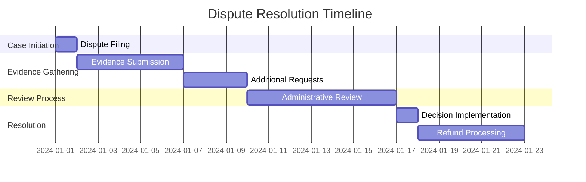

**Section sources**
- [Luong_TraHang_Dispute.md:46-51](file://docs/Luong_TraHang_Dispute.md#L46-L51)

## Common Dispute Scenarios

### Scenario 1: Product Not Received
**Typical Evidence**: Delivery tracking, shipping confirmation, customer communication
**Resolution Path**: Standard review with shipping provider verification
**Expected Outcome**: Refund approval with shipping company liability assessment

### Scenario 2: Item Damaged During Transit
**Typical Evidence**: Photo documentation, shipping box condition, damage assessment
**Resolution Path**: Enhanced review with damage evaluation
**Expected Outcome**: Partial/full refund based on damage severity

### Scenario 3: Wrong Item Dispatched
**Typical Evidence**: Packaging photos, item comparison, order confirmation
**Resolution Path**: Standard review with inventory verification
**Expected Outcome**: Replacement or refund based on customer preference

### Scenario 4: Non-Receipt of Refund
**Typical Evidence**: Transaction records, bank statements, system logs
**Resolution Path**: Escalated review with financial audit
**Expected Outcome**: Refund processing acceleration or investigation

**Section sources**
- [Luong_TraHang_Dispute.md:1-73](file://docs/Luong_TraHang_Dispute.md#L1-L73)

## Troubleshooting Guide

### Common Issues and Solutions

#### Issue: Duplicate Dispute Creation
**Symptoms**: HTTP 409 Conflict when filing disputes
**Causes**: Existing dispute for the same order
**Solution**: Check existing dispute status via order lookup endpoint

#### Issue: Unauthorized Access Attempts
**Symptoms**: HTTP 403 Forbidden errors
**Causes**: Insufficient permissions or invalid authentication
**Solution**: Verify user roles and authentication tokens

#### Issue: Order Eligibility Rejection
**Symptoms**: HTTP 400 Bad Request for dispute creation
**Causes**: Order not in SHIPPED/COMPLETED status or outside 7-day window
**Solution**: Verify order status and timing requirements

#### Issue: Evidence Upload Failures
**Symptoms**: HTTP 400 validation errors
**Causes**: Invalid image URLs or format restrictions
**Solution**: Validate image URLs and format requirements

### Error Handling Patterns

The system implements consistent error handling:

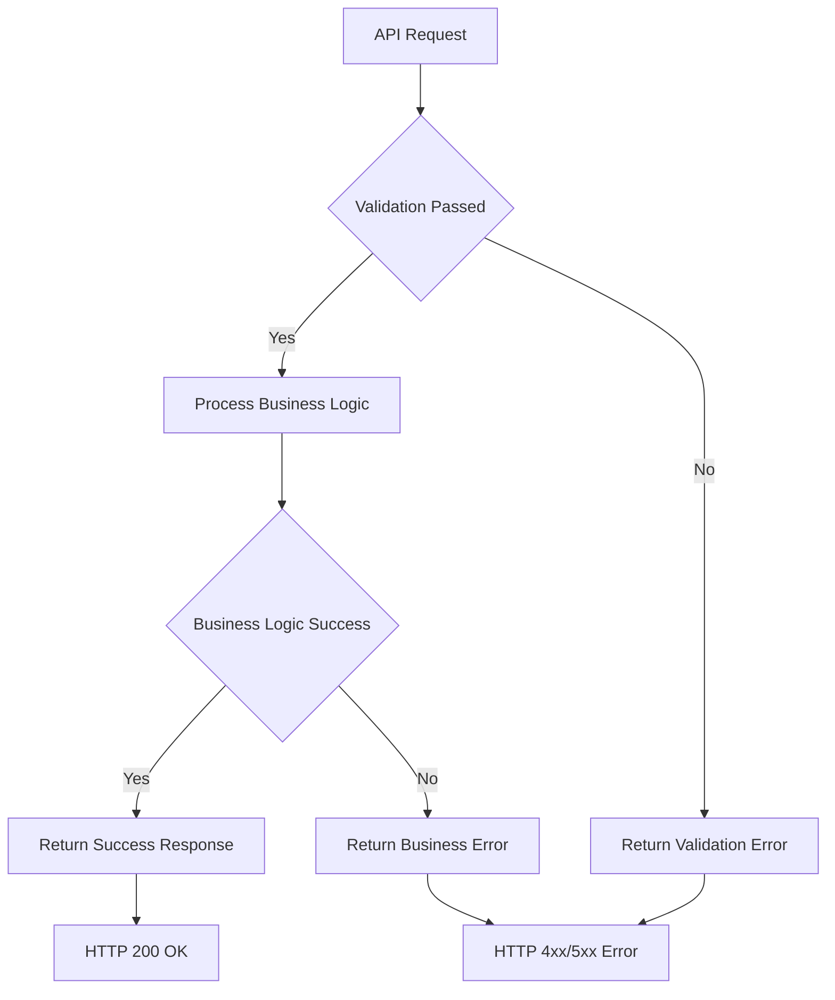

**Diagram sources**
- [DisputeServiceImpl.java:54-92](file://src/Backend/src/main/java/com/shoppeclone/backend/dispute/service/impl/DisputeServiceImpl.java#L54-L92)

**Section sources**
- [DisputeController.java:47-70](file://src/Backend/src/main/java/com/shoppeclone/backend/dispute/controller/DisputeController.java#L47-L70)
- [DisputeServiceImpl.java:54-92](file://src/Backend/src/main/java/com/shoppeclone/backend/dispute/service/impl/DisputeServiceImpl.java#L54-L92)

## Conclusion

The Dispute Resolution System provides a comprehensive, automated solution for managing customer disputes efficiently. Through its multi-stage process, robust API endpoints, and seamless integration with order and refund systems, the platform ensures fair outcomes while minimizing administrative overhead.

Key strengths of the system include:

- **Streamlined Process**: Eliminates complex return procedures through automatic refund processing
- **Transparent Communication**: Provides clear status updates and decision rationale
- **Evidence-Driven Decisions**: Maintains comprehensive documentation trails for all disputes
- **Scalable Architecture**: Supports growing dispute volumes with automated processing
- **Policy Compliance**: Enforces consistent decision-making aligned with platform policies

The system's design prioritizes both customer satisfaction and operational efficiency, positioning it as a robust foundation for dispute resolution in e-commerce environments. Future enhancements could include advanced analytics, machine learning-based risk assessment, and expanded integration capabilities with external dispute resolution services.