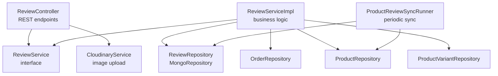
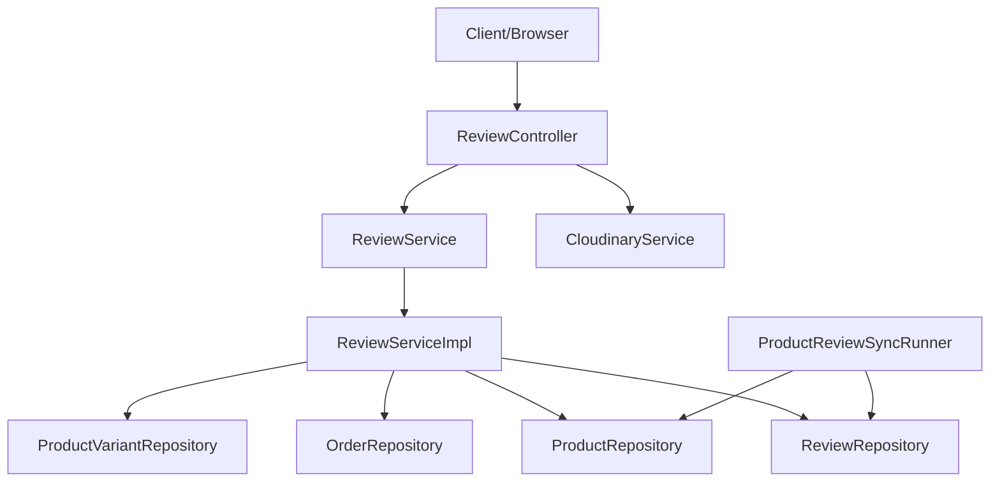
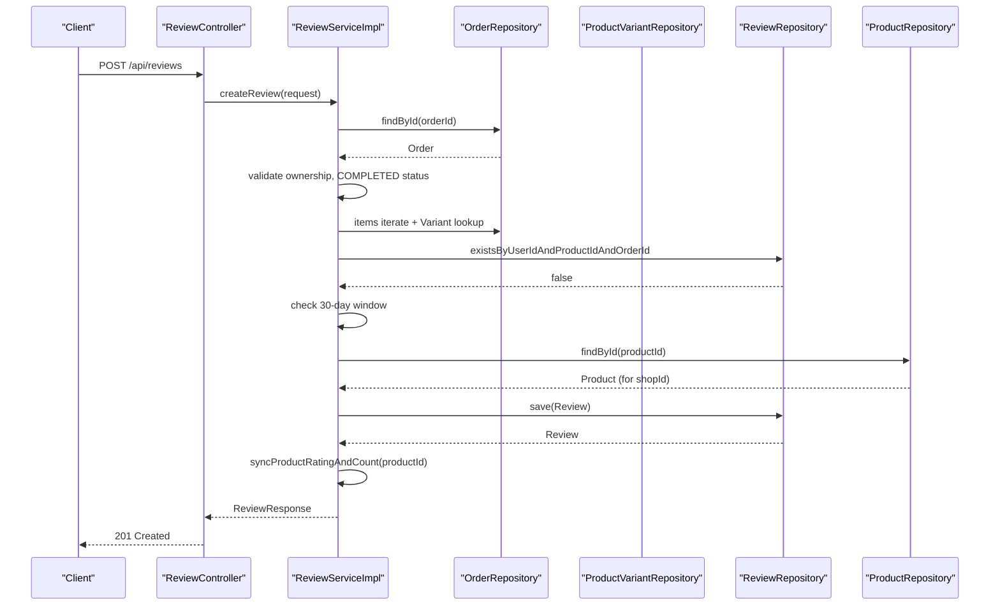
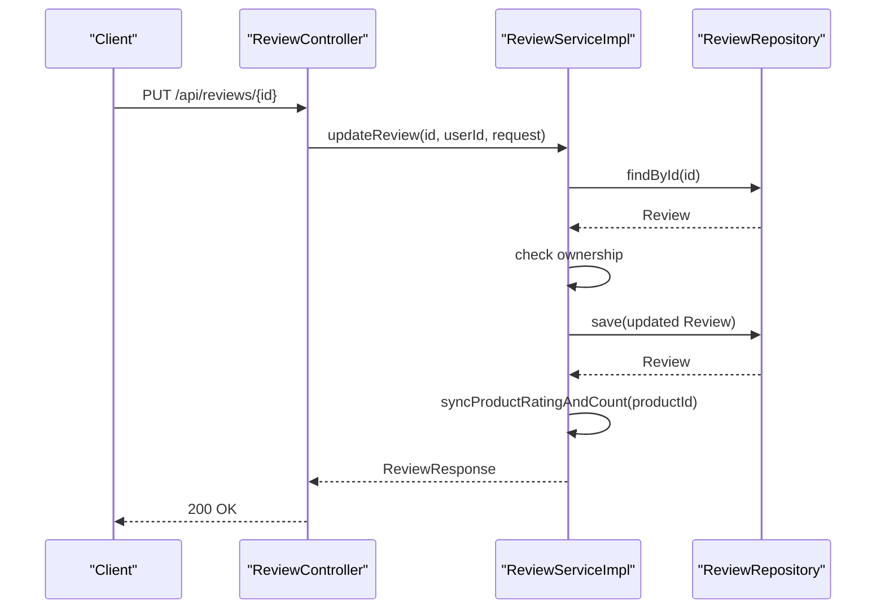
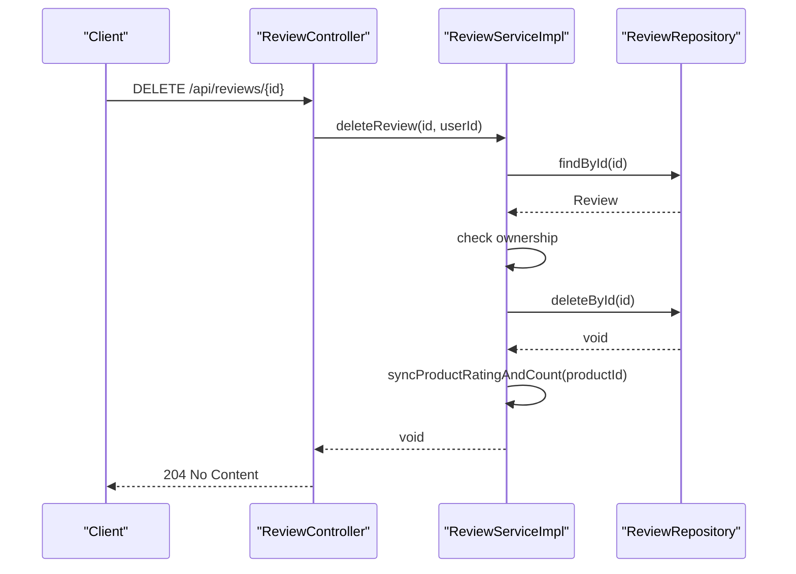
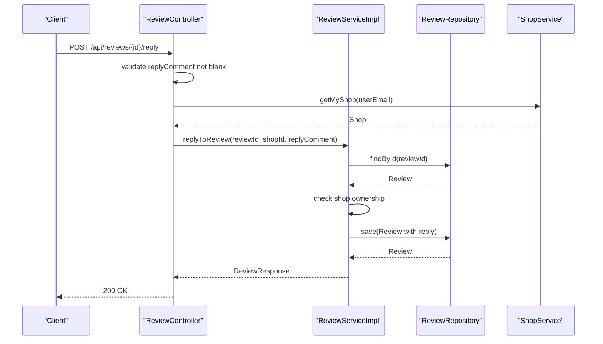
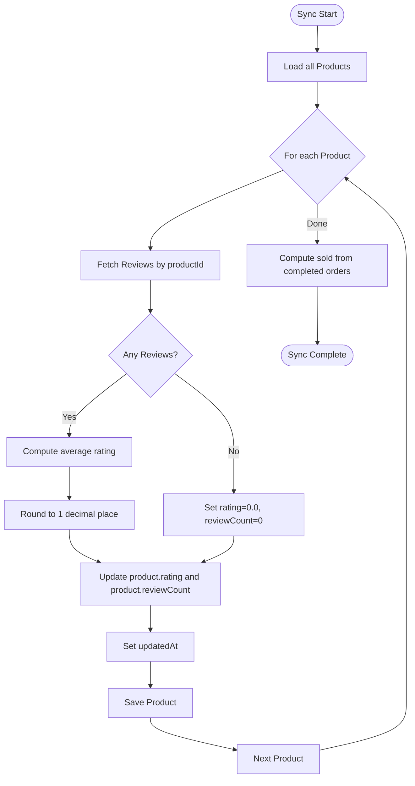
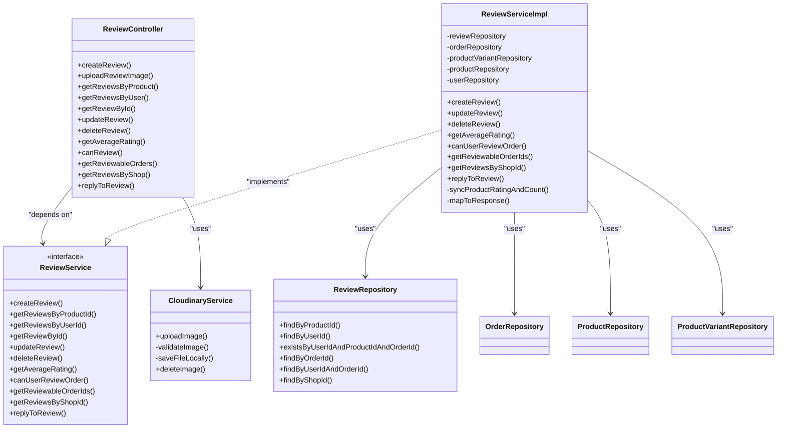

# Product Review System

<cite>
**Referenced Files in This Document**
- [ReviewController.java](file://src/backend/src/main/java/com/shoppeclone/backend/review/controller/ReviewController.java)
- [ReviewService.java](file://src/backend/src/main/java/com/shoppeclone/backend/review/service/ReviewService.java)
- [ReviewServiceImpl.java](file://src/backend/src/main/java/com/shoppeclone/backend/review/service/impl/ReviewServiceImpl.java)
- [Review.java](file://src/backend/src/main/java/com/shoppeclone/backend/review/entity/Review.java)
- [ReviewRepository.java](file://src/backend/src/main/java/com/shoppeclone/backend/review/repository/ReviewRepository.java)
- [CreateReviewRequest.java](file://src/backend/src/main/java/com/shoppeclone/backend/review/dto/request/CreateReviewRequest.java)
- [UpdateReviewRequest.java](file://src/backend/src/main/java/com/shoppeclone/backend/review/dto/request/UpdateReviewRequest.java)
- [ReviewResponse.java](file://src/backend/src/main/java/com/shoppeclone/backend/review/dto/response/ReviewResponse.java)
- [CloudinaryService.java](file://src/backend/src/main/java/com/shoppeclone/backend/common/service/CloudinaryService.java)
- [ProductReviewSyncRunner.java](file://src/backend/src/main/java/com/shoppeclone/backend/review/sync/ProductReviewSyncRunner.java)
- [Order.java](file://src/backend/src/main/java/com/shoppeclone/backend/order/entity/Order.java)
- [OrderStatus.java](file://src/backend/src/main/java/com/shoppeclone/backend/order/entity/OrderStatus.java)
- [SecurityConfig.java](file://src/backend/src/main/java/com/shoppeclone/backend/auth/security/SecurityConfig.java)
- [Role.java](file://src/backend/src/main/java/com/shoppeclone/backend/auth/model/Role.java)
- [ReviewException.java](file://src/backend/src/main/java/com/shoppeclone/backend/review/exception/ReviewException.java)
</cite>

## Table of Contents
1. [Introduction](#introduction)
2. [Project Structure](#project-structure)
3. [Core Components](#core-components)
4. [Architecture Overview](#architecture-overview)
5. [Detailed Component Analysis](#detailed-component-analysis)
6. [Dependency Analysis](#dependency-analysis)
7. [Performance Considerations](#performance-considerations)
8. [Troubleshooting Guide](#troubleshooting-guide)
9. [Conclusion](#conclusion)

## Introduction
This document describes the Product Review System, covering the complete lifecycle of reviews: creation, modification, deletion, and moderation via seller replies. It documents the REST API endpoints, authentication and authorization requirements, validation rules, image upload capabilities via Cloudinary, rating calculation mechanisms, and integration with order completion. It also explains filtering by product, user, and shop, and outlines performance considerations for large-scale review data.

## Project Structure
The review system is organized around a REST controller, a service interface and implementation, domain entities, repositories, DTOs, and supporting services for image uploads and synchronization.

**Diagram sources**
- [ReviewController.java:24-189](file://src/backend/src/main/java/com/shoppeclone/backend/review/controller/ReviewController.java#L24-L189)
- [ReviewService.java:9-66](file://src/backend/src/main/java/com/shoppeclone/backend/review/service/ReviewService.java#L9-L66)
- [ReviewServiceImpl.java:26-338](file://src/backend/src/main/java/com/shoppeclone/backend/review/service/impl/ReviewServiceImpl.java#L26-L338)
- [CloudinaryService.java:20-137](file://src/backend/src/main/java/com/shoppeclone/backend/common/service/CloudinaryService.java#L20-L137)
- [ReviewRepository.java:7-19](file://src/backend/src/main/java/com/shoppeclone/backend/review/repository/ReviewRepository.java#L7-L19)
- [ProductReviewSyncRunner.java:30-88](file://src/backend/src/main/java/com/shoppeclone/backend/review/sync/ProductReviewSyncRunner.java#L30-L88)

**Section sources**
- [ReviewController.java:24-189](file://src/backend/src/main/java/com/shoppeclone/backend/review/controller/ReviewController.java#L24-L189)
- [ReviewService.java:9-66](file://src/backend/src/main/java/com/shoppeclone/backend/review/service/ReviewService.java#L9-L66)
- [ReviewServiceImpl.java:26-338](file://src/backend/src/main/java/com/shoppeclone/backend/review/service/impl/ReviewServiceImpl.java#L26-L338)
- [CloudinaryService.java:20-137](file://src/backend/src/main/java/com/shoppeclone/backend/common/service/CloudinaryService.java#L20-L137)
- [ReviewRepository.java:7-19](file://src/backend/src/main/java/com/shoppeclone/backend/review/repository/ReviewRepository.java#L7-L19)
- [ProductReviewSyncRunner.java:30-88](file://src/backend/src/main/java/com/shoppeclone/backend/review/sync/ProductReviewSyncRunner.java#L30-L88)

## Core Components
- ReviewController: Exposes REST endpoints for creating, updating, deleting, retrieving reviews, uploading images, checking eligibility to review, listing eligible orders, fetching average ratings, and seller replies.
- ReviewService and ReviewServiceImpl: Encapsulate business logic for review CRUD, validation against order completion, duplicate prevention, timeframe limits, and rating synchronization.
- Review Entity and Repository: Persist review data and provide queries by product, user, order, and shop.
- DTOs: CreateReviewRequest, UpdateReviewRequest, ReviewResponse define request/response shapes and validation constraints.
- CloudinaryService: Handles image uploads with validation and fallback to local storage.
- ProductReviewSyncRunner: Periodically recalculates product rating and review counts from reviews and sold units from completed orders.

**Section sources**
- [ReviewController.java:24-189](file://src/backend/src/main/java/com/shoppeclone/backend/review/controller/ReviewController.java#L24-L189)
- [ReviewService.java:9-66](file://src/backend/src/main/java/com/shoppeclone/backend/review/service/ReviewService.java#L9-L66)
- [ReviewServiceImpl.java:26-338](file://src/backend/src/main/java/com/shoppeclone/backend/review/service/impl/ReviewServiceImpl.java#L26-L338)
- [Review.java:11-40](file://src/backend/src/main/java/com/shoppeclone/backend/review/entity/Review.java#L11-L40)
- [ReviewRepository.java:7-19](file://src/backend/src/main/java/com/shoppeclone/backend/review/repository/ReviewRepository.java#L7-L19)
- [CreateReviewRequest.java:13-34](file://src/backend/src/main/java/com/shoppeclone/backend/review/dto/request/CreateReviewRequest.java#L13-L34)
- [UpdateReviewRequest.java:11-22](file://src/backend/src/main/java/com/shoppeclone/backend/review/dto/request/UpdateReviewRequest.java#L11-L22)
- [ReviewResponse.java:8-25](file://src/backend/src/main/java/com/shoppeclone/backend/review/dto/response/ReviewResponse.java#L8-L25)
- [CloudinaryService.java:20-137](file://src/backend/src/main/java/com/shoppeclone/backend/common/service/CloudinaryService.java#L20-L137)
- [ProductReviewSyncRunner.java:30-88](file://src/backend/src/main/java/com/shoppeclone/backend/review/sync/ProductReviewSyncRunner.java#L30-L88)

## Architecture Overview
The system follows a layered architecture:
- Presentation: Spring MVC REST controller
- Application: Service interface and implementation
- Persistence: MongoDB repositories
- Integration: Cloudinary for image storage and periodic sync for product metrics

**Diagram sources**
- [ReviewController.java:24-189](file://src/backend/src/main/java/com/shoppeclone/backend/review/controller/ReviewController.java#L24-L189)
- [ReviewServiceImpl.java:26-338](file://src/backend/src/main/java/com/shoppeclone/backend/review/service/impl/ReviewServiceImpl.java#L26-L338)
- [ReviewRepository.java:7-19](file://src/backend/src/main/java/com/shoppeclone/backend/review/repository/ReviewRepository.java#L7-L19)
- [ProductReviewSyncRunner.java:30-88](file://src/backend/src/main/java/com/shoppeclone/backend/review/sync/ProductReviewSyncRunner.java#L30-L88)
- [CloudinaryService.java:20-137](file://src/backend/src/main/java/com/shoppeclone/backend/common/service/CloudinaryService.java#L20-L137)

## Detailed Component Analysis

### REST API Endpoints
- Create Review
  - Method: POST
  - Path: /api/reviews
  - Authenticated: Required
  - Body: CreateReviewRequest (productId, orderId, rating, comment, imageUrls)
  - Validation: Order ownership, COMPLETED status, product in order, no duplicate, within 30-day window
  - Response: ReviewResponse
- Upload Review Image
  - Method: POST
  - Path: /api/reviews/upload-image
  - Authenticated: Not required by controller; typically requires authentication at gateway/filter level
  - Body: multipart/form-data with file field
  - Response: JSON with imageUrl
- Get Reviews by Product
  - Method: GET
  - Path: /api/reviews/product/{productId}
  - Response: List<ReviewResponse>
- Get Reviews by User
  - Method: GET
  - Path: /api/reviews/user/{userId}
  - Response: List<ReviewResponse>
- Get Review by Id
  - Method: GET
  - Path: /api/reviews/{id}
  - Response: ReviewResponse
- Update Review
  - Method: PUT
  - Path: /api/reviews/{id}
  - Authenticated: Required
  - Body: UpdateReviewRequest (rating, comment, imageUrls)
  - Permissions: Only the review owner can edit
  - Response: ReviewResponse
- Delete Review
  - Method: DELETE
  - Path: /api/reviews/{id}
  - Authenticated: Required
  - Permissions: Only the review owner can delete
  - Response: 204 No Content
- Average Rating by Product
  - Method: GET
  - Path: /api/reviews/product/{productId}/average-rating
  - Response: JSON with averageRating
- Can User Review Order
  - Method: GET
  - Path: /api/reviews/can-review?orderId={orderId}&productId={productId}
  - Authenticated: Required
  - Response: JSON with canReview
- Get Reviewable Orders
  - Method: GET
  - Path: /api/reviews/reviewable-orders
  - Authenticated: Required
  - Response: JSON with orderIds
- Get Reviews by Shop
  - Method: GET
  - Path: /api/reviews/shop/{shopId}
  - Response: List<ReviewResponse>
- Reply to Review (Seller)
  - Method: POST
  - Path: /api/reviews/{id}/reply
  - Authenticated: Required
  - Body: JSON with replyComment
  - Permissions: Only the shop owner of the reviewed product can reply
  - Response: ReviewResponse

Authentication and Authorization:
- Authentication: JWT-based stateless authentication
- Authorization: 
  - All /api/reviews/** endpoints require authentication
  - Seller reply endpoint additionally validates shop ownership of the product

**Section sources**
- [ReviewController.java:44-187](file://src/backend/src/main/java/com/shoppeclone/backend/review/controller/ReviewController.java#L44-L187)
- [SecurityConfig.java:35-79](file://src/backend/src/main/java/com/shoppeclone/backend/auth/security/SecurityConfig.java#L35-L79)
- [Role.java:10-18](file://src/backend/src/main/java/com/shoppeclone/backend/auth/model/Role.java#L10-L18)

### Review Lifecycle and Workflows

#### Creation Workflow

**Diagram sources**
- [ReviewController.java:44-52](file://src/backend/src/main/java/com/shoppeclone/backend/review/controller/ReviewController.java#L44-L52)
- [ReviewServiceImpl.java:38-109](file://src/backend/src/main/java/com/shoppeclone/backend/review/service/impl/ReviewServiceImpl.java#L38-L109)
- [OrderRepository.java](file://src/backend/src/main/java/com/shoppeclone/backend/order/repository/OrderRepository.java)
- [ProductVariantRepository.java](file://src/backend/src/main/java/com/shoppeclone/backend/product/repository/ProductVariantRepository.java)
- [ReviewRepository.java](file://src/backend/src/main/java/com/shoppeclone/backend/review/repository/ReviewRepository.java#L12)
- [ProductRepository.java](file://src/backend/src/main/java/com/shoppeclone/backend/product/repository/ProductRepository.java)

#### Modification Workflow

**Diagram sources**
- [ReviewController.java:99-107](file://src/backend/src/main/java/com/shoppeclone/backend/review/controller/ReviewController.java#L99-L107)
- [ReviewServiceImpl.java:134-155](file://src/backend/src/main/java/com/shoppeclone/backend/review/service/impl/ReviewServiceImpl.java#L134-L155)
- [ReviewRepository.java:7-19](file://src/backend/src/main/java/com/shoppeclone/backend/review/repository/ReviewRepository.java#L7-L19)

#### Deletion Workflow

**Diagram sources**
- [ReviewController.java:113-120](file://src/backend/src/main/java/com/shoppeclone/backend/review/controller/ReviewController.java#L113-L120)
- [ReviewServiceImpl.java:157-167](file://src/backend/src/main/java/com/shoppeclone/backend/review/service/impl/ReviewServiceImpl.java#L157-L167)
- [ReviewRepository.java:7-19](file://src/backend/src/main/java/com/shoppeclone/backend/review/repository/ReviewRepository.java#L7-L19)

#### Seller Reply Workflow

**Diagram sources**
- [ReviewController.java:170-187](file://src/backend/src/main/java/com/shoppeclone/backend/review/controller/ReviewController.java#L170-L187)
- [ReviewServiceImpl.java:278-295](file://src/backend/src/main/java/com/shoppeclone/backend/review/service/impl/ReviewServiceImpl.java#L278-L295)
- [ReviewRepository.java:7-19](file://src/backend/src/main/java/com/shoppeclone/backend/review/repository/ReviewRepository.java#L7-L19)

### Validation Rules
- CreateReviewRequest:
  - productId: required
  - orderId: required
  - rating: required, min 1, max 5
  - comment: optional
  - imageUrls: up to 5 URLs
- UpdateReviewRequest:
  - rating: min 1, max 5
  - comment: optional
  - imageUrls: up to 5 URLs
- Additional business validations in ReviewServiceImpl:
  - Order ownership by userId
  - Order status must be COMPLETED
  - Product must appear in order items (via ProductVariant)
  - Duplicate review prevention per userId-productId-orderId
  - Timeframe constraint: reviews allowed within 30 days after order completion
  - Seller reply: only the shop owning the product can reply

**Section sources**
- [CreateReviewRequest.java:18-33](file://src/backend/src/main/java/com/shoppeclone/backend/review/dto/request/CreateReviewRequest.java#L18-L33)
- [UpdateReviewRequest.java:13-21](file://src/backend/src/main/java/com/shoppeclone/backend/review/dto/request/UpdateReviewRequest.java#L13-L21)
- [ReviewServiceImpl.java:38-85](file://src/backend/src/main/java/com/shoppeclone/backend/review/service/impl/ReviewServiceImpl.java#L38-L85)
- [ReviewServiceImpl.java:134-140](file://src/backend/src/main/java/com/shoppeclone/backend/review/service/impl/ReviewServiceImpl.java#L134-L140)
- [ReviewServiceImpl.java:278-285](file://src/backend/src/main/java/com/shoppeclone/backend/review/service/impl/ReviewServiceImpl.java#L278-L285)

### Image Upload via Cloudinary
- Endpoint: POST /api/reviews/upload-image
- Accepts: multipart/form-data with file parameter
- Validation: file size <= 3MB, content-type image/*, allowed formats: JPEG, JPG, PNG, WEBP
- Behavior: Attempts Cloudinary upload; falls back to local storage if Cloudinary is unavailable
- Returns: JSON with imageUrl

**Section sources**
- [ReviewController.java:58-63](file://src/backend/src/main/java/com/shoppeclone/backend/review/controller/ReviewController.java#L58-L63)
- [CloudinaryService.java:36-58](file://src/backend/src/main/java/com/shoppeclone/backend/common/service/CloudinaryService.java#L36-L58)
- [CloudinaryService.java:93-123](file://src/backend/src/main/java/com/shoppeclone/backend/common/service/CloudinaryService.java#L93-L123)

### Rating Calculation Mechanisms
- Real-time average rating retrieval: GET /api/reviews/product/{productId}/average-rating
- Periodic synchronization:
  - ProductReviewSyncRunner recalculates product.rating and product.reviewCount from reviews
  - Also computes product.sold from completed orders
  - Runs at application startup with @Order(5)

**Diagram sources**
- [ProductReviewSyncRunner.java:37-86](file://src/backend/src/main/java/com/shoppeclone/backend/review/sync/ProductReviewSyncRunner.java#L37-L86)
- [ReviewRepository.java](file://src/backend/src/main/java/com/shoppeclone/backend/review/repository/ReviewRepository.java#L8)
- [OrderRepository.java](file://src/backend/src/main/java/com/shoppeclone/backend/order/repository/OrderRepository.java)

**Section sources**
- [ReviewController.java:122-130](file://src/backend/src/main/java/com/shoppeclone/backend/review/controller/ReviewController.java#L122-L130)
- [ProductReviewSyncRunner.java:45-60](file://src/backend/src/main/java/com/shoppeclone/backend/review/sync/ProductReviewSyncRunner.java#L45-L60)
- [ProductReviewSyncRunner.java:62-86](file://src/backend/src/main/java/com/shoppeclone/backend/review/sync/ProductReviewSyncRunner.java#L62-L86)

### Filtering Capabilities
- By Product: GET /api/reviews/product/{productId}
- By User: GET /api/reviews/user/{userId}
- By Shop: GET /api/reviews/shop/{shopId}
- By Id: GET /api/reviews/{id}
- Average Rating: GET /api/reviews/product/{productId}/average-rating

**Section sources**
- [ReviewController.java:69-130](file://src/backend/src/main/java/com/shoppeclone/backend/review/controller/ReviewController.java#L69-L130)
- [ReviewRepository.java:8-18](file://src/backend/src/main/java/com/shoppeclone/backend/review/repository/ReviewRepository.java#L8-L18)

### Permission Checks for Editing/Deleting Reviews
- Ownership verification:
  - Update: Only the review’s userId matches the authenticated user
  - Delete: Only the review’s userId matches the authenticated user
- Seller Reply:
  - Only the shop owning the product (review.shopId) can add or modify a reply

**Section sources**
- [ReviewServiceImpl.java:134-140](file://src/backend/src/main/java/com/shoppeclone/backend/review/service/impl/ReviewServiceImpl.java#L134-L140)
- [ReviewServiceImpl.java:157-163](file://src/backend/src/main/java/com/shoppeclone/backend/review/service/impl/ReviewServiceImpl.java#L157-L163)
- [ReviewServiceImpl.java:278-285](file://src/backend/src/main/java/com/shoppeclone/backend/review/service/impl/ReviewServiceImpl.java#L278-L285)

### Integration with Order Completion
- Eligibility to review depends on:
  - Order ownership by userId
  - Order status is COMPLETED
  - Product appears in order items (via ProductVariant)
  - No prior review for the same userId-productId-orderId
  - Within 30 days of order completion
- Helper endpoints:
  - GET /api/reviews/can-review to check eligibility
  - GET /api/reviews/reviewable-orders to list eligible order IDs

**Section sources**
- [ReviewServiceImpl.java:184-234](file://src/backend/src/main/java/com/shoppeclone/backend/review/service/impl/ReviewServiceImpl.java#L184-L234)
- [ReviewServiceImpl.java:236-268](file://src/backend/src/main/java/com/shoppeclone/backend/review/service/impl/ReviewServiceImpl.java#L236-L268)
- [OrderStatus.java:3-12](file://src/backend/src/main/java/com/shoppeclone/backend/order/entity/OrderStatus.java#L3-L12)
- [Order.java:34-48](file://src/backend/src/main/java/com/shoppeclone/backend/order/entity/Order.java#L34-L48)

### Moderation and Seller Reply
- Seller reply endpoint POST /api/reviews/{id}/reply:
  - Validates replyComment is present
  - Confirms the authenticated user owns the shop associated with the product
  - Updates review with replyComment and replyAt, tracks isReplyEdited on subsequent edits

**Section sources**
- [ReviewController.java:170-187](file://src/backend/src/main/java/com/shoppeclone/backend/review/controller/ReviewController.java#L170-L187)
- [ReviewServiceImpl.java:278-295](file://src/backend/src/main/java/com/shoppeclone/backend/review/service/impl/ReviewServiceImpl.java#L278-L295)

## Dependency Analysis

**Diagram sources**
- [ReviewController.java:24-189](file://src/backend/src/main/java/com/shoppeclone/backend/review/controller/ReviewController.java#L24-L189)
- [ReviewService.java:9-66](file://src/backend/src/main/java/com/shoppeclone/backend/review/service/ReviewService.java#L9-L66)
- [ReviewServiceImpl.java:26-338](file://src/backend/src/main/java/com/shoppeclone/backend/review/service/impl/ReviewServiceImpl.java#L26-L338)
- [ReviewRepository.java:7-19](file://src/backend/src/main/java/com/shoppeclone/backend/review/repository/ReviewRepository.java#L7-L19)
- [CloudinaryService.java:20-137](file://src/backend/src/main/java/com/shoppeclone/backend/common/service/CloudinaryService.java#L20-L137)

**Section sources**
- [ReviewController.java:24-189](file://src/backend/src/main/java/com/shoppeclone/backend/review/controller/ReviewController.java#L24-L189)
- [ReviewService.java:9-66](file://src/backend/src/main/java/com/shoppeclone/backend/review/service/ReviewService.java#L9-L66)
- [ReviewServiceImpl.java:26-338](file://src/backend/src/main/java/com/shoppeclone/backend/review/service/impl/ReviewServiceImpl.java#L26-L338)
- [ReviewRepository.java:7-19](file://src/backend/src/main/java/com/shoppeclone/backend/review/repository/ReviewRepository.java#L7-L19)
- [CloudinaryService.java:20-137](file://src/backend/src/main/java/com/shoppeclone/backend/common/service/CloudinaryService.java#L20-L137)

## Performance Considerations
- Indexes: Review entity uses @Indexed on userId, productId, orderId, shopId to optimize queries.
- Query patterns:
  - findByProductId, findByUserId, findByOrderId, findByShopId are used frequently
  - Consider adding compound indexes for common filter combinations (e.g., productId+createdAt)
- Synchronization:
  - ProductReviewSyncRunner runs at startup and recalculates ratings and review counts
  - For very large datasets, consider scheduling incremental updates or background jobs
- Image storage:
  - CloudinaryService supports fallback to local storage; ensure proper cleanup and rotation of local files
- Pagination:
  - Current endpoints return full lists; introduce pagination for product/user/shop review listings to reduce payload sizes
- Caching:
  - Cache average ratings and recent reviews for hot products/users to reduce database load
- Asynchronous updates:
  - Product rating recalculation occurs synchronously during create/update/delete; consider async updates for high-throughput scenarios

**Section sources**
- [Review.java:17-27](file://src/backend/src/main/java/com/shoppeclone/backend/review/entity/Review.java#L17-L27)
- [ReviewRepository.java:8-18](file://src/backend/src/main/java/com/shoppeclone/backend/review/repository/ReviewRepository.java#L8-L18)
- [ProductReviewSyncRunner.java:37-42](file://src/backend/src/main/java/com/shoppeclone/backend/review/sync/ProductReviewSyncRunner.java#L37-L42)

## Troubleshooting Guide
Common issues and resolutions:
- ReviewException thrown during creation:
  - Order not found or not owned by user
  - Order not COMPLETED
  - Product not part of the order
  - Duplicate review exists
  - Review deadline exceeded (>30 days)
- Ownership errors:
  - Update/Delete: Ensure authenticated user matches review.userId
  - Reply: Ensure authenticated user owns the shop linked to the product
- Image upload failures:
  - Verify file size and type constraints
  - Check Cloudinary configuration; fallback to local storage logs warnings
- Average rating discrepancies:
  - Confirm ProductReviewSyncRunner has executed or use real-time average endpoint

**Section sources**
- [ReviewException.java:3-7](file://src/backend/src/main/java/com/shoppeclone/backend/review/exception/ReviewException.java#L3-L7)
- [ReviewServiceImpl.java:38-85](file://src/backend/src/main/java/com/shoppeclone/backend/review/service/impl/ReviewServiceImpl.java#L38-L85)
- [ReviewServiceImpl.java:134-140](file://src/backend/src/main/java/com/shoppeclone/backend/review/service/impl/ReviewServiceImpl.java#L134-L140)
- [ReviewServiceImpl.java:157-163](file://src/backend/src/main/java/com/shoppeclone/backend/review/service/impl/ReviewServiceImpl.java#L157-L163)
- [ReviewServiceImpl.java:278-285](file://src/backend/src/main/java/com/shoppeclone/backend/review/service/impl/ReviewServiceImpl.java#L278-L285)
- [CloudinaryService.java:52-57](file://src/backend/src/main/java/com/shoppeclone/backend/common/service/CloudinaryService.java#L52-L57)

## Conclusion
The Product Review System provides a robust, validated, and integrated solution for managing customer feedback. It enforces strict order-based eligibility, supports image uploads with Cloudinary, calculates ratings both in real-time and periodically, and offers seller moderation via replies. The architecture cleanly separates concerns and exposes a comprehensive set of endpoints with clear authentication and authorization policies.