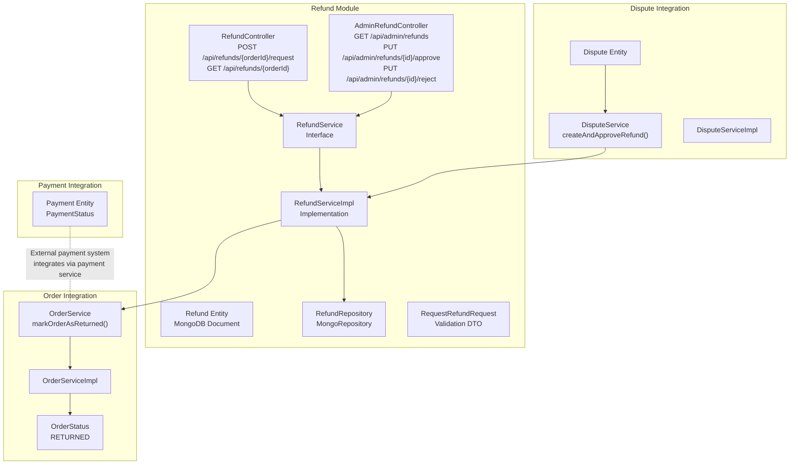
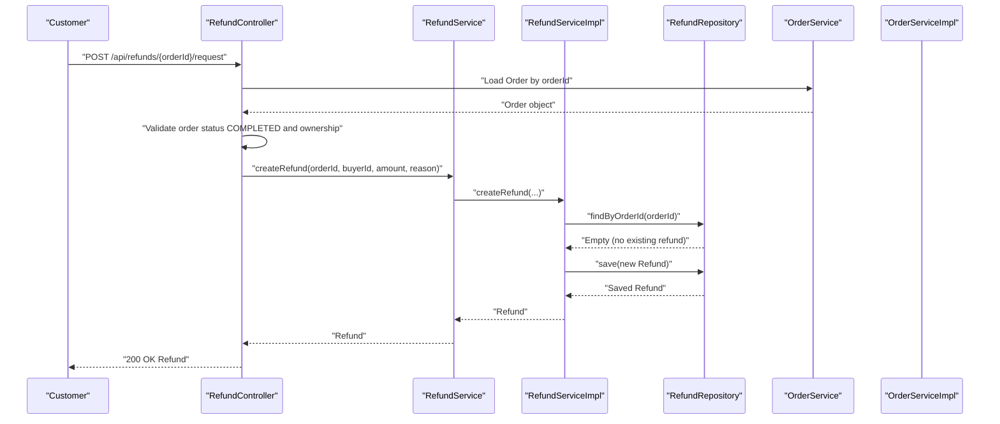
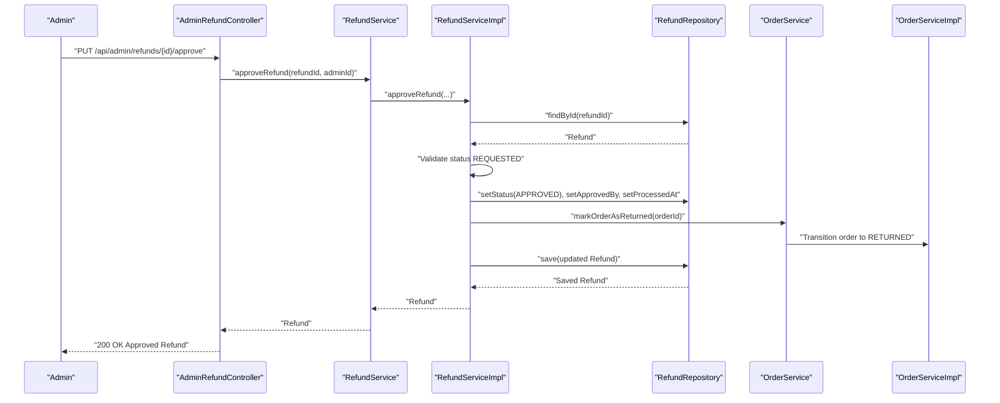
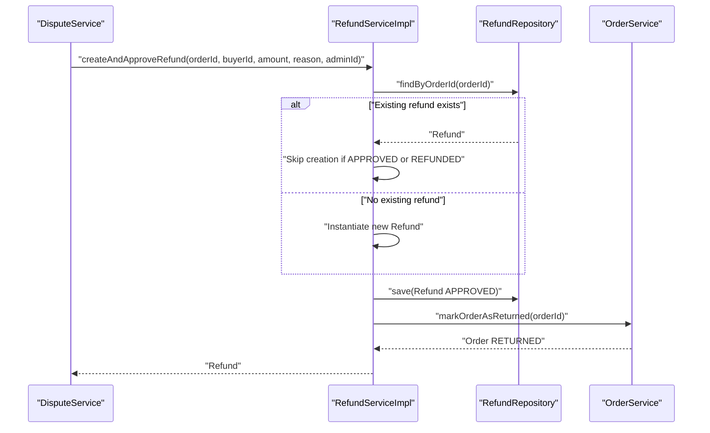
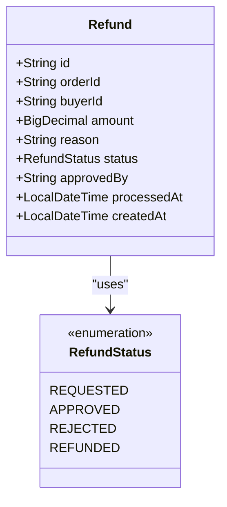
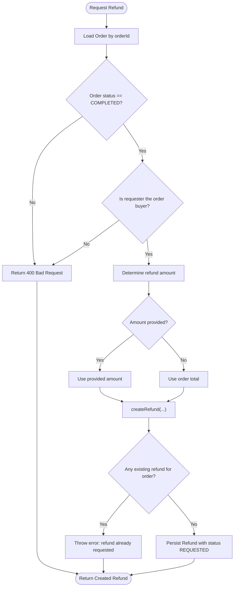
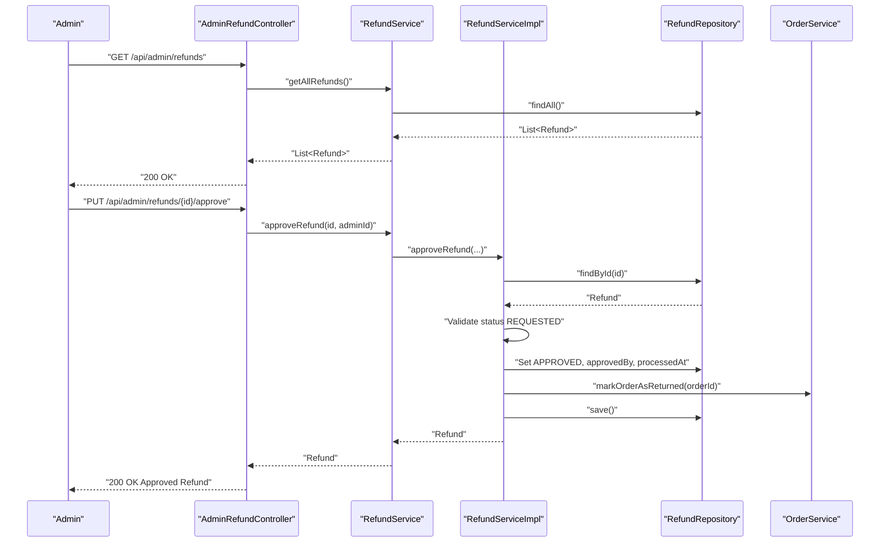
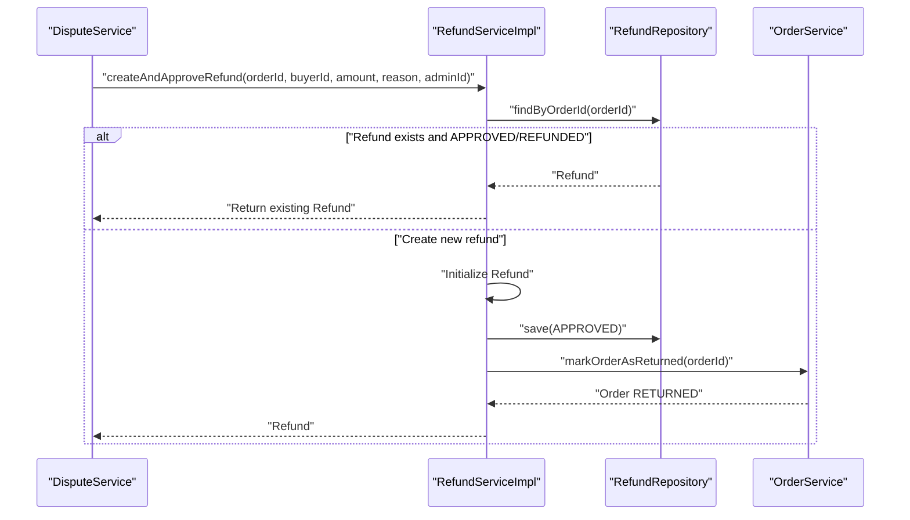
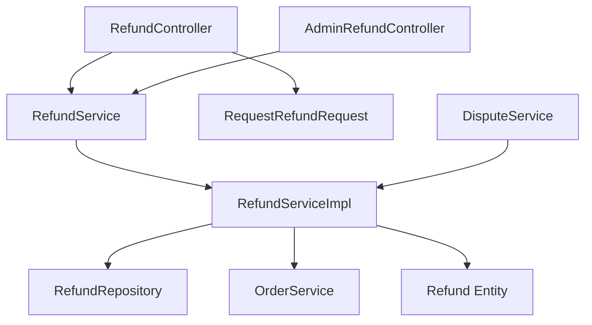

# Refund Management System

<cite>
**Referenced Files in This Document**
- [AdminRefundController.java](file://src/backend/src/main/java/com/shoppeclone/backend/refund/controller/AdminRefundController.java)
- [RefundController.java](file://src/backend/src/main/java/com/shoppeclone/backend/refund/controller/RefundController.java)
- [Refund.java](file://src/backend/src/main/java/com/shoppeclone/backend/refund/entity/Refund.java)
- [RefundStatus.java](file://src/backend/src/main/java/com/shoppeclone/backend/refund/entity/RefundStatus.java)
- [RequestRefundRequest.java](file://src/backend/src/main/java/com/shoppeclone/backend/refund/dto/request/RequestRefundRequest.java)
- [RefundService.java](file://src/backend/src/main/java/com/shoppeclone/backend/refund/service/RefundService.java)
- [RefundServiceImpl.java](file://src/backend/src/main/java/com/shoppeclone/backend/refund/service/RefundServiceImpl.java)
- [RefundRepository.java](file://src/backend/src/main/java/com/shoppeclone/backend/refund/repository/RefundRepository.java)
- [OrderService.java](file://src/backend/src/main/java/com/shoppeclone/backend/order/service/OrderService.java)
- [OrderServiceImpl.java](file://src/backend/src/main/java/com/shoppeclone/backend/order/service/impl/OrderServiceImpl.java)
- [OrderStatus.java](file://src/backend/src/main/java/com/shoppeclone/backend/order/entity/OrderStatus.java)
- [Payment.java](file://src/backend/src/main/java/com/shoppeclone/backend/payment/entity/Payment.java)
- [Dispute.java](file://src/backend/src/main/java/com/shoppeclone/backend/dispute/entity/Dispute.java)
- [DisputeService.java](file://src/backend/src/main/java/com/shoppeclone/backend/dispute/service/DisputeService.java)
</cite>

## Table of Contents
1. [Introduction](#introduction)
2. [Project Structure](#project-structure)
3. [Core Components](#core-components)
4. [Architecture Overview](#architecture-overview)
5. [Detailed Component Analysis](#detailed-component-analysis)
6. [Dependency Analysis](#dependency-analysis)
7. [Performance Considerations](#performance-considerations)
8. [Troubleshooting Guide](#troubleshooting-guide)
9. [Conclusion](#conclusion)

## Introduction
This document describes the Refund Management System within the backend platform. It explains the complete refund workflow from initiation to approval or rejection, covering both customer-initiated requests and admin-managed processing. It documents eligibility criteria based on order status, validation rules, refund amount calculation, integration points with the order and payment systems, admin oversight capabilities, and audit trail maintenance for compliance.

## Project Structure
The refund module is organized around a REST API with controllers, domain entities, repositories, services, and DTOs. It integrates with the order and dispute systems to enforce business rules and maintain auditability.

**Diagram sources**
- [RefundController.java:22-103](file://src/backend/src/main/java/com/shoppeclone/backend/refund/controller/RefundController.java#L22-L103)
- [AdminRefundController.java:14-43](file://src/backend/src/main/java/com/shoppeclone/backend/refund/controller/AdminRefundController.java#L14-L43)
- [RefundService.java:8-24](file://src/backend/src/main/java/com/shoppeclone/backend/refund/service/RefundService.java#L8-L24)
- [RefundServiceImpl.java:15-117](file://src/backend/src/main/java/com/shoppeclone/backend/refund/service/RefundServiceImpl.java#L15-L117)
- [Refund.java:10-33](file://src/backend/src/main/java/com/shoppeclone/backend/refund/entity/Refund.java#L10-L33)
- [RefundRepository.java:10-18](file://src/backend/src/main/java/com/shoppeclone/backend/refund/repository/RefundRepository.java#L10-L18)
- [RequestRefundRequest.java:9-17](file://src/backend/src/main/java/com/shoppeclone/backend/refund/dto/request/RequestRefundRequest.java#L9-L17)
- [OrderService.java:9-33](file://src/backend/src/main/java/com/shoppeclone/backend/order/service/OrderService.java#L9-L33)
- [OrderServiceImpl.java:666-670](file://src/backend/src/main/java/com/shoppeclone/backend/order/service/impl/OrderServiceImpl.java#L666-L670)
- [OrderStatus.java:3-13](file://src/backend/src/main/java/com/shoppeclone/backend/order/entity/OrderStatus.java#L3-L13)
- [DisputeService.java:7-28](file://src/backend/src/main/java/com/shoppeclone/backend/dispute/service/DisputeService.java#L7-L28)
- [Dispute.java:9-34](file://src/backend/src/main/java/com/shoppeclone/backend/dispute/entity/Dispute.java#L9-L34)
- [Payment.java:11-27](file://src/backend/src/main/java/com/shoppeclone/backend/payment/entity/Payment.java#L11-L27)

**Section sources**
- [RefundController.java:22-103](file://src/backend/src/main/java/com/shoppeclone/backend/refund/controller/RefundController.java#L22-L103)
- [AdminRefundController.java:14-43](file://src/backend/src/main/java/com/shoppeclone/backend/refund/controller/AdminRefundController.java#L14-L43)
- [RefundServiceImpl.java:15-117](file://src/backend/src/main/java/com/shoppeclone/backend/refund/service/RefundServiceImpl.java#L15-L117)
- [Refund.java:10-33](file://src/backend/src/main/java/com/shoppeclone/backend/refund/entity/Refund.java#L10-L33)
- [RefundRepository.java:10-18](file://src/backend/src/main/java/com/shoppeclone/backend/refund/repository/RefundRepository.java#L10-L18)
- [RequestRefundRequest.java:9-17](file://src/backend/src/main/java/com/shoppeclone/backend/refund/dto/request/RequestRefundRequest.java#L9-L17)
- [OrderService.java:9-33](file://src/backend/src/main/java/com/shoppeclone/backend/order/service/OrderService.java#L9-L33)
- [OrderServiceImpl.java:666-670](file://src/backend/src/main/java/com/shoppeclone/backend/order/service/impl/OrderServiceImpl.java#L666-L670)
- [OrderStatus.java:3-13](file://src/backend/src/main/java/com/shoppeclone/backend/order/entity/OrderStatus.java#L3-L13)
- [DisputeService.java:7-28](file://src/backend/src/main/java/com/shoppeclone/backend/dispute/service/DisputeService.java#L7-L28)
- [Dispute.java:9-34](file://src/backend/src/main/java/com/shoppeclone/backend/dispute/entity/Dispute.java#L9-L34)
- [Payment.java:11-27](file://src/backend/src/main/java/com/shoppeclone/backend/payment/entity/Payment.java#L11-L27)

## Core Components
- Controllers:
  - Customer-facing refund controller handles refund requests and retrieval by order ID.
  - Admin-facing refund controller manages listing, approving, and rejecting refunds.
- Service Layer:
  - RefundService defines the contract for creating, approving, rejecting, and querying refunds.
  - RefundServiceImpl implements the business logic, including validations and order state transitions.
- Persistence:
  - Refund entity stored in MongoDB with indexed order ID and lifecycle fields.
  - RefundRepository provides CRUD and lookup operations.
- Validation:
  - RequestRefundRequest enforces non-empty reason and positive amount.
- Integrations:
  - OrderService integration to mark orders as returned upon approval.
  - DisputeService integration to auto-create approved refunds during dispute resolution.
  - Payment system indirectly via order completion and payment creation.

**Section sources**
- [RefundController.java:22-103](file://src/backend/src/main/java/com/shoppeclone/backend/refund/controller/RefundController.java#L22-L103)
- [AdminRefundController.java:14-43](file://src/backend/src/main/java/com/shoppeclone/backend/refund/controller/AdminRefundController.java#L14-L43)
- [RefundService.java:8-24](file://src/backend/src/main/java/com/shoppeclone/backend/refund/service/RefundService.java#L8-L24)
- [RefundServiceImpl.java:15-117](file://src/backend/src/main/java/com/shoppeclone/backend/refund/service/RefundServiceImpl.java#L15-L117)
- [Refund.java:10-33](file://src/backend/src/main/java/com/shoppeclone/backend/refund/entity/Refund.java#L10-L33)
- [RefundRepository.java:10-18](file://src/backend/src/main/java/com/shoppeclone/backend/refund/repository/RefundRepository.java#L10-L18)
- [RequestRefundRequest.java:9-17](file://src/backend/src/main/java/com/shoppeclone/backend/refund/dto/request/RequestRefundRequest.java#L9-L17)

## Architecture Overview
The refund workflow spans three primary flows:
1. Customer-initiated refund request after order completion.
2. Admin-managed approval/rejection of pending requests.
3. Dispute-resolution-driven automatic approval and refund creation.

**Diagram sources**
- [RefundController.java:48-78](file://src/backend/src/main/java/com/shoppeclone/backend/refund/controller/RefundController.java#L48-L78)
- [RefundServiceImpl.java:22-36](file://src/backend/src/main/java/com/shoppeclone/backend/refund/service/RefundServiceImpl.java#L22-L36)
- [RefundRepository.java:11-12](file://src/backend/src/main/java/com/shoppeclone/backend/refund/repository/RefundRepository.java#L11-L12)
- [OrderService.java:19-23](file://src/backend/src/main/java/com/shoppeclone/backend/order/service/OrderService.java#L19-L23)
- [OrderServiceImpl.java:618-652](file://src/backend/src/main/java/com/shoppeclone/backend/order/service/impl/OrderServiceImpl.java#L618-L652)

**Diagram sources**
- [AdminRefundController.java:27-41](file://src/backend/src/main/java/com/shoppeclone/backend/refund/controller/AdminRefundController.java#L27-L41)
- [RefundServiceImpl.java:67-83](file://src/backend/src/main/java/com/shoppeclone/backend/refund/service/RefundServiceImpl.java#L67-L83)
- [OrderService.java](file://src/backend/src/main/java/com/shoppeclone/backend/order/service/OrderService.java#L23)
- [OrderServiceImpl.java:666-670](file://src/backend/src/main/java/com/shoppeclone/backend/order/service/impl/OrderServiceImpl.java#L666-L670)

**Diagram sources**
- [DisputeService.java:12-13](file://src/backend/src/main/java/com/shoppeclone/backend/dispute/service/DisputeService.java#L12-L13)
- [RefundServiceImpl.java:38-65](file://src/backend/src/main/java/com/shoppeclone/backend/refund/service/RefundServiceImpl.java#L38-L65)
- [OrderService.java](file://src/backend/src/main/java/com/shoppeclone/backend/order/service/OrderService.java#L23)
- [OrderServiceImpl.java:666-670](file://src/backend/src/main/java/com/shoppeclone/backend/order/service/impl/OrderServiceImpl.java#L666-L670)

## Detailed Component Analysis

### Refund Entity and Status Model
The refund entity captures the essential lifecycle of a refund request, including amount, reason, current status, and administrative metadata. The status model supports four states: REQUESTED, APPROVED, REJECTED, and REFUNDED.

**Diagram sources**
- [Refund.java:10-33](file://src/backend/src/main/java/com/shoppeclone/backend/refund/entity/Refund.java#L10-L33)
- [RefundStatus.java:3-8](file://src/backend/src/main/java/com/shoppeclone/backend/refund/entity/RefundStatus.java#L3-L8)

**Section sources**
- [Refund.java:10-33](file://src/backend/src/main/java/com/shoppeclone/backend/refund/entity/Refund.java#L10-L33)
- [RefundStatus.java:3-8](file://src/backend/src/main/java/com/shoppeclone/backend/refund/entity/RefundStatus.java#L3-L8)

### Customer-Initiated Refund Workflow
Key behaviors:
- Eligibility: Only orders with status COMPLETED are eligible for refund requests.
- Ownership: Only the order's buyer can initiate a refund.
- Amount handling: If not provided, the full order total is used; otherwise, the submitted amount is validated.
- Idempotency: No duplicate refund requests are permitted for the same order.

**Diagram sources**
- [RefundController.java:48-78](file://src/backend/src/main/java/com/shoppeclone/backend/refund/controller/RefundController.java#L48-L78)
- [RefundServiceImpl.java:22-36](file://src/backend/src/main/java/com/shoppeclone/backend/refund/service/RefundServiceImpl.java#L22-L36)

**Section sources**
- [RefundController.java:48-78](file://src/backend/src/main/java/com/shoppeclone/backend/refund/controller/RefundController.java#L48-L78)
- [RefundServiceImpl.java:22-36](file://src/backend/src/main/java/com/shoppeclone/backend/refund/service/RefundServiceImpl.java#L22-L36)

### Admin-Managed Refund Processing
Admin actions:
- Approve: Transitions a REQUESTED refund to APPROVED, sets admin approver and processed timestamp, and marks the associated order as returned.
- Reject: Transitions a REQUESTED refund to REJECTED with admin metadata.
- Retrieve: Admins can list all refunds and fetch a specific refund by ID.

**Diagram sources**
- [AdminRefundController.java:22-41](file://src/backend/src/main/java/com/shoppeclone/backend/refund/controller/AdminRefundController.java#L22-L41)
- [RefundServiceImpl.java:67-83](file://src/backend/src/main/java/com/shoppeclone/backend/refund/service/RefundServiceImpl.java#L67-L83)
- [OrderService.java](file://src/backend/src/main/java/com/shoppeclone/backend/order/service/OrderService.java#L23)

**Section sources**
- [AdminRefundController.java:22-41](file://src/backend/src/main/java/com/shoppeclone/backend/refund/controller/AdminRefundController.java#L22-L41)
- [RefundServiceImpl.java:67-83](file://src/backend/src/main/java/com/shoppeclone/backend/refund/service/RefundServiceImpl.java#L67-L83)

### Dispute-Resolution-Driven Refunds
When disputes are resolved with approval, the system can automatically create and approve a refund, marking the order as returned and persisting the refund record.

**Diagram sources**
- [DisputeService.java:12-13](file://src/backend/src/main/java/com/shoppeclone/backend/dispute/service/DisputeService.java#L12-L13)
- [RefundServiceImpl.java:38-65](file://src/backend/src/main/java/com/shoppeclone/backend/refund/service/RefundServiceImpl.java#L38-L65)
- [OrderService.java](file://src/backend/src/main/java/com/shoppeclone/backend/order/service/OrderService.java#L23)

**Section sources**
- [DisputeService.java:12-13](file://src/backend/src/main/java/com/shoppeclone/backend/dispute/service/DisputeService.java#L12-L13)
- [RefundServiceImpl.java:38-65](file://src/backend/src/main/java/com/shoppeclone/backend/refund/service/RefundServiceImpl.java#L38-L65)

### Refund Amount Calculation and Validation
- Validation:
  - Reason is required and non-blank.
  - Amount must be positive; if omitted, the system defaults to the order total.
- Calculation:
  - The amount is captured as-is from the request or derived from the order total.
  - No internal percentage or tax calculations are performed within the refund service; the amount reflects the intended refund value.

**Section sources**
- [RequestRefundRequest.java:9-17](file://src/backend/src/main/java/com/shoppeclone/backend/refund/dto/request/RequestRefundRequest.java#L9-L17)
- [RefundController.java:70-77](file://src/backend/src/main/java/com/shoppeclone/backend/refund/controller/RefundController.java#L70-L77)
- [RefundServiceImpl.java:22-36](file://src/backend/src/main/java/com/shoppeclone/backend/refund/service/RefundServiceImpl.java#L22-L36)

### Integration with Payment Systems
- The refund module does not directly call external payment providers. Instead, it relies on the order and payment lifecycles:
  - Orders are created with payments; payment status is managed separately.
  - Upon refund approval, the order state is transitioned to returned, which can trigger downstream reconciliation with the payment system.
- The payment entity tracks payment identifiers and statuses, enabling integration hooks outside the scope of the refund service.

**Section sources**
- [Payment.java:11-27](file://src/backend/src/main/java/com/shoppeclone/backend/payment/entity/Payment.java#L11-L27)
- [OrderServiceImpl.java:374-382](file://src/backend/src/main/java/com/shoppeclone/backend/order/service/impl/OrderServiceImpl.java#L374-L382)

### Audit Trail and Compliance
- Each refund maintains:
  - Creation timestamp.
  - Approval/rejection timestamps and admin identifiers.
  - The requested amount and reason.
- These fields support compliance reporting and audits.

**Section sources**
- [Refund.java:16-31](file://src/backend/src/main/java/com/shoppeclone/backend/refund/entity/Refund.java#L16-L31)

## Dependency Analysis
The refund module exhibits clear separation of concerns:
- Controllers depend on services for business operations.
- Services depend on repositories for persistence and on the order service for state transitions.
- Entities and DTOs define the data contracts and validation rules.

**Diagram sources**
- [RefundController.java:22-103](file://src/backend/src/main/java/com/shoppeclone/backend/refund/controller/RefundController.java#L22-L103)
- [AdminRefundController.java:14-43](file://src/backend/src/main/java/com/shoppeclone/backend/refund/controller/AdminRefundController.java#L14-L43)
- [RefundService.java:8-24](file://src/backend/src/main/java/com/shoppeclone/backend/refund/service/RefundService.java#L8-L24)
- [RefundServiceImpl.java:15-117](file://src/backend/src/main/java/com/shoppeclone/backend/refund/service/RefundServiceImpl.java#L15-L117)
- [RefundRepository.java:10-18](file://src/backend/src/main/java/com/shoppeclone/backend/refund/repository/RefundRepository.java#L10-L18)
- [RequestRefundRequest.java:9-17](file://src/backend/src/main/java/com/shoppeclone/backend/refund/dto/request/RequestRefundRequest.java#L9-L17)
- [Refund.java:10-33](file://src/backend/src/main/java/com/shoppeclone/backend/refund/entity/Refund.java#L10-L33)
- [DisputeService.java:7-28](file://src/backend/src/main/java/com/shoppeclone/backend/dispute/service/DisputeService.java#L7-L28)

**Section sources**
- [RefundController.java:22-103](file://src/backend/src/main/java/com/shoppeclone/backend/refund/controller/RefundController.java#L22-L103)
- [AdminRefundController.java:14-43](file://src/backend/src/main/java/com/shoppeclone/backend/refund/controller/AdminRefundController.java#L14-L43)
- [RefundServiceImpl.java:15-117](file://src/backend/src/main/java/com/shoppeclone/backend/refund/service/RefundServiceImpl.java#L15-L117)
- [RefundRepository.java:10-18](file://src/backend/src/main/java/com/shoppeclone/backend/refund/repository/RefundRepository.java#L10-L18)
- [RequestRefundRequest.java:9-17](file://src/backend/src/main/java/com/shoppeclone/backend/refund/dto/request/RequestRefundRequest.java#L9-L17)
- [Refund.java:10-33](file://src/backend/src/main/java/com/shoppeclone/backend/refund/entity/Refund.java#L10-L33)
- [DisputeService.java:7-28](file://src/backend/src/main/java/com/shoppeclone/backend/dispute/service/DisputeService.java#L7-L28)

## Performance Considerations
- Indexing: The refund collection uses an indexed order ID field, enabling efficient lookups by order identifier.
- Idempotency checks: Prevent duplicate refund requests for the same order reduce redundant writes.
- Minimal state transitions: Approving a refund triggers a single order state change to returned, minimizing cascading updates.

**Section sources**
- [RefundRepository.java:11-12](file://src/backend/src/main/java/com/shoppeclone/backend/refund/repository/RefundRepository.java#L11-L12)
- [RefundServiceImpl.java:22-26](file://src/backend/src/main/java/com/shoppeclone/backend/refund/service/RefundServiceImpl.java#L22-L26)

## Troubleshooting Guide
Common issues and resolutions:
- Unauthorized access:
  - Customer requests must match the order's buyer; otherwise, a forbidden error is returned.
- Invalid order status:
  - Refund requests are only accepted for COMPLETED orders; otherwise, a bad request error is returned.
- Duplicate refund request:
  - Attempting to create a refund for an order already having a refund triggers an error.
- Non-pending status:
  - Admins can only approve or reject refunds with status REQUESTED; otherwise, an error is thrown.
- Access control:
  - Retrieving a refund by order requires the requester to be the buyer, an admin, or the seller of the order.

**Section sources**
- [RefundController.java:60-68](file://src/backend/src/main/java/com/shoppeclone/backend/refund/controller/RefundController.java#L60-L68)
- [RefundServiceImpl.java:22-26](file://src/backend/src/main/java/com/shoppeclone/backend/refund/service/RefundServiceImpl.java#L22-L26)
- [AdminRefundController.java:27-41](file://src/backend/src/main/java/com/shoppeclone/backend/refund/controller/AdminRefundController.java#L27-L41)
- [RefundServiceImpl.java:67-74](file://src/backend/src/main/java/com/shoppeclone/backend/refund/service/RefundServiceImpl.java#L67-L74)
- [RefundController.java:80-101](file://src/backend/src/main/java/com/shoppeclone/backend/refund/controller/RefundController.java#L80-L101)

## Conclusion
The Refund Management System provides a robust, auditable, and extensible framework for handling customer refund requests and admin oversight. It enforces eligibility rules, validates inputs, integrates with order and dispute systems, and maintains a clear audit trail. Future enhancements could include automated payment reversals, refund scheduling, and richer policy engines for time-based eligibility and partial refunds.