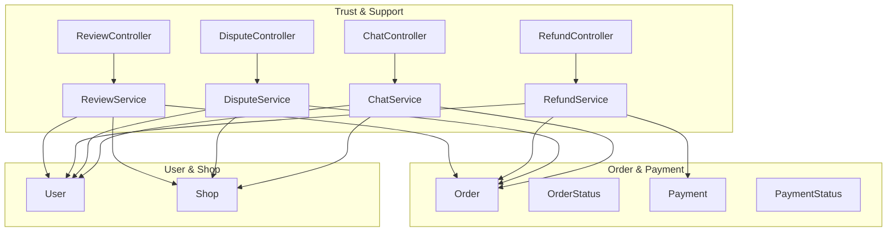
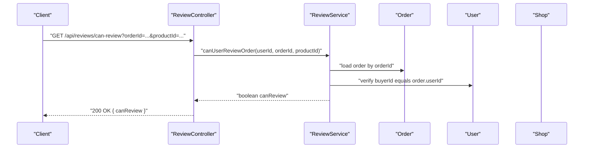
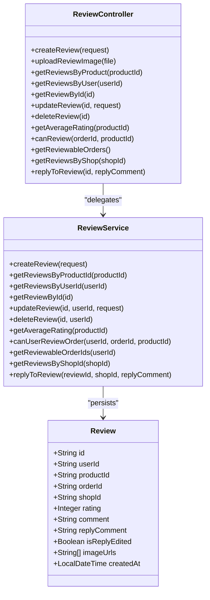
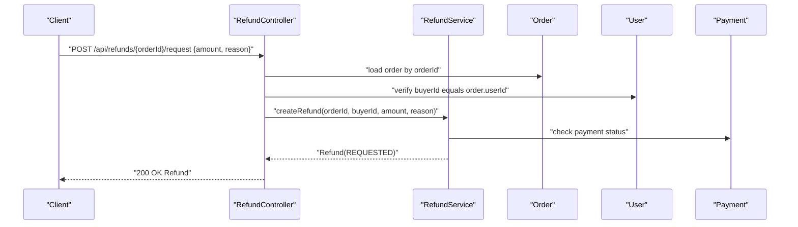
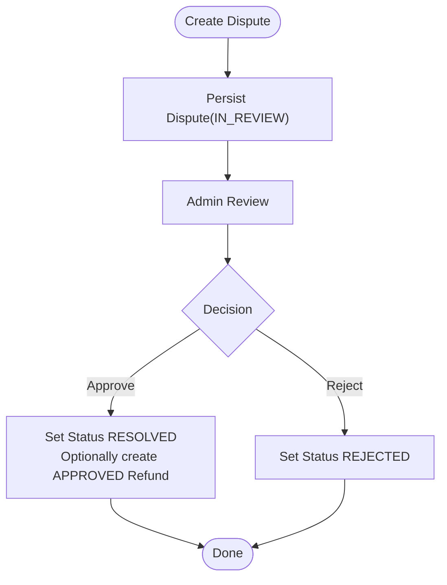
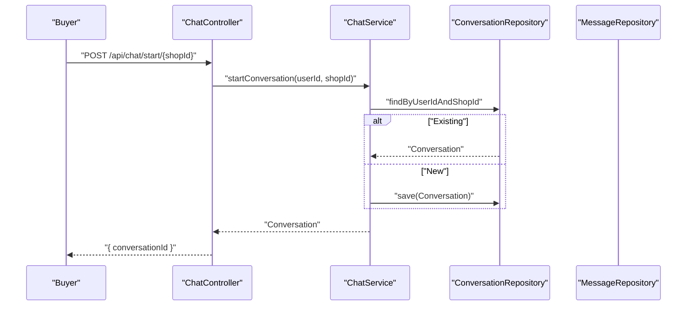
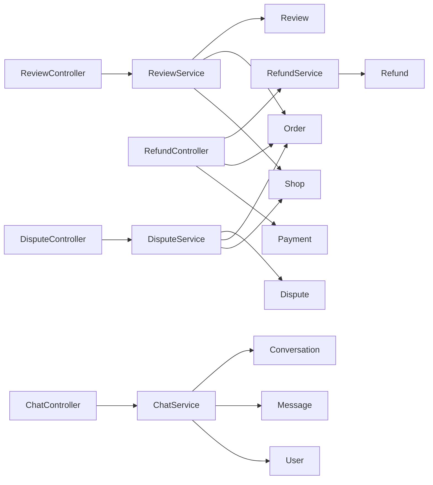
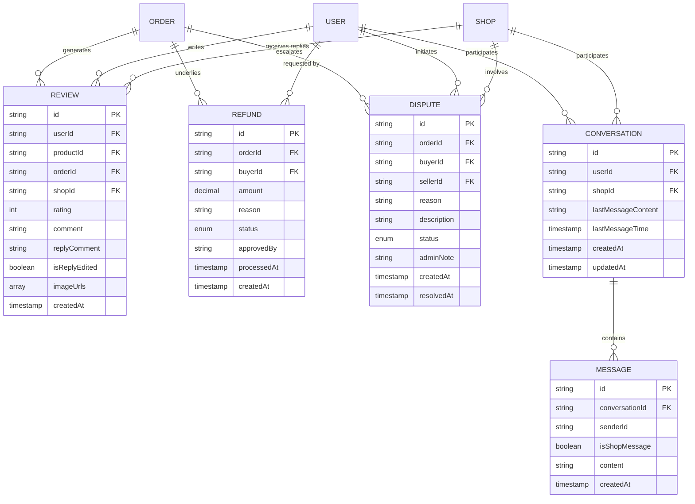

# Trust & Support System

<cite>
**Referenced Files in This Document**
- [ReviewController.java](file://src/Backend/src/main/java/com/shoppeclone/backend/review/controller/ReviewController.java)
- [ReviewService.java](file://src/Backend/src/main/java/com/shoppeclone/backend/review/service/ReviewService.java)
- [CreateReviewRequest.java](file://src/Backend/src/main/java/com/shoppeclone/backend/review/dto/request/CreateReviewRequest.java)
- [Review.java](file://src/Backend/src/main/java/com/shoppeclone/backend/review/entity/Review.java)
- [RefundController.java](file://src/Backend/src/main/java/com/shoppeclone/backend/refund/controller/RefundController.java)
- [RefundService.java](file://src/Backend/src/main/java/com/shoppeclone/backend/refund/service/RefundService.java)
- [Refund.java](file://src/Backend/src/main/java/com/shoppeclone/backend/refund/entity/Refund.java)
- [RefundStatus.java](file://src/Backend/src/main/java/com/shoppeclone/backend/refund/entity/RefundStatus.java)
- [DisputeController.java](file://src/Backend/src/main/java/com/shoppeclone/backend/dispute/controller/DisputeController.java)
- [DisputeService.java](file://src/Backend/src/main/java/com/shoppeclone/backend/dispute/service/DisputeService.java)
- [Dispute.java](file://src/Backend/src/main/java/com/shoppeclone/backend/dispute/entity/Dispute.java)
- [DisputeStatus.java](file://src/Backend/src/main/java/com/shoppeclone/backend/dispute/entity/DisputeStatus.java)
- [ChatController.java](file://src/Backend/src/main/java/com/shoppeclone/backend/chat/controller/ChatController.java)
- [ChatService.java](file://src/Backend/src/main/java/com/shoppeclone/backend/chat/service/ChatService.java)
- [Conversation.java](file://src/Backend/src/main/java/com/shoppeclone/backend/chat/entity/Conversation.java)
- [Message.java](file://src/Backend/src/main/java/com/shoppeclone/backend/chat/entity/Message.java)
- [ConversationRepository.java](file://src/Backend/src/main/java/com/shoppeclone/backend/chat/repository/ConversationRepository.java)
- [MessageRepository.java](file://src/Backend/src/main/java/com/shoppeclone/backend/chat/repository/MessageRepository.java)
- [Order.java](file://src/Backend/src/main/java/com/shoppeclone/backend/order/entity/Order.java)
- [OrderStatus.java](file://src/Backend/src/main/java/com/shoppeclone/backend/order/entity/OrderStatus.java)
- [Payment.java](file://src/Backend/src/main/java/com/shoppeclone/backend/payment/entity/Payment.java)
- [PaymentStatus.java](file://src/Backend/src/main/java/com/shoppeclone/backend/payment/entity/PaymentStatus.java)
- [User.java](file://src/Backend/src/main/java/com/shoppeclone/backend/auth/model/User.java)
- [Shop.java](file://src/Backend/src/main/java/com/shoppeclone/backend/shop/entity/Shop.java)
</cite>

## Table of Contents
1. [Introduction](#introduction)
2. [Project Structure](#project-structure)
3. [Core Components](#core-components)
4. [Architecture Overview](#architecture-overview)
5. [Detailed Component Analysis](#detailed-component-analysis)
6. [Dependency Analysis](#dependency-analysis)
7. [Performance Considerations](#performance-considerations)
8. [Troubleshooting Guide](#troubleshooting-guide)
9. [Conclusion](#conclusion)
10. [Appendices](#appendices)

## Introduction
This document explains the Trust & Support System covering product review management, refund processing, dispute resolution, and customer chat functionality. It connects these subsystems to order processing, payment systems, and user management, and provides configuration options, parameters, return values, and practical examples drawn from the codebase. The goal is to make the system understandable for beginners while offering sufficient technical depth for experienced developers.

## Project Structure
The Trust & Support domain is organized into four primary modules:
- Reviews: manage product ratings, comments, replies, and moderation checks
- Refunds: process buyer-initiated refund requests and admin approvals
- Disputes: escalate unresolved issues and link to refund creation
- Chat: enable buyer-seller conversations with message lifecycle controls

**Diagram sources**
- [ReviewController.java:24-188](file://src/Backend/src/main/java/com/shoppeclone/backend/review/controller/ReviewController.java#L24-L188)
- [RefundController.java:22-102](file://src/Backend/src/main/java/com/shoppeclone/backend/refund/controller/RefundController.java#L22-L102)
- [DisputeController.java:24-129](file://src/Backend/src/main/java/com/shoppeclone/backend/dispute/controller/DisputeController.java#L24-L129)
- [ChatController.java:20-133](file://src/Backend/src/main/java/com/shoppeclone/backend/chat/controller/ChatController.java#L20-L133)
- [Order.java](file://src/Backend/src/main/java/com/shoppeclone/backend/order/entity/Order.java)
- [OrderStatus.java](file://src/Backend/src/main/java/com/shoppeclone/backend/order/entity/OrderStatus.java)
- [Payment.java](file://src/Backend/src/main/java/com/shoppeclone/backend/payment/entity/Payment.java)
- [PaymentStatus.java](file://src/Backend/src/main/java/com/shoppeclone/backend/payment/entity/PaymentStatus.java)
- [User.java](file://src/Backend/src/main/java/com/shoppeclone/backend/auth/model/User.java)
- [Shop.java](file://src/Backend/src/main/java/com/shoppeclone/backend/shop/entity/Shop.java)

**Section sources**
- [ReviewController.java:24-188](file://src/Backend/src/main/java/com/shoppeclone/backend/review/controller/ReviewController.java#L24-L188)
- [RefundController.java:22-102](file://src/Backend/src/main/java/com/shoppeclone/backend/refund/controller/RefundController.java#L22-L102)
- [DisputeController.java:24-129](file://src/Backend/src/main/java/com/shoppeclone/backend/dispute/controller/DisputeController.java#L24-L129)
- [ChatController.java:20-133](file://src/Backend/src/main/java/com/shoppeclone/backend/chat/controller/ChatController.java#L20-L133)

## Core Components
- Review Management
  - Controllers expose endpoints to create, update, delete, and query reviews; compute average ratings; and allow sellers to reply.
  - Services define the business logic for CRUD, moderation checks, and reviewable order discovery.
  - Entities capture review metadata, replies, and optional images.
  - DTOs enforce validation for creation and updates.

- Refund Processing
  - Controllers validate order eligibility and ownership before creating refund requests.
  - Services handle creation, approval, rejection, and linking to dispute resolutions.
  - Entities track refund status and processing timestamps.

- Dispute Resolution
  - Controllers validate access by buyer, seller, or admin before creating and managing disputes.
  - Services orchestrate status transitions and optional automatic refund creation upon resolution.
  - Entities represent dispute records with statuses and timestamps.

- Customer Chat
  - Controllers manage conversation initiation, message sending, retrieval, and deletion.
  - Services encapsulate persistence and access control for conversations and messages.
  - Repositories provide MongoDB-backed storage for conversations and messages.

**Section sources**
- [ReviewService.java:9-65](file://src/Backend/src/main/java/com/shoppeclone/backend/review/service/ReviewService.java#L9-L65)
- [CreateReviewRequest.java:12-33](file://src/Backend/src/main/java/com/shoppeclone/backend/review/dto/request/CreateReviewRequest.java#L12-L33)
- [Review.java:11-39](file://src/Backend/src/main/java/com/shoppeclone/backend/review/entity/Review.java#L11-L39)
- [RefundService.java:8-23](file://src/Backend/src/main/java/com/shoppeclone/backend/refund/service/RefundService.java#L8-L23)
- [Refund.java:10-32](file://src/Backend/src/main/java/com/shoppeclone/backend/refund/entity/Refund.java#L10-L32)
- [RefundStatus.java:3-8](file://src/Backend/src/main/java/com/shoppeclone/backend/refund/entity/RefundStatus.java#L3-L8)
- [DisputeService.java:7-27](file://src/Backend/src/main/java/com/shoppeclone/backend/dispute/service/DisputeService.java#L7-L27)
- [Dispute.java:9-33](file://src/Backend/src/main/java/com/shoppeclone/backend/dispute/entity/Dispute.java#L9-L33)
- [DisputeStatus.java:3-8](file://src/Backend/src/main/java/com/shoppeclone/backend/dispute/entity/DisputeStatus.java#L3-L8)
- [ChatService.java:20-124](file://src/Backend/src/main/java/com/shoppeclone/backend/chat/service/ChatService.java#L20-L124)
- [Conversation.java:13-34](file://src/Backend/src/main/java/com/shoppeclone/backend/chat/entity/Conversation.java#L13-L34)
- [Message.java:11-31](file://src/Backend/src/main/java/com/shoppeclone/backend/chat/entity/Message.java#L11-L31)

## Architecture Overview
The Trust & Support system integrates tightly with Order, Payment, User, and Shop domains. Reviews depend on Order completion and Payment outcomes; Refunds depend on Order eligibility and Payment status; Disputes escalate unresolved Orders and can trigger Refunds; Chat enables communication between Users and Shops.

**Diagram sources**
- [ReviewController.java:136-144](file://src/Backend/src/main/java/com/shoppeclone/backend/review/controller/ReviewController.java#L136-L144)
- [ReviewService.java:49-54](file://src/Backend/src/main/java/com/shoppeclone/backend/review/service/ReviewService.java#L49-L54)
- [Order.java](file://src/Backend/src/main/java/com/shoppeclone/backend/order/entity/Order.java)
- [User.java](file://src/Backend/src/main/java/com/shoppeclone/backend/auth/model/User.java)

**Section sources**
- [ReviewController.java:136-144](file://src/Backend/src/main/java/com/shoppeclone/backend/review/controller/ReviewController.java#L136-L144)
- [ReviewService.java:49-54](file://src/Backend/src/main/java/com/shoppeclone/backend/review/service/ReviewService.java#L49-L54)

## Detailed Component Analysis

### Product Review Management
- Endpoints
  - Create review: POST /api/reviews
  - Upload images: POST /api/reviews/upload-image
  - Get reviews by product: GET /api/reviews/product/{productId}
  - Get reviews by user: GET /api/reviews/user/{userId}
  - Get single review: GET /api/reviews/{id}
  - Update review: PUT /api/reviews/{id}
  - Delete review: DELETE /api/reviews/{id}
  - Average rating: GET /api/reviews/product/{productId}/average-rating
  - Can review check: GET /api/reviews/can-review?orderId=&productId=
  - Reviewable orders: GET /api/reviews/reviewable-orders
  - Get shop reviews: GET /api/reviews/shop/{shopId}
  - Reply to review: POST /api/reviews/{id}/reply

- Parameters and Validation
  - CreateReviewRequest enforces productId, orderId, rating bounds, optional comment, and up to five image URLs.
  - Update/delete restricts to the review owner.
  - Reply requires authenticated seller of the shop associated with the review.

- Return Values
  - CRUD endpoints return ReviewResponse or HTTP 204 for deletions.
  - Average rating returns a JSON object with a numeric value.
  - Can review returns a boolean flag.

- Moderation and Access Control
  - Sellers can reply to reviews tied to their shop.
  - Image uploads go through Cloudinary via the controller’s upload endpoint.

- Example Paths
  - [Create review:44-52](file://src/Backend/src/main/java/com/shoppeclone/backend/review/controller/ReviewController.java#L44-L52)
  - [Upload images:58-63](file://src/Backend/src/main/java/com/shoppeclone/backend/review/controller/ReviewController.java#L58-L63)
  - [Average rating:126-130](file://src/Backend/src/main/java/com/shoppeclone/backend/review/controller/ReviewController.java#L126-L130)
  - [Can review check:136-144](file://src/Backend/src/main/java/com/shoppeclone/backend/review/controller/ReviewController.java#L136-L144)

**Diagram sources**
- [ReviewController.java:24-188](file://src/Backend/src/main/java/com/shoppeclone/backend/review/controller/ReviewController.java#L24-L188)
- [ReviewService.java:9-65](file://src/Backend/src/main/java/com/shoppeclone/backend/review/service/ReviewService.java#L9-L65)
- [Review.java:11-39](file://src/Backend/src/main/java/com/shoppeclone/backend/review/entity/Review.java#L11-L39)

**Section sources**
- [ReviewController.java:44-188](file://src/Backend/src/main/java/com/shoppeclone/backend/review/controller/ReviewController.java#L44-L188)
- [CreateReviewRequest.java:12-33](file://src/Backend/src/main/java/com/shoppeclone/backend/review/dto/request/CreateReviewRequest.java#L12-L33)
- [Review.java:11-39](file://src/Backend/src/main/java/com/shoppeclone/backend/review/entity/Review.java#L11-L39)

### Refund Processing
- Endpoints
  - Request refund: POST /api/refunds/{orderId}/request
  - Get refund by order: GET /api/refunds/{orderId}

- Eligibility and Access Control
  - Only buyers who placed the order can request refunds.
  - Order must be in COMPLETED status.
  - Access to refund details is restricted to buyer, seller, or admin.

- Workflow
  - Request sets status to REQUESTED.
  - Admin can approve or reject; approved refunds transition to APPROVED.
  - Approved refunds can be marked REFUNDED externally (e.g., after payment system confirms).

- Parameters and Return Values
  - Request body supports explicit amount; otherwise defaults to order total.
  - Returns the created Refund entity.

- Example Paths
  - [Request refund:48-78](file://src/Backend/src/main/java/com/shoppeclone/backend/refund/controller/RefundController.java#L48-L78)
  - [Get refund by order:80-101](file://src/Backend/src/main/java/com/shoppeclone/backend/refund/controller/RefundController.java#L80-L101)

**Diagram sources**
- [RefundController.java:48-78](file://src/Backend/src/main/java/com/shoppeclone/backend/refund/controller/RefundController.java#L48-L78)
- [RefundService.java:9-12](file://src/Backend/src/main/java/com/shoppeclone/backend/refund/service/RefundService.java#L9-L12)
- [Order.java](file://src/Backend/src/main/java/com/shoppeclone/backend/order/entity/Order.java)
- [OrderStatus.java](file://src/Backend/src/main/java/com/shoppeclone/backend/order/entity/OrderStatus.java)
- [Payment.java](file://src/Backend/src/main/java/com/shoppeclone/backend/payment/entity/Payment.java)
- [PaymentStatus.java](file://src/Backend/src/main/java/com/shoppeclone/backend/payment/entity/PaymentStatus.java)

**Section sources**
- [RefundController.java:48-101](file://src/Backend/src/main/java/com/shoppeclone/backend/refund/controller/RefundController.java#L48-L101)
- [RefundService.java:9-23](file://src/Backend/src/main/java/com/shoppeclone/backend/refund/service/RefundService.java#L9-L23)
- [Refund.java:10-32](file://src/Backend/src/main/java/com/shoppeclone/backend/refund/entity/Refund.java#L10-L32)
- [RefundStatus.java:3-8](file://src/Backend/src/main/java/com/shoppeclone/backend/refund/entity/RefundStatus.java#L3-L8)

### Dispute Resolution
- Endpoints
  - Create dispute: POST /api/disputes
  - Upload dispute image: POST /api/disputes/{id}/images
  - Get dispute: GET /api/disputes/{id}
  - Get dispute images: GET /api/disputes/{id}/images
  - Get dispute by order: GET /api/disputes/order/{orderId}

- Access Control
  - Buyers can create and access their own disputes.
  - Sellers linked to the order can access; admins have unrestricted access.

- Status Lifecycle
  - Disputes start as IN_REVIEW and can be RESOLVED or REJECTED.
  - Resolutions can optionally auto-create an APPROVED refund.

- Example Paths
  - [Create dispute:76-87](file://src/Backend/src/main/java/com/shoppeclone/backend/dispute/controller/DisputeController.java#L76-L87)
  - [Upload image:89-99](file://src/Backend/src/main/java/com/shoppeclone/backend/dispute/controller/DisputeController.java#L89-L99)
  - [Get dispute by order:120-128](file://src/Backend/src/main/java/com/shoppeclone/backend/dispute/controller/DisputeController.java#L120-L128)

**Diagram sources**
- [DisputeController.java:76-128](file://src/Backend/src/main/java/com/shoppeclone/backend/dispute/controller/DisputeController.java#L76-L128)
- [DisputeService.java:10-13](file://src/Backend/src/main/java/com/shoppeclone/backend/dispute/service/DisputeService.java#L10-L13)
- [Dispute.java:9-33](file://src/Backend/src/main/java/com/shoppeclone/backend/dispute/entity/Dispute.java#L9-L33)
- [DisputeStatus.java:3-8](file://src/Backend/src/main/java/com/shoppeclone/backend/dispute/entity/DisputeStatus.java#L3-L8)

**Section sources**
- [DisputeController.java:76-129](file://src/Backend/src/main/java/com/shoppeclone/backend/dispute/controller/DisputeController.java#L76-L129)
- [DisputeService.java:7-27](file://src/Backend/src/main/java/com/shoppeclone/backend/dispute/service/DisputeService.java#L7-L27)
- [Dispute.java:9-33](file://src/Backend/src/main/java/com/shoppeclone/backend/dispute/entity/Dispute.java#L9-L33)
- [DisputeStatus.java:3-8](file://src/Backend/src/main/java/com/shoppeclone/backend/dispute/entity/DisputeStatus.java#L3-L8)

### Customer Chat Functionality
- Endpoints
  - Start conversation: POST /api/chat/start/{shopId}?userId=...
  - Get messages: GET /api/chat/{conversationId}/messages
  - Get conversation: GET /api/chat/conversation/{conversationId}
  - Get shop conversations: GET /api/chat/shop/{shopId}/conversations
  - Send message: POST /api/chat/{conversationId}/messages {content}
  - Delete message: DELETE /api/chat/messages/{messageId}
  - Delete conversation: DELETE /api/chat/conversations/{conversationId}

- Access Control
  - Only participants can delete messages/conversations.
  - Shop owners can initiate chats with specific followers; others start with the shop.

- Persistence
  - Conversations indexed by user and shop; deduplication keeps the latest per user.
  - Messages stored with timestamps and shop attribution.

- Example Paths
  - [Start conversation:28-51](file://src/Backend/src/main/java/com/shoppeclone/backend/chat/controller/ChatController.java#L28-L51)
  - [Send message:74-101](file://src/Backend/src/main/java/com/shoppeclone/backend/chat/controller/ChatController.java#L74-L101)
  - [Delete conversation:118-131](file://src/Backend/src/main/java/com/shoppeclone/backend/chat/controller/ChatController.java#L118-L131)

**Diagram sources**
- [ChatController.java:28-51](file://src/Backend/src/main/java/com/shoppeclone/backend/chat/controller/ChatController.java#L28-L51)
- [ChatService.java:27-41](file://src/Backend/src/main/java/com/shoppeclone/backend/chat/service/ChatService.java#L27-L41)
- [ConversationRepository.java:11-16](file://src/Backend/src/main/java/com/shoppeclone/backend/chat/repository/ConversationRepository.java#L11-L16)

**Section sources**
- [ChatController.java:28-131](file://src/Backend/src/main/java/com/shoppeclone/backend/chat/controller/ChatController.java#L28-L131)
- [ChatService.java:27-123](file://src/Backend/src/main/java/com/shoppeclone/backend/chat/service/ChatService.java#L27-L123)
- [Conversation.java:13-34](file://src/Backend/src/main/java/com/shoppeclone/backend/chat/entity/Conversation.java#L13-L34)
- [Message.java:11-31](file://src/Backend/src/main/java/com/shoppeclone/backend/chat/entity/Message.java#L11-L31)
- [ConversationRepository.java:11-16](file://src/Backend/src/main/java/com/shoppeclone/backend/chat/repository/ConversationRepository.java#L11-L16)
- [MessageRepository.java:10-13](file://src/Backend/src/main/java/com/shoppeclone/backend/chat/repository/MessageRepository.java#L10-L13)

## Dependency Analysis
- Controllers depend on Services and Repositories to enforce business rules and persist data.
- Services depend on Entities and repositories to operate on domain data.
- Entities define indices for efficient lookups (by user, shop, order).
- Cross-domain dependencies:
  - Reviews depend on Orders for eligibility checks and Shops for seller replies.
  - Refunds depend on Orders for eligibility and Payments for status alignment.
  - Disputes depend on Orders and can trigger Refunds.
  - Chat depends on Users and Shops for participant verification.

**Diagram sources**
- [ReviewController.java:24-188](file://src/Backend/src/main/java/com/shoppeclone/backend/review/controller/ReviewController.java#L24-L188)
- [RefundController.java:22-102](file://src/Backend/src/main/java/com/shoppeclone/backend/refund/controller/RefundController.java#L22-L102)
- [DisputeController.java:24-129](file://src/Backend/src/main/java/com/shoppeclone/backend/dispute/controller/DisputeController.java#L24-L129)
- [ChatController.java:20-133](file://src/Backend/src/main/java/com/shoppeclone/backend/chat/controller/ChatController.java#L20-L133)
- [Review.java:11-39](file://src/Backend/src/main/java/com/shoppeclone/backend/review/entity/Review.java#L11-L39)
- [Refund.java:10-32](file://src/Backend/src/main/java/com/shoppeclone/backend/refund/entity/Refund.java#L10-L32)
- [Dispute.java:9-33](file://src/Backend/src/main/java/com/shoppeclone/backend/dispute/entity/Dispute.java#L9-L33)
- [Conversation.java:13-34](file://src/Backend/src/main/java/com/shoppeclone/backend/chat/entity/Conversation.java#L13-L34)
- [Message.java:11-31](file://src/Backend/src/main/java/com/shoppeclone/backend/chat/entity/Message.java#L11-L31)
- [Order.java](file://src/Backend/src/main/java/com/shoppeclone/backend/order/entity/Order.java)
- [Shop.java](file://src/Backend/src/main/java/com/shoppeclone/backend/shop/entity/Shop.java)
- [User.java](file://src/Backend/src/main/java/com/shoppeclone/backend/auth/model/User.java)
- [Payment.java](file://src/Backend/src/main/java/com/shoppeclone/backend/payment/entity/Payment.java)

**Section sources**
- [Review.java:11-39](file://src/Backend/src/main/java/com/shoppeclone/backend/review/entity/Review.java#L11-L39)
- [Refund.java:10-32](file://src/Backend/src/main/java/com/shoppeclone/backend/refund/entity/Refund.java#L10-L32)
- [Dispute.java:9-33](file://src/Backend/src/main/java/com/shoppeclone/backend/dispute/entity/Dispute.java#L9-L33)
- [Conversation.java:13-34](file://src/Backend/src/main/java/com/shoppeclone/backend/chat/entity/Conversation.java#L13-L34)
- [Message.java:11-31](file://src/Backend/src/main/java/com/shoppeclone/backend/chat/entity/Message.java#L11-L31)

## Performance Considerations
- Indexing
  - Reviews and Disputes use indexed foreign keys for user, product, order, and shop to speed lookups.
  - Conversations are compound-indexed by user and shop to avoid duplicates efficiently.
- Pagination and Filtering
  - For large datasets, consider adding pagination to endpoints returning lists (e.g., shop reviews, dispute images).
- Asynchronous Workflows
  - Consider offloading heavy tasks (image uploads, notifications) to background jobs.
- Caching
  - Cache frequently accessed averages and recent messages where appropriate.

[No sources needed since this section provides general guidance]

## Troubleshooting Guide
- Reviews
  - “User not found” during authentication: ensure the authenticated principal maps to an existing user.
  - “Cannot review” response: verify the order is COMPLETED and belongs to the requesting user.
  - “Reply not allowed”: ensure the requester owns the shop associated with the review.

- Refunds
  - “Order not found” or “Forbidden”: confirm order ownership and COMPLETED status.
  - Amount mismatch: ensure the requested amount does not exceed the order total.

- Disputes
  - “No permission to access this dispute”: verify buyer/seller/admin roles against the order.
  - Resolution not creating refund: ensure the admin action explicitly approves a refund upon resolution.

- Chat
  - “Conversation not found”: verify the conversationId exists and belongs to the user or shop owner.
  - “You do not have permission to delete”: only the original sender can delete messages; shop owners can delete for their conversations.

**Section sources**
- [ReviewController.java:34-38](file://src/Backend/src/main/java/com/shoppeclone/backend/review/controller/ReviewController.java#L34-L38)
- [RefundController.java:57-68](file://src/Backend/src/main/java/com/shoppeclone/backend/refund/controller/RefundController.java#L57-L68)
- [DisputeController.java:47-70](file://src/Backend/src/main/java/com/shoppeclone/backend/dispute/controller/DisputeController.java#L47-L70)
- [ChatController.java:86-115](file://src/Backend/src/main/java/com/shoppeclone/backend/chat/controller/ChatController.java#L86-L115)

## Conclusion
The Trust & Support System provides a cohesive set of capabilities to maintain product quality, resolve financial issues, and facilitate communication. Reviews, Refunds, Disputes, and Chat are tightly integrated with Orders, Payments, Users, and Shops, ensuring consistent state and robust access control. By following the documented endpoints, parameters, and workflows, teams can implement reliable trust and support experiences.

[No sources needed since this section summarizes without analyzing specific files]

## Appendices

### API Definitions

- Reviews
  - POST /api/reviews
    - Body: CreateReviewRequest
    - Returns: ReviewResponse
  - POST /api/reviews/upload-image
    - Form-data: file
    - Returns: { imageUrl }
  - GET /api/reviews/product/{productId}
    - Returns: List<ReviewResponse>
  - GET /api/reviews/user/{userId}
    - Returns: List<ReviewResponse>
  - GET /api/reviews/{id}
    - Returns: ReviewResponse
  - PUT /api/reviews/{id}
    - Body: UpdateReviewRequest
    - Returns: ReviewResponse
  - DELETE /api/reviews/{id}
    - Returns: 204 No Content
  - GET /api/reviews/product/{productId}/average-rating
    - Returns: { averageRating: number }
  - GET /api/reviews/can-review?orderId=&productId=
    - Returns: { canReview: boolean }
  - GET /api/reviews/reviewable-orders
    - Returns: { orderIds: string[] }
  - GET /api/reviews/shop/{shopId}
    - Returns: List<ReviewResponse>
  - POST /api/reviews/{id}/reply
    - Body: { replyComment: string }
    - Returns: ReviewResponse

- Refunds
  - POST /api/refunds/{orderId}/request
    - Body: { amount?: number, reason: string }
    - Returns: Refund
  - GET /api/refunds/{orderId}
    - Returns: Refund or 404

- Disputes
  - POST /api/disputes
    - Body: { orderId: string, reason: string, description: string }
    - Returns: Dispute
  - POST /api/disputes/{id}/images
    - Body: { imageUrl: string }
    - Returns: DisputeImage
  - GET /api/disputes/{id}
    - Returns: Dispute
  - GET /api/disputes/{id}/images
    - Returns: List<DisputeImage>
  - GET /api/disputes/order/{orderId}
    - Returns: Dispute or 404

- Chat
  - POST /api/chat/start/{shopId}?userId=...
    - Returns: { conversationId: string }
  - GET /api/chat/{conversationId}/messages
    - Returns: List<Message>
  - GET /api/chat/conversation/{conversationId}
    - Returns: Conversation or 404
  - GET /api/chat/shop/{shopId}/conversations
    - Returns: List<Conversation>
  - POST /api/chat/{conversationId}/messages
    - Body: { content: string }
    - Returns: Message
  - DELETE /api/chat/messages/{messageId}
    - Returns: 200 or 400
  - DELETE /api/chat/conversations/{conversationId}
    - Returns: 200 or 400

**Section sources**
- [ReviewController.java:44-188](file://src/Backend/src/main/java/com/shoppeclone/backend/review/controller/ReviewController.java#L44-L188)
- [RefundController.java:48-101](file://src/Backend/src/main/java/com/shoppeclone/backend/refund/controller/RefundController.java#L48-L101)
- [DisputeController.java:76-129](file://src/Backend/src/main/java/com/shoppeclone/backend/dispute/controller/DisputeController.java#L76-L129)
- [ChatController.java:28-131](file://src/Backend/src/main/java/com/shoppeclone/backend/chat/controller/ChatController.java#L28-L131)

### Data Models

**Diagram sources**
- [Review.java:11-39](file://src/Backend/src/main/java/com/shoppeclone/backend/review/entity/Review.java#L11-L39)
- [Refund.java:10-32](file://src/Backend/src/main/java/com/shoppeclone/backend/refund/entity/Refund.java#L10-L32)
- [Dispute.java:9-33](file://src/Backend/src/main/java/com/shoppeclone/backend/dispute/entity/Dispute.java#L9-L33)
- [Conversation.java:13-34](file://src/Backend/src/main/java/com/shoppeclone/backend/chat/entity/Conversation.java#L13-L34)
- [Message.java:11-31](file://src/Backend/src/main/java/com/shoppeclone/backend/chat/entity/Message.java#L11-L31)
- [Order.java](file://src/Backend/src/main/java/com/shoppeclone/backend/order/entity/Order.java)
- [User.java](file://src/Backend/src/main/java/com/shoppeclone/backend/auth/model/User.java)
- [Shop.java](file://src/Backend/src/main/java/com/shoppeclone/backend/shop/entity/Shop.java)