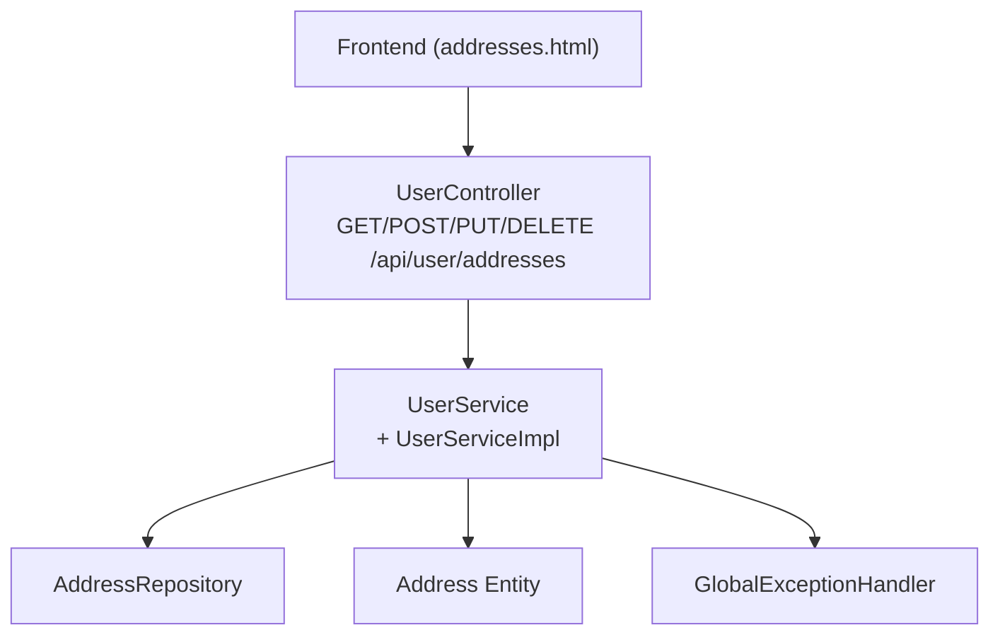
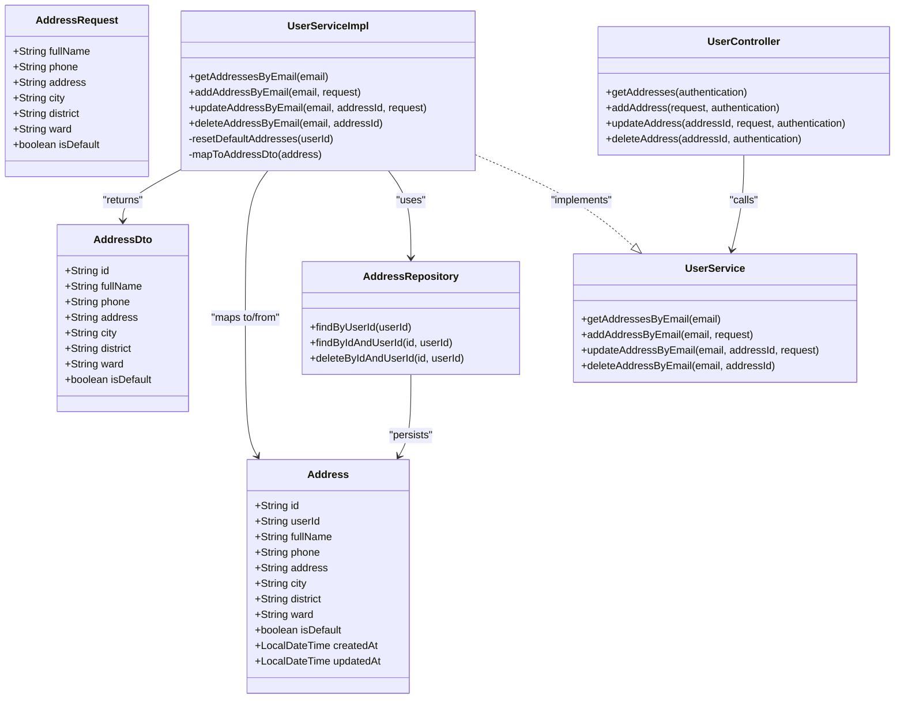
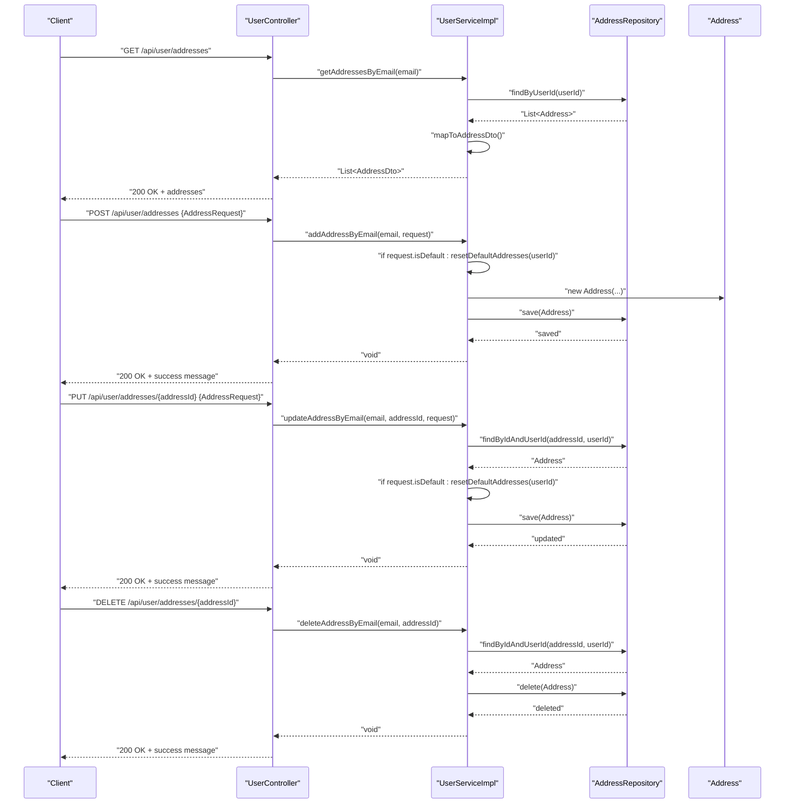
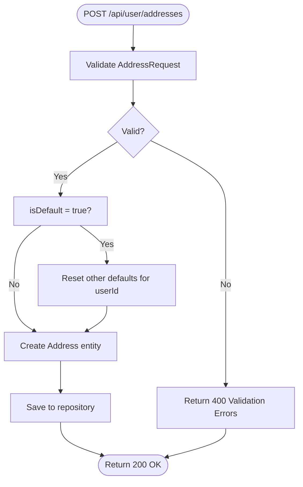
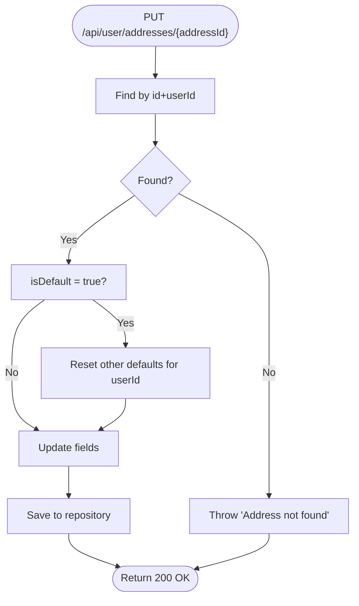
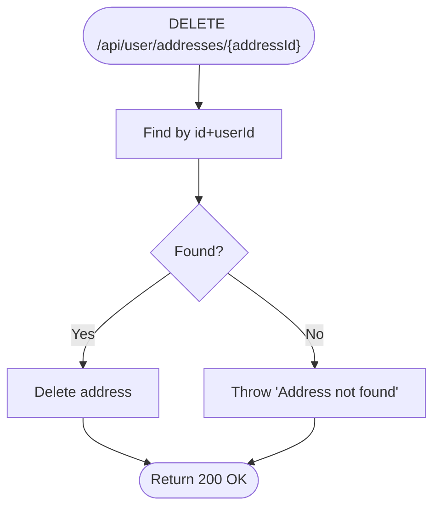
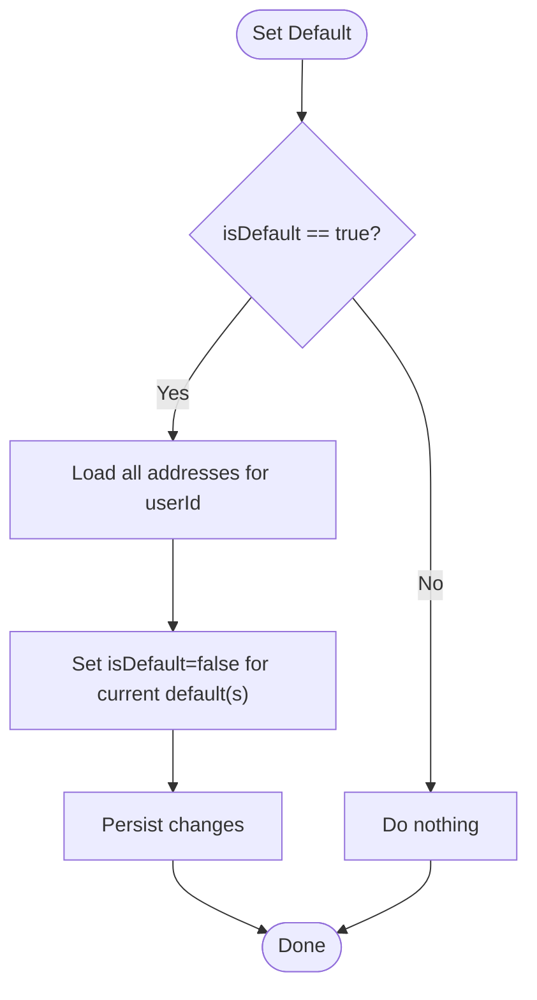
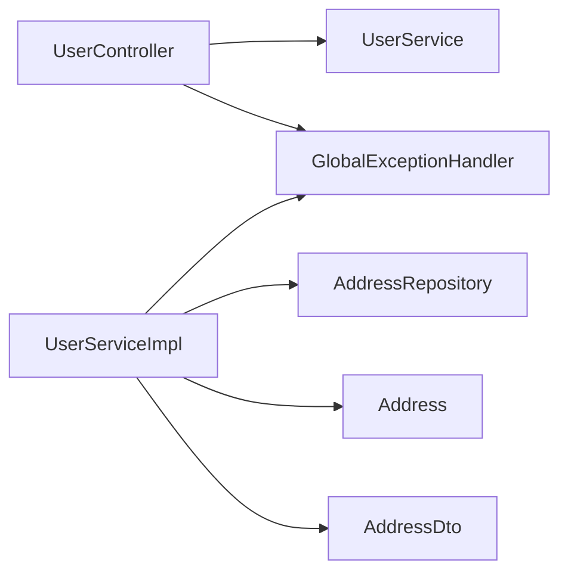

# Address Management System

<cite>
**Referenced Files in This Document**
- [Address.java](file://src/Backend/src/main/java/com/shoppeclone/backend/user/model/Address.java)
- [AddressRequest.java](file://src/Backend/src/main/java/com/shoppeclone/backend/user/dto/request/AddressRequest.java)
- [AddressDto.java](file://src/Backend/src/main/java/com/shoppeclone/backend/user/dto/response/AddressDto.java)
- [AddressRepository.java](file://src/Backend/src/main/java/com/shoppeclone/backend/user/repository/AddressRepository.java)
- [UserService.java](file://src/Backend/src/main/java/com/shoppeclone/backend/user/service/UserService.java)
- [UserServiceImpl.java](file://src/Backend/src/main/java/com/shoppeclone/backend/user/service/impl/UserServiceImpl.java)
- [UserController.java](file://src/Backend/src/main/java/com/shoppeclone/backend/user/controller/UserController.java)
- [GlobalExceptionHandler.java](file://src/Backend/src/main/java/com/shoppeclone/backend/common/exception/GlobalExceptionHandler.java)
- [addresses.html](file://src/Frontend/addresses.html)
</cite>

## Table of Contents
1. [Introduction](#introduction)
2. [Project Structure](#project-structure)
3. [Core Components](#core-components)
4. [Architecture Overview](#architecture-overview)
5. [Detailed Component Analysis](#detailed-component-analysis)
6. [Dependency Analysis](#dependency-analysis)
7. [Performance Considerations](#performance-considerations)
8. [Troubleshooting Guide](#troubleshooting-guide)
9. [Conclusion](#conclusion)

## Introduction
This document describes the Address Management System that powers user address CRUD operations. It covers the HTTP endpoints for retrieving, adding, updating, and deleting addresses, the data transfer objects (DTOs) and validation rules, the underlying entity model, and the business logic for default address selection and persistence. Practical examples and error handling guidance are included to help developers integrate and troubleshoot the system effectively.

## Project Structure
The address management feature spans the model, DTO, repository, service, and controller layers, plus frontend integration for UI interactions.

**Diagram sources**
- [UserController.java:55-87](file://src/Backend/src/main/java/com/shoppeclone/backend/user/controller/UserController.java#L55-L87)
- [UserService.java:17-23](file://src/Backend/src/main/java/com/shoppeclone/backend/user/service/UserService.java#L17-L23)
- [UserServiceImpl.java:70-136](file://src/Backend/src/main/java/com/shoppeclone/backend/user/service/impl/UserServiceImpl.java#L70-L136)
- [AddressRepository.java:8-14](file://src/Backend/src/main/java/com/shoppeclone/backend/user/repository/AddressRepository.java#L8-L14)
- [Address.java:10-23](file://src/Backend/src/main/java/com/shoppeclone/backend/user/model/Address.java#L10-L23)
- [GlobalExceptionHandler.java:24-40](file://src/Backend/src/main/java/com/shoppeclone/backend/common/exception/GlobalExceptionHandler.java#L24-L40)

**Section sources**
- [UserController.java:15-96](file://src/Backend/src/main/java/com/shoppeclone/backend/user/controller/UserController.java#L15-L96)
- [UserServiceImpl.java:21-201](file://src/Backend/src/main/java/com/shoppeclone/backend/user/service/impl/UserServiceImpl.java#L21-L201)
- [AddressRepository.java:1-15](file://src/Backend/src/main/java/com/shoppeclone/backend/user/repository/AddressRepository.java#L1-L15)
- [Address.java:1-24](file://src/Backend/src/main/java/com/shoppeclone/backend/user/model/Address.java#L1-L24)
- [GlobalExceptionHandler.java:1-109](file://src/Backend/src/main/java/com/shoppeclone/backend/common/exception/GlobalExceptionHandler.java#L1-L109)

## Core Components
- Address entity: stores address fields and default flag with MongoDB annotations.
- AddressRequest DTO: validates incoming address creation/update requests.
- AddressDto: response payload for address listings.
- AddressRepository: MongoDB repository with typed queries by userId and id+userId.
- UserService and UserServiceImpl: orchestrate address operations, enforce default address semantics, and map to/from DTOs.
- UserController: exposes REST endpoints for address management.
- GlobalExceptionHandler: centralizes validation and runtime error responses.

**Section sources**
- [Address.java:10-23](file://src/Backend/src/main/java/com/shoppeclone/backend/user/model/Address.java#L10-L23)
- [AddressRequest.java:8-29](file://src/Backend/src/main/java/com/shoppeclone/backend/user/dto/request/AddressRequest.java#L8-L29)
- [AddressDto.java:6-15](file://src/Backend/src/main/java/com/shoppeclone/backend/user/dto/response/AddressDto.java#L6-L15)
- [AddressRepository.java:8-14](file://src/Backend/src/main/java/com/shoppeclone/backend/user/repository/AddressRepository.java#L8-L14)
- [UserService.java:9-27](file://src/Backend/src/main/java/com/shoppeclone/backend/user/service/UserService.java#L9-L27)
- [UserServiceImpl.java:70-136](file://src/Backend/src/main/java/com/shoppeclone/backend/user/service/impl/UserServiceImpl.java#L70-L136)
- [UserController.java:55-87](file://src/Backend/src/main/java/com/shoppeclone/backend/user/controller/UserController.java#L55-L87)
- [GlobalExceptionHandler.java:24-40](file://src/Backend/src/main/java/com/shoppeclone/backend/common/exception/GlobalExceptionHandler.java#L24-L40)

## Architecture Overview
The system follows a layered architecture:
- Presentation: UserController exposes REST endpoints.
- Application: UserService defines the contract; UserServiceImpl implements business logic.
- Persistence: AddressRepository provides MongoDB access.
- Data Transfer: AddressRequest for input validation; AddressDto for output serialization.
- Error Handling: GlobalExceptionHandler standardizes error responses.

**Diagram sources**
- [Address.java:10-23](file://src/Backend/src/main/java/com/shoppeclone/backend/user/model/Address.java#L10-L23)
- [AddressRequest.java:8-29](file://src/Backend/src/main/java/com/shoppeclone/backend/user/dto/request/AddressRequest.java#L8-L29)
- [AddressDto.java:6-15](file://src/Backend/src/main/java/com/shoppeclone/backend/user/dto/response/AddressDto.java#L6-L15)
- [AddressRepository.java:8-14](file://src/Backend/src/main/java/com/shoppeclone/backend/user/repository/AddressRepository.java#L8-L14)
- [UserService.java:9-27](file://src/Backend/src/main/java/com/shoppeclone/backend/user/service/UserService.java#L9-L27)
- [UserServiceImpl.java:70-136](file://src/Backend/src/main/java/com/shoppeclone/backend/user/service/impl/UserServiceImpl.java#L70-L136)
- [UserController.java:55-87](file://src/Backend/src/main/java/com/shoppeclone/backend/user/controller/UserController.java#L55-L87)

## Detailed Component Analysis

### Address Entity Model
- Fields: identifier, user association, recipient details, locality components, default flag, timestamps.
- Default behavior: isDefault defaults to false at the entity level.
- Persistence: mapped to MongoDB collection "addresses".

Key characteristics:
- Strong typing via primitive wrappers for scalars.
- Timestamps capture creation and last update.
- Relationship: Address belongs to a user via userId.

**Section sources**
- [Address.java:10-23](file://src/Backend/src/main/java/com/shoppeclone/backend/user/model/Address.java#L10-L23)

### AddressRequest DTO
Purpose: Validates incoming address creation and update payloads.

Validation rules:
- fullName: required (non-blank).
- phone: required pattern matching 10 digits starting with "0".
- address: required (non-blank).
- city: required (non-blank).
- district: required (non-blank).
- ward: required (non-blank).
- isDefault: optional flag indicating default address selection.

Behavior:
- Used in controller endpoints with @Valid to trigger Bean Validation.
- Enforces constraints server-side regardless of client-side checks.

**Section sources**
- [AddressRequest.java:8-29](file://src/Backend/src/main/java/com/shoppeclone/backend/user/dto/request/AddressRequest.java#L8-L29)

### AddressDto Response Format
Fields returned to clients:
- id, fullName, phone, address, city, district, ward, isDefault.

Notes:
- Excludes createdAt/updatedAt to keep response minimal.
- Reflects persisted fields and default flag state.

**Section sources**
- [AddressDto.java:6-15](file://src/Backend/src/main/java/com/shoppeclone/backend/user/dto/response/AddressDto.java#L6-L15)

### AddressRepository
Capabilities:
- findByUserId(userId): lists all addresses for a user.
- findByIdAndUserId(id, userId): fetches a specific address owned by the user.
- deleteByIdAndUserId(id, userId): deletes an address owned by the user.

Implications:
- All repository operations are scoped to the authenticated user to prevent cross-user access.

**Section sources**
- [AddressRepository.java:8-14](file://src/Backend/src/main/java/com/shoppeclone/backend/user/repository/AddressRepository.java#L8-L14)

### UserService and UserServiceImpl
Responsibilities:
- Retrieve addresses by user email.
- Add new addresses with default address handling.
- Update existing addresses with default address handling.
- Delete addresses owned by the user.
- Map between Address entity and AddressDto.

Default Address Semantics:
- When isDefault is true in create/update:
  - Reset all previously marked default addresses for the user.
  - Persist the new default address.
- When isDefault is false, no changes to other defaults occur.

Persistence Strategy:
- Uses transactional boundaries for write operations to maintain consistency.
- Saves timestamps during create/update.

**Section sources**
- [UserService.java:17-23](file://src/Backend/src/main/java/com/shoppeclone/backend/user/service/UserService.java#L17-L23)
- [UserServiceImpl.java:70-136](file://src/Backend/src/main/java/com/shoppeclone/backend/user/service/impl/UserServiceImpl.java#L70-L136)

### UserController Endpoints
Endpoints:
- GET /api/user/addresses: Returns all addresses for the authenticated user.
- POST /api/user/addresses: Creates a new address for the authenticated user.
- PUT /api/user/addresses/{addressId}: Updates an existing address owned by the user.
- DELETE /api/user/addresses/{addressId}: Removes an address owned by the user.

Security:
- Authentication is required; endpoints extract email from Authentication principal.
- Authorization enforced via repository queries scoped to userId.

Responses:
- Successful operations return success messages as plain text.
- Validation failures return structured error bodies via GlobalExceptionHandler.

**Section sources**
- [UserController.java:55-87](file://src/Backend/src/main/java/com/shoppeclone/backend/user/controller/UserController.java#L55-L87)

### Frontend Integration
The frontend page demonstrates:
- Adding/editing addresses via a modal form.
- Setting an address as default by sending a PUT with isDefault=true.
- Deleting addresses with confirmation and toast notifications.
- Using Authorization headers with Bearer tokens.

Note: The frontend performs client-side phone validation and also relies on server-side validation for robustness.

**Section sources**
- [addresses.html:406-455](file://src/Frontend/addresses.html#L406-L455)
- [addresses.html:457-479](file://src/Frontend/addresses.html#L457-L479)
- [addresses.html:481-499](file://src/Frontend/addresses.html#L481-L499)

## Architecture Overview

**Diagram sources**
- [UserController.java:55-87](file://src/Backend/src/main/java/com/shoppeclone/backend/user/controller/UserController.java#L55-L87)
- [UserServiceImpl.java:70-136](file://src/Backend/src/main/java/com/shoppeclone/backend/user/service/impl/UserServiceImpl.java#L70-L136)
- [AddressRepository.java:8-14](file://src/Backend/src/main/java/com/shoppeclone/backend/user/repository/AddressRepository.java#L8-L14)
- [Address.java:10-23](file://src/Backend/src/main/java/com/shoppeclone/backend/user/model/Address.java#L10-L23)

## Detailed Component Analysis

### Address Creation Workflow
Steps:
1. Client sends POST with AddressRequest.
2. Controller validates via @Valid and invokes UserService.
3. If isDefault is true, previous defaults are cleared for the user.
4. New Address entity is populated and saved.
5. Success message returned.

**Diagram sources**
- [UserServiceImpl.java:80-101](file://src/Backend/src/main/java/com/shoppeclone/backend/user/service/impl/UserServiceImpl.java#L80-L101)
- [AddressRequest.java:8-29](file://src/Backend/src/main/java/com/shoppeclone/backend/user/dto/request/AddressRequest.java#L8-L29)

**Section sources**
- [UserServiceImpl.java:80-101](file://src/Backend/src/main/java/com/shoppeclone/backend/user/service/impl/UserServiceImpl.java#L80-L101)
- [AddressRequest.java:8-29](file://src/Backend/src/main/java/com/shoppeclone/backend/user/dto/request/AddressRequest.java#L8-L29)

### Address Update Workflow
Steps:
1. Client sends PUT with AddressRequest and addressId.
2. Controller finds the address owned by the user.
3. If isDefault is true, previous defaults are cleared for the user.
4. Address fields are updated and saved.
5. Success message returned.

**Diagram sources**
- [UserServiceImpl.java:103-125](file://src/Backend/src/main/java/com/shoppeclone/backend/user/service/impl/UserServiceImpl.java#L103-L125)
- [AddressRepository.java:11](file://src/Backend/src/main/java/com/shoppeclone/backend/user/repository/AddressRepository.java#L11)

**Section sources**
- [UserServiceImpl.java:103-125](file://src/Backend/src/main/java/com/shoppeclone/backend/user/service/impl/UserServiceImpl.java#L103-L125)
- [AddressRepository.java:11](file://src/Backend/src/main/java/com/shoppeclone/backend/user/repository/AddressRepository.java#L11)

### Address Deletion Workflow
Steps:
1. Client sends DELETE with addressId.
2. Controller finds the address owned by the user.
3. Deletes the address.
4. Success message returned.

**Diagram sources**
- [UserServiceImpl.java:127-136](file://src/Backend/src/main/java/com/shoppeclone/backend/user/service/impl/UserServiceImpl.java#L127-L136)
- [AddressRepository.java:13](file://src/Backend/src/main/java/com/shoppeclone/backend/user/repository/AddressRepository.java#L13)

**Section sources**
- [UserServiceImpl.java:127-136](file://src/Backend/src/main/java/com/shoppeclone/backend/user/service/impl/UserServiceImpl.java#L127-L136)
- [AddressRepository.java:13](file://src/Backend/src/main/java/com/shoppeclone/backend/user/repository/AddressRepository.java#L13)

### Default Address Selection Logic
- When a new address is created with isDefault=true, all other addresses for the same user are set to isDefault=false.
- When an existing address is updated with isDefault=true, the same reset logic applies.
- If isDefault=false is sent, no changes are made to other defaults.

**Diagram sources**
- [UserServiceImpl.java:162-170](file://src/Backend/src/main/java/com/shoppeclone/backend/user/service/impl/UserServiceImpl.java#L162-L170)

**Section sources**
- [UserServiceImpl.java:162-170](file://src/Backend/src/main/java/com/shoppeclone/backend/user/service/impl/UserServiceImpl.java#L162-L170)

## Dependency Analysis
- Controller depends on UserService for business operations.
- UserServiceImpl depends on AddressRepository for persistence and Address entity for mapping.
- AddressRepository depends on MongoDB Spring Data abstraction.
- GlobalExceptionHandler centralizes error responses for validation and runtime exceptions.

**Diagram sources**
- [UserController.java:21](file://src/Backend/src/main/java/com/shoppeclone/backend/user/controller/UserController.java#L21)
- [UserServiceImpl.java:25-28](file://src/Backend/src/main/java/com/shoppeclone/backend/user/service/impl/UserServiceImpl.java#L25-L28)
- [AddressRepository.java:3](file://src/Backend/src/main/java/com/shoppeclone/backend/user/repository/AddressRepository.java#L3)
- [Address.java:10-23](file://src/Backend/src/main/java/com/shoppeclone/backend/user/model/Address.java#L10-L23)
- [GlobalExceptionHandler.java:24-40](file://src/Backend/src/main/java/com/shoppeclone/backend/common/exception/GlobalExceptionHandler.java#L24-L40)

**Section sources**
- [UserController.java:21](file://src/Backend/src/main/java/com/shoppeclone/backend/user/controller/UserController.java#L21)
- [UserServiceImpl.java:25-28](file://src/Backend/src/main/java/com/shoppeclone/backend/user/service/impl/UserServiceImpl.java#L25-L28)
- [AddressRepository.java:3](file://src/Backend/src/main/java/com/shoppeclone/backend/user/repository/AddressRepository.java#L3)
- [GlobalExceptionHandler.java:24-40](file://src/Backend/src/main/java/com/shoppeclone/backend/common/exception/GlobalExceptionHandler.java#L24-L40)

## Performance Considerations
- Default address reset scans all addresses for a user; consider indexing userId for optimal performance.
- Transactional writes ensure consistency but may increase contention under high concurrency; monitor repository save operations.
- DTO mapping is lightweight; avoid unnecessary projections or joins.

## Troubleshooting Guide
Common issues and resolutions:
- Validation failures:
  - Symptom: 400 Bad Request with validation messages.
  - Causes: Missing required fields, invalid phone format, or blank values.
  - Resolution: Ensure fullName, phone (10 digits starting with "0"), address, city, district, and ward are provided and correctly formatted.
- Address not found:
  - Symptom: Error when updating/deleting non-existent or unauthorized address.
  - Cause: addressId does not belong to the authenticated user.
  - Resolution: Verify ownership and correct id.
- Unexpected errors:
  - Symptom: 500 Internal Server Error.
  - Cause: Unhandled exceptions in service layer.
  - Resolution: Check server logs and ensure proper exception handling via GlobalExceptionHandler.

**Section sources**
- [GlobalExceptionHandler.java:24-40](file://src/Backend/src/main/java/com/shoppeclone/backend/common/exception/GlobalExceptionHandler.java#L24-L40)
- [UserServiceImpl.java:108-109](file://src/Backend/src/main/java/com/shoppeclone/backend/user/service/impl/UserServiceImpl.java#L108-L109)
- [UserServiceImpl.java:129-135](file://src/Backend/src/main/java/com/shoppeclone/backend/user/service/impl/UserServiceImpl.java#L129-L135)

## Conclusion
The Address Management System provides a secure, validated, and consistent way to manage user addresses. It enforces strong validation rules, maintains default address semantics, and integrates cleanly with the frontend. By following the documented endpoints, DTOs, and validation constraints, developers can implement reliable address operations while leveraging centralized error handling for predictable user experiences.