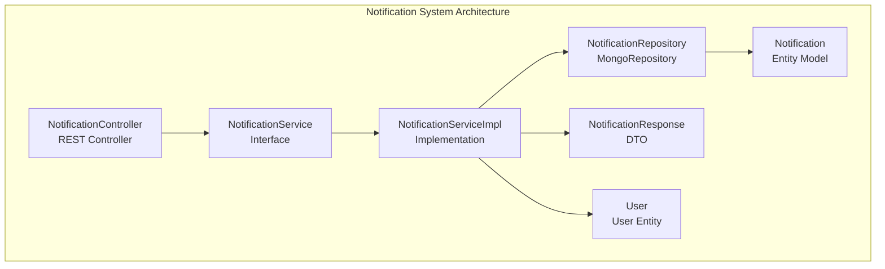
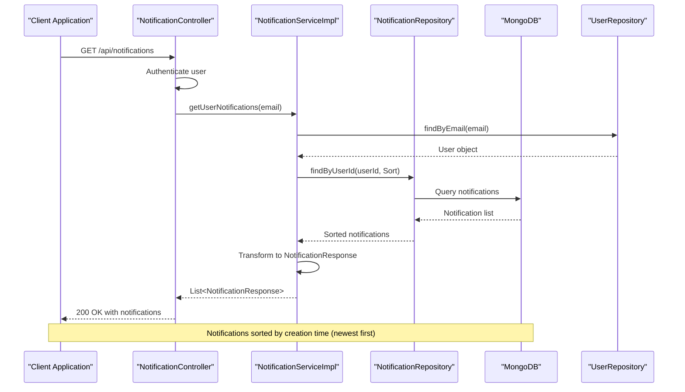
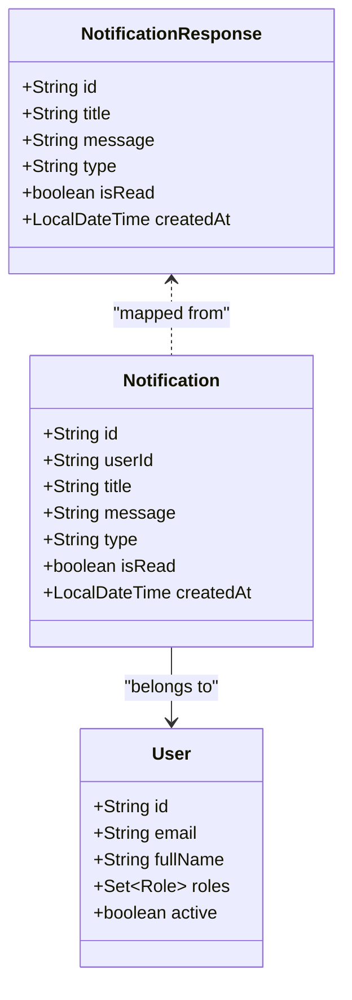
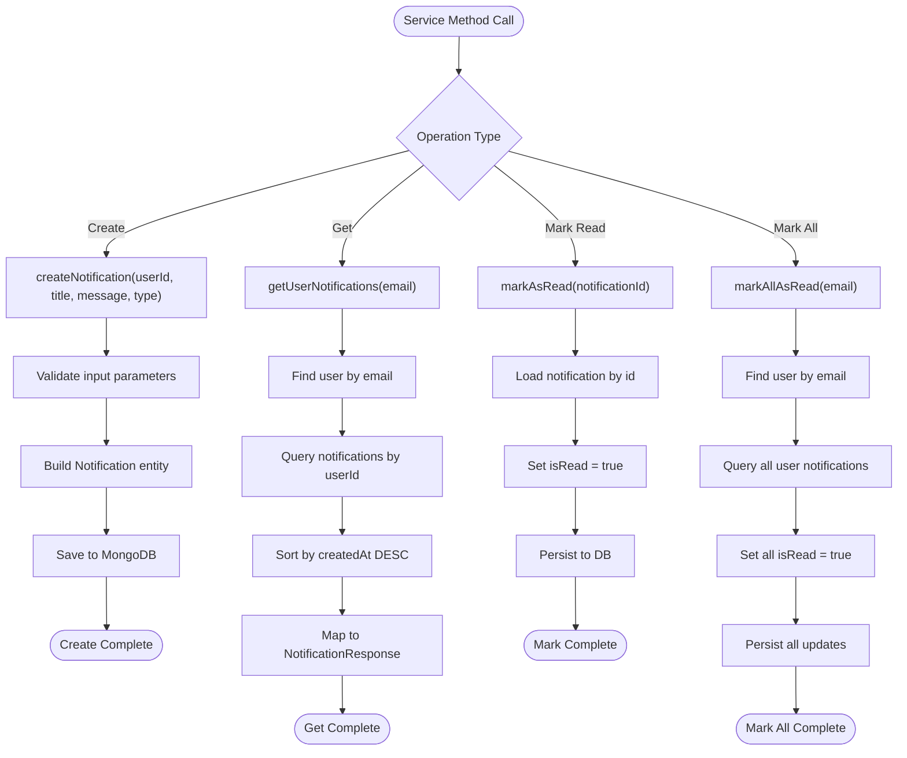
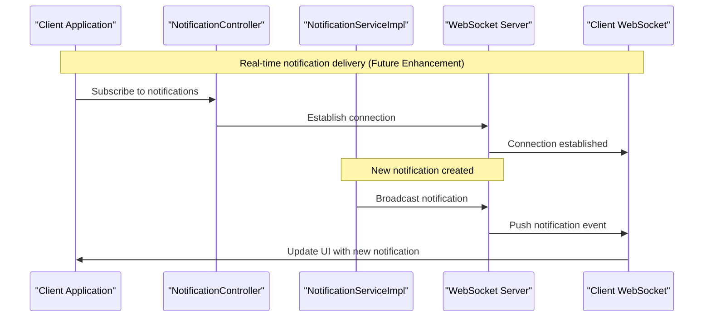
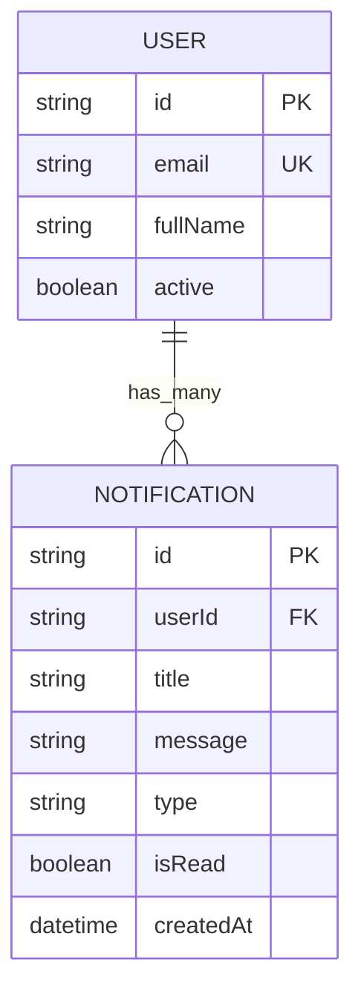

# Notification System

<cite>
**Referenced Files in This Document**
- [NotificationController.java](file://src/backend/src/main/java/com/shoppeclone/backend/user/controller/NotificationController.java)
- [NotificationService.java](file://src/backend/src/main/java/com/shoppeclone/backend/user/service/NotificationService.java)
- [NotificationServiceImpl.java](file://src/backend/src/main/java/com/shoppeclone/backend/user/service/impl/NotificationServiceImpl.java)
- [NotificationRepository.java](file://src/backend/src/main/java/com/shoppeclone/backend/user/repository/NotificationRepository.java)
- [Notification.java](file://src/backend/src/main/java/com/shoppeclone/backend/user/model/Notification.java)
- [NotificationResponse.java](file://src/backend/src/main/java/com/shoppeclone/backend/user/dto/response/NotificationResponse.java)
- [User.java](file://src/backend/src/main/java/com/shoppeclone/backend/auth/model/User.java)
- [OtpServiceImpl.java](file://src/backend/src/main/java/com/shoppeclone/backend/auth/service/impl/OtpServiceImpl.java)
</cite>

## Table of Contents
1. [Introduction](#introduction)
2. [Project Structure](#project-structure)
3. [Core Components](#core-components)
4. [Architecture Overview](#architecture-overview)
5. [Detailed Component Analysis](#detailed-component-analysis)
6. [Notification Types and Data Models](#notification-types-and-data-models)
7. [API Endpoints and Usage](#api-endpoints-and-usage)
8. [Notification Delivery and Real-time Updates](#notification-delivery-and-real-time-updates)
9. [Notification History Management](#notification-history-management)
10. [Notification Preferences and GDPR Compliance](#notification-preferences-and-gdpr-compliance)
11. [Performance Considerations](#performance-considerations)
12. [Troubleshooting Guide](#troubleshooting-guide)
13. [Conclusion](#conclusion)

## Introduction
This document provides comprehensive documentation for the notification system functionality. It covers notification retrieval, marking as read/unread, notification preferences management, and the underlying architecture. The system supports three primary notification types: order updates, system alerts, and promotions. It includes detailed explanations of the Notification entity structure, NotificationResponse DTO format, endpoint definitions, filtering options, pagination support, delivery mechanisms, real-time updates, and GDPR compliance considerations.

## Project Structure
The notification system is organized around a clean separation of concerns with dedicated controller, service, repository, model, and DTO layers. The system leverages Spring Boot with MongoDB for persistence and Spring Security for authentication.



**Diagram sources**
- [NotificationController.java:13-40](file://src/backend/src/main/java/com/shoppeclone/backend/user/controller/NotificationController.java#L13-L40)
- [NotificationService.java:7-15](file://src/backend/src/main/java/com/shoppeclone/backend/user/service/NotificationService.java#L7-L15)
- [NotificationServiceImpl.java:17-77](file://src/backend/src/main/java/com/shoppeclone/backend/user/service/impl/NotificationServiceImpl.java#L17-L77)
- [NotificationRepository.java:10-15](file://src/backend/src/main/java/com/shoppeclone/backend/user/repository/NotificationRepository.java#L10-L15)
- [Notification.java:12-30](file://src/backend/src/main/java/com/shoppeclone/backend/user/model/Notification.java#L12-L30)
- [NotificationResponse.java:9-19](file://src/backend/src/main/java/com/shoppeclone/backend/user/dto/response/NotificationResponse.java#L9-L19)
- [User.java:13-38](file://src/backend/src/main/java/com/shoppeclone/backend/auth/model/User.java#L13-L38)

**Section sources**
- [NotificationController.java:1-41](file://src/backend/src/main/java/com/shoppeclone/backend/user/controller/NotificationController.java#L1-L41)
- [NotificationService.java:1-16](file://src/backend/src/main/java/com/shoppeclone/backend/user/service/NotificationService.java#L1-L16)
- [NotificationServiceImpl.java:1-78](file://src/backend/src/main/java/com/shoppeclone/backend/user/service/impl/NotificationServiceImpl.java#L1-L78)
- [NotificationRepository.java:1-16](file://src/backend/src/main/java/com/shoppeclone/backend/user/repository/NotificationRepository.java#L1-L16)
- [Notification.java:1-31](file://src/backend/src/main/java/com/shoppeclone/backend/user/model/Notification.java#L1-L31)
- [NotificationResponse.java:1-20](file://src/backend/src/main/java/com/shoppeclone/backend/user/dto/response/NotificationResponse.java#L1-L20)
- [User.java:1-38](file://src/backend/src/main/java/com/shoppeclone/backend/auth/model/User.java#L1-L38)

## Core Components
The notification system consists of several key components working together to manage notifications effectively:

### Controller Layer
The NotificationController handles HTTP requests for notification operations, providing endpoints for retrieving notifications and managing read/unread status.

### Service Layer
The NotificationService interface defines the contract for notification operations, while NotificationServiceImpl provides the concrete implementation handling business logic and data transformations.

### Repository Layer
The NotificationRepository extends MongoRepository to provide database operations for notification persistence and querying.

### Model and DTO Layers
The Notification entity represents the persisted data structure, while NotificationResponse serves as the API response DTO for client consumption.

**Section sources**
- [NotificationController.java:13-40](file://src/backend/src/main/java/com/shoppeclone/backend/user/controller/NotificationController.java#L13-L40)
- [NotificationService.java:7-15](file://src/backend/src/main/java/com/shoppeclone/backend/user/service/NotificationService.java#L7-L15)
- [NotificationServiceImpl.java:17-77](file://src/backend/src/main/java/com/shoppeclone/backend/user/service/impl/NotificationServiceImpl.java#L17-L77)
- [NotificationRepository.java:10-15](file://src/backend/src/main/java/com/shoppeclone/backend/user/repository/NotificationRepository.java#L10-L15)
- [Notification.java:12-30](file://src/backend/src/main/java/com/shoppeclone/backend/user/model/Notification.java#L12-L30)
- [NotificationResponse.java:9-19](file://src/backend/src/main/java/com/shoppeclone/backend/user/dto/response/NotificationResponse.java#L9-L19)

## Architecture Overview
The notification system follows a layered architecture pattern with clear separation between presentation, business logic, data access, and persistence layers.



**Diagram sources**
- [NotificationController.java:20-25](file://src/backend/src/main/java/com/shoppeclone/backend/user/controller/NotificationController.java#L20-L25)
- [NotificationServiceImpl.java:37-55](file://src/backend/src/main/java/com/shoppeclone/backend/user/service/impl/NotificationServiceImpl.java#L37-L55)
- [NotificationRepository.java:11-14](file://src/backend/src/main/java/com/shoppeclone/backend/user/repository/NotificationRepository.java#L11-L14)
- [User.java:19-26](file://src/backend/src/main/java/com/shoppeclone/backend/auth/model/User.java#L19-L26)

The architecture ensures loose coupling between components and provides clear extension points for future enhancements.

**Section sources**
- [NotificationController.java:13-40](file://src/backend/src/main/java/com/shoppeclone/backend/user/controller/NotificationController.java#L13-L40)
- [NotificationServiceImpl.java:17-77](file://src/backend/src/main/java/com/shoppeclone/backend/user/service/impl/NotificationServiceImpl.java#L17-L77)

## Detailed Component Analysis

### Notification Entity Analysis
The Notification entity serves as the core data structure for storing notification information in MongoDB.



**Diagram sources**
- [Notification.java:16-30](file://src/backend/src/main/java/com/shoppeclone/backend/user/model/Notification.java#L16-L30)
- [NotificationResponse.java:12-19](file://src/backend/src/main/java/com/shoppeclone/backend/user/dto/response/NotificationResponse.java#L12-L19)
- [User.java:15-38](file://src/backend/src/main/java/com/shoppeclone/backend/auth/model/User.java#L15-L38)

Key characteristics of the Notification entity:
- **Unique Identifier**: MongoDB ObjectId automatically generated
- **Recipient Association**: Indexed userId field for efficient querying
- **Content Fields**: Title and message for notification content
- **Type Classification**: Enum-like string field supporting different notification categories
- **Read Status**: Boolean flag for tracking notification state
- **Timestamp Management**: Automatic creation time tracking

**Section sources**
- [Notification.java:12-30](file://src/backend/src/main/java/com/shoppeclone/backend/user/model/Notification.java#L12-L30)

### Service Implementation Details
The NotificationServiceImpl handles all business logic for notification operations, including creation, retrieval, and status management.



**Diagram sources**
- [NotificationServiceImpl.java:24-76](file://src/backend/src/main/java/com/shoppeclone/backend/user/service/impl/NotificationServiceImpl.java#L24-L76)

**Section sources**
- [NotificationServiceImpl.java:17-77](file://src/backend/src/main/java/com/shoppeclone/backend/user/service/impl/NotificationServiceImpl.java#L17-L77)

## Notification Types and Data Models

### Supported Notification Types
The system supports three primary notification types:

1. **Order Updates**: Notifications related to order status changes, shipping updates, and delivery confirmations
2. **System Alerts**: System maintenance notifications, security alerts, and platform-wide announcements
3. **Promotions**: Marketing campaigns, special offers, and promotional content

### NotificationResponse DTO Structure
The NotificationResponse DTO provides a standardized format for API responses:

| Field | Type | Description |
|-------|------|-------------|
| id | String | Unique notification identifier |
| title | String | Notification headline/title |
| message | String | Main notification content |
| type | String | Notification category (ORDER, SYSTEM, PROMOTION) |
| isRead | Boolean | Read/unread status indicator |
| createdAt | LocalDateTime | Timestamp of notification creation |

### Example Notification Data Structures
Example notification payload structure:
```json
{
  "id": "64f3a1b2c3d4e5f6a7b8c9d0",
  "title": "Order Shipped",
  "message": "Your order #ORD-12345 has been shipped and is on its way",
  "type": "ORDER",
  "isRead": false,
  "createdAt": "2023-09-15T14:30:00Z"
}
```

**Section sources**
- [Notification.java:23-25](file://src/backend/src/main/java/com/shoppeclone/backend/user/model/Notification.java#L23-L25)
- [NotificationResponse.java:12-19](file://src/backend/src/main/java/com/shoppeclone/backend/user/dto/response/NotificationResponse.java#L12-L19)

## API Endpoints and Usage

### Endpoint Definitions
The notification system exposes four primary endpoints:

| Method | Endpoint | Description | Authentication Required |
|--------|----------|-------------|------------------------|
| GET | `/api/notifications` | Retrieve all notifications for current user | Yes |
| PUT | `/api/notifications/{id}/read` | Mark specific notification as read | Yes |
| PUT | `/api/notifications/read-all` | Mark all notifications as read | Yes |

### Request and Response Examples

#### GET /api/notifications
**Request:**
```
GET /api/notifications
Authorization: Bearer <jwt-token>
```

**Response:**
```json
[
  {
    "id": "64f3a1b2c3d4e5f6a7b8c9d0",
    "title": "Order Shipped",
    "message": "Your order #ORD-12345 has been shipped",
    "type": "ORDER",
    "isRead": false,
    "createdAt": "2023-09-15T14:30:00Z"
  },
  {
    "id": "64f3a1b2c3d4e5f6a7b8c9d1",
    "title": "Security Alert",
    "message": "New login detected from unfamiliar device",
    "type": "SYSTEM",
    "isRead": true,
    "createdAt": "2023-09-14T09:15:00Z"
  }
]
```

#### PUT /api/notifications/{id}/read
**Request:**
```
PUT /api/notifications/64f3a1b2c3d4e5f6a7b8c9d0/read
Authorization: Bearer <jwt-token>
```

**Response:** `200 OK`

#### PUT /api/notifications/read-all
**Request:**
```
PUT /api/notifications/read-all
Authorization: Bearer <jwt-token>
```

**Response:** `200 OK`

### Filtering and Pagination Support
The current implementation provides basic sorting capabilities:
- **Sorting**: Notifications are sorted by creation time in descending order (newest first)
- **Filtering**: No explicit filtering options are implemented
- **Pagination**: Not currently supported

**Section sources**
- [NotificationController.java:20-39](file://src/backend/src/main/java/com/shoppeclone/backend/user/controller/NotificationController.java#L20-L39)
- [NotificationServiceImpl.java:42-44](file://src/backend/src/main/java/com/shoppeclone/backend/user/service/impl/NotificationServiceImpl.java#L42-L44)

## Notification Delivery and Real-time Updates

### Current Delivery Mechanisms
The notification system currently supports asynchronous delivery through the following mechanisms:

1. **Database Persistence**: Notifications are stored in MongoDB immediately upon creation
2. **Background Processing**: Creation operations are handled synchronously but can be extended for async processing
3. **Client Polling**: Clients retrieve notifications via HTTP GET requests

### Real-time Update Capabilities
Real-time updates are not currently implemented. However, the system architecture supports several enhancement approaches:



**Diagram sources**
- [NotificationServiceImpl.java:24-35](file://src/backend/src/main/java/com/shoppeclone/backend/user/service/impl/NotificationServiceImpl.java#L24-L35)

### Delivery Extension Points
Potential real-time delivery mechanisms:
- **WebSocket Integration**: For bidirectional communication
- **Server-Sent Events**: For unidirectional server-to-client updates
- **Push Notifications**: Mobile app push notification support
- **Email/SMS Integration**: Additional communication channels

**Section sources**
- [NotificationServiceImpl.java:17-35](file://src/backend/src/main/java/com/shoppeclone/backend/user/service/impl/NotificationServiceImpl.java#L17-L35)

## Notification History Management

### Storage and Retrieval
The system maintains notification history through MongoDB with the following characteristics:



**Diagram sources**
- [Notification.java:16-30](file://src/backend/src/main/java/com/shoppeclone/backend/user/model/Notification.java#L16-L30)
- [User.java:15-38](file://src/backend/src/main/java/com/shoppeclone/backend/auth/model/User.java#L15-L38)

### Query Performance Considerations
- **Indexing**: userId field is indexed for efficient user-specific queries
- **Sorting**: createdAt field enables chronological ordering
- **Counting**: Dedicated method for unread notification counting

### Data Lifecycle Management
- **Retention**: No automatic cleanup policies are implemented
- **Archival**: Future enhancements could include notification archiving
- **Cleanup**: Manual deletion operations would require user consent per GDPR

**Section sources**
- [NotificationRepository.java:11-14](file://src/backend/src/main/java/com/shoppeclone/backend/user/repository/NotificationRepository.java#L11-L14)
- [NotificationServiceImpl.java:67-76](file://src/backend/src/main/java/com/shoppeclone/backend/user/service/impl/NotificationServiceImpl.java#L67-L76)

## Notification Preferences and GDPR Compliance

### Current Preferences Implementation
The notification system does not currently implement user preferences or opt-out functionality. The User entity lacks notification preference fields.

### GDPR Compliance Considerations
For GDPR compliance, the system should implement:

1. **Consent Management**: Explicit user consent for different notification types
2. **Opt-out Mechanism**: Ability for users to unsubscribe from specific notification categories
3. **Data Retention**: Right to erasure and data portability
4. **Logging**: Audit trails for user preferences and consent changes

### Recommended Preference Structure
Proposed User entity extensions for preferences:

| Field | Type | Description |
|-------|------|-------------|
| notificationPreferences | Map<String, Boolean> | User's preferred notification channels |
| marketingConsent | Boolean | Consent for promotional notifications |
| systemAlertConsent | Boolean | Consent for system notifications |
| lastPreferenceUpdate | LocalDateTime | Timestamp of last preference change |

### Opt-out Functionality
Future implementation should include:
- **Channel-specific opt-out**: Ability to disable specific notification types
- **Temporary suspension**: Grace period for opting out
- **Preference synchronization**: Across multiple devices and platforms

**Section sources**
- [User.java:15-38](file://src/backend/src/main/java/com/shoppeclone/backend/auth/model/User.java#L15-L38)

## Performance Considerations

### Current Performance Characteristics
- **Query Efficiency**: Single-indexed userId queries provide O(log n) lookup performance
- **Memory Usage**: In-memory transformation of entities to DTOs
- **Network Overhead**: JSON serialization for API responses

### Scalability Recommendations
1. **Index Optimization**: Consider compound indexes for frequent query patterns
2. **Caching Strategy**: Implement Redis caching for frequently accessed notification lists
3. **Batch Operations**: Use batch processing for bulk read operations
4. **Connection Pooling**: Optimize MongoDB connection pool configuration

### Monitoring and Metrics
Recommended metrics to track:
- Notification creation rate
- Query response times
- Memory usage patterns
- Database connection utilization

## Troubleshooting Guide

### Common Issues and Solutions

#### Authentication Failures
**Symptoms**: 401 Unauthorized responses from notification endpoints
**Causes**: Invalid or expired JWT tokens
**Solutions**: 
- Verify token validity and expiration
- Check user authentication status
- Implement token refresh mechanisms

#### User Not Found Errors
**Symptoms**: "User not found" exceptions during notification retrieval
**Causes**: User account deletion or email mismatch
**Solutions**:
- Verify user exists in database
- Check email normalization
- Implement graceful error handling

#### Notification Not Found
**Symptoms**: "Notification not found" exceptions for mark-as-read operations
**Causes**: Invalid notification ID or notification ownership issues
**Solutions**:
- Validate notification ID format
- Check notification ownership against authenticated user
- Implement proper error responses

### Error Handling Patterns
The system implements consistent error handling:
- **Validation Errors**: Return appropriate HTTP status codes
- **Resource Not Found**: Use 404 status for missing resources
- **Server Errors**: Return 500 status for unexpected exceptions
- **Authentication Errors**: Use 401 status for unauthorized access

**Section sources**
- [NotificationServiceImpl.java:39-40](file://src/backend/src/main/java/com/shoppeclone/backend/user/service/impl/NotificationServiceImpl.java#L39-L40)
- [NotificationServiceImpl.java:58-63](file://src/backend/src/main/java/com/shoppeclone/backend/user/service/impl/NotificationServiceImpl.java#L58-L63)

## Conclusion
The notification system provides a solid foundation for managing user communications with clear separation of concerns and extensible architecture. The current implementation supports essential notification operations including creation, retrieval, and status management. Key areas for future enhancement include real-time updates, comprehensive notification preferences, GDPR compliance features, and advanced filtering/pagination capabilities. The system's modular design allows for seamless integration of these features while maintaining backward compatibility and performance standards.