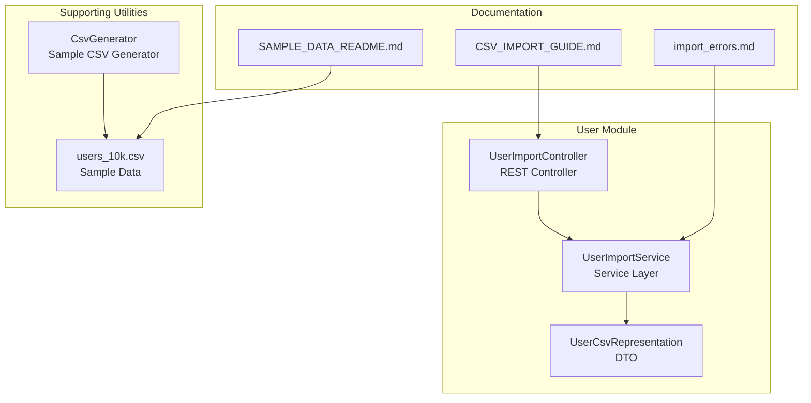
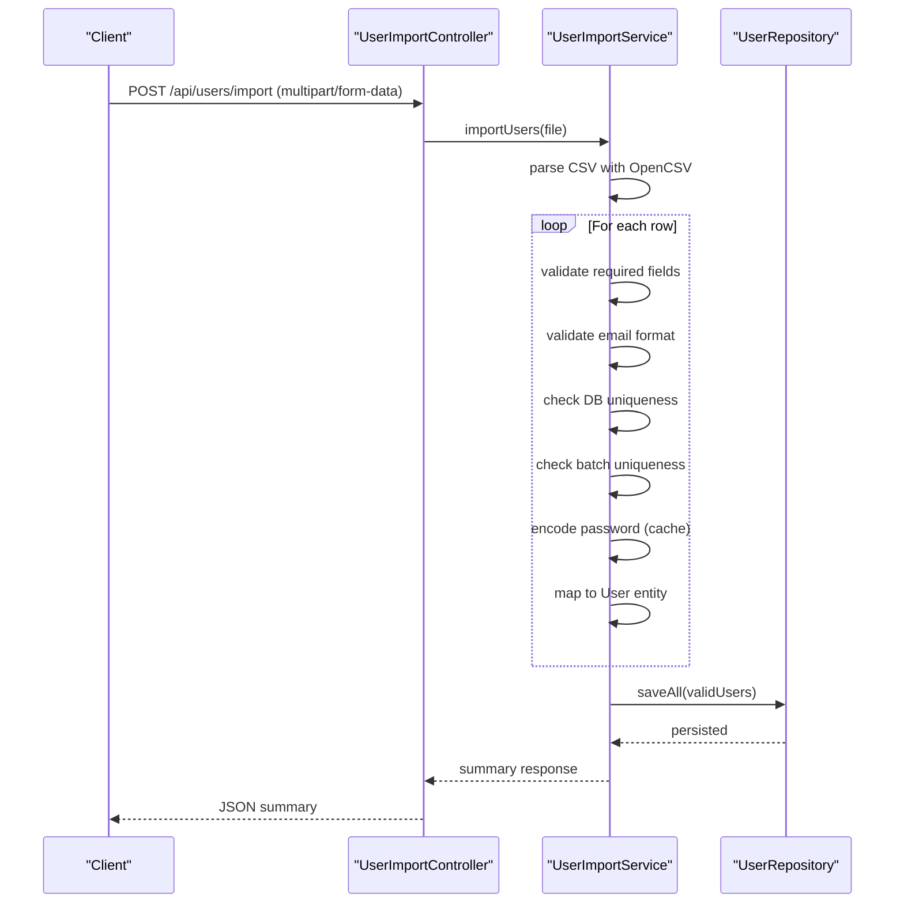
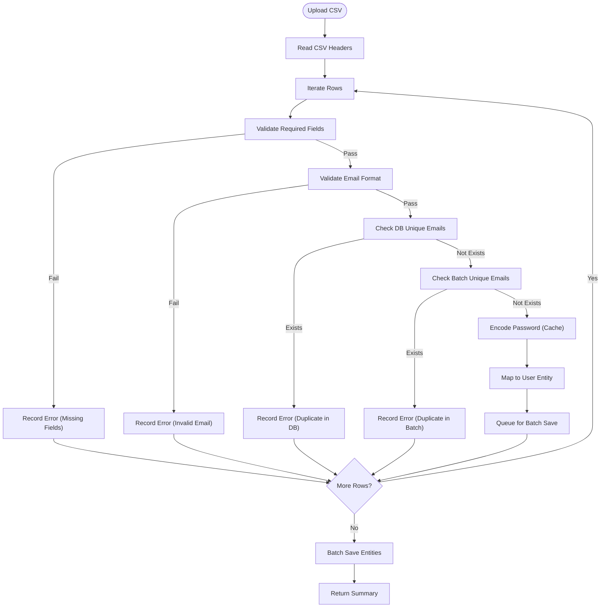
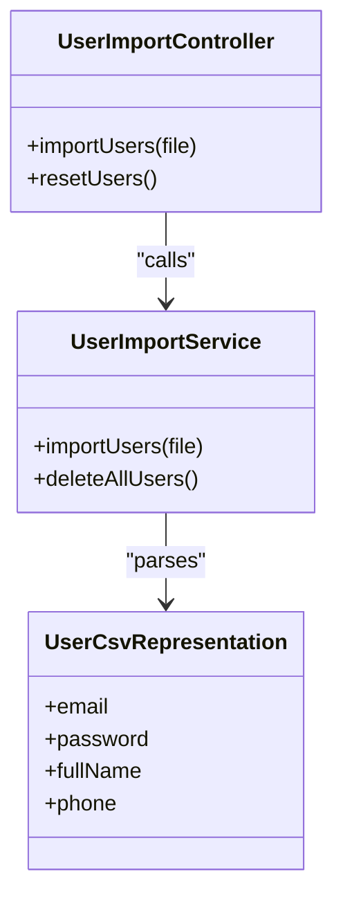

# User Import & Export System

<cite>
**Referenced Files in This Document**
- [UserImportController.java](file://src/Backend/src/main/java/com/shoppeclone/backend/user/controller/UserImportController.java)
- [UserImportService.java](file://src/Backend/src/main/java/com/shoppeclone/backend/user/service/UserImportService.java)
- [UserCsvRepresentation.java](file://src/Backend/src/main/java/com/shoppeclone/backend/user/dto/UserCsvRepresentation.java)
- [users_10k.csv](file://src/Backend/users_10k.csv)
- [CsvGenerator.java](file://src/Backend/src/main/java/com/shoppeclone/backend/common/utils/CsvGenerator.java)
- [SAMPLE_DATA_README.md](file://src/Backend/SAMPLE_DATA_README.md)
- [CSV_IMPORT_GUIDE.md](file://src/Backend/CSV_IMPORT_GUIDE.md)
- [import_errors.md](file://docs/import_errors.md)
</cite>

## Table of Contents
1. [Introduction](#introduction)
2. [Project Structure](#project-structure)
3. [Core Components](#core-components)
4. [Architecture Overview](#architecture-overview)
5. [Detailed Component Analysis](#detailed-component-analysis)
6. [Dependency Analysis](#dependency-analysis)
7. [Performance Considerations](#performance-considerations)
8. [Troubleshooting Guide](#troubleshooting-guide)
9. [Conclusion](#conclusion)
10. [Appendices](#appendices)

## Introduction
This document explains the user import and export capabilities of the backend system. It focuses on:
- Bulk user registration via CSV upload
- Data validation rules and error handling for malformed CSV files
- The UserCsvRepresentation DTO and how user data is mapped during import
- UserImportController endpoints and their processing workflows
- Examples of CSV file formats, required headers, and validation constraints
- Export functionality for generating user reports, filtering options, and CSV generation
- Data privacy considerations, batch processing limits, and performance optimization for large datasets
- Troubleshooting guidance for common import/export issues and validation errors

## Project Structure
The user import feature is implemented under the user module with a dedicated controller and service. Supporting utilities and sample data are included to demonstrate usage and validate behavior.

**Diagram sources**
- [UserImportController.java:1-35](file://src/Backend/src/main/java/com/shoppeclone/backend/user/controller/UserImportController.java#L1-L35)
- [UserImportService.java:1-153](file://src/Backend/src/main/java/com/shoppeclone/backend/user/service/UserImportService.java#L1-L153)
- [UserCsvRepresentation.java:1-27](file://src/Backend/src/main/java/com/shoppeclone/backend/user/dto/UserCsvRepresentation.java#L1-L27)
- [CsvGenerator.java:1-31](file://src/Backend/src/main/java/com/shoppeclone/backend/common/utils/CsvGenerator.java#L1-L31)
- [users_10k.csv:1-100](file://src/Backend/users_10k.csv#L1-L100)
- [SAMPLE_DATA_README.md:1-154](file://src/Backend/SAMPLE_DATA_README.md#L1-L154)
- [CSV_IMPORT_GUIDE.md:1-264](file://src/Backend/CSV_IMPORT_GUIDE.md#L1-L264)
- [import_errors.md:1-38](file://docs/import_errors.md#L1-L38)

**Section sources**
- [UserImportController.java:1-35](file://src/Backend/src/main/java/com/shoppeclone/backend/user/controller/UserImportController.java#L1-L35)
- [UserImportService.java:1-153](file://src/Backend/src/main/java/com/shoppeclone/backend/user/service/UserImportService.java#L1-L153)
- [UserCsvRepresentation.java:1-27](file://src/Backend/src/main/java/com/shoppeclone/backend/user/dto/UserCsvRepresentation.java#L1-L27)
- [CsvGenerator.java:1-31](file://src/Backend/src/main/java/com/shoppeclone/backend/common/utils/CsvGenerator.java#L1-L31)
- [users_10k.csv:1-100](file://src/Backend/users_10k.csv#L1-L100)
- [SAMPLE_DATA_README.md:1-154](file://src/Backend/SAMPLE_DATA_README.md#L1-L154)
- [CSV_IMPORT_GUIDE.md:1-264](file://src/Backend/CSV_IMPORT_GUIDE.md#L1-L264)
- [import_errors.md:1-38](file://docs/import_errors.md#L1-L38)

## Core Components
- UserImportController: Exposes endpoints for importing users from uploaded CSV and resetting the user collection.
- UserImportService: Implements CSV parsing, validation, deduplication, password caching, and batch persistence.
- UserCsvRepresentation: Defines the CSV schema and column-to-field mapping for import.
- CsvGenerator: Generates realistic sample CSV data for testing and load scenarios.
- users_10k.csv: Realistic sample dataset used for validation and performance testing.
- Documentation: Guides and error reports supporting import workflows and troubleshooting.

**Section sources**
- [UserImportController.java:18-34](file://src/Backend/src/main/java/com/shoppeclone/backend/user/controller/UserImportController.java#L18-L34)
- [UserImportService.java:34-147](file://src/Backend/src/main/java/com/shoppeclone/backend/user/service/UserImportService.java#L34-L147)
- [UserCsvRepresentation.java:13-26](file://src/Backend/src/main/java/com/shoppeclone/backend/user/dto/UserCsvRepresentation.java#L13-L26)
- [CsvGenerator.java:16-31](file://src/Backend/src/main/java/com/shoppeclone/backend/common/utils/CsvGenerator.java#L16-L31)
- [users_10k.csv:1-100](file://src/Backend/users_10k.csv#L1-L100)
- [SAMPLE_DATA_README.md:54-94](file://src/Backend/SAMPLE_DATA_README.md#L54-L94)
- [CSV_IMPORT_GUIDE.md:1-264](file://src/Backend/CSV_IMPORT_GUIDE.md#L1-L264)
- [import_errors.md:1-38](file://docs/import_errors.md#L1-L38)

## Architecture Overview
The import pipeline follows a layered architecture:
- Controller receives multipart/form-data requests and delegates to the service.
- Service parses CSV rows, validates each record, caches password encodings, and persists validated records in batches.
- Validation includes required fields, email format, and uniqueness checks against the database and current batch.

**Diagram sources**
- [UserImportController.java:20-27](file://src/Backend/src/main/java/com/shoppeclone/backend/user/controller/UserImportController.java#L20-L27)
- [UserImportService.java:34-147](file://src/Backend/src/main/java/com/shoppeclone/backend/user/service/UserImportService.java#L34-L147)

## Detailed Component Analysis

### UserImportController
Responsibilities:
- Accepts CSV uploads via multipart/form-data.
- Delegates import processing to UserImportService.
- Provides endpoint to reset/delete all users.

Endpoints:
- POST /api/users/import: Upload and import CSV.
- DELETE /api/users/reset: Delete all users.

Processing workflow:
- Reads uploaded file stream.
- Calls service method to parse, validate, and persist users.
- Returns structured summary with counts and errors.

**Section sources**
- [UserImportController.java:20-34](file://src/Backend/src/main/java/com/shoppeclone/backend/user/controller/UserImportController.java#L20-L34)

### UserImportService
Responsibilities:
- Parse CSV using OpenCSV with a mapping strategy.
- Validate each row for required fields, email format, and uniqueness.
- Cache password encodings to reduce CPU overhead.
- Persist validated users in batches to minimize database round-trips.
- Aggregate and return a summary of processed, successful, and failed records.

Key validations:
- Required fields: email and fullName must be present.
- Email format: basic regex validation.
- Uniqueness: checks against existing DB emails and current batch.

Performance optimizations:
- Pre-fetch existing emails to avoid repeated queries.
- Password encoding cache keyed by raw password.
- Batch save at the end of processing.

Error handling:
- Catches exceptions per row and continues processing.
- Aggregates errors with line numbers for reporting.

**Section sources**
- [UserImportService.java:34-147](file://src/Backend/src/main/java/com/shoppeclone/backend/user/service/UserImportService.java#L34-L147)

### UserCsvRepresentation DTO
Purpose:
- Maps CSV columns to DTO fields for parsing.

Columns:
- email
- password
- fullName
- phone

Mapping strategy:
- Uses OpenCSV’s CsvBindByName annotation to bind columns by header name.

**Section sources**
- [UserCsvRepresentation.java:15-26](file://src/Backend/src/main/java/com/shoppeclone/backend/user/dto/UserCsvRepresentation.java#L15-L26)

### CSV Import Workflow Details
- CSV headers must match DTO field names.
- Rows are processed sequentially with strict validation.
- On validation failure, the row is skipped and an error is recorded with line number.
- On success, the row is transformed into a User entity and queued for batch save.

**Diagram sources**
- [UserImportService.java:64-131](file://src/Backend/src/main/java/com/shoppeclone/backend/user/service/UserImportService.java#L64-L131)
- [UserCsvRepresentation.java:15-26](file://src/Backend/src/main/java/com/shoppeclone/backend/user/dto/UserCsvRepresentation.java#L15-L26)

**Section sources**
- [UserImportService.java:64-131](file://src/Backend/src/main/java/com/shoppeclone/backend/user/service/UserImportService.java#L64-L131)
- [UserCsvRepresentation.java:15-26](file://src/Backend/src/main/java/com/shoppeclone/backend/user/dto/UserCsvRepresentation.java#L15-L26)

### Export Functionality
Current state:
- No explicit export endpoints or services were identified in the user module.
- The repository includes documentation and guides for import workflows and sample data generation.

Guidance for implementing export:
- Define an endpoint (e.g., GET /api/users/export) that streams filtered user data as CSV.
- Apply filters (e.g., date range, role, status) and pagination to manage large datasets.
- Use streaming to avoid loading all records into memory.
- Respect data privacy by excluding sensitive fields and applying access controls.

[No sources needed since this section provides general guidance]

### CSV Format, Required Headers, and Constraints
- Required headers: email, password, fullName, phone.
- Encoding: UTF-8-BOM recommended for international characters.
- Constraints:
  - email and fullName are required.
  - email must pass format validation.
  - email must be unique (across DB and current batch).
  - phone is optional; if present, ensure it matches expected format.

Examples:
- See the sample CSV file and generator for header and row examples.

**Section sources**
- [UserCsvRepresentation.java:15-26](file://src/Backend/src/main/java/com/shoppeclone/backend/user/dto/UserCsvRepresentation.java#L15-L26)
- [users_10k.csv:1-100](file://src/Backend/users_10k.csv#L1-L100)
- [CsvGenerator.java:23-31](file://src/Backend/src/main/java/com/shoppeclone/backend/common/utils/CsvGenerator.java#L23-L31)
- [SAMPLE_DATA_README.md:56-62](file://src/Backend/SAMPLE_DATA_README.md#L56-L62)

## Dependency Analysis
- UserImportController depends on UserImportService.
- UserImportService depends on:
  - OpenCSV for parsing
  - UserRepository for uniqueness checks and persistence
  - RoleRepository for default role assignment
  - PasswordEncoder for secure password hashing
- UserCsvRepresentation is consumed by OpenCSV mapping strategy.

**Diagram sources**
- [UserImportController.java:18-34](file://src/Backend/src/main/java/com/shoppeclone/backend/user/controller/UserImportController.java#L18-L34)
- [UserImportService.java:30-33](file://src/Backend/src/main/java/com/shoppeclone/backend/user/service/UserImportService.java#L30-L33)
- [UserCsvRepresentation.java:13-26](file://src/Backend/src/main/java/com/shoppeclone/backend/user/dto/UserCsvRepresentation.java#L13-L26)

**Section sources**
- [UserImportController.java:18-34](file://src/Backend/src/main/java/com/shoppeclone/backend/user/controller/UserImportController.java#L18-L34)
- [UserImportService.java:30-33](file://src/Backend/src/main/java/com/shoppeclone/backend/user/service/UserImportService.java#L30-L33)
- [UserCsvRepresentation.java:13-26](file://src/Backend/src/main/java/com/shoppeclone/backend/user/dto/UserCsvRepresentation.java#L13-L26)

## Performance Considerations
- Batch processing: Persist validated users in batches to reduce database round-trips.
- Password encoding cache: Reuse encoded passwords to avoid redundant cryptographic work.
- Pre-fetch existing emails: Minimize repeated DB queries for uniqueness checks.
- Streaming: Process CSV rows iteratively to keep memory usage low.
- Large datasets: Consider chunking and rate limiting to prevent timeouts and resource exhaustion.

[No sources needed since this section provides general guidance]

## Troubleshooting Guide
Common issues and resolutions:
- Malformed CSV:
  - Verify headers match DTO fields (email, password, fullName, phone).
  - Ensure UTF-8-BOM encoding for international characters.
- Validation failures:
  - Missing required fields (email or fullName).
  - Invalid email format.
  - Duplicate email in DB or within the CSV batch.
- Error reporting:
  - The service aggregates errors with line numbers for easy identification.
  - Review the import error report for examples of rejected records.

**Section sources**
- [UserImportService.java:70-129](file://src/Backend/src/main/java/com/shoppeclone/backend/user/service/UserImportService.java#L70-L129)
- [import_errors.md:8-36](file://docs/import_errors.md#L8-L36)

## Conclusion
The user import system provides a robust, validated, and efficient mechanism for bulk user registration from CSV. It enforces essential data quality rules, optimizes performance through caching and batching, and offers clear error reporting. While export functionality is not currently implemented in the user module, the documented patterns and guidelines can be used to introduce secure, filtered, and streamed export endpoints.

[No sources needed since this section summarizes without analyzing specific files]

## Appendices

### API Endpoints Reference
- POST /api/users/import: Upload CSV and import users.
- DELETE /api/users/reset: Delete all users.

**Section sources**
- [UserImportController.java:20-34](file://src/Backend/src/main/java/com/shoppeclone/backend/user/controller/UserImportController.java#L20-L34)

### Sample Data and Generation
- users_10k.csv: Contains 10,000 realistic user records with UTF-8-BOM encoding.
- CsvGenerator: Produces CSV with headers email, password, fullName, phone.

**Section sources**
- [users_10k.csv:1-100](file://src/Backend/users_10k.csv#L1-L100)
- [CsvGenerator.java:23-31](file://src/Backend/src/main/java/com/shoppeclone/backend/common/utils/CsvGenerator.java#L23-L31)
- [SAMPLE_DATA_README.md:56-62](file://src/Backend/SAMPLE_DATA_README.md#L56-L62)