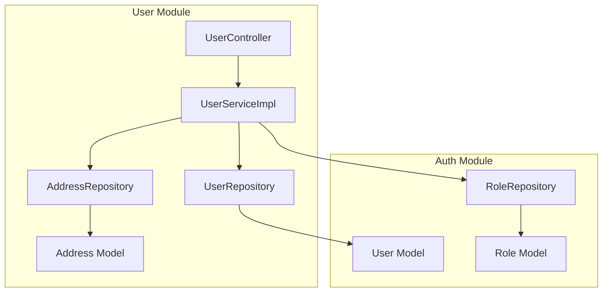
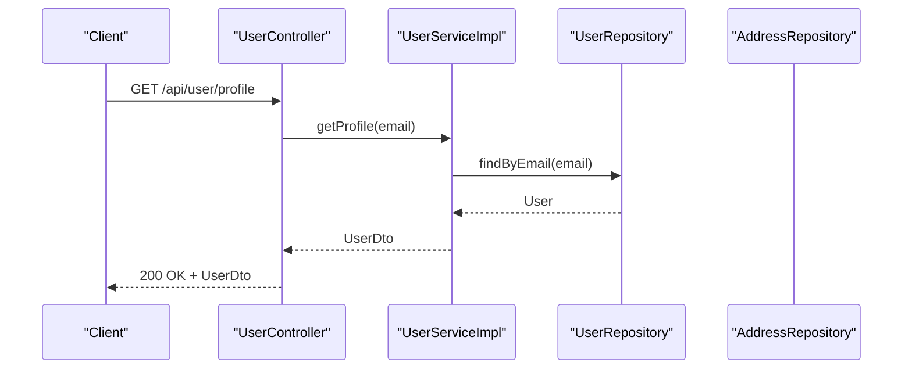
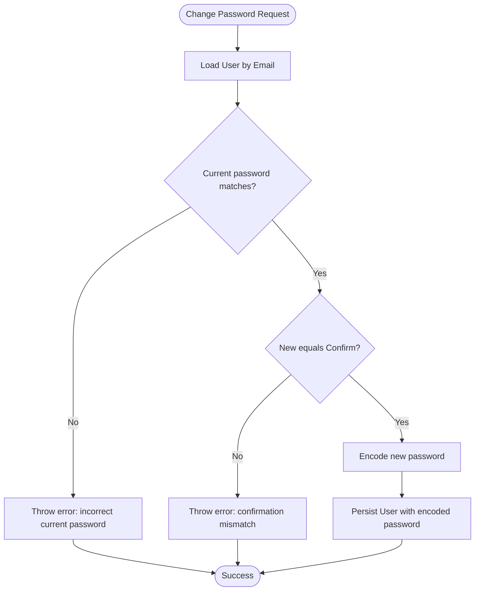
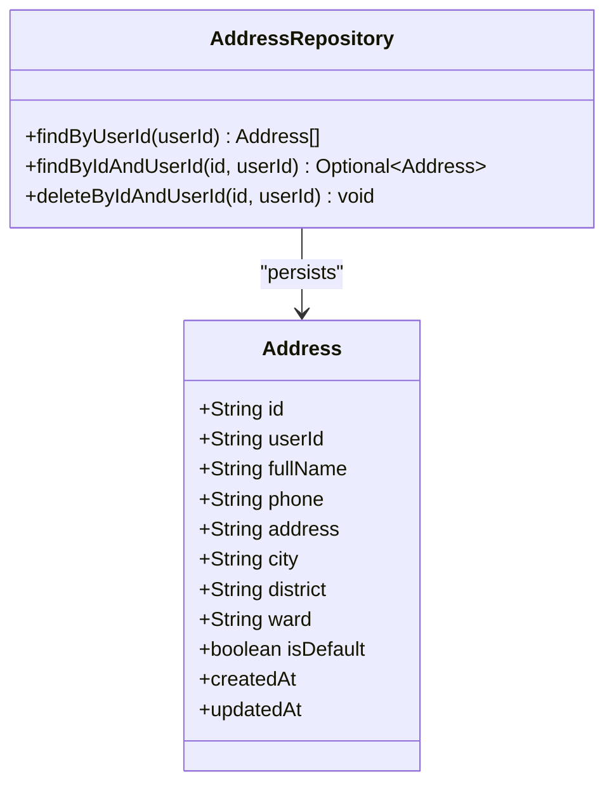
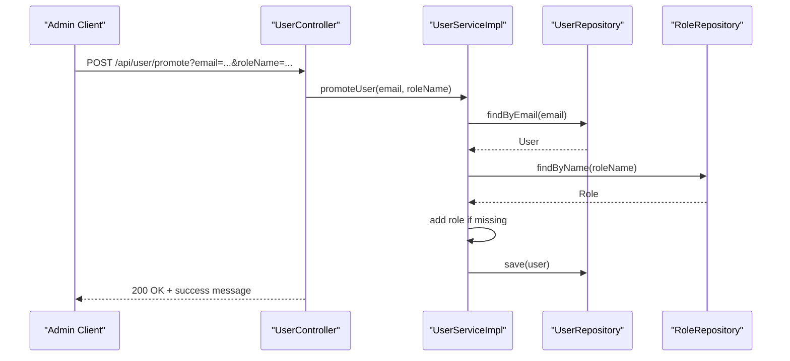
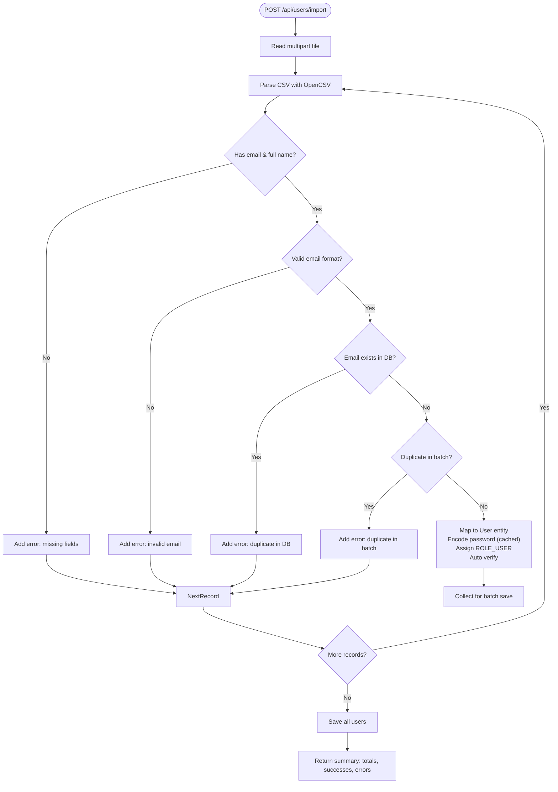
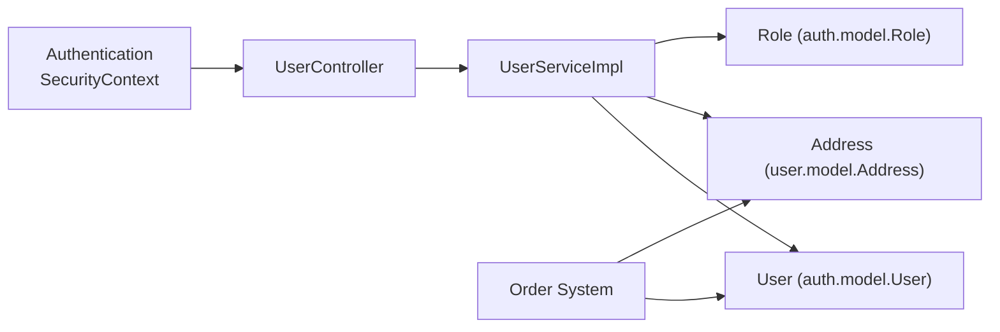
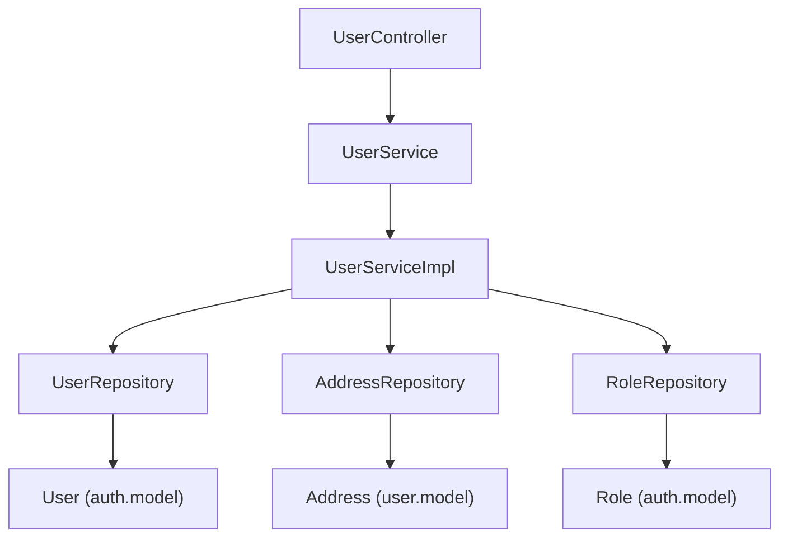

# User Management System

<cite>
**Referenced Files in This Document**
- [UserController.java](file://src/backend/src/main/java/com/shoppeclone/backend/user/controller/UserController.java)
- [UserService.java](file://src/backend/src/main/java/com/shoppeclone/backend/user/service/UserService.java)
- [UserServiceImpl.java](file://src/backend/src/main/java/com/shoppeclone/backend/user/service/impl/UserServiceImpl.java)
- [UserImportController.java](file://src/backend/src/main/java/com/shoppeclone/backend/user/controller/UserImportController.java)
- [UserImportService.java](file://src/backend/src/main/java/com/shoppeclone/backend/user/service/UserImportService.java)
- [UpdateProfileRequest.java](file://src/backend/src/main/java/com/shoppeclone/backend/user/dto/request/UpdateProfileRequest.java)
- [ChangePasswordRequest.java](file://src/backend/src/main/java/com/shoppeclone/backend/user/dto/request/ChangePasswordRequest.java)
- [AddressRequest.java](file://src/backend/src/main/java/com/shoppeclone/backend/user/dto/request/AddressRequest.java)
- [AddressDto.java](file://src/backend/src/main/java/com/shoppeclone/backend/user/dto/response/AddressDto.java)
- [Address.java](file://src/backend/src/main/java/com/shoppeclone/backend/user/model/Address.java)
- [AddressRepository.java](file://src/backend/src/main/java/com/shoppeclone/backend/user/repository/AddressRepository.java)
- [User.java](file://src/backend/src/main/java/com/shoppeclone/backend/auth/model/User.java)
- [Role.java](file://src/backend/src/main/java/com/shoppeclone/backend/auth/model/Role.java)
- [UserRepository.java](file://src/backend/src/main/java/com/shoppeclone/backend/auth/repository/UserRepository.java)
- [RoleRepository.java](file://src/backend/src/main/java/com/shoppeclone/backend/auth/repository/RoleRepository.java)
</cite>

## Table of Contents
1. [Introduction](#introduction)
2. [Project Structure](#project-structure)
3. [Core Components](#core-components)
4. [Architecture Overview](#architecture-overview)
5. [Detailed Component Analysis](#detailed-component-analysis)
6. [Dependency Analysis](#dependency-analysis)
7. [Performance Considerations](#performance-considerations)
8. [Troubleshooting Guide](#troubleshooting-guide)
9. [Conclusion](#conclusion)

## Introduction
This document explains the user management system, covering profile management, address handling, administrative promotion, and user import/export capabilities. It also documents configuration options, parameters, return values, and relationships with authentication and order systems. Privacy considerations and user roles/permissions are addressed to help both beginners and experienced developers understand and operate the system effectively.

## Project Structure
The user management system is organized around Spring MVC controllers, service interfaces and implementations, DTOs for requests/responses, domain models, and repositories. Key areas:
- Controllers expose REST endpoints for profile, addresses, and admin operations
- Services encapsulate business logic and coordinate repositories
- DTOs define validated request/response shapes
- Models represent persisted entities
- Repositories handle MongoDB persistence

**Diagram sources**
- [UserController.java:15-96](file://src/backend/src/main/java/com/shoppeclone/backend/user/controller/UserController.java#L15-L96)
- [UserServiceImpl.java:21-201](file://src/backend/src/main/java/com/shoppeclone/backend/user/service/impl/UserServiceImpl.java#L21-L201)
- [UserRepository.java](file://src/backend/src/main/java/com/shoppeclone/backend/auth/repository/UserRepository.java)
- [AddressRepository.java:1-15](file://src/backend/src/main/java/com/shoppeclone/backend/user/repository/AddressRepository.java#L1-L15)
- [Address.java:1-24](file://src/backend/src/main/java/com/shoppeclone/backend/user/model/Address.java#L1-L24)
- [User.java:1-38](file://src/backend/src/main/java/com/shoppeclone/backend/auth/model/User.java#L1-L38)
- [RoleRepository.java](file://src/backend/src/main/java/com/shoppeclone/backend/auth/repository/RoleRepository.java)
- [Role.java:1-18](file://src/backend/src/main/java/com/shoppeclone/backend/auth/model/Role.java#L1-L18)

**Section sources**
- [UserController.java:15-96](file://src/backend/src/main/java/com/shoppeclone/backend/user/controller/UserController.java#L15-L96)
- [UserService.java:9-28](file://src/backend/src/main/java/com/shoppeclone/backend/user/service/UserService.java#L9-L28)
- [UserServiceImpl.java:21-201](file://src/backend/src/main/java/com/shoppeclone/backend/user/service/impl/UserServiceImpl.java#L21-L201)

## Core Components
- Profile management: retrieve and update user profile, change password
- Address management: list, add, update, delete addresses with default selection
- Administrative promotion: assign roles to users
- Import/export: bulk import users from CSV, reset/delete all users

Key interfaces and implementations:
- UserController: REST endpoints
- UserService: interface defining operations
- UserServiceImpl: transactional implementations with validations and mappings
- DTOs: validated request/response objects
- Models: persisted entities for users and addresses
- Repositories: MongoDB access for users, addresses, roles

**Section sources**
- [UserController.java:27-96](file://src/backend/src/main/java/com/shoppeclone/backend/user/controller/UserController.java#L27-L96)
- [UserService.java:9-28](file://src/backend/src/main/java/com/shoppeclone/backend/user/service/UserService.java#L9-L28)
- [UserServiceImpl.java:30-153](file://src/backend/src/main/java/com/shoppeclone/backend/user/service/impl/UserServiceImpl.java#L30-L153)
- [UpdateProfileRequest.java:1-18](file://src/backend/src/main/java/com/shoppeclone/backend/user/dto/request/UpdateProfileRequest.java#L1-L18)
- [ChangePasswordRequest.java:1-21](file://src/backend/src/main/java/com/shoppeclone/backend/user/dto/request/ChangePasswordRequest.java#L1-L21)
- [AddressRequest.java:1-30](file://src/backend/src/main/java/com/shoppeclone/backend/user/dto/request/AddressRequest.java#L1-L30)
- [AddressDto.java:1-16](file://src/backend/src/main/java/com/shoppeclone/backend/user/dto/response/AddressDto.java#L1-L16)
- [Address.java:1-24](file://src/backend/src/main/java/com/shoppeclone/backend/user/model/Address.java#L1-L24)
- [AddressRepository.java:1-15](file://src/backend/src/main/java/com/shoppeclone/backend/user/repository/AddressRepository.java#L1-L15)
- [User.java:1-38](file://src/backend/src/main/java/com/shoppeclone/backend/auth/model/User.java#L1-L38)
- [Role.java:1-18](file://src/backend/src/main/java/com/shoppeclone/backend/auth/model/Role.java#L1-L18)

## Architecture Overview
The system follows layered architecture:
- Presentation: controllers handle HTTP requests and return ResponseEntity
- Application: services implement business logic, enforce validations, and manage transactions
- Persistence: repositories interact with MongoDB collections
- Models: POJOs mapped to MongoDB documents

**Diagram sources**
- [UserController.java:29-33](file://src/backend/src/main/java/com/shoppeclone/backend/user/controller/UserController.java#L29-L33)
- [UserServiceImpl.java:32-35](file://src/backend/src/main/java/com/shoppeclone/backend/user/service/impl/UserServiceImpl.java#L32-L35)
- [UserRepository.java](file://src/backend/src/main/java/com/shoppeclone/backend/auth/repository/UserRepository.java)
- [User.java:1-38](file://src/backend/src/main/java/com/shoppeclone/backend/auth/model/User.java#L1-L38)

## Detailed Component Analysis

### Profile Management
Endpoints:
- GET /api/user/profile: returns current user profile
- PUT /api/user/profile: updates profile (full name, phone, avatar)
- PUT /api/user/change-password: changes password with validation

Validation rules:
- UpdateProfileRequest: full name required; phone must be 10 digits starting with 0; avatar optional
- ChangePasswordRequest: current/new/confirm passwords required; new password minimum 8 chars with uppercase, lowercase, digit

Behavior:
- Profile retrieval maps User entity to UserDto via service
- UpdateProfile sets avatar only if provided
- ChangePassword validates current password matches stored hash, ensures new/confirm match, then encodes and saves

**Diagram sources**
- [UserServiceImpl.java:50-66](file://src/backend/src/main/java/com/shoppeclone/backend/user/service/impl/UserServiceImpl.java#L50-L66)
- [ChangePasswordRequest.java:8-20](file://src/backend/src/main/java/com/shoppeclone/backend/user/dto/request/ChangePasswordRequest.java#L8-L20)

**Section sources**
- [UserController.java:29-51](file://src/backend/src/main/java/com/shoppeclone/backend/user/controller/UserController.java#L29-L51)
- [UserService.java:11-15](file://src/backend/src/main/java/com/shoppeclone/backend/user/service/UserService.java#L11-L15)
- [UserServiceImpl.java:32-66](file://src/backend/src/main/java/com/shoppeclone/backend/user/service/impl/UserServiceImpl.java#L32-L66)
- [UpdateProfileRequest.java:8-17](file://src/backend/src/main/java/com/shoppeclone/backend/user/dto/request/UpdateProfileRequest.java#L8-L17)
- [ChangePasswordRequest.java:8-20](file://src/backend/src/main/java/com/shoppeclone/backend/user/dto/request/ChangePasswordRequest.java#L8-L20)

### Address Management
Endpoints:
- GET /api/user/addresses: list all addresses for the authenticated user
- POST /api/user/addresses: add a new address; marking as default resets others
- PUT /api/user/addresses/{addressId}: update an existing address; marking as default resets others
- DELETE /api/user/addresses/{addressId}: delete an address

Data model:
- Address entity fields: recipient name, phone, street, city, district, ward, default flag, timestamps
- AddressDto mirrors Address for responses

Behavior:
- Default address enforcement: when a new or updated address is marked default, all other addresses for the user are cleared of default
- Validation: AddressRequest enforces presence of recipient name, phone pattern, address, city, district, ward; default flag optional

**Diagram sources**
- [Address.java:8-24](file://src/backend/src/main/java/com/shoppeclone/backend/user/model/Address.java#L8-L24)
- [AddressRepository.java:8-14](file://src/backend/src/main/java/com/shoppeclone/backend/user/repository/AddressRepository.java#L8-L14)

**Section sources**
- [UserController.java:55-87](file://src/backend/src/main/java/com/shoppeclone/backend/user/controller/UserController.java#L55-L87)
- [UserService.java:17-23](file://src/backend/src/main/java/com/shoppeclone/backend/user/service/UserService.java#L17-L23)
- [UserServiceImpl.java:70-136](file://src/backend/src/main/java/com/shoppeclone/backend/user/service/impl/UserServiceImpl.java#L70-L136)
- [AddressRequest.java:8-29](file://src/backend/src/main/java/com/shoppeclone/backend/user/dto/request/AddressRequest.java#L8-L29)
- [AddressDto.java:6-15](file://src/backend/src/main/java/com/shoppeclone/backend/user/dto/response/AddressDto.java#L6-L15)
- [Address.java:10-23](file://src/backend/src/main/java/com/shoppeclone/backend/user/model/Address.java#L10-L23)
- [AddressRepository.java:8-14](file://src/backend/src/main/java/com/shoppeclone/backend/user/repository/AddressRepository.java#L8-L14)

### Administrative Promotion
Endpoint:
- POST /api/user/promote: promotes a user to a given role by email

Behavior:
- Loads user by email
- Loads role by name
- Adds role to user roles if not present
- Saves user

**Diagram sources**
- [UserController.java:90-94](file://src/backend/src/main/java/com/shoppeclone/backend/user/controller/UserController.java#L90-L94)
- [UserServiceImpl.java:140-153](file://src/backend/src/main/java/com/shoppeclone/backend/user/service/impl/UserServiceImpl.java#L140-L153)
- [RoleRepository.java](file://src/backend/src/main/java/com/shoppeclone/backend/auth/repository/RoleRepository.java)
- [Role.java:10-18](file://src/backend/src/main/java/com/shoppeclone/backend/auth/model/Role.java#L10-L18)

**Section sources**
- [UserController.java:90-94](file://src/backend/src/main/java/com/shoppeclone/backend/user/controller/UserController.java#L90-L94)
- [UserService.java:26-26](file://src/backend/src/main/java/com/shoppeclone/backend/user/service/UserService.java#L26-L26)
- [UserServiceImpl.java:140-153](file://src/backend/src/main/java/com/shoppeclone/backend/user/service/impl/UserServiceImpl.java#L140-L153)

### User Import/Export
Endpoints:
- POST /api/users/import: import users from CSV (multipart/form-data)
- DELETE /api/users/reset: delete all users

Import behavior:
- Reads CSV with OpenCSV and maps to UserCsvRepresentation
- Validates required fields (email, full name), email format, duplicates in DB and within batch
- Encodes passwords with caching for performance
- Assigns default ROLE_USER
- Auto-verifies imported users
- Returns summary: total processed, successes, errors, and error list

Export note:
- No explicit export endpoint is present in the user module; import/export is primarily focused on CSV import and database reset

**Diagram sources**
- [UserImportController.java:20-27](file://src/backend/src/main/java/com/shoppeclone/backend/user/controller/UserImportController.java#L20-L27)
- [UserImportService.java:34-147](file://src/backend/src/main/java/com/shoppeclone/backend/user/service/UserImportService.java#L34-L147)

**Section sources**
- [UserImportController.java:20-33](file://src/backend/src/main/java/com/shoppeclone/backend/user/controller/UserImportController.java#L20-L33)
- [UserImportService.java:34-153](file://src/backend/src/main/java/com/shoppeclone/backend/user/service/UserImportService.java#L34-L153)

### Relationships with Authentication and Order Systems
- Authentication integration:
  - Controllers use Authentication to extract the current user's email
  - User entity stores credentials and roles
  - Password changes rely on PasswordEncoder
- Order system relationship:
  - Orders reference users via user ID; address management supports shipping addresses used during checkout
  - Promoting users affects authorization for administrative actions

**Diagram sources**
- [UserController.java:23-25](file://src/backend/src/main/java/com/shoppeclone/backend/user/controller/UserController.java#L23-L25)
- [User.java:15-38](file://src/backend/src/main/java/com/shoppeclone/backend/auth/model/User.java#L15-L38)
- [Role.java:10-18](file://src/backend/src/main/java/com/shoppeclone/backend/auth/model/Role.java#L10-L18)
- [Address.java:10-23](file://src/backend/src/main/java/com/shoppeclone/backend/user/model/Address.java#L10-L23)

## Dependency Analysis
- Controllers depend on services
- Services depend on repositories and external components (PasswordEncoder)
- Entities depend on MongoDB annotations
- AddressRepository depends on Address entity
- UserServiceImpl coordinates User, Address, Role repositories

**Diagram sources**
- [UserController.java:21-21](file://src/backend/src/main/java/com/shoppeclone/backend/user/controller/UserController.java#L21-L21)
- [UserService.java:1-8](file://src/backend/src/main/java/com/shoppeclone/backend/user/service/UserService.java#L1-L8)
- [UserServiceImpl.java:25-28](file://src/backend/src/main/java/com/shoppeclone/backend/user/service/impl/UserServiceImpl.java#L25-L28)
- [UserRepository.java](file://src/backend/src/main/java/com/shoppeclone/backend/auth/repository/UserRepository.java)
- [AddressRepository.java:1-15](file://src/backend/src/main/java/com/shoppeclone/backend/user/repository/AddressRepository.java#L1-L15)
- [RoleRepository.java](file://src/backend/src/main/java/com/shoppeclone/backend/auth/repository/RoleRepository.java)
- [User.java:1-38](file://src/backend/src/main/java/com/shoppeclone/backend/auth/model/User.java#L1-L38)
- [Address.java:1-24](file://src/backend/src/main/java/com/shoppeclone/backend/user/model/Address.java#L1-L24)
- [Role.java:1-18](file://src/backend/src/main/java/com/shoppeclone/backend/auth/model/Role.java#L1-L18)

**Section sources**
- [UserServiceImpl.java:25-28](file://src/backend/src/main/java/com/shoppeclone/backend/user/service/impl/UserServiceImpl.java#L25-L28)
- [AddressRepository.java:8-14](file://src/backend/src/main/java/com/shoppeclone/backend/user/repository/AddressRepository.java#L8-L14)

## Performance Considerations
- Password encoding caching: UserImportService caches encoded passwords per raw value to avoid redundant hashing
- Pre-fetch existing emails: reduces repeated DB queries for duplicate checks
- Batch save: imports collect entities and persist once at the end
- Default address reset: iterates over user’s addresses to clear defaults when a new default is set

Recommendations:
- Monitor CSV import size and memory usage; consider streaming large files
- Index email fields in MongoDB for faster lookups
- Use pagination for address lists if users accumulate many addresses

**Section sources**
- [UserImportService.java:37-50](file://src/backend/src/main/java/com/shoppeclone/backend/user/service/UserImportService.java#L37-L50)
- [UserImportService.java:110-114](file://src/backend/src/main/java/com/shoppeclone/backend/user/service/UserImportService.java#L110-L114)
- [UserImportService.java:134-136](file://src/backend/src/main/java/com/shoppeclone/backend/user/service/UserImportService.java#L134-L136)
- [UserServiceImpl.java:162-170](file://src/backend/src/main/java/com/shoppeclone/backend/user/service/impl/UserServiceImpl.java#L162-L170)

## Troubleshooting Guide
Common issues and resolutions:
- Profile update fails due to validation:
  - Ensure full name is provided and phone matches the required pattern
  - Reference: [UpdateProfileRequest.java:10-14](file://src/backend/src/main/java/com/shoppeclone/backend/user/dto/request/UpdateProfileRequest.java#L10-L14)
- Password change errors:
  - Current password must match stored hash; new and confirm must match; new password must meet length and character requirements
  - Reference: [UserServiceImpl.java:55-61](file://src/backend/src/main/java/com/shoppeclone/backend/user/service/impl/UserServiceImpl.java#L55-L61)
- Address operations fail:
  - Address not found: verify addressId belongs to the authenticated user
  - Default address conflicts: setting a new default clears previous defaults automatically
  - Reference: [UserServiceImpl.java:108-109](file://src/backend/src/main/java/com/shoppeclone/backend/user/service/impl/UserServiceImpl.java#L108-L109), [UserServiceImpl.java:162-170](file://src/backend/src/main/java/com/shoppeclone/backend/user/service/impl/UserServiceImpl.java#L162-L170)
- Import errors:
  - Missing email/full name, invalid email format, duplicate in DB or batch, CSV parsing exceptions
  - Review returned error list for line-specific issues
  - Reference: [UserImportService.java:70-130](file://src/backend/src/main/java/com/shoppeclone/backend/user/service/UserImportService.java#L70-L130)
- Promotion failures:
  - Role not found or user not found; ensure role exists and email is correct
  - Reference: [UserServiceImpl.java:144-145](file://src/backend/src/main/java/com/shoppeclone/backend/user/service/impl/UserServiceImpl.java#L144-L145)

**Section sources**
- [UpdateProfileRequest.java:10-14](file://src/backend/src/main/java/com/shoppeclone/backend/user/dto/request/UpdateProfileRequest.java#L10-L14)
- [ChangePasswordRequest.java:9-19](file://src/backend/src/main/java/com/shoppeclone/backend/user/dto/request/ChangePasswordRequest.java#L9-L19)
- [UserServiceImpl.java:55-61](file://src/backend/src/main/java/com/shoppeclone/backend/user/service/impl/UserServiceImpl.java#L55-L61)
- [UserServiceImpl.java:108-109](file://src/backend/src/main/java/com/shoppeclone/backend/user/service/impl/UserServiceImpl.java#L108-L109)
- [UserServiceImpl.java:162-170](file://src/backend/src/main/java/com/shoppeclone/backend/user/service/impl/UserServiceImpl.java#L162-L170)
- [UserImportService.java:70-130](file://src/backend/src/main/java/com/shoppeclone/backend/user/service/UserImportService.java#L70-L130)
- [UserServiceImpl.java:144-145](file://src/backend/src/main/java/com/shoppeclone/backend/user/service/impl/UserServiceImpl.java#L144-L145)

## Conclusion
The user management system provides robust profile and address operations, secure password handling, administrative promotion, and efficient CSV-based user import with comprehensive validation and error reporting. Its modular design integrates cleanly with the authentication and order subsystems, enabling scalable user lifecycle management with strong privacy and permission controls.