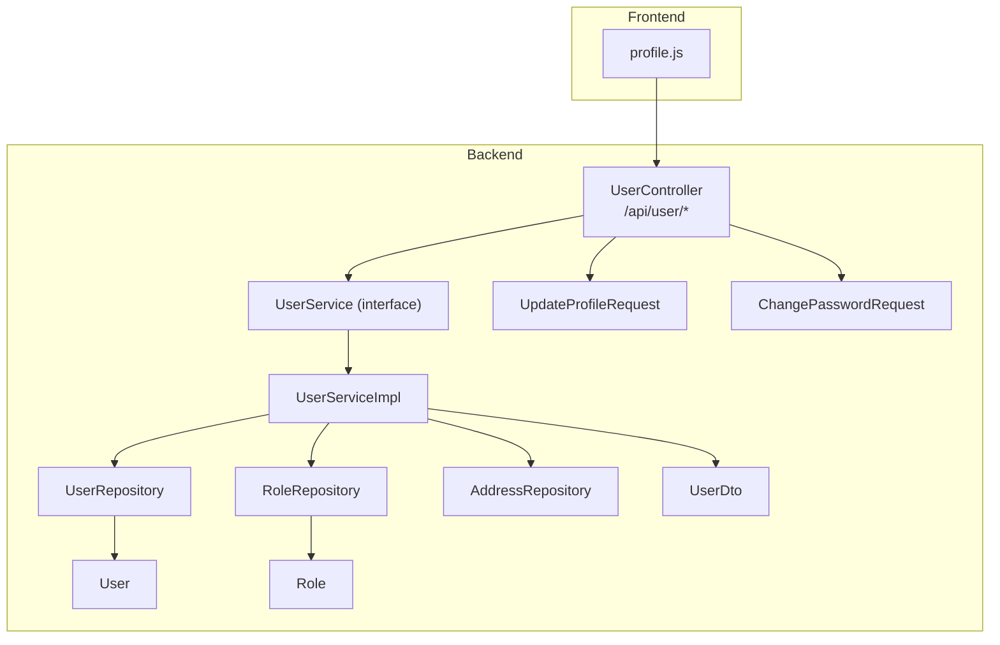
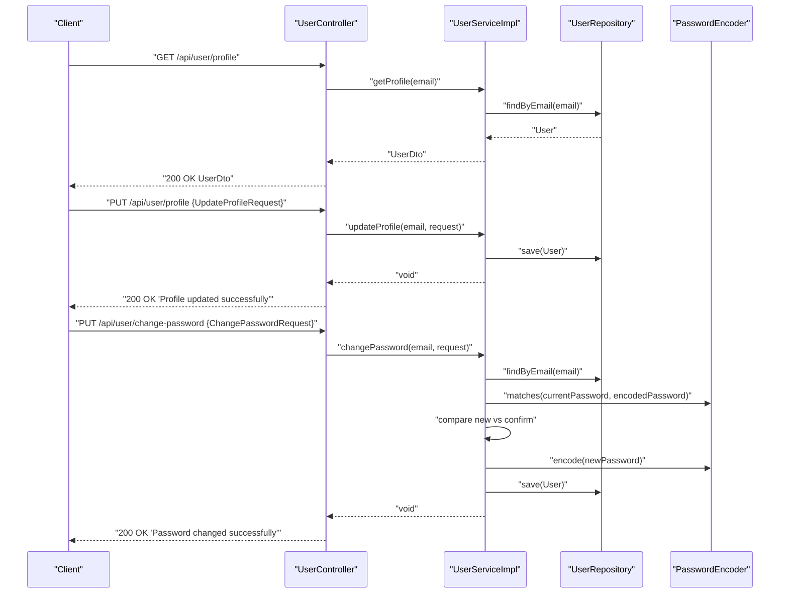
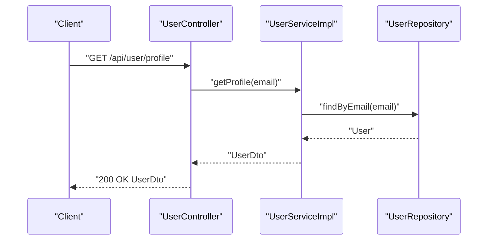
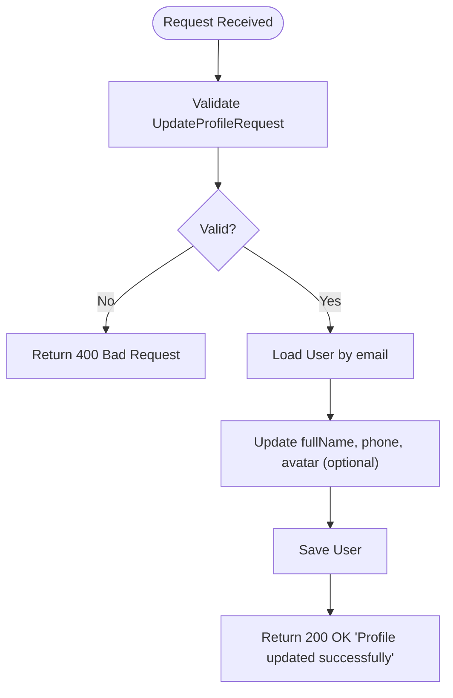
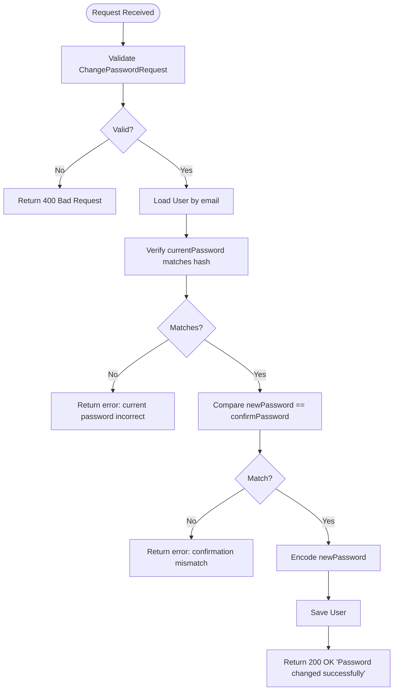
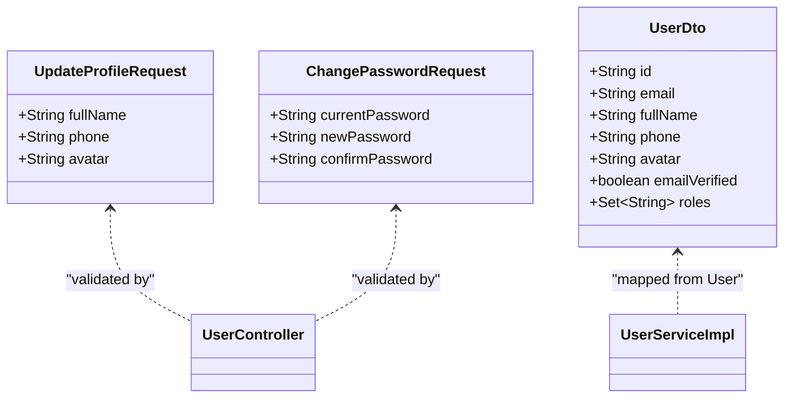
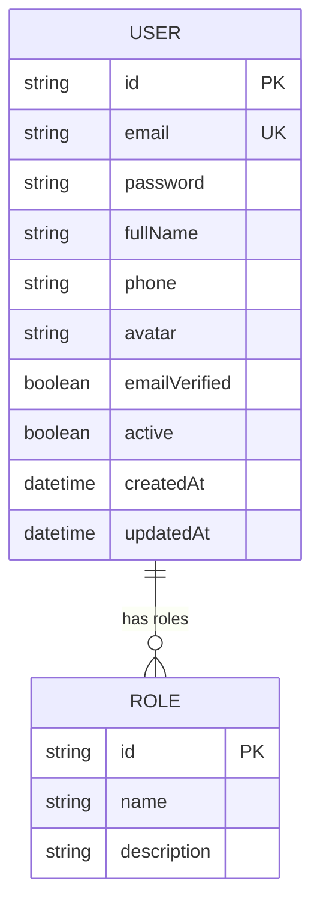
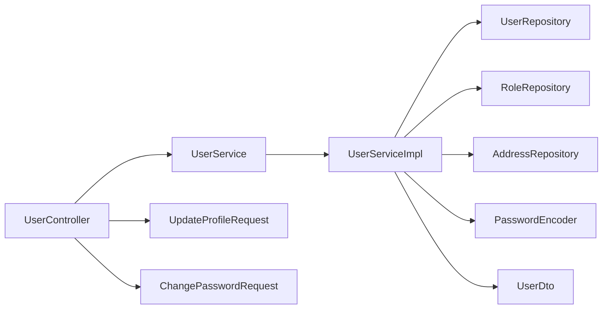

# User Profile Management

<cite>
**Referenced Files in This Document**
- [UserController.java](file://src/Backend/src/main/java/com/shoppeclone/backend/user/controller/UserController.java)
- [UserService.java](file://src/Backend/src/main/java/com/shoppeclone/backend/user/service/UserService.java)
- [UserServiceImpl.java](file://src/Backend/src/main/java/com/shoppeclone/backend/user/service/impl/UserServiceImpl.java)
- [UpdateProfileRequest.java](file://src/Backend/src/main/java/com/shoppeclone/backend/user/dto/request/UpdateProfileRequest.java)
- [ChangePasswordRequest.java](file://src/Backend/src/main/java/com/shoppeclone/backend/user/dto/request/ChangePasswordRequest.java)
- [UserDto.java](file://src/Backend/src/main/java/com/shoppeclone/backend/auth/dto/response/UserDto.java)
- [User.java](file://src/Backend/src/main/java/com/shoppeclone/backend/auth/model/User.java)
- [Role.java](file://src/Backend/src/main/java/com/shoppeclone/backend/auth/model/Role.java)
- [AddressRequest.java](file://src/Backend/src/main/java/com/shoppeclone/backend/user/dto/request/AddressRequest.java)
- [AddressDto.java](file://src/Backend/src/main/java/com/shoppeclone/backend/user/dto/response/AddressDto.java)
- [profile.js](file://src/Frontend/js/profile.js)
</cite>

## Table of Contents
1. [Introduction](#introduction)
2. [Project Structure](#project-structure)
3. [Core Components](#core-components)
4. [Architecture Overview](#architecture-overview)
5. [Detailed Component Analysis](#detailed-component-analysis)
6. [Dependency Analysis](#dependency-analysis)
7. [Performance Considerations](#performance-considerations)
8. [Troubleshooting Guide](#troubleshooting-guide)
9. [Conclusion](#conclusion)

## Introduction
This document explains the user profile management functionality, focusing on retrieving and updating user profiles, changing passwords, and validating user data. It documents the UpdateProfileRequest and ChangePasswordRequest DTOs, their validation constraints, and security considerations. It also details the UserDto response structure and secure transmission practices. Practical examples of API endpoints for /api/user/profile and /api/user/change-password are included, along with common validation errors, password strength requirements, and privacy considerations.

## Project Structure
The user profile management feature spans the user controller, service, DTOs, and models. The controller exposes REST endpoints under /api/user, while the service implements business logic and interacts with repositories. DTOs define request/response shapes and validation constraints. The frontend JavaScript demonstrates how the client consumes these endpoints.

**Diagram sources**
- [UserController.java:15-51](file://src/Backend/src/main/java/com/shoppeclone/backend/user/controller/UserController.java#L15-L51)
- [UserService.java:9-27](file://src/Backend/src/main/java/com/shoppeclone/backend/user/service/UserService.java#L9-L27)
- [UserServiceImpl.java:21-66](file://src/Backend/src/main/java/com/shoppeclone/backend/user/service/impl/UserServiceImpl.java#L21-L66)
- [UpdateProfileRequest.java:7-17](file://src/Backend/src/main/java/com/shoppeclone/backend/user/dto/request/UpdateProfileRequest.java#L7-L17)
- [ChangePasswordRequest.java:7-20](file://src/Backend/src/main/java/com/shoppeclone/backend/user/dto/request/ChangePasswordRequest.java#L7-L20)
- [UserDto.java:6-15](file://src/Backend/src/main/java/com/shoppeclone/backend/auth/dto/response/UserDto.java#L6-L15)
- [User.java:13-38](file://src/Backend/src/main/java/com/shoppeclone/backend/auth/model/User.java#L13-L38)
- [Role.java:8-18](file://src/Backend/src/main/java/com/shoppeclone/backend/auth/model/Role.java#L8-L18)

**Section sources**
- [UserController.java:15-51](file://src/Backend/src/main/java/com/shoppeclone/backend/user/controller/UserController.java#L15-L51)
- [UserService.java:9-27](file://src/Backend/src/main/java/com/shoppeclone/backend/user/service/UserService.java#L9-L27)
- [UserServiceImpl.java:21-66](file://src/Backend/src/main/java/com/shoppeclone/backend/user/service/impl/UserServiceImpl.java#L21-L66)

## Core Components
- UserController: Exposes GET /api/user/profile, PUT /api/user/profile, and PUT /api/user/change-password endpoints. It validates requests via @Valid and delegates to UserService.
- UserService and UserServiceImpl: Implement profile retrieval and updates, password changes, and address management. They enforce validation and security checks.
- DTOs:
  - UpdateProfileRequest: Validates full name, phone pattern, and optional avatar.
  - ChangePasswordRequest: Enforces non-empty current/new/confirm passwords, minimum length, and complexity requirements for the new password.
  - UserDto: Response shape for user profile data returned to clients.
- Models:
  - User: MongoDB entity storing user credentials, profile fields, roles, and timestamps.
  - Role: Stores role identifiers and names.

Key responsibilities:
- Profile retrieval: UserController delegates to UserService to map User to UserDto.
- Profile update: UserController validates UpdateProfileRequest and calls UserServiceImpl.updateProfile, which persists changes.
- Password change: UserController validates ChangePasswordRequest and calls UserServiceImpl.changePassword, which verifies current password, matches confirm password, encodes the new password, and saves.

Security highlights:
- Authentication via Spring Security Authentication; endpoints require a valid bearer token.
- Password encoding using PasswordEncoder before persistence.
- Validation constraints prevent malformed data.

**Section sources**
- [UserController.java:29-51](file://src/Backend/src/main/java/com/shoppeclone/backend/user/controller/UserController.java#L29-L51)
- [UserService.java:11-15](file://src/Backend/src/main/java/com/shoppeclone/backend/user/service/UserService.java#L11-L15)
- [UserServiceImpl.java:32-66](file://src/Backend/src/main/java/com/shoppeclone/backend/user/service/impl/UserServiceImpl.java#L32-L66)
- [UpdateProfileRequest.java:10-14](file://src/Backend/src/main/java/com/shoppeclone/backend/user/dto/request/UpdateProfileRequest.java#L10-L14)
- [ChangePasswordRequest.java:9-19](file://src/Backend/src/main/java/com/shoppeclone/backend/user/dto/request/ChangePasswordRequest.java#L9-L19)
- [UserDto.java:8-14](file://src/Backend/src/main/java/com/shoppeclone/backend/auth/dto/response/UserDto.java#L8-L14)
- [User.java:19-33](file://src/Backend/src/main/java/com/shoppeclone/backend/auth/model/User.java#L19-L33)
- [Role.java:14-15](file://src/Backend/src/main/java/com/shoppeclone/backend/auth/model/Role.java#L14-L15)

## Architecture Overview
The profile management flow integrates the controller, service, and persistence layers. Requests are validated at the controller level and enforced by service-layer checks. Password changes involve cryptographic hashing and strict equality checks.

**Diagram sources**
- [UserController.java:29-51](file://src/Backend/src/main/java/com/shoppeclone/backend/user/controller/UserController.java#L29-L51)
- [UserServiceImpl.java:32-66](file://src/Backend/src/main/java/com/shoppeclone/backend/user/service/impl/UserServiceImpl.java#L32-L66)
- [User.java:19-22](file://src/Backend/src/main/java/com/shoppeclone/backend/auth/model/User.java#L19-L22)

## Detailed Component Analysis

### Profile Retrieval: GET /api/user/profile
- Endpoint: GET /api/user/profile
- Authentication: Requires a valid bearer token; the controller extracts the email from Authentication.
- Implementation:
  - UserController calls UserService.getProfile(email).
  - UserServiceImpl maps the User entity to UserDto.
- Response: 200 OK with UserDto payload.

**Diagram sources**
- [UserController.java:29-33](file://src/Backend/src/main/java/com/shoppeclone/backend/user/controller/UserController.java#L29-L33)
- [UserServiceImpl.java:32-35](file://src/Backend/src/main/java/com/shoppeclone/backend/user/service/impl/UserServiceImpl.java#L32-L35)

**Section sources**
- [UserController.java:29-33](file://src/Backend/src/main/java/com/shoppeclone/backend/user/controller/UserController.java#L29-L33)
- [UserServiceImpl.java:32-35](file://src/Backend/src/main/java/com/shoppeclone/backend/user/service/impl/UserServiceImpl.java#L32-L35)

### Profile Update: PUT /api/user/profile
- Endpoint: PUT /api/user/profile
- Request body: UpdateProfileRequest
  - fullName: Required (non-blank)
  - phone: Optional; must match Vietnamese landline/mobile pattern (10 digits, starts with 0)
  - avatar: Optional; replaces existing avatar if present
- Validation:
  - @NotBlank on fullName
  - @Pattern on phone enforcing Vietnamese phone format
- Implementation:
  - UserController validates request and calls UserServiceImpl.updateProfile.
  - Service loads User by email, updates fields, conditionally sets avatar, updates timestamps, and saves.
- Response: 200 OK with success message.

**Diagram sources**
- [UserController.java:35-42](file://src/Backend/src/main/java/com/shoppeclone/backend/user/controller/UserController.java#L35-L42)
- [UpdateProfileRequest.java:10-14](file://src/Backend/src/main/java/com/shoppeclone/backend/user/dto/request/UpdateProfileRequest.java#L10-L14)
- [UserServiceImpl.java:38-48](file://src/Backend/src/main/java/com/shoppeclone/backend/user/service/impl/UserServiceImpl.java#L38-L48)

**Section sources**
- [UserController.java:35-42](file://src/Backend/src/main/java/com/shoppeclone/backend/user/controller/UserController.java#L35-L42)
- [UpdateProfileRequest.java:10-14](file://src/Backend/src/main/java/com/shoppeclone/backend/user/dto/request/UpdateProfileRequest.java#L10-L14)
- [UserServiceImpl.java:38-48](file://src/Backend/src/main/java/com/shoppeclone/backend/user/service/impl/UserServiceImpl.java#L38-L48)

### Password Change: PUT /api/user/change-password
- Endpoint: PUT /api/user/change-password
- Request body: ChangePasswordRequest
  - currentPassword: Required (non-blank)
  - newPassword: Required (min 8 chars), must contain uppercase, lowercase, and digit
  - confirmPassword: Required (min 8 chars); must match newPassword
- Validation:
  - @NotBlank on all three fields
  - @Size min 8 for newPassword and confirmPassword
  - @Pattern for newPassword requiring mixed case and digit
- Implementation:
  - UserController validates request and calls UserServiceImpl.changePassword.
  - Service verifies current password against stored hash.
  - Confirms newPassword equals confirmPassword.
  - Encodes new password and saves.
- Response: 200 OK with success message.

**Diagram sources**
- [UserController.java:44-51](file://src/Backend/src/main/java/com/shoppeclone/backend/user/controller/UserController.java#L44-L51)
- [ChangePasswordRequest.java:9-19](file://src/Backend/src/main/java/com/shoppeclone/backend/user/dto/request/ChangePasswordRequest.java#L9-L19)
- [UserServiceImpl.java:50-66](file://src/Backend/src/main/java/com/shoppeclone/backend/user/service/impl/UserServiceImpl.java#L50-L66)

**Section sources**
- [UserController.java:44-51](file://src/Backend/src/main/java/com/shoppeclone/backend/user/controller/UserController.java#L44-L51)
- [ChangePasswordRequest.java:9-19](file://src/Backend/src/main/java/com/shoppeclone/backend/user/dto/request/ChangePasswordRequest.java#L9-L19)
- [UserServiceImpl.java:50-66](file://src/Backend/src/main/java/com/shoppeclone/backend/user/service/impl/UserServiceImpl.java#L50-L66)

### DTOs and Data Transfer Objects
- UpdateProfileRequest
  - Fields: fullName (required), phone (pattern-matched), avatar (optional)
  - Validation: @NotBlank on fullName; @Pattern on phone
- ChangePasswordRequest
  - Fields: currentPassword (required), newPassword (min 8, mixed case + digit), confirmPassword (min 8)
  - Validation: @NotBlank on all; @Size and @Pattern on newPassword; confirm must equal new
- UserDto (response)
  - Fields: id, email, fullName, phone, avatar, emailVerified, roles
  - Used by UserController.getProfile to return profile data

**Diagram sources**
- [UpdateProfileRequest.java:7-17](file://src/Backend/src/main/java/com/shoppeclone/backend/user/dto/request/UpdateProfileRequest.java#L7-L17)
- [ChangePasswordRequest.java:7-20](file://src/Backend/src/main/java/com/shoppeclone/backend/user/dto/request/ChangePasswordRequest.java#L7-L20)
- [UserDto.java:6-15](file://src/Backend/src/main/java/com/shoppeclone/backend/auth/dto/response/UserDto.java#L6-L15)
- [UserController.java:35-51](file://src/Backend/src/main/java/com/shoppeclone/backend/user/controller/UserController.java#L35-L51)

**Section sources**
- [UpdateProfileRequest.java:10-14](file://src/Backend/src/main/java/com/shoppeclone/backend/user/dto/request/UpdateProfileRequest.java#L10-L14)
- [ChangePasswordRequest.java:9-19](file://src/Backend/src/main/java/com/shoppeclone/backend/user/dto/request/ChangePasswordRequest.java#L9-L19)
- [UserDto.java:8-14](file://src/Backend/src/main/java/com/shoppeclone/backend/auth/dto/response/UserDto.java#L8-L14)

### User Data Model and Privacy Considerations
- User entity stores:
  - Identity: id, email (unique index)
  - Credentials: password
  - Profile: fullName, phone, avatar
  - Verification and activity: emailVerified, active
  - Roles: embedded Set<Role>
  - Timestamps: createdAt, updatedAt
- Privacy considerations:
  - Only necessary fields are exposed in UserDto (no password).
  - Avatar is optional and can be omitted.
  - Phone numbers follow a strict Vietnamese pattern to reduce ambiguity.
  - Authentication via bearer token ensures endpoints are protected.

**Diagram sources**
- [User.java:16-33](file://src/Backend/src/main/java/com/shoppeclone/backend/auth/model/User.java#L16-L33)
- [Role.java:11-15](file://src/Backend/src/main/java/com/shoppeclone/backend/auth/model/Role.java#L11-L15)

**Section sources**
- [User.java:19-33](file://src/Backend/src/main/java/com/shoppeclone/backend/auth/model/User.java#L19-L33)
- [Role.java:14-15](file://src/Backend/src/main/java/com/shoppeclone/backend/auth/model/Role.java#L14-L15)

### Frontend Integration Example
- The frontend profile.js demonstrates:
  - Fetching profile data with Authorization header containing a bearer token.
  - Submitting profile updates and password changes similarly with Authorization and JSON body.
- This illustrates secure transmission via bearer tokens and JSON payloads.

**Section sources**
- [profile.js:4-19](file://src/Frontend/js/profile.js#L4-L19)
- [profile.js:21-38](file://src/Frontend/js/profile.js#L21-L38)
- [profile.js:40-58](file://src/Frontend/js/profile.js#L40-L58)

## Dependency Analysis
- Controller depends on UserService for business operations.
- UserServiceImpl depends on:
  - UserRepository for user persistence
  - RoleRepository for role management
  - PasswordEncoder for password hashing
  - AddressRepository for address operations (separate concern)
- DTOs are consumed by the controller and produced by the service.

**Diagram sources**
- [UserController.java:21-25](file://src/Backend/src/main/java/com/shoppeclone/backend/user/controller/UserController.java#L21-L25)
- [UserService.java:21-27](file://src/Backend/src/main/java/com/shoppeclone/backend/user/service/UserService.java#L21-L27)
- [UserServiceImpl.java:25-28](file://src/Backend/src/main/java/com/shoppeclone/backend/user/service/impl/UserServiceImpl.java#L25-L28)

**Section sources**
- [UserController.java:21-25](file://src/Backend/src/main/java/com/shoppeclone/backend/user/controller/UserController.java#L21-L25)
- [UserService.java:21-27](file://src/Backend/src/main/java/com/shoppeclone/backend/user/service/UserService.java#L21-L27)
- [UserServiceImpl.java:25-28](file://src/Backend/src/main/java/com/shoppeclone/backend/user/service/impl/UserServiceImpl.java#L25-L28)

## Performance Considerations
- Validation occurs at the controller boundary to fail fast and avoid unnecessary database calls.
- Password encoding is performed only during password changes, minimizing overhead.
- Profile updates are single-entity writes; ensure indexes exist on email for efficient lookup.
- Consider caching frequently accessed profile data if read volume is high, while ensuring cache invalidation on updates.

## Troubleshooting Guide
Common validation errors and resolutions:
- UpdateProfileRequest
  - Missing fullName: Ensure fullName is provided; server responds with validation error.
  - Invalid phone format: Phone must match the Vietnamese pattern (10 digits starting with 0).
- ChangePasswordRequest
  - Current password incorrect: Verify the provided current password matches the stored hash.
  - New password confirmation mismatch: newPassword must equal confirmPassword.
  - New password too short: Must be at least 8 characters.
  - New password lacks required character types: Must include uppercase, lowercase, and digit.

Error handling behavior:
- Validation failures return 400 with constraint violations.
- Business logic errors (e.g., user not found, incorrect current password, address not found) throw runtime exceptions; the global exception handler translates them to appropriate HTTP responses.

Practical examples:
- Successful profile update:
  - Client sends PUT /api/user/profile with fullName and phone.
  - Server returns 200 OK with "Profile updated successfully".
- Successful password change:
  - Client sends PUT /api/user/change-password with currentPassword, newPassword, and confirmPassword.
  - Server returns 200 OK with "Password changed successfully".

**Section sources**
- [UpdateProfileRequest.java:10-14](file://src/Backend/src/main/java/com/shoppeclone/backend/user/dto/request/UpdateProfileRequest.java#L10-L14)
- [ChangePasswordRequest.java:9-19](file://src/Backend/src/main/java/com/shoppeclone/backend/user/dto/request/ChangePasswordRequest.java#L9-L19)
- [UserServiceImpl.java:55-61](file://src/Backend/src/main/java/com/shoppeclone/backend/user/service/impl/UserServiceImpl.java#L55-L61)
- [profile.js:21-38](file://src/Frontend/js/profile.js#L21-L38)
- [profile.js:40-58](file://src/Frontend/js/profile.js#L40-L58)

## Conclusion
The user profile management feature provides secure, validated operations for retrieving and updating profiles and changing passwords. DTOs enforce strong constraints, UserServiceImpl encapsulates business logic and security checks, and the controller exposes straightforward endpoints under /api/user. The UserDto response excludes sensitive fields, and authentication via bearer tokens protects endpoints. Following the validation rules and error handling guidance ensures robust and secure user data management.