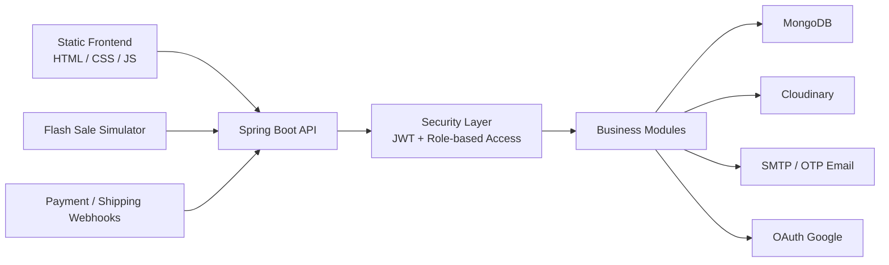


# 🛍️ Shoppe Clone Backend Workspace

> Workspace thương mại điện tử xây bằng Spring Boot + MongoDB, gồm backend API, giao diện tĩnh phục vụ demo và các công cụ hỗ trợ seed dữ liệu, kiểm thử, flash sale simulation.

    

## ✨ Tổng quan

Dự án này là một hệ thống e-commerce nhiều module, tập trung vào backend Java/Spring Boot. Mã nguồn hiện tại không chỉ có các chức năng cơ bản như đăng nhập, sản phẩm, giỏ hàng và đơn hàng, mà còn mở rộng sang seller workflow, flash sale, voucher, review, refund, dispute, chat, analytics và webhook tích hợp.

Backend runtime chính nằm ở `src/Backend`. Ngoài ra workspace còn chứa:

- `src/Frontend`: bộ HTML/CSS/JS tĩnh dùng để dựng giao diện và thử nghiệm flow.
- `tools`: script PowerShell và một simulator riêng để test flash sale tải cao.
- `docs`: ghi chú phân tích nghiệp vụ, log làm việc và tài liệu hỗ trợ.

## 🚀 Điểm nổi bật

- Spring Boot 3.2.3, Java 21, Maven Wrapper.
- MongoDB làm database chính.
- JWT authentication, refresh token, OTP email và Google OAuth.
- Quản lý người dùng, địa chỉ, thông báo và đổi/quên mật khẩu.
- Quản lý shop, duyệt shop, analytics cho seller, theo dõi shop.
- Danh mục, sản phẩm, biến thể, tồn kho, hình ảnh sản phẩm.
- Giỏ hàng, đặt hàng, cập nhật trạng thái đơn, vận chuyển và tracking.
- Voucher toàn sàn, voucher shop, freeship và flash sale runtime.
- Review sản phẩm, seller reply, refund và dispute có upload ảnh bằng URL.
- Webhook cho shipping và payment (MoMo, VNPAY).
- Bộ seed dữ liệu và simulator để test flash sale concurrency.

## 🧰 Tech Stack

| Nhóm | Công nghệ |
| --- | --- |
| Backend | `Spring Boot`, `Spring Web`, `Spring Security`, `Spring Validation` |
| Data | `MongoDB`, `Spring Data MongoDB` |
| Auth | `JWT (jjwt)`, `OAuth2 Client`, `BCrypt` |
| Tích hợp | `Java Mail Sender`, `Cloudinary`, `WebClient` |
| Build | `Maven`, `mvnw`, `Lombok` |
| Test | `spring-boot-starter-test`, `spring-security-test` |

## 🏗️ Kiến trúc ở mức cao



## 🧩 Module chính

| Module | Mục đích | Endpoint gốc tiêu biểu |
| --- | --- | --- |
| Authentication | Đăng ký, đăng nhập, refresh token, OTP, reset password, OAuth Google | `/api/auth`, `/api/auth/oauth` |
| User | Hồ sơ, đổi mật khẩu, địa chỉ, import user CSV, notifications | `/api/user`, `/api/users`, `/api/notifications` |
| Shop & Seller | Đăng ký shop, duyệt shop, dashboard seller, returns, analytics | `/api/shop`, `/api/seller`, `/api/seller/analytics` |
| Catalog | Danh mục, sản phẩm, biến thể, hình ảnh, tìm kiếm | `/api/categories`, `/api/products` |
| Commerce | Giỏ hàng, đơn hàng, theo dõi shop, payment, shipping | `/api/cart`, `/api/orders`, `/api/follow`, `/api/payments`, `/api/shipping` |
| Promotions | Voucher, shop voucher, flash sale campaign/slot/registration/order | `/api/vouchers`, `/api/shop-vouchers`, `/api/flash-sales` |
| Trust & Support | Review, refund, dispute, chat | `/api/reviews`, `/api/refunds`, `/api/disputes`, `/api/chat` |
| Admin | Dashboard, quản trị user, maintenance, dispute/refund review | `/api/admin/**` |

## 🔐 Quyền truy cập và bảo mật

- Các endpoint đọc công khai như sản phẩm, danh mục, flash sale hiện tại, shop public và review public được mở cho client.
- Phần lớn API còn lại yêu cầu JWT.
- Dự án dùng `@EnableMethodSecurity`, nên một số luồng quan trọng được chặn thêm theo role `ADMIN` hoặc `SELLER`.
- Endpoint `/api/flash-sales/order` đang được mở để phục vụ simulator stress test.

## 🗂️ Cấu trúc thư mục

```text
Backend/
|-- README.md
|-- docs/
|-- tools/
|   |-- FlashSaleSimulator/
|   `-- *.ps1
`-- src/
    |-- Backend/
    |   |-- pom.xml
    |   |-- .env.example
    |   |-- .env.cloudinary.example
    |   |-- src/main/java/com/shoppeclone/backend/
    |   |   |-- auth/
    |   |   |-- user/
    |   |   |-- shop/
    |   |   |-- product/
    |   |   |-- cart/
    |   |   |-- order/
    |   |   |-- payment/
    |   |   |-- promotion/
    |   |   |-- review/
    |   |   |-- refund/
    |   |   |-- dispute/
    |   |   |-- shipping/
    |   |   |-- admin/
    |   |   `-- common/
    |   `-- src/main/resources/
    |       |-- application.properties
    |       `-- static/
    `-- Frontend/
        |-- *.html
        |-- style.css
        `-- js/
```

## ⚙️ Chạy local nhanh

### 1. 📋 Yêu cầu môi trường

- Java 21
- Maven hoặc dùng Maven Wrapper đi kèm
- MongoDB local hoặc MongoDB Atlas
- Tài khoản Gmail App Password nếu muốn dùng OTP email
- Cloudinary nếu muốn upload ảnh
- Google OAuth credentials nếu muốn test login Google

### 2. 🔑 Chuẩn bị biến môi trường

Trong `src/Backend`, tạo file `.env` dựa trên:

- `.env.example`
- `.env.cloudinary.example`

Các biến quan trọng:

```env
MONGODB_URI=mongodb+srv://<username>:<password>@cluster0.exxxxxx.mongodb.net/web_shoppe?retryWrites=true&w=majority
JWT_SECRET=YourSuperSecretKeyForJWTTokenGenerationAndValidation123456
JWT_EXPIRATION=900000
JWT_REFRESH_EXPIRATION=604800000
GOOGLE_CLIENT_ID=your-google-client-id
GOOGLE_CLIENT_SECRET=your-google-client-secret
MAIL_USERNAME=your-email@gmail.com
MAIL_PASSWORD=your-16-char-app-password
OTP_EXPIRATION=300000
CLOUDINARY_CLOUD_NAME=your_cloud_name
CLOUDINARY_API_KEY=your_api_key
CLOUDINARY_API_SECRET=your_api_secret
```

### 3. 🗄️ Cấu hình MongoDB

MongoDB URI nên đặt trong `src/Backend/.env` qua biến `MONGODB_URI`.
`application.properties` sẽ đọc lại biến này khi app khởi động, nên backend vẫn kết nối MongoDB Atlas bình thường mà không lộ password trong source.

Port mặc định của ứng dụng là `8080`.

### 4. ▶️ Khởi động backend

```powershell
cd src\Backend
.\mvnw.cmd spring-boot:run
```

Hoặc dùng script:

```powershell
cd src\Backend
.\run-dev.bat
```

Sau khi chạy thành công:

- API base URL: `http://localhost:8080`
- Static demo pages: `http://localhost:8080/index.html`

## 🌱 Những gì xảy ra khi startup

Đây là phần rất đáng đọc trước khi dùng dữ liệu thật:

- `DataInitializer` seed role, category, payment method và shipping provider mặc định.
- Có logic promote admin mang tính project-specific trong `DataInitializer`; nên rà lại trước khi deploy thật.
- `VoucherSeeder` đang `deleteAll()` voucher rồi seed lại mỗi lần ứng dụng khởi động.
- `ProductSeeder` sẽ cố phục hồi sản phẩm từ file `products.json` trong working directory nếu file này tồn tại.

## 🔄 Luồng chính của hệ thống

### 👤 Người mua

- Đăng ký, đăng nhập, xác thực OTP, reset mật khẩu.
- Xem sản phẩm, danh mục, voucher, flash sale.
- Thêm giỏ hàng, đặt hàng, xem lịch sử đơn.
- Thanh toán, theo dõi đơn, đánh giá sản phẩm.
- Yêu cầu refund hoặc mở dispute sau mua hàng.

### 🏪 Người bán

- Đăng ký shop, upload giấy tờ định danh.
- Quản lý shop, sản phẩm, biến thể, hình ảnh.
- Tham gia flash sale, theo dõi doanh số flash sale.
- Cập nhật trạng thái đơn, vận đơn, xử lý returns.
- Xem analytics và phản hồi review.

### 🛡️ Quản trị viên

- Duyệt hoặc từ chối shop.
- Quản lý user và role.
- Tạo campaign flash sale, slot, approve đăng ký.
- Duyệt dispute, refund và xem dashboard.
- Chạy maintenance để đồng bộ sales counters.

## 📡 Các endpoint đáng chú ý

| Chức năng | Endpoint |
| --- | --- |
| Auth | `/api/auth/register`, `/api/auth/login`, `/api/auth/refresh-token` |
| OAuth Google | `/api/auth/oauth/google/url`, `/api/auth/oauth/google/exchange` |
| Hồ sơ user | `/api/user/profile`, `/api/user/addresses` |
| Shop | `/api/shop/register`, `/api/shop/my-shop`, `/api/shop/admin/pending` |
| Catalog | `/api/products/search`, `/api/products/category/{categoryId}`, `/api/categories/root` |
| Cart & Order | `/api/cart`, `/api/orders` |
| Payment | `/api/payments`, `/api/webhooks/payment/momo`, `/api/webhooks/payment/vnpay` |
| Shipping | `/api/shipping/providers`, `/api/webhooks/shipping/update` |
| Flash Sale | `/api/flash-sales/current`, `/api/flash-sales/campaigns`, `/api/flash-sales/order` |
| Review / Refund / Dispute | `/api/reviews`, `/api/refunds/{orderId}/request`, `/api/disputes` |

## 🎨 Frontend trong repo

Repo này có hai lớp frontend:

- `src/Frontend`: mã HTML/CSS/JS tĩnh dùng để phát triển hoặc thử nghiệm nhanh ngoài backend.
- `src/Backend/src/main/resources/static`: bản static assets được Spring Boot phục vụ trực tiếp.

Điều này hữu ích khi demo flow end-to-end mà chưa cần tách frontend framework riêng.

## 🧪 Công cụ và tài nguyên hỗ trợ

### ⚡ Flash Sale Simulator

Thư mục `tools/FlashSaleSimulator` chứa một ứng dụng Java nhỏ để bắn request đồng thời vào:

```text
POST /api/flash-sales/order
```

Use case:

- kiểm tra race condition khi flash sale diễn ra.
- đo số request thành công, hết hàng và lỗi hệ thống.
- xác nhận tồn kho không bị âm khi có tải cao.

### 🖥️ Script PowerShell

Trong `tools/` có nhiều script phục vụ phát triển nhanh:

- chạy dev server.
- test API và health.
- audit shop, category, product.
- khôi phục dữ liệu hoặc seed lại danh mục.

### 📚 Tài liệu nội bộ

Một số file đáng xem thêm:

- `src/Backend/CSV_IMPORT_GUIDE.md`
- `src/Backend/MONGODB_SETUP_GUIDE.md`
- `src/Backend/SAMPLE_DATA_README.md`
- `docs/Luong_FlashSale.md`
- `docs/Luong_TraHang_Dispute.md`

## ✅ Testing

Repo hiện có test cho một số luồng quan trọng:

- `WebhookControllerTest`
- `PaymentPromotionIntegrationTest`
- `CartServiceImplTest`

Chạy test:

```powershell
cd src\Backend
.\mvnw.cmd test
```

## 📝 Ghi chú thực tế

- Luồng payment hiện có webhook cho MoMo và VNPAY, nhưng phần tạo `redirectUrl` trong payment API vẫn đang ở mức đơn giản.
- CORS đang mở cho một số origin local phổ biến như `localhost:3000` và `127.0.0.1:5500`.
- Đây là repo phát triển tích lũy theo thời gian, nên trong `docs/` và `tools/` có cả tài liệu cũ lẫn tiện ích ad-hoc. README này ưu tiên phản ánh code đang tồn tại trong `src/Backend`.

## 🎯 Khi nào nên dùng repo này

Repo phù hợp nếu bạn cần:

- một backend e-commerce mẫu bằng Java/Spring Boot để học theo module.
- một nền tảng demo có đủ buyer, seller, admin flow.
- môi trường thử nghiệm flash sale, voucher, refund và dispute.
- một codebase để tiếp tục tách riêng frontend, chuẩn hóa config và nâng chất lượng production.
