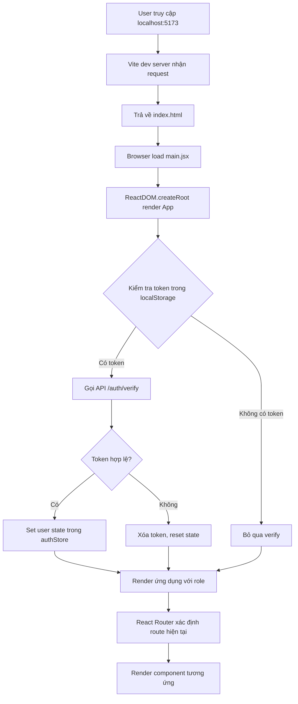
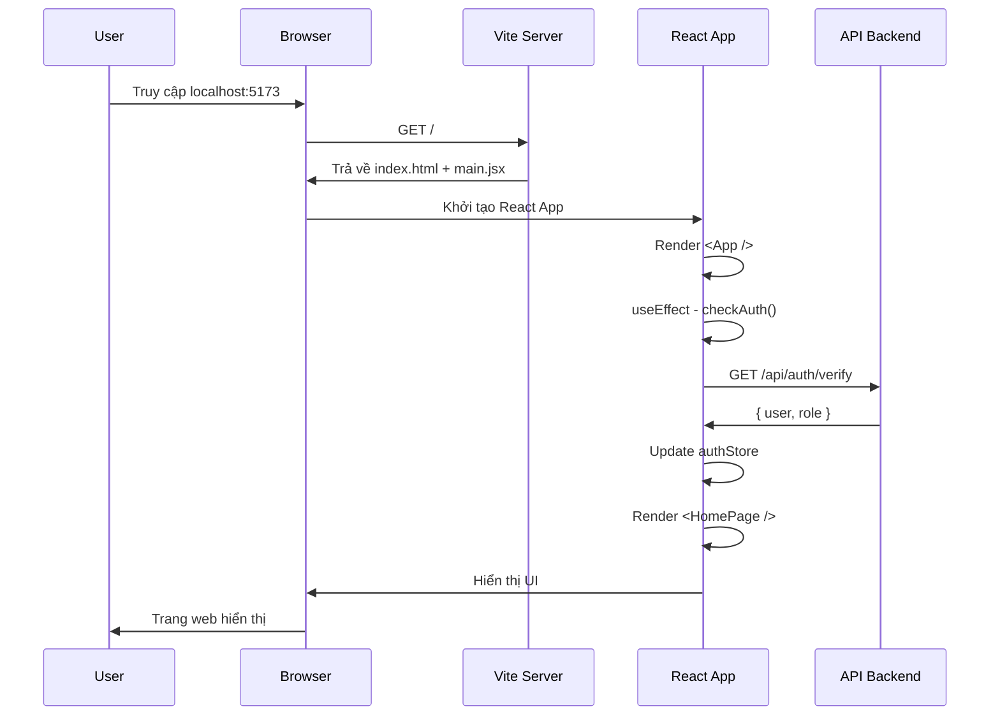
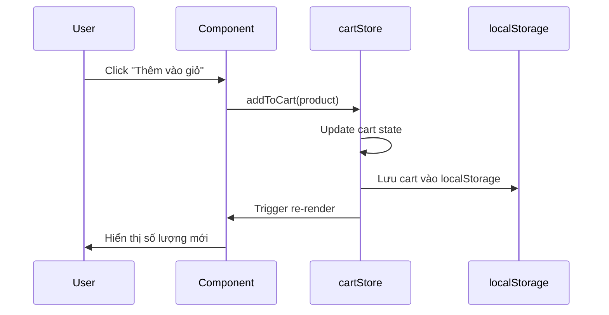
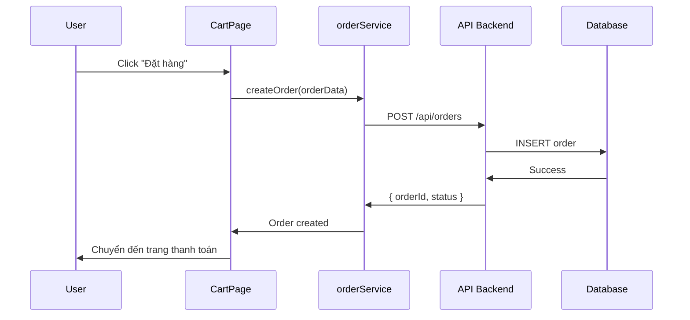

# 🚀 Hướng Dẫn Chi Tiết: Quá Trình Chạy Frontend

## 📋 Mục Lục
1. [Tổng Quan Kiến Trúc](#tổng-quan-kiến-trúc)
2. [Quy Trình Khởi Động](#quy-trình-khởi-động)
3. [Luồng Xử Lý Ứng Dụng](#luồng-xử-lý-ứng-dụng)
4. [Cấu Trúc Thư Mục](#cấu-trúc-thư-mục)
5. [Các Thành Phần Chính](#các-thành-phần-chính)

---

## 🏗️ Tổng Quan Kiến Trúc

Dự án frontend của bạn sử dụng **React + Vite**, một stack hiện đại và nhanh chóng:

### Công Nghệ Sử Dụng:
- **React 18.3.1**: Thư viện UI component-based
- **Vite 5.4.6**: Build tool cực nhanh, thay thế Create React App
- **React Router DOM**: Quản lý routing/navigation
- **Zustand**: State management đơn giản, nhẹ
- **Axios**: HTTP client để gọi API
- **React Icons**: Thư viện icon

---

## 🔄 Quy Trình Khởi Động

### Bước 1: Chạy Lệnh `npm run dev`

Khi bạn chạy lệnh này, điều gì xảy ra?

```bash
npm run dev
```

**Vite** sẽ:
1. ✅ Đọc file cấu hình [`vite.config.js`](file:///c:/Users/HPPAVILION/Documents/Cusor/Cafe_app/my-app/Frontend/vite.config.js)
2. ✅ Khởi động dev server tại `http://localhost:5173`
3. ✅ Thiết lập proxy để forward các request `/api/*` đến backend `http://localhost:5000`
4. ✅ Bật Hot Module Replacement (HMR) - tự động reload khi code thay đổi

### Bước 2: Trình Duyệt Load `index.html`

File [`index.html`](file:///c:/Users/HPPAVILION/Documents/Cusor/Cafe_app/my-app/Frontend/index.html) là điểm khởi đầu:

```html
<!doctype html>
<html lang="en">
  <head>
    <meta charset="UTF-8" />
    <link rel="icon" type="image/svg+xml" href="/vite.svg" />
    <meta name="viewport" content="width=device-width, initial-scale=1.0" />
    <title>my-app</title>
  </head>
  <body>
    <div id="root"></div>                    <!-- ⭐ React sẽ render vào đây -->
    <script type="module" src="/src/main.jsx"></script>  <!-- ⭐ Entry point -->
  </body>
</html>
```

**Điểm quan trọng:**
- `<div id="root"></div>`: Container rỗng, React sẽ "chiếm quyền" và render toàn bộ app vào đây
- `<script type="module" src="/src/main.jsx">`: Load file JavaScript chính

### Bước 3: Thực Thi `main.jsx`

File [`main.jsx`](file:///c:/Users/HPPAVILION/Documents/Cusor/Cafe_app/my-app/Frontend/src/main.jsx) khởi tạo React app:

```jsx
import React from 'react';
import ReactDOM from 'react-dom/client';
import { BrowserRouter } from 'react-router-dom';
import App from './App.jsx';
import './styles.css';

ReactDOM.createRoot(document.getElementById('root')).render(
  <React.StrictMode>
    <BrowserRouter>
      <App />
    </BrowserRouter>
  </React.StrictMode>
);
```

**Giải thích từng dòng:**

| Dòng Code | Chức Năng |
|-----------|-----------|
| `ReactDOM.createRoot(...)` | Tạo React root tại `<div id="root">` |
| `<React.StrictMode>` | Bật chế độ kiểm tra nghiêm ngặt (phát hiện lỗi tiềm ẩn) |
| `<BrowserRouter>` | Bật routing cho ứng dụng (quản lý URL) |
| `<App />` | Component chính của ứng dụng |
| `import './styles.css'` | Load CSS toàn cục |

### Bước 4: Component `App.jsx` Được Render

File [`App.jsx`](file:///c:/Users/HPPAVILION/Documents/Cusor/Cafe_app/my-app/Frontend/src/App.jsx) là trái tim của ứng dụng:

```jsx
export default function App() {
  const role = useAuthStore(s => s.role);
  const verifyToken = useAuthStore(s => s.verifyToken);
  const toast = useNotifyStore();
  const location = useLocation();
  const [sidebarOpen, setSidebarOpen] = useState(false);
  const [isVerifying, setIsVerifying] = useState(true);
  
  // 1️⃣ Kiểm tra authentication khi app khởi động
  useEffect(() => {
    const checkAuth = async () => {
      try {
        await verifyToken();  // Gọi API kiểm tra token
      } catch (error) {
        console.error('Auth verification error:', error);
      } finally {
        setIsVerifying(false);  // Kết thúc loading
      }
    };
    checkAuth();
  }, [verifyToken]);

  // 2️⃣ Hiển thị loading screen trong khi verify
  if (isVerifying) {
    return (
      <div className="app" style={{...}}>
        <div>☕ Đang tải...</div>
      </div>
    );
  }

  // 3️⃣ Render ứng dụng chính
  return (
    <div className="app">
      <Header />
      <Routes>
        <Route path="/" element={<HomePage />} />
        <Route path="/cart" element={<CartPage />} />
        <Route path="/menu" element={<MenuPage />} />
        <Route path="/admin" element={role === 'admin' ? <AdminDashboard /> : <Navigate to="/login" />} />
        {/* ... các route khác */}
      </Routes>
      <Footer />
      {/* Toast notifications */}
    </div>
  );
}
```

---

## 🌊 Luồng Xử Lý Ứng Dụng

### Sơ Đồ Luồng Khởi Động



### Chi Tiết Từng Bước

#### 1. **Khởi Động Vite Dev Server**
```bash
npm run dev
```
- Vite đọc `vite.config.js`
- Khởi động server tại port 5173
- Thiết lập proxy: `/api/*` → `http://localhost:5000`

#### 2. **Browser Request**
```
GET http://localhost:5173/
```
- Vite trả về `index.html`
- Browser parse HTML, tìm thấy `<script src="/src/main.jsx">`

#### 3. **Module Loading**
```javascript
// Vite tự động transform JSX → JavaScript
import App from './App.jsx'  // → App component
import './styles.css'         // → Inject CSS vào <head>
```

#### 4. **React Initialization**
```javascript
ReactDOM.createRoot(document.getElementById('root')).render(...)
```
- Tạo React root
- Render `<App />` vào `<div id="root">`

#### 5. **Authentication Check**
```javascript
useEffect(() => {
  const checkAuth = async () => {
    await verifyToken();  // Gọi API GET /api/auth/verify
  };
  checkAuth();
}, []);
```

**API Request:**
```http
GET http://localhost:5173/api/auth/verify
Authorization: Bearer <token_from_localStorage>

↓ (Proxy forward)

GET http://localhost:5000/api/auth/verify
```

#### 6. **Routing**
```javascript
<Routes>
  <Route path="/" element={<HomePage />} />
  <Route path="/menu" element={<MenuPage />} />
  {/* ... */}
</Routes>
```
- React Router so sánh URL hiện tại với các route
- Render component tương ứng

---

## 📁 Cấu Trúc Thư Mục

```
Frontend/
├── public/              # Static assets (không qua build process)
├── src/
│   ├── components/      # ⚛️ Reusable UI components
│   │   ├── layout/      # Header, Footer, Sidebar
│   │   ├── product/     # ProductCard, ProductList
│   │   └── ...
│   ├── pages/           # 📄 Page components (route endpoints)
│   │   ├── Home/        # HomePage.jsx
│   │   ├── Product/     # MenuPage.jsx, ProductReviewsPage.jsx
│   │   ├── Order/       # CartPage.jsx, CustomerOrdersPage.jsx
│   │   ├── Admin/       # AdminDashboardPage.jsx
│   │   └── Auth/        # LoginPage.jsx
│   ├── stores/          # 🗄️ Zustand state management
│   │   ├── authStore.js      # User authentication state
│   │   ├── cartStore.js      # Shopping cart state
│   │   ├── notifyStore.js    # Toast notifications
│   │   └── ...
│   ├── services/        # 🌐 API calls (axios)
│   │   ├── authService.js
│   │   ├── productService.js
│   │   ├── orderService.js
│   │   └── ...
│   ├── config/          # ⚙️ Configuration files
│   │   └── routes.js    # Route constants
│   ├── constants/       # 📌 App constants
│   │   └── roles.js     # User roles (ADMIN, CUSTOMER)
│   ├── utils/           # 🛠️ Helper functions
│   ├── hooks/           # 🪝 Custom React hooks
│   ├── main.jsx         # 🚪 Entry point
│   ├── App.jsx          # 🏠 Root component
│   └── styles.css       # 🎨 Global styles
├── index.html           # HTML template
├── vite.config.js       # Vite configuration
└── package.json         # Dependencies & scripts
```

---

## 🧩 Các Thành Phần Chính

### 1. **State Management (Zustand)**

**authStore.js** - Quản lý authentication:
```javascript
import { create } from 'zustand';

export const useAuthStore = create((set) => ({
  user: null,
  role: null,
  token: localStorage.getItem('token'),
  
  login: async (credentials) => {
    const response = await authService.login(credentials);
    localStorage.setItem('token', response.token);
    set({ user: response.user, role: response.role, token: response.token });
  },
  
  logout: () => {
    localStorage.removeItem('token');
    set({ user: null, role: null, token: null });
  },
  
  verifyToken: async () => {
    const token = localStorage.getItem('token');
    if (!token) return;
    
    const response = await authService.verify();
    set({ user: response.user, role: response.role });
  }
}));
```

**Cách sử dụng trong component:**
```javascript
function MyComponent() {
  const user = useAuthStore(s => s.user);
  const login = useAuthStore(s => s.login);
  
  return <div>Hello {user?.name}</div>;
}
```

### 2. **API Services (Axios)**

**productService.js** - Gọi API sản phẩm:
```javascript
import axios from 'axios';

const API_URL = '/api/products';  // Proxy sẽ forward đến backend

export const productService = {
  getAll: async () => {
    const response = await axios.get(API_URL);
    return response.data;
  },
  
  getById: async (id) => {
    const response = await axios.get(`${API_URL}/${id}`);
    return response.data;
  },
  
  create: async (data) => {
    const response = await axios.post(API_URL, data, {
      headers: {
        'Authorization': `Bearer ${localStorage.getItem('token')}`
      }
    });
    return response.data;
  }
};
```

### 3. **Routing (React Router)**

**routes.js** - Định nghĩa routes:
```javascript
export const ROUTES = {
  HOME: '/',
  MENU: '/menu',
  CART: '/cart',
  LOGIN: '/login',
  ADMIN: '/admin',
  MY_ORDERS: '/my-orders',
  PRODUCT_REVIEWS: (id) => `/products/${id}/reviews`,
  NOT_FOUND: '*'
};
```

**App.jsx** - Sử dụng routes:
```javascript
<Routes>
  <Route path={ROUTES.HOME} element={<HomePage />} />
  <Route path={ROUTES.MENU} element={<MenuPage />} />
  <Route 
    path={ROUTES.ADMIN} 
    element={role === ROLES.ADMIN ? <AdminDashboard /> : <Navigate to={ROUTES.LOGIN} />} 
  />
</Routes>
```

### 4. **Proxy Configuration**

**vite.config.js** - Forward API requests:
```javascript
export default defineConfig({
  plugins: [react()],
  server: {
    proxy: {
      "/api": {
        target: "http://localhost:5000",  // Backend server
        changeOrigin: true,
        secure: false,
      }
    }
  }
})
```

**Cách hoạt động:**
```
Frontend Request:  GET http://localhost:5173/api/products
                   ↓ (Vite proxy)
Backend Receives:  GET http://localhost:5000/api/products
```

---

## 🎯 Tóm Tắt Luồng Hoạt Động

### Khi User Truy Cập Trang Chủ (`/`)



### Khi User Click "Thêm vào giỏ hàng"



### Khi User Đặt Hàng



---

## 💡 Những Điểm Quan Trọng Cần Nhớ

### 1. **Hot Module Replacement (HMR)**
- Khi bạn sửa code, Vite tự động reload trang
- Không cần restart server
- State được giữ nguyên (trong hầu hết trường hợp)

### 2. **Proxy API Requests**
- Frontend: `localhost:5173`
- Backend: `localhost:5000`
- Mọi request đến `/api/*` được forward tự động

### 3. **State Persistence**
- `authStore` lưu token trong `localStorage`
- `cartStore` lưu giỏ hàng trong `localStorage`
- Khi refresh trang, data vẫn còn

### 4. **Protected Routes**
```javascript
<Route 
  path="/admin" 
  element={role === 'admin' ? <AdminDashboard /> : <Navigate to="/login" />} 
/>
```
- Kiểm tra role trước khi render
- Redirect nếu không có quyền

### 5. **Component Lifecycle**
```javascript
useEffect(() => {
  // Chạy khi component mount
  fetchData();
  
  return () => {
    // Cleanup khi component unmount
    cancelRequest();
  };
}, [dependencies]);  // Chạy lại khi dependencies thay đổi
```

---

## 🚀 Các Lệnh Thường Dùng

| Lệnh | Chức Năng |
|------|-----------|
| `npm run dev` | Khởi động dev server (port 5173) |
| `npm run build` | Build production bundle |
| `npm run preview` | Preview production build |

---

## 🔍 Debug Tips

### 1. **Kiểm tra Network Requests**
- Mở DevTools (F12) → Tab Network
- Xem các API calls và response

### 2. **Kiểm tra State**
```javascript
// Thêm vào component
console.log('Current state:', useAuthStore.getState());
```

### 3. **React DevTools**
- Cài extension React DevTools
- Xem component tree và props/state

### 4. **Kiểm tra localStorage**
```javascript
// Console
localStorage.getItem('token')
localStorage.getItem('cart')
```

---

## 📚 Tài Liệu Tham Khảo

- [Vite Documentation](https://vitejs.dev/)
- [React Documentation](https://react.dev/)
- [React Router](https://reactrouter.com/)
- [Zustand](https://github.com/pmndrs/zustand)
- [Axios](https://axios-http.com/)

---

**Chúc bạn code vui vẻ! ☕✨**
