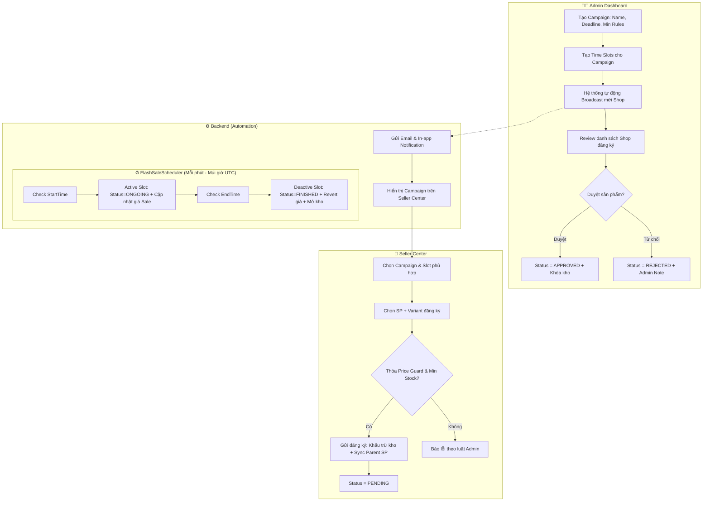

# Luồng Quản lý Flash Sale (Campaign → Registration → Execution)

**Hệ thống tự động hóa hoàn toàn:** Admin tạo chiến dịch → Hệ thống Broadcast mời Shop → Shop đăng ký → Admin duyệt → Hệ thống tự động chạy theo lịch.

---

## 1. Tổng quan Trạng thái Campaign (Status)

```
Campaign: REGISTRATION_OPEN → ONGOING → FINISHED
Slot:     ACTIVE → ONGOING → FINISHED
```
*Ghi chú: Status ONGOING của Slot là lúc sản phẩm thực sự được giảm giá trên sàn.*

---

## 2. Luồng vận hành chi tiết

### Sơ đồ Mermaid



---

## 3. Chi tiết API & Hành động

| Bước | Đối tượng | Hành động | API Endpoint | Ghi chú |
|------|-----------|-----------|--------------|---------|
| 1 | Admin | Tạo Chiến dịch | `POST /api/flash-sales/campaigns` | Thiết lập Min Discount, Deadline |
| 2 | System | Broadcast | - | Tự động gửi Email & Thông báo chuông |
| 3 | Shop | Đăng ký SP | `POST /api/flash-sales/registrations` | Hệ thống trừ kho gốc & Sync `totalStock` ngay lập tức |
| 4 | Admin | Duyệt SP | `PUT /api/flash-sales/.../approve` | Nếu Reject, hệ thống tự động hoàn trả kho |
| 5 | System | Kích hoạt | Scheduler (Chạy ngầm) | Đổi Status Slot sang **ONGOING**, cập nhật giá |
| 6 | Buyer | Mua hàng | `POST /api/orders` | Trừ tồn kho Flash Sale đã khóa |
| 7 | System | Kết thúc | Scheduler (Chạy ngầm) | Đổi Status sang **FINISHED**, trả lại giá gốc & kho dư |

---

## 4. Các cơ chế vận hành chuyên nghiệp

### 🛡️ Price Guard (Động)
Hệ thống không fix cứng 10%. Admin có thể thiết lập mức giảm tối thiểu riêng cho từng đợt (ví dụ: Sale 11.11 yêu cầu giảm từ 50%). Nếu Shop nhập giá cao hơn mức này, hệ thống sẽ chặn ngay lập tức.

### 🔒 Inventory Locking (Khấu trừ kho tức thì)
Thay vì đợi đến lúc Admin duyệt, hệ thống hiện tại khấu trừ tồn kho ngay khi Shop nhấn **Đăng ký**. 
- **Lý do:** Đảm bảo Shop không thể đăng ký vượt quá thực tế và giữ chỗ hàng ngay lập tức.
- **Cơ chế hoàn trả:** Nếu Admin bấm **Từ chối (Reject)** hoặc Shop **Hủy đăng ký**, số lượng hàng sẽ được tự động cộng trả lại vào kho chính của Shop.
- **Đồng bộ hóa:** Hệ thống tự động gọi hàm `syncProductTotalStock` để cập nhật tổng kho ở cấp độ sản phẩm cha, giúp hiển thị nhất quán trên toàn sàn.

### ⚠️ Emergency Stop (Dừng khẩn cấp)
Admin có quyền ngắt mọi lúc. Khi dừng, hệ thống tự động:
1. Hoàn trả giá gốc ngay lập tức trên sàn.
2. Cộng lại số hàng chưa bán hết vào kho chính của Shop.
3. Gửi thông báo khẩn cấp cho Shop qua chuông.

---

## 5. UI/UX Highlights
- **Seller:** Nhận thông báo mời gọi có Link trực tiếp đến Form đăng ký.
- **Buyer:** Xem đồng hồ đếm ngược (Countdown) và thanh tiến trình "Blowing Fire" 🔥 (màu cam cháy) cho các SP sắp hết hàng.
- **Admin:** Quản lý tập trung, có báo cáo số lượng SP đã duyệt/chờ duyệt.
