# Luồng Quản lý Flash Sale (Campaign → Registration → Execution)

**Hệ thống tự động hóa hoàn toàn:** Admin tạo chiến dịch → Hệ thống Broadcast mời Shop → Shop đăng ký → Admin duyệt → Hệ thống tự động chạy theo lịch.

---

## 1. Tổng quan Trạng thái Campaign (Status)

```
Campaign: REGISTRATION_OPEN → ONGOING → FINISHED
Slot:     ACTIVE → ONGOING → FINISHED
```
*Ghi chú: Status ONGOING của Slot là lúc sản phẩm thực sự được giảm giá trên sàn.*

---

## 2. Luồng vận hành chi tiết

### Sơ đồ Mermaid

```mermaid
flowchart TD
    subgraph Admin["👨‍💼 Admin Dashboard"]
        A1[Tạo Campaign: Name, Deadline, Min Rules] --> A2[Tạo Time Slots cho Campaign]
        A2 --> A3[Hệ thống tự động Broadcast mời Shop]
        A3 --> A4[Review danh sách Shop đăng ký]
        A4 --> A5{Duyệt sản phẩm?}
        A5 -->|Duyệt| A6[Status = APPROVED + Khóa kho]
        A5 -->|Từ chối| A7[Status = REJECTED + Admin Note]
    end

    subgraph System["⚙️ Backend (Automation)"]
        A3 -.-> B1[Gửi Email & In-app Notification]
        B1 --> B2[Hiển thị Campaign trên Seller Center]
        
        subgraph Scheduler["⏰ FlashSaleScheduler (Mỗi phút - Múi giờ UTC)"]
            C1[Check StartTime] --> C2[Active Slot: Status=ONGOING + Cập nhật giá Sale]
            C2 --> C3[Check EndTime]
            C3 --> C4[Deactive Slot: Status=FINISHED + Revert giá + Mở kho]
        end
    end

    subgraph Seller["🏪 Seller Center"]
        B2 --> S1[Chọn Campaign & Slot phù hợp]
        S1 --> S2[Chọn SP + Variant đăng ký]
        S2 --> S3{Thỏa Price Guard & Min Stock?}
        S3 -->|Có| S4[Gửi đăng ký: Status = PENDING]
        S3 -->|Không| S5[Báo lỗi theo luật Admin]
    end
```



---

## 3. Chi tiết API & Hành động

| Bước | Đối tượng | Hành động | API Endpoint | Ghi chú |
|------|-----------|-----------|--------------|---------|
| 1 | Admin | Tạo Chiến dịch | `POST /api/flash-sales/campaigns` | Thiết lập Min Discount, Deadline |
| 2 | System | Broadcast | - | Tự động gửi Email & Thông báo chuông |
| 3 | Shop | Đăng ký SP | `POST /api/flash-sales/registrations` | Kiểm tra luật Price Guard ngay lúc gửi |
| 4 | Admin | Duyệt SP | `PUT /api/flash-sales/.../approve` | Hệ thống tự động khóa tồn kho của Shop |
| 5 | System | Kích hoạt | Scheduler (Chạy ngầm) | Đổi Status Slot sang **ONGOING**, cập nhật giá |
| 6 | Buyer | Mua hàng | `POST /api/orders` | Trừ tồn kho Flash Sale đã khóa |
| 7 | System | Kết thúc | Scheduler (Chạy ngầm) | Đổi Status sang **FINISHED**, trả lại giá gốc & kho dư |

---

## 4. Các cơ chế vận hành chuyên nghiệp

### 🛡️ Price Guard (Động)
Hệ thống không fix cứng 10%. Admin có thể thiết lập mức giảm tối thiểu riêng cho từng đợt (ví dụ: Sale 11.11 yêu cầu giảm từ 50%). Nếu Shop nhập giá cao hơn mức này, hệ thống sẽ chặn ngay lập tức.

### 🔒 Inventory Locking (Khóa kho)
Ngay khi Admin bấm **Duyệt**, số lượng hàng đăng ký sẽ bị trừ khỏi kho chính của Shop và đưa vào "Kho Flash Sale". Điều này đảm bảo Shop không thể bán hết sạch hàng trước khi phiên sale bắt đầu.

### ⚠️ Emergency Stop (Dừng khẩn cấp)
Admin có quyền ngắt mọi lúc. Khi dừng, hệ thống tự động:
1. Hoàn trả giá gốc ngay lập tức trên sàn.
2. Cộng lại số hàng chưa bán hết vào kho chính của Shop.
3. Gửi thông báo khẩn cấp cho Shop qua chuông.

---

## 5. UI/UX Highlights
- **Seller:** Nhận thông báo mời gọi có Link trực tiếp đến Form đăng ký.
- **Buyer:** Xem đồng hồ đếm ngược (Countdown) và thanh tiến trình "Blowing Fire" 🔥 (màu cam cháy) cho các SP sắp hết hàng.
- **Admin:** Quản lý tập trung, có báo cáo số lượng SP đã duyệt/chờ duyệt.
