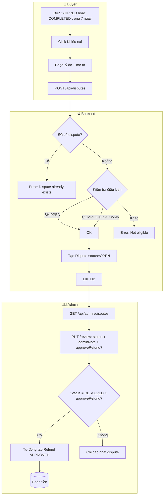

# Luồng Khiếu nại → Hoàn tiền (Dispute → Refund)

**Một luồng duy nhất:** Buyer gửi Khiếu nại → Admin xử lý → Nếu duyệt, tự động hoàn tiền (không cần nút Trả hàng riêng).

## 1. Tổng quan Order Status

```
PENDING → CONFIRMED → PAID → SHIPPING → SHIPPED → COMPLETED
   ↓           ↓         ↓
CANCELLED  CANCELLED  CANCELLED
```

## 2. Luồng Khiếu nại (Dispute) → Tự động hoàn tiền khi Admin duyệt

### Sơ đồ Mermaid



### Điều kiện tạo Dispute

- Order phải **SHIPPED** HOẶC **COMPLETED**
- Nếu COMPLETED: phải trong **7 ngày** kể từ `completedAt`
- Mỗi đơn chỉ có **1 dispute**

### Chi tiết luồng

| Bước | Người | Hành động | API |
|------|-------|-----------|-----|
| 1 | Buyer | Mở chi tiết đơn (thỏa điều kiện) | - |
| 2 | Buyer | Click "Khiếu nại" | - |
| 3 | Buyer | Chọn lý do, mô tả chi tiết (≥10 ký tự) | - |
| 4 | Buyer | Gửi khiếu nại | `POST /api/disputes` |
| 5 | Backend | Kiểm tra điều kiện → Tạo Dispute | status = OPEN |
| 6 | Admin | Xem danh sách | `GET /api/admin/disputes` |
| 7 | Admin | Xử lý: RESOLVED + ✓ Hoàn tiền | `PUT /api/admin/disputes/{id}/review` |
| 8 | Backend | Tự động tạo Refund APPROVED | - |

### Dispute Status

- `OPEN` — Mới tạo
- `IN_REVIEW` — Admin đang xem xét
- `RESOLVED` — Đã giải quyết
- `REJECTED` — Đã từ chối

---

## 3. Quan hệ Dispute → Refund

```
┌─────────────────────────────────────────────────────────┐
│                    ORDER (orderId)                       │
└─────────────────────────────────────────────────────────┘
         │
         │ 1:1
         ▼
┌─────────────────────┐       Admin RESOLVED + approveRefund
│      DISPUTE        │  ─────────────────────────────────►  Refund (APPROVED)
│  - reason, desc     │                                      tự động tạo
│  - OPEN → RESOLVED  │
└─────────────────────┘
```

- **Một luồng**: Chỉ có nút "Khiếu nại" trên order-detail
- **Admin duyệt dispute** + tích "Hoàn tiền" → Backend tự động tạo Refund APPROVED

---

## 4. Frontend

### order-detail.html

- Chỉ nút **"Khiếu nại"** (trả hàng, hàng hỏng, sai mô tả...)
- Bỏ nút "Yêu cầu trả hàng / hoàn tiền" riêng

### Admin Panel - Disputes

- Khi Review dispute: chọn **RESOLVED** + tích **"Hoàn tiền cho buyer"**
- Có thể nhập số tiền (để trống = full đơn hàng)
- Backend tự động tạo Refund APPROVED
